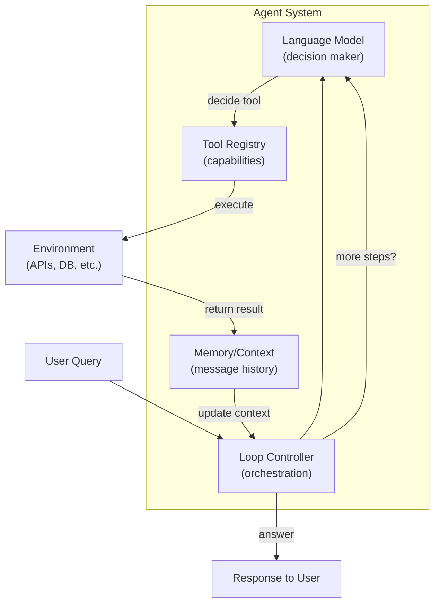

# What Is an Agent?

## Detailed Explanation

An agent is an autonomous system that perceives its environment, reasons about what to do next, and takes actions to achieve goals. In the LLM context, an agent combines three core components: a language model that serves as the decision-maker (the "brain"), a set of tools or functions it can invoke to interact with the world (the "hands"), and a loop that orchestrates the perception-reasoning-action-observation cycle until the goal is reached or a termination condition is met.

Agents are fundamentally different from traditional chatbots or single-turn LLM interactions. A chatbot responds once and conversation ends; an agent iterates, adapts, and refines its approach based on feedback. A chatbot answers a question directly from its training data; an agent breaks multi-step problems into substeps, calls tools, observes results, and adjusts its strategy accordingly. This iterative loop is what gives agents their power — they can solve complex, multi-step problems that static models cannot, including those requiring real-time information, computation, or interaction with external systems.

**Why it matters:** Agents represent a shift from passive information retrieval to active problem-solving. They enable LLMs to go beyond text generation to become orchestrators of complex workflows. Understanding agents is foundational for building autonomous systems, AI assistants, data pipelines, and reasoning engines — all key interview topics in modern AI engineering.

**Key clarification:** Agents ≠ chatbots. Agents iterate; chatbots respond once. Agents adapt based on tool results; chatbots use fixed knowledge. Agents are deterministic in structure but non-deterministic in decisions (due to LLM sampling).

## Core Intuition
A human solving a hard problem: thinks through steps, uses tools (calculator, search), observes results, adjusts strategy. AI agents do the same — the LLM "thinks," tools let it "act," the environment gives feedback.

## How It Works

The agent loop is the heart of agentic AI. Here's the step-by-step execution:

1. **Perception / Input:** Agent receives a user query or observes the current state of the environment.
   - Example: User asks "What's the population of France?"
   - Agent reads and parses this input

2. **Reasoning / Planning:** The LLM analyzes the input and decides what to do next.
   - Internal thought: "I need to look up factual information. The search tool would be useful."
   - The LLM generates reasoning text (visible in ReAct) and decides which tool to call
   - This reasoning is non-deterministic — temperature, prompt, and sampling affect the decision

3. **Action / Tool Call:** Agent invokes the selected tool with appropriate arguments.
   - Example: Calls `search(query="France population")` or uses web API
   - Tool execution is synchronous — the agent waits for the result
   - Tool calls are explicit and structured (JSON or XML schemas)

4. **Observation / Feedback:** Tool returns a result. Agent incorporates this into its context.
   - Example: Search returns "France population: ~67 million"
   - This result is added to the message history
   - The agent now has new information to reason about

5. **Repeat or Terminate:** Agent evaluates if the goal is reached.
   - If goal reached → return answer to user
   - If not reached → loop back to step 2, with updated context
   - If max_steps exceeded → return "max iterations reached" error (safety mechanism)

**Key pattern — ReAct (Reasoning + Acting):**
The agent explicitly separates reasoning from action. Example flow:
```
Thought: "I need to find the capital of France"
Action: search(query="capital of France")
Observation: "The capital of France is Paris"
Thought: "The question is answered. I can return the result"
Action: Return "Paris"
```

**Tool Definitions:** Tools are registered with:
- **Name:** Identifier for the tool (e.g., "search", "calculator")
- **Description:** Natural language explanation of what the tool does
- **Input Schema:** JSON schema defining required/optional parameters
- **Execution:** Function that actually runs when tool is called

Agents use the tool definition to decide when to call a tool and what arguments to pass. Vague descriptions lead to incorrect tool calls; clear descriptions guide the agent correctly.

**Memory and Context:**
Agents maintain context across steps in a message history. This allows:
- The agent to remember previous tool results when making future decisions
- The user to understand the agent's reasoning process
- Long-horizon planning where agent decisions depend on earlier steps
Context grows with each step; long conversations require summarization or pruning.

## Architecture / Trade-offs

**Components of an Agent System:**



**Key Design Trade-offs:**

1. **Cost vs. Capability**
   - More steps = more LLM calls = higher cost and latency
   - Fewer steps = faster but less reasoning, more hallucinations
   - **Decision:** Design tool abstractions to minimize steps. Pre-filter candidates, combine tools, cache results

2. **Flexibility vs. Performance**
   - Large tool set (20+ tools) → flexible but agent gets confused, calls wrong tool
   - Small tool set (3-5 tools) → fast and focused but less capable
   - **Decision:** Start with 5-10 core tools; add hierarchy/routing if needed

3. **Stateful vs. Stateless Agents**
   - Stateful: Agent maintains memory across conversations → smarter but context explosion
   - Stateless: Each query is independent → simpler but loses context
   - **Decision:** Use stateful with summarization/pruning for long conversations

4. **Determinism for Production**
   - Agents are non-deterministic due to LLM sampling
   - Same query → different tool calls → different results
   - **Decision:** Use `temperature=0` for deterministic behavior; validate tool outputs

**Design Patterns:**
- **ReAct:** Explicit reasoning steps before actions. Better for complex tasks. More transparent (can audit reasoning).
- **Self-Critique:** Agent generates answer, then critiques its own logic, then refines. Slower but higher quality.
- **Tool Hierarchies:** Route to specialized tool clusters (e.g., data tools, API tools). Scales to 20+ tools.

## Interview Q&A

**Q1: How would you prevent an agent from getting stuck in an infinite loop?**
A: Three mechanisms: (1) Set max_steps (default 10-15, adjust based on problem complexity); (2) Add early stopping (if goal detected, exit); (3) Add fallback logic (if tool fails 3x, try different approach). Always test max_steps with your data.

**Q2: When would you use a multi-step agentic approach vs. a single-pass model?**
A: Use agents for: multi-step reasoning, external data/tool access, long-horizon planning. Use single-pass for: simple Q&A, low-latency requirements (<500ms), when data is in training set. Agents cost 2-10x more per query (multiple LLM calls).

**Q3: What's the trade-off between having many tools vs. few tools?**
A: More tools = more capability but agent gets confused (calls wrong tool). Fewer tools = focused and fast but limited. Solution: Start with 5-10, add routing/hierarchies if >20. Test tool description clarity on agent accuracy.

**Q4: How would you debug an agent that keeps calling the same tool incorrectly?**
A: (1) Log all tool calls and LLM reasoning; (2) Check tool definition (name, description, schema clarity); (3) Check if tool actually solves the problem (maybe need different tool); (4) Test with lower temperature for more deterministic behavior; (5) Add constraint in prompt: "Don't call X tool more than once per query."

**Q5: When should you add memory to an agent? What are the costs?**
A: Add memory when: user interactions build on prior context; agent needs long-horizon planning. Costs: Context grows → slower/more expensive LLM calls; memory bloat → need summarization/pruning. Solution: Use sliding window memory or periodic summaries. Cost can increase 2-5x with multi-turn conversations.

**Q6: How would you make an agent's actions auditable for compliance or debugging?**
A: Log all tool calls, inputs, outputs, LLM reasoning, and decisions. Store in structured format (JSON with timestamp). Create trace visualization showing decision path. For regulated systems: sign logs, version tool definitions, maintain audit trail. Allow users to replay agent's decision process.

**Q7: What's the difference between agentic reasoning and prompt engineering?**
A: Prompt engineering: single-pass LLM call; you craft the perfect prompt to elicit behavior. Agentic: multi-pass loop where LLM reasons, takes actions, observes, and adapts. Agents solve problems traditional prompting cannot (complex reasoning, tool use, adaptation). But agents cost more and are less predictable.

**Q8: How would you evaluate whether an agent is actually "thinking" or just hallucinating?**
A: Check: (1) Tool calls match reasoning; (2) Agent uses tool outputs (not ignored); (3) Reasoning is step-by-step (not random); (4) Agent stops when goal reached; (5) Errors are recoverable (agent tries different approach). Metrics: accuracy, tool call correctness, steps-to-solution, cost per query.

## Best Practices

1. **Validate tool schemas rigorously.** Agents hallucinate arguments that don't match schema. Test schema clarity before deployment. Use strict validation in tool execution.

2. **Set max_steps conservatively.** Default 10 is reasonable. Too low = agent can't solve complex problems. Too high = cost explosion. Measure steps-to-solution on test set and adjust.

3. **Use structured output for tool calls.** Don't let LLM freeform decide tools. Require JSON/XML schema with `tool_choice: "auto"` in Anthropic API. This prevents hallucination.

4. **Monitor cost per query.** Each agent step costs LLM tokens. A 10-step agent might cost 10x more than single-pass model. Track and alert on cost per query.

5. **Cache tool outputs when possible.** If same query asked twice, reuse previous tool result. Saves 50-80% cost. Implement simple cache with query hash.

6. **Test tool calling on diverse inputs.** Agents fail differently than models. Edge cases: empty results, malformed results, timeout. Test agent robustly with adversarial inputs.

7. **Log all reasoning and tool calls.** For debugging and auditing. Store decision trace. Allow users to inspect "why" agent made each decision. Critical for user trust.

8. **Use temperature≈0 for production agents.** Randomness hurts reliability. If you need diversity, use ensemble (multiple agents vote) rather than high temperature.

9. **Implement graceful fallbacks.** If tool fails → try different tool, return partial result, or ask user for help. Never silently fail or make up results.

10. **Version tool definitions.** As you update tools, maintain version history. Old agent runs must be reproducible. Use git to track tool schema changes.

## Common Pitfalls

1. **Unbounded loops.** Agent retries same tool indefinitely because it doesn't understand the problem or tool is broken. **Fix:** Max steps + explicit stopping condition + fallback logic.

2. **Vague tool descriptions.** Agent can't decide which tool to use. Descriptions like "helper" or "processor" are too vague. **Fix:** Clear, specific names and descriptions. Include usage examples in schema.

3. **Ignoring latency.** Each agent step adds ~1 second (LLM call + tool execution). 10-step agent takes 10+ seconds. **Fix:** Optimize tool abstractions. Pre-filter candidates. Cache results. For real-time apps, use simpler approaches.

4. **Tool hallucination.** Agent invents tool arguments that don't match schema, or invents results entirely. **Fix:** Validate schema strictly. Log all tool executions. Verify tool outputs match expected format.

5. **Missing error handling.** Tool fails → agent crashes or makes up result. **Fix:** Wrap all tool calls in try/except. Return structured error responses. Let agent retry with different tool.

6. **Context explosion.** Message history grows unbounded. Older context becomes irrelevant. **Fix:** Implement summarization or sliding window. Prune old, irrelevant context. Monitor context length.

7. **Non-reproducible behavior.** Agent gives different answers to same query (due to temperature > 0). Production system becomes unreliable. **Fix:** Use temperature=0 for deterministic behavior. If diversity needed, use ensemble voting.

8. **Over-reliance on single tool.** Agent depends heavily on one tool. If tool fails, agent can't recover. **Fix:** Design tool set with alternatives. Implement routing to backup tools.

9. **Poor benchmarking.** Claim agent "works" based on 1-2 examples. Real test set reveals agent fails on edge cases. **Fix:** Test on 100+ diverse examples. Measure accuracy, cost, speed. Track failure modes.

10. **Ignoring user trust.** Users can't understand why agent made a decision. Black box leads to rejection. **Fix:** Log reasoning, explain tool choices, show decision trace. Make agent transparent.

## Code Examples

**Example 1: Anthropic API (Basic Agent)**
```python
from anthropic import Anthropic

def run_agent(user_query: str, max_steps: int = 10):
    client = Anthropic()
    
    tools = [
        {
            "name": "calculator",
            "description": "Evaluate mathematical expressions",
            "input_schema": {
                "type": "object",
                "properties": {"expression": {"type": "string"}},
                "required": ["expression"]
            }
        },
        {
            "name": "search",
            "description": "Search for information",
            "input_schema": {
                "type": "object",
                "properties": {"query": {"type": "string"}},
                "required": ["query"]
            }
        }
    ]
    
    messages = [{"role": "user", "content": user_query}]
    
    for step in range(max_steps):
        response = client.messages.create(
            model="claude-3-5-sonnet-20241022",
            max_tokens=1024,
            tools=tools,
            messages=messages
        )
        
        if response.stop_reason == "end_turn":
            for block in response.content:
                if hasattr(block, 'text'):
                    return block.text
        
        # Process tool calls
        assistant_message = {"role": "assistant", "content": response.content}
        messages.append(assistant_message)
        
        tool_results = []
        for block in response.content:
            if block.type == "tool_use":
                # Execute tool
                if block.name == "calculator":
                    result = str(eval(block.input["expression"]))
                elif block.name == "search":
                    result = f"Found info about {block.input['query']}"
                else:
                    result = "Unknown tool"
                
                tool_results.append({
                    "type": "tool_result",
                    "tool_use_id": block.id,
                    "content": result
                })
        
        if tool_results:
            messages.append({"role": "user", "content": tool_results})
    
    return "Max steps exceeded"

# Run
result = run_agent("What is 42 * 17 plus the population of France?")
print(result)
```

**Example 2: LangChain Agent**
```python
from langchain.agents import Tool, initialize_agent, AgentType
from langchain.llms import OpenAI
from langchain.memory import ConversationBufferMemory

tools = [
    Tool(
        name="Math",
        func=lambda x: str(eval(x)),
        description="Useful for math. Input: expression like '2 + 2*3'"
    ),
    Tool(
        name="Search",
        func=lambda x: f"Info on {x}",
        description="Useful for finding facts. Input: topic"
    )
]

llm = OpenAI(temperature=0)
memory = ConversationBufferMemory(memory_key="chat_history", return_messages=True)

agent = initialize_agent(
    tools=tools,
    llm=llm,
    agent=AgentType.ZERO_SHOT_REACT_DESCRIPTION,
    memory=memory,
    verbose=True,
    max_iterations=10
)

result = agent.run("What is 25 * 4?")
print(result)
```

**Example 3: Production Pattern with Caching**
```python
from functools import lru_cache
import json

class ProductionAgent:
    def __init__(self, max_steps=10):
        self.max_steps = max_steps
        self.call_history = []
    
    @lru_cache(maxsize=100)
    def _cached_tool_call(self, tool_name: str, tool_input: str) -> str:
        # Execute tool with caching
        if tool_name == "search":
            return f"Cached result for: {tool_input}"
        return ""
    
    def run(self, query: str):
        from anthropic import Anthropic
        client = Anthropic()
        
        messages = [{"role": "user", "content": query}]
        tools = [
            {
                "name": "search",
                "description": "Search",
                "input_schema": {
                    "type": "object",
                    "properties": {"query": {"type": "string"}},
                    "required": ["query"]
                }
            }
        ]
        
        for step in range(self.max_steps):
            response = client.messages.create(
                model="claude-3-5-sonnet-20241022",
                max_tokens=1024,
                tools=tools,
                messages=messages
            )
            
            self.call_history.append({
                "step": step,
                "input_tokens": response.usage.input_tokens,
                "output_tokens": response.usage.output_tokens
            })
            
            if response.stop_reason == "end_turn":
                return response
            
            # Handle tool calls with caching
            messages.append({"role": "assistant", "content": response.content})
            # ... process tools ...
        
        return None

agent = ProductionAgent()
result = agent.run("Search for information about agents")
print(f"Cost metrics: {json.dumps(agent.call_history, indent=2)}")
```

## Related Concepts
- Agent Loops — the execution pattern
- Agent Memory Management — maintaining context
- Tool Use and Tool Design — designing agent capabilities
- Agent Routing — directing work to specialized agents
- Multi-Agent Systems — coordinating multiple agents

## Resources
- [ReAct: Synergizing Reasoning and Acting in LLMs](https://arxiv.org/abs/2210.03629)
- [Agentic AI (Anthropic blog)](https://www.anthropic.com/research/agents)
- [Agent Design Patterns](https://www.anthropic.com/research)
