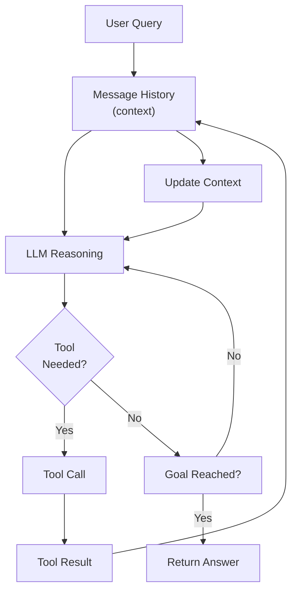

# Agent Loops

## Detailed Explanation

An agent loop is the core execution pattern that enables iterative reasoning and action. It's the mechanism that transforms a language model from a one-shot predictor into an autonomous agent capable of multi-step problem-solving. The loop follows a simple but powerful cycle: perceive the current state, reason about what to do, take an action, observe the results, and repeat. This iteration continues until the agent reaches its goal or hits a resource limit (max steps).

The agent loop is fundamentally different from a single LLM call. A single call predicts an answer based on training data; an agent loop can reason through novel problems, access real-time information, correct mistakes, and adapt strategies. Each iteration allows the agent to incorporate new information (observation) into its reasoning, creating a feedback loop that drives progress toward the goal.

**Why it matters:** The loop is what makes agents "agentic." Without it, you have a tool-calling LLM. With it, you have autonomous problem-solving. Understanding loop structure is critical for building reliable agents, debugging stuck agents, optimizing cost, and designing effective tool hierarchies.

**Key clarification:** Agent loop ≠ feedback loop. Feedback loops are bidirectional and may oscillate. Agent loops are directed toward a goal and terminate when reached.

## Core Intuition
Imagine solving a complex problem (like planning a trip). You don't give an answer immediately. Instead, you think about what you need, search for information, evaluate options, refine your approach based on what you learn, and iterate until satisfied. Agent loops replicate this process: observe context, think, act, observe result, think again.

## How It Works

The agent loop executes in well-defined stages. Here's the detailed flow:

**Stage 1 — Observe / Perception:**
Agent reads the current state: user query, previous results, environment state. All context goes into the message history.
- Example: User asks "Find a flight from NYC to LA under $500"
- Agent reads query + any prior context

**Stage 2 — Think / Reason:**
LLM analyzes the state and decides what to do next. This is the reasoning step.
- Example: "I need to search for flights first. Then check prices. Then filter by budget."
- Reasoning can be implicit (LLM decides silently) or explicit (ReAct: write out thoughts)

**Stage 3 — Act / Tool Call:**
Agent selects a tool and invokes it with specific arguments.
- Example: Call `search_flights(from="NYC", to="LA")`
- Tool execution is synchronous—agent waits for result
- Tool calls are explicit and structured

**Stage 4 — Observe / Feedback:**
Tool returns a result. This becomes new information in the agent's context.
- Example: Tool returns `[Flight1, Flight2, Flight3, ...]`
- This result is added to message history
- Agent now has new facts to reason about

**Stage 5 — Evaluate / Continue Decision:**
Agent checks: have we reached the goal? If yes, stop. If no, loop back to Stage 2 with updated context.
- Example: Agent sees flights but doesn't know prices → loop back
- After getting prices: agent knows options but needs to filter → loop back
- After filtering by budget: goal reached → exit loop and return answer

**Example Iteration (Flight Booking):**

```
Iteration 1:
  Observe: User wants flight NYC→LA, budget $500
  Think: "I need to search for flights"
  Act: search_flights(NYC, LA)
  Observe: Found flights [100, 200, 300, ...]
  Decide: Goal not reached (need to check budgets)

Iteration 2:
  Observe: [List of flights from previous step]
  Think: "I need to check which are under $500"
  Act: filter_by_price(flights, max_price=500)
  Observe: Filtered list [200, 300, ...]
  Decide: Goal reached (found flights under budget)

Return: Recommend flight with price 300
```

**Loop Structure (Pseudocode):**
```python
messages = [{"role": "user", "content": user_query}]
for step in range(max_steps):
    # Stage 2: Think
    response = llm.think(messages, tools)
    
    # Stage 3: Act (if LLM decides tool is needed)
    if response.has_tool_call():
        tool_result = execute_tool(response.tool_name, response.tool_args)
        
        # Stage 4: Observe
        messages.append({"role": "assistant", "content": response})
        messages.append({"role": "user", "content": tool_result})
    else:
        # Stage 5: Goal reached (LLM returned final answer)
        return response.text
        
return "Max steps exceeded"
```

**ReAct Pattern (Explicit Reasoning):**
The ReAct (Reasoning + Acting) pattern makes the loop explicit with visible reasoning steps:
```
Thought: "I need to find flights"
Action: search_flights(NYC, LA)
Observation: [List of flights]
Thought: "Now I need to filter by price"
Action: filter_by_price(flights, 500)
Observation: [Filtered list]
Thought: "Goal is reached. Return answer."
```

This transparency helps debugging and auditing.

## Architecture / Trade-offs

**Loop Components:**



**Key Design Trade-offs:**

1. **Iterations vs. Cost**
   - More steps → more reasoning → better answers BUT higher latency/cost (each step = 1 LLM call)
   - Fewer steps → cheaper and faster but less reasoning, more mistakes
   - **Decision:** Measure steps-to-solution on test set. Adjust max_steps. Cache results to reduce iterations.

2. **Explicit vs. Implicit Reasoning**
   - Explicit (ReAct): visible thought steps → better transparency, easier debugging but longer outputs
   - Implicit: silent reasoning → shorter outputs but harder to debug
   - **Decision:** Use explicit for complex problems or regulated systems; implicit for speed/cost optimization.

3. **Synchronous vs. Asynchronous Tools**
   - Synchronous: agent waits for tool result → simpler, sequential, blocking
   - Asynchronous: agent continues while tools run → more complex, parallel, efficient
   - **Decision:** Use synchronous for most cases; async only for large tool sets with parallel-safe operations.

4. **Fixed vs. Dynamic Max Steps**
   - Fixed: max_steps=10 always → simple, predictable cost
   - Dynamic: adjust max_steps based on problem complexity → better UX but unpredictable cost
   - **Decision:** Use fixed max_steps for production; dynamic only with strict timeouts.

**Loop Termination Conditions:**
- Goal detected (agent's reasoning shows goal is met)
- Max steps exceeded (hard safety limit)
- Timeout (real-world wall-clock limit)
- User cancellation
- Tool failure + no fallback

## Interview Q&A

**Q1: How many iterations should an agent loop typically run?**
A: Usually 1-10 iterations depending on problem complexity. Simple queries (lookup): 1-2 steps. Complex reasoning: 5-10 steps. Measure on your test set; if avg >15 steps, likely hitting max_steps too often. Consider optimizing tool design.

**Q2: What's the difference between implicit and explicit reasoning loops?**
A: Implicit: LLM reasons silently, makes tool calls. Faster, cheaper outputs. Explicit (ReAct): LLM writes out Thought → Action → Observation steps. Slower, longer outputs, but auditable and easier to debug. Use explicit for compliance; implicit for speed.

**Q3: How do you prevent an agent loop from getting stuck retrying the same tool?**
A: (1) Detect loops: track tool call history, alert if same tool called 3x; (2) Add fallback: if tool fails N times, try different tool; (3) Add max_attempts per tool (e.g., max 2 calls to search_tool); (4) Use temperature=0 for deterministic decisions; (5) Improve tool error messages so agent learns why it failed.

**Q4: What's the trade-off between synchronous and asynchronous tool execution in loops?**
A: Synchronous: agent waits for each tool result sequentially. Simple, predictable, but slow if tools have latency. Asynchronous: agent can dispatch multiple tools in parallel, wait for all. Faster but more complex (need to handle partial failures, resource limits). Use synchronous for <3 tools; async for >5 tools or tools with high latency.

**Q5: How do you optimize the loop for cost and latency in production?**
A: (1) Cache tool results: same query → reuse cached answer; (2) Reduce iterations: smaller tool set, clearer tool descriptions = fewer steps; (3) Batch operations: instead of 5 single calls, make 1 batch call; (4) Prune context: summarize old message history to reduce token count; (5) Use smaller model if possible (claude-3-haiku) with fallback to larger model.

**Q6: What happens if max_steps is set too low vs. too high?**
A: Too low (e.g., max_steps=2): agent can't solve complex problems, returns incomplete answers. Too high (e.g., max_steps=100): agent runs forever on simple problems, cost explodes. Solution: set based on problem domain. Start with 10, measure avg steps, adjust. Use timeout as secondary limit.

**Q7: How do you make a loop idempotent for reliability?**
A: (1) Tool idempotency: tools should produce same result if called twice with same args; (2) Deduplication: detect duplicate tool calls, reuse prior result; (3) State tracking: maintain agent state so retry from last step, not from beginning; (4) Logging: log all decisions so you can inspect and replay; (5) Version tools: use versioned tool APIs for deterministic results.

**Q8: When should you use early stopping vs. always running max_steps?**
A: Early stopping: exit immediately when goal detected. Better UX (faster response), lower cost. Always max_steps: simpler code (runs full loop regardless). Solution: always implement early stopping. Check after each iteration: "Is goal reached?" or "Can we answer now?" If yes, exit loop and return.

## Best Practices

1. **Set max_steps conservatively.** Default 10-15 is reasonable for most use cases. Test on your data. If >20 steps typical, rethink problem or tool design.

2. **Always implement early stopping.** Don't always run max_steps. After each iteration, check if goal is reached or answer is ready. Early exit saves cost and latency.

3. **Log all loop iterations.** Log: step number, LLM reasoning, tool call (name + args), tool result. Critical for debugging stuck agents. Store in structured format (JSON).

4. **Monitor cost per query.** Track: number of steps, tokens per step, total cost. Alert if unusual (e.g., query uses 20 steps when avg is 3). Helps catch bugs early.

5. **Implement loop detection.** Track tool call history. Alert if same tool called 3+ times in a row. Likely indicates agent is stuck. Trigger fallback or early exit.

6. **Use temperature=0 for production.** Non-deterministic behavior (high temperature) causes loops to behave unpredictably. Same query might take 3 steps or 10 steps. Use temperature=0 for reliability.

7. **Optimize tool design for fewer steps.** Vague/overlapping tools → agent needs more steps to clarify which to use. Clear, specific tools → fewer steps. Tool design directly impacts loop efficiency.

8. **Add fallback mechanisms.** If tool fails → try different tool, return partial result, or ask user. Never silently fail and continue looping. Fallbacks prevent infinite loops.

9. **Version and test tool changes.** Changing a tool's behavior alters loop dynamics. Always test loop behavior after tool updates. Track tool version in logs for reproducibility.

10. **Consider human-in-the-loop for complex cases.** If loop runs >10 steps, ask user: "Should I keep trying or give up?" Prevents cost explosion and improves UX.

## Common Pitfalls

1. **Infinite loops.** Agent keeps retrying same tool because: (a) tool keeps failing, (b) tool doesn't actually solve problem, (c) agent doesn't understand goal. **Fix:** Set max_steps + implement loop detection + improve tool descriptions. Log everything to debug.

2. **No early stopping.** Agent continues iterating even after goal is reached. Agent: "I found the answer" but keeps looping. **Fix:** After each iteration, explicitly check: goal_reached? If yes, exit and return answer immediately.

3. **Max steps too low.** max_steps=2 but problem needs 5 steps. Agent always returns incomplete answer. Users are frustrated. **Fix:** Test on representative data. Measure average steps needed. Set max_steps to (avg + 2) with buffer.

4. **Cost explosion.** Agent loop turns $0.01 query into $0.50 because it runs 50 iterations. Budget blown. **Fix:** Monitor cost, implement caching, optimize tool design, set stricter max_steps, add timeout limits.

5. **Tool hallucination in loops.** Agent makes up tool results (e.g., "Tool returned X" but tool actually returned Y). Loop continues based on hallucinated data. **Fix:** Log all tool executions. Validate tool result matches expected schema. Return errors if tool output invalid.

6. **Context explosion.** Message history grows unbounded across loop iterations. Later iterations become slow because context is huge. **Fix:** Implement context pruning (remove old irrelevant messages) or summarization (compress old context).

7. **Ambiguous tool descriptions.** Tools with vague names/descriptions → agent calls wrong tool → loop wastes steps. **Fix:** Use clear names (search_product, not search). Detailed descriptions with usage examples. Test tool descriptions on agent behavior.

8. **No tool versioning.** Tool behavior changes mid-loop. Agent's behavior becomes unpredictable. Can't reproduce issues. **Fix:** Version tools. Log tool version in each loop iteration. Use versioned tool APIs.

9. **Asynchronous complexity.** Attempted parallel tool execution but didn't handle race conditions. Agent loses tool results or misorders them. **Fix:** Use synchronous loops initially (simpler, debuggable). Only move to async after proven need.

10. **Poor timeout management.** No wall-clock timeout. Loop can run indefinitely if LLM calls hang. **Fix:** Set timeout limit (e.g., 30 seconds max). If timeout → exit loop and return partial result. Implement with wrapper.

## Code Examples

**Example 1: Basic Synchronous Loop (Anthropic API)**
```python
from anthropic import Anthropic

def agent_loop(user_query: str, max_steps: int = 10):
    client = Anthropic()
    
    tools = [
        {
            "name": "search",
            "description": "Search for information",
            "input_schema": {
                "type": "object",
                "properties": {"query": {"type": "string"}},
                "required": ["query"]
            }
        },
        {
            "name": "calculator",
            "description": "Evaluate math expressions",
            "input_schema": {
                "type": "object",
                "properties": {"expression": {"type": "string"}},
                "required": ["expression"]
            }
        }
    ]
    
    messages = [{"role": "user", "content": user_query}]
    
    for step in range(max_steps):
        print(f"\n--- Step {step + 1} ---")
        
        response = client.messages.create(
            model="claude-3-5-sonnet-20241022",
            max_tokens=1024,
            tools=tools,
            messages=messages
        )
        
        # Early stopping: check if goal reached
        if response.stop_reason == "end_turn":
            for block in response.content:
                if hasattr(block, 'text'):
                    return block.text
        
        # Process tool calls
        assistant_message = {"role": "assistant", "content": response.content}
        messages.append(assistant_message)
        
        tool_results = []
        for block in response.content:
            if block.type == "tool_use":
                print(f"Tool: {block.name}, Args: {block.input}")
                
                # Execute tool
                if block.name == "search":
                    result = f"Found info about {block.input['query']}"
                elif block.name == "calculator":
                    result = str(eval(block.input["expression"]))
                else:
                    result = "Unknown tool"
                
                print(f"Result: {result}")
                
                tool_results.append({
                    "type": "tool_result",
                    "tool_use_id": block.id,
                    "content": result
                })
        
        if tool_results:
            messages.append({"role": "user", "content": tool_results})
    
    return "Max steps exceeded"

# Usage
result = agent_loop("Find the population of France and calculate 5 * that number")
print(f"\nFinal Answer:\n{result}")
```

**Example 2: Loop with Explicit Loop Detection and Cost Tracking (Advanced)**
```python
from anthropic import Anthropic
from collections import defaultdict
import json

class SmartAgent:
    def __init__(self, max_steps: int = 10, max_same_tool: int = 3):
        self.client = Anthropic()
        self.max_steps = max_steps
        self.max_same_tool = max_same_tool
        self.tool_call_history = defaultdict(list)
        self.cost_log = []
    
    def run(self, query: str):
        messages = [{"role": "user", "content": query}]
        tools = [
            {
                "name": "search",
                "description": "Search web",
                "input_schema": {
                    "type": "object",
                    "properties": {"q": {"type": "string"}},
                    "required": ["q"]
                }
            }
        ]
        
        for step in range(self.max_steps):
            response = self.client.messages.create(
                model="claude-3-5-sonnet-20241022",
                max_tokens=1024,
                tools=tools,
                messages=messages
            )
            
            # Log cost
            self.cost_log.append({
                "step": step,
                "input_tokens": response.usage.input_tokens,
                "output_tokens": response.usage.output_tokens
            })
            
            if response.stop_reason == "end_turn":
                return response.content[-1].text
            
            messages.append({"role": "assistant", "content": response.content})
            
            # Check for loops
            tool_calls = [b for b in response.content if b.type == "tool_use"]
            for tc in tool_calls:
                self.tool_call_history[tc.name].append(step)
                
                if len(self.tool_call_history[tc.name]) > self.max_same_tool:
                    return f"Loop detected: {tc.name} called too many times"
            
            # Execute tools and continue
            results = []
            for tc in tool_calls:
                result = f"Info about {tc.input['q']}"
                results.append({
                    "type": "tool_result",
                    "tool_use_id": tc.id,
                    "content": result
                })
            
            messages.append({"role": "user", "content": results})
        
        return "Max steps exceeded"

agent = SmartAgent()
result = agent.run("Find information about agent loops")
print(f"Result: {result}")
print(f"Cost: {json.dumps(agent.cost_log, indent=2)}")
```

**Example 3: Production Loop with Caching and Timeout (Framework-Based)**
```python
from langchain.agents import Tool, initialize_agent, AgentType
from langchain.chat_models import ChatOpenAI
import time
from functools import lru_cache

@lru_cache(maxsize=50)
def cached_search(query: str) -> str:
    """Search with caching"""
    return f"Results for: {query}"

tools = [
    Tool(
        name="search",
        func=cached_search,
        description="Search for info"
    )
]

llm = ChatOpenAI(temperature=0, model="gpt-4")

agent = initialize_agent(
    tools=tools,
    llm=llm,
    agent=AgentType.ZERO_SHOT_REACT_DESCRIPTION,
    max_iterations=10,
    verbose=True,
    handle_parsing_errors=True
)

# Run with timeout
start = time.time()
timeout_seconds = 30

try:
    result = agent.run("Find population of 5 countries and sum them")
    elapsed = time.time() - start
    
    if elapsed > timeout_seconds:
        print(f"Warning: Query took {elapsed:.1f}s (timeout: {timeout_seconds}s)")
    
    print(f"Result: {result}")
except Exception as e:
    print(f"Agent failed: {e}")
```

## Related Topics
- [What Is an Agent](01-what-is-an-agent.md) — core concept
- [Planning & Reasoning](07-planning-reasoning.md) — thinking component
- [Error Recovery](26-error-recovery.md) — handling failures in loop

## Resources
- [ReAct: Synergizing Reasoning and Acting](https://arxiv.org/abs/2210.03629)
