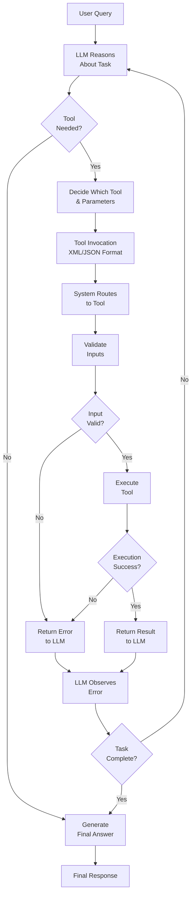

# Tool Use

## Detailed Explanation

Tool use enables LLMs to interact with external systems by calling functions and APIs. Unlike pure text generation, tool use allows agents to: (1) retrieve real-time information (web search, database queries), (2) perform computations (calculator, code execution), (3) take actions (send emails, update databases, trigger workflows), (4) process inputs (image recognition, document parsing). Mechanism: (1) define tools with name, description, input schema, (2) tell LLM about tools, (3) LLM decides when to call tools and with what parameters, (4) system executes tool, (5) return result to LLM as context for next step. This closes the feedback loop: LLM reasons → chooses tool → observes tool output → reasons again. Key advantages: (1) grounded in real data (not hallucinated), (2) real-world impact beyond text, (3) composable (combine many tools), (4) adaptive (LLM learns which tool for which task). Challenges: (1) tool failures (network errors, invalid inputs)—must handle gracefully, (2) latency (tools are slow)—use async and caching, (3) LLM confusion (similar tools)—clear naming and description, (4) security (expose dangerous operations)—sandbox and validate. Best for: knowledge work (search + reason), automation (trigger actions based on reasoning), multi-step workflows. Foundation of agentic AI.

## Core Intuition

Imagine a lawyer (LLM) with an assistant (tool use). Lawyer: "I need to look up case law on contract disputes." Assistant provides: legal database tool, web search tool, document analysis tool. Lawyer calls the database tool ("search for precedents"), gets results, reasons about them, then calls document tool ("analyze this clause"), gets insights, delivers opinion. Without tools, lawyer just guesses; with tools, lawyer is grounded in facts and can take action. Tool use is that assistant—extending what LLM can do beyond text.

## How It Works

Tool use operates through definition, availability, decision, execution, and integration:

1. **Tool Definition** — Define each tool: name (unique), description (helps LLM decide), input schema (JSON defining parameters)
2. **Tool Availability** — Tell LLM which tools exist and how to use them
3. **LLM Decision** — LLM reasons about task, decides if tool needed, what tool, what parameters
4. **Tool Invocation** — LLM generates structured tool call (XML, JSON, or function format)
5. **System Execution** — System routes call to correct tool, validates inputs, executes
6. **Error Handling** — If tool fails, catch error, return informative message to LLM
7. **Result Integration** — Return tool output to LLM as additional context
8. **Loop** — LLM observes result, continues reasoning, may call another tool



## Architecture / Trade-offs

**Tool Definition Clarity:**
- Vague ("compute something") — LLM confused, wrong tool choices
- Precise ("Arithmetic calculator. Accepts: '5+3', '2**3', '-10'. Returns: computed number") — LLM confident, correct choices

**Error Handling Strategy:**
- Fail-hard (tool error = task fails) — Simple, loses work, frustrating
- Retry (error → retry with same inputs) — Recovers transient failures
- Fallback (error → use alternative tool) — Robust, adds complexity
- Partial results (error → continue with incomplete data) — Flexible, may miss insights

**Tool Execution:**
- Synchronous (LLM waits for tool) — Simple, slow if tool takes >1s
- Asynchronous (tool executes in background, LLM continues) — Fast, complex management
- Batched (queue multiple tool calls, execute together) — Efficient, requires queueing

**Tool Distribution:**
- Local (tools run in-process) — Fast, limited scale
- Remote (tools are microservices) — Scalable, adds network latency and failures

**Validation Level:**
- No validation (pass inputs directly to tool) — Fast, unsafe (garbage in → garbage out)
- Input validation (check before calling) — Safe, prevents bad inputs from reaching tool
- Schema validation (JSON schema) — Strict, helps LLM align with expectations

## Interview Q&A

**Q: What is tool use and why is it critical for agents?**
A: Tool use lets LLMs call external functions/APIs to perform actions beyond text generation. Without tools, LLMs only generate text (hallucinate). With tools, they: (1) retrieve real data (web search, databases), (2) perform calculations (calculator), (3) take actions (send emails, trigger workflows). Tool use closes the loop: reason → act → observe → reason. Foundation of agentic AI.

**Q: How do you define a tool so LLMs use it correctly?**
A: Three things: (1) Name—unique, self-explanatory ("calculator", not "tool_1"), (2) Description—clear, include examples ("Arithmetic calculator. Accepts: '5+3', '2**3'. Returns: number"), (3) Input schema—JSON schema defining parameters, types, constraints. Bad: "Compute stuff". Good: "Perform arithmetic (e.g., '5+3*2'). Accepts string expressions with +, -, *, /, **. Returns number."

**Q: What happens if a tool fails or LLM calls with invalid input?**
A: Must handle gracefully. (1) Validate input before calling—catch schema mismatches early, (2) Catch tool errors—network timeout, API error, (3) Return informative error to LLM—"database query failed: connection timeout. Retry or try alternative tool". (4) Set max_calls limit—prevent infinite loops. (5) Add fallback—if primary tool fails, use alternative.

**Q: How do you prevent LLM from hallucinating tool outputs?**
A: Don't let it! (1) Always execute tools, don't let LLM guess results, (2) Return actual tool output to LLM as context, (3) Don't fabricate results. Example: LLM says "I'll search for X". System actually executes search. If search finds nothing, tell LLM "search for X returned 0 results", not "found: [made up]". Truthfulness is crucial.

**Q: How to organize many tools to avoid LLM confusion?**
A: Too many similar tools → LLM picks wrong one. Solutions: (1) Hierarchical organization—group by domain (database tools, web tools, calculation tools), (2) Distinct names—not "query_db_v1", "query_db_v2", but "search_user_database", "search_product_catalog", (3) Clear descriptions with examples—help LLM distinguish, (4) Limit to 5-10 tools max—any more, organize differently, (5) Category prefix—"db_query_users", "db_query_products" makes relationships clear.

**Q: When should tool use be asynchronous vs synchronous?**
A: Synchronous: LLM waits for tool to return. Good for fast tools (<1s). Bad for slow tools (>5s latency). Asynchronous: tool executes in background; LLM can continue reasoning. Good for slow tools, allows parallelism. Bad: harder to manage, need callbacks. Use: sync for fast tools (calculator, small database queries), async for slow tools (web scraping, large analyses, external API calls with delays).

**Q: How do you handle tool failures and fallbacks?**
A: Design upfront: (1) Identify critical tools (must succeed), (2) Provide fallbacks—if primary fails, have alternative, (3) Retry logic—transient failures (network) worth retrying; permanent failures (invalid input) not, (4) Partial results—if tool fails, can you proceed with empty/default value?, (5) Escalation—if all tools fail, escalate to human. Example: web search fails → try cached results → if no cache, tell LLM "unable to search, proceeding with general knowledge".

**Q: What security risks come with tool use?**
A: LLM might call tools unexpectedly or with malicious input. Risks: (1) Dangerous operations exposed (file delete, system commands)—don't expose, (2) SQL injection—LLM generates malicious SQL, (3) Privilege escalation—LLM calls admin tools, (4) Resource exhaustion—LLM calls expensive tool repeatedly. Mitigations: (1) Sandbox tools—run in restricted environment, (2) Validate inputs strictly, (3) Role-based access—LLM can only call allowed tools, (4) Rate limiting—max calls per minute, (5) Monitoring—log all tool calls, audit for suspicious patterns.

## Best Practices

1. **Write Clear Tool Descriptions** — Include examples. "Search web for current information. Example: search('climate change 2024')" not just "web search".

2. **Validate Inputs Rigorously** — Check schema before executing. Catch type mismatches, out-of-range values, injection attacks.

3. **Return Informative Errors** — Don't return just "error". Return: "Database connection timeout. Retry in 5s or use cached data from 2 hours ago". LLM needs context to decide next step.

4. **Handle Tool Failures Gracefully** — Never crash silently. Always catch exceptions, return meaningful error.

5. **Set Timeouts** — Tools should never hang. Set max_time (e.g., 10s). If timeout, cancel and return error.

6. **Use Async for Slow Tools** — Long-running tools should be async (don't block LLM reasoning).

7. **Cache Tool Results** — If LLM calls same tool with same input twice, use cached result. Saves latency and cost.

8. **Monitor Tool Usage** — Track: which tools called, frequency, errors, latency. If web_search fails 50%, investigate.

9. **Document Tool Contract** — What does tool guarantee? "Always succeeds", "May timeout", "May return empty", "Cached results may be stale"?

10. **Security-First Design** — Review tools for security risks before exposing to agents. Sandbox execution. Validate all inputs.

## Common Pitfalls

**Pitfall 1: Vague Tool Descriptions**
Issue: Description is "perform calculation". LLM unsure if tool handles division, percentages, exponents.
Fix: Be specific. "Arithmetic calculator supporting +, -, *, /, ** on integers/floats. Example: '5 + 3 * 2' → 11"

**Pitfall 2: No Input Validation**
Issue: LLM calls calculator("hello"). Tool crashes or returns garbage. LLM confused.
Fix: Validate before executing. Check schema, type, ranges. Return error: "Invalid input 'hello' for calculator. Expected arithmetic expression."

**Pitfall 3: Silent Tool Failures**
Issue: Tool fails (network error, database down). System silently returns empty. LLM thinks no results exist.
Fix: Return explicit error. "Database unavailable. Reason: connection timeout. Retry in 10s." LLM knows difference between "no results" and "tool failed".

**Pitfall 4: Infinite Tool Loops**
Issue: LLM gets stuck calling same tool repeatedly. No progress. Max steps hit.
Fix: Track called tools. Set max_calls per tool (e.g., max 3 calls per tool per task). If limit hit, escalate or try different approach.

**Pitfall 5: Slow Tools Block LLM**
Issue: Tool takes 30s. LLM waits, latency becomes unacceptable (user sees delay).
Fix: Use async execution. Tool executes in background. LLM continues reasoning, polls for result, or waits only when needed.

**Pitfall 6: Tool Name Confusion**
Issue: Two tools "search_database" and "search_docs" do similar things. LLM picks wrong one.
Fix: Rename clearly. "search_user_database" vs "search_documentation_archive". Descriptions explain difference.

**Pitfall 7: No Fallback for Tool Failure**
Issue: Primary tool fails. No fallback. Task fails entirely.
Fix: Design fallback. "Try web search. If fails, use cached data. If no cache, use general knowledge."

**Pitfall 8: Exposing Dangerous Tools**
Issue: Database delete tool exposed to LLM. LLM accidentally calls it (malicious input or misunderstanding).
Fix: Don't expose dangerous operations. If necessary, add approval gates (require human confirmation before executing delete).

## Code Examples

### Example 1: Basic Tool Use with Anthropic API

```python
import anthropic
import json

client = anthropic.Anthropic()

# Define tools
tools = [
    {
        "name": "calculator",
        "description": "Perform arithmetic calculations. Examples: '5 + 3', '10 * 4', '100 / 2'. Returns the calculated number.",
        "input_schema": {
            "type": "object",
            "properties": {
                "expression": {
                    "type": "string",
                    "description": "Mathematical expression (e.g., '5 + 3 * 2')"
                }
            },
            "required": ["expression"]
        }
    },
    {
        "name": "web_search",
        "description": "Search the web for current information. Example: search for 'climate change 2024'.",
        "input_schema": {
            "type": "object",
            "properties": {
                "query": {
                    "type": "string",
                    "description": "Search query (e.g., 'latest AI breakthroughs')"
                }
            },
            "required": ["query"]
        }
    }
]

def execute_tool(tool_name: str, tool_input: dict) -> str:
    """Execute a tool and return result."""
    if tool_name == "calculator":
        try:
            result = eval(tool_input["expression"])  # NOTE: unsafe for untrusted input
            return json.dumps({"success": True, "result": result})
        except Exception as e:
            return json.dumps({"success": False, "error": str(e)})
    
    elif tool_name == "web_search":
        # Simulate web search
        query = tool_input["query"]
        return json.dumps({
            "success": True,
            "results": [
                {"title": f"Result 1 for {query}", "snippet": "Information..."},
                {"title": f"Result 2 for {query}", "snippet": "More info..."}
            ]
        })
    
    return json.dumps({"success": False, "error": f"Unknown tool: {tool_name}"})

def run_agent_with_tools(user_query: str):
    """Run agent loop with tool use."""
    messages = [{"role": "user", "content": user_query}]
    
    for iteration in range(10):  # Max 10 iterations
        # Get LLM response with tools available
        response = client.messages.create(
            model="claude-3-5-sonnet-20241022",
            max_tokens=1024,
            tools=tools,
            messages=messages
        )
        
        # Check if LLM wants to use tools
        if response.stop_reason == "tool_use":
            # Add assistant response to messages
            messages.append({"role": "assistant", "content": response.content})
            
            # Process tool uses
            tool_results = []
            for block in response.content:
                if block.type == "tool_use":
                    print(f"🔧 Calling tool: {block.name} with input: {block.input}")
                    result = execute_tool(block.name, block.input)
                    tool_results.append({
                        "type": "tool_result",
                        "tool_use_id": block.id,
                        "content": result
                    })
            
            # Add tool results to messages
            messages.append({"role": "user", "content": tool_results})
        
        else:
            # LLM finished (no more tool use)
            final_text = next(
                (block.text for block in response.content if hasattr(block, 'text')),
                "No response"
            )
            print(f"✓ Final response: {final_text}")
            return final_text
    
    return "Max iterations reached"

# Run agent
run_agent_with_tools("What's 42 * 17? Then search for the significance of that number.")
```

### Example 2: Tool Use with Error Handling and Validation

```python
from typing import Optional, Dict, Any

class ToolExecutor:
    def __init__(self):
        self.call_history = {}
        self.max_calls_per_tool = 5
    
    def validate_input(self, tool_name: str, tool_input: dict) -> tuple[bool, str]:
        """Validate input against tool schema."""
        if tool_name == "calculator":
            if "expression" not in tool_input:
                return False, "Missing 'expression' parameter"
            if not isinstance(tool_input["expression"], str):
                return False, "'expression' must be a string"
            # Check for dangerous operations
            dangerous = ["__import__", "eval", "exec", "open"]
            if any(d in tool_input["expression"] for d in dangerous):
                return False, "Expression contains dangerous operations"
            return True, ""
        
        elif tool_name == "web_search":
            if "query" not in tool_input:
                return False, "Missing 'query' parameter"
            if len(tool_input["query"]) < 1:
                return False, "Query cannot be empty"
            if len(tool_input["query"]) > 500:
                return False, "Query too long (max 500 chars)"
            return True, ""
        
        return False, f"Unknown tool: {tool_name}"
    
    def execute(self, tool_name: str, tool_input: dict) -> str:
        """Execute tool with validation and error handling."""
        # Check call limit
        if tool_name not in self.call_history:
            self.call_history[tool_name] = 0
        
        if self.call_history[tool_name] >= self.max_calls_per_tool:
            return json.dumps({
                "success": False,
                "error": f"Tool '{tool_name}' call limit reached ({self.max_calls_per_tool})"
            })
        
        # Validate input
        valid, error_msg = self.validate_input(tool_name, tool_input)
        if not valid:
            return json.dumps({"success": False, "error": f"Input validation failed: {error_msg}"})
        
        # Execute
        try:
            self.call_history[tool_name] += 1
            
            if tool_name == "calculator":
                result = eval(tool_input["expression"])
                return json.dumps({"success": True, "result": result})
            
            elif tool_name == "web_search":
                # Simulate search with timeout
                query = tool_input["query"]
                return json.dumps({
                    "success": True,
                    "results": [
                        {"title": f"Result for {query}", "url": "https://example.com"}
                    ]
                })
        
        except TimeoutError:
            return json.dumps({
                "success": False,
                "error": "Tool execution timeout. Please try again.",
                "retryable": True
            })
        except Exception as e:
            return json.dumps({
                "success": False,
                "error": f"Tool execution failed: {str(e)}",
                "retryable": isinstance(e, (ConnectionError, TimeoutError))
            })

# Usage
executor = ToolExecutor()
result = executor.execute("calculator", {"expression": "5 + 3"})
print(result)  # {"success": true, "result": 8}
```

### Example 3: Tool Composition and Fallbacks

```python
class ToolCompositor:
    def __init__(self, tools: Dict[str, callable], fallbacks: Dict[str, list]):
        self.tools = tools
        self.fallbacks = fallbacks  # {"primary_tool": ["fallback1", "fallback2"]}
    
    async def execute_with_fallback(self, tool_name: str, tool_input: dict, max_retries: int = 2) -> str:
        """Execute tool with fallback strategy."""
        
        # Try primary tool
        for attempt in range(max_retries):
            try:
                tool = self.tools[tool_name]
                result = await tool(**tool_input)
                return result
            except Exception as e:
                print(f"⚠️  {tool_name} attempt {attempt + 1} failed: {str(e)[:50]}")
                if attempt < max_retries - 1:
                    await asyncio.sleep(1)  # Wait before retry
        
        # Try fallback tools
        fallback_list = self.fallbacks.get(tool_name, [])
        for fallback_name in fallback_list:
            try:
                print(f"→ Trying fallback: {fallback_name}")
                tool = self.tools[fallback_name]
                result = await tool(**tool_input)
                print(f"✓ Fallback succeeded")
                return result
            except Exception as e:
                print(f"  Fallback failed: {str(e)[:50]}")
        
        return json.dumps({
            "success": False,
            "error": f"All attempts failed for '{tool_name}'. Primary and fallbacks exhausted."
        })

# Usage
compositor = ToolCompositor(
    tools={
        "web_search": search_web,
        "search_cache": search_cache,
        "calculator": calculate
    },
    fallbacks={"web_search": ["search_cache"]}
)

result = await compositor.execute_with_fallback("web_search", {"query": "AI trends"})
```

## Related Concepts

- **Tool Calling** — Structured patterns for tool invocation
- **Structured Output** — Ensuring tool outputs match expected schema
- **Agent Loops** — Tool use within agent reasoning loop
- **Error Recovery** — Handling tool failures and retries
- **Planning & Reasoning** — Deciding which tools to use and when

