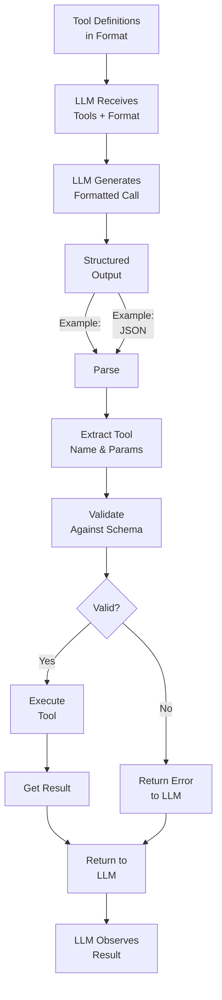

# Tool Calling

## Detailed Explanation

Tool calling is the structured protocol for LLMs to invoke external functions. While tool use defines *what* tools exist and *why* to use them, tool calling specifies *how* LLMs formally request tool execution. Mechanism: (1) LLM generates structured output (XML, JSON, or function format) indicating which tool to call and parameters, (2) system parses this structured output, (3) validates parameters, (4) executes tool, (5) returns result. Key patterns: (1) XML-based (`<tool_use><invoke name="...">`) used by Claude, (2) JSON-based (OpenAI format) with structured fields, (3) function format (named parameters with types). Advantages of structured calling: (1) parseable by code (not ambiguous natural language), (2) type-safe (schema validation), (3) supports parallel tool calls (multiple tools in one response), (4) enables tool composition. Challenges: (1) LLM must reliably generate valid syntax, (2) training/prompting critical (model needs examples), (3) parsing errors possible, (4) over-specification (too many parameters confuses LLM). Best for: mission-critical systems where tool calls must be reliable and parseable. Foundation of production agents.

## Core Intuition

Imagine a radio operator (LLM) and command center (system). Without structured calling, operator says "um, call the weather team with latitude and longitude... I forgot the format." Vague, unparseable. With structured calling: operator has protocol: "WEATHER-REQUEST: lat=40.7128, lon=-74.0060, unit=celsius". Clear, parseable, reliable. System receives message, parses it, dispatches correctly. Tool calling is that protocol—ensuring LLM's requests are machine-readable.

## How It Works

Tool calling operates through format specification, generation, parsing, validation, and execution:

1. **Format Definition** — Specify how tools are called: XML, JSON, or function format
2. **Tool Description in Format** — Provide tool schemas in the chosen format
3. **LLM Generation** — LLM generates formatted tool calls (trained via examples)
4. **Structured Parsing** — System parses formatted output
5. **Parameter Extraction** — Extract tool name, parameters from formatted output
6. **Validation** — Validate parameters against schema
7. **Tool Execution** — Call tool with validated parameters
8. **Response Integration** — Return result to LLM



## Architecture / Trade-offs

**Format Choice:**

| Format | Example | Pros | Cons |
|--------|---------|------|------|
| **XML** | `<tool_use><invoke name="calc"><param...>` | Native parsing, clear hierarchy | Verbose, not JSON |
| **JSON** | `{"tool": "calc", "params": {...}}` | Lightweight, standard | Ambiguity in format |
| **Function** | `calculator(expression="5+3")` | Most natural for code | Hard to parse from LLM output |

**Parallel Tool Calls:**
- Single tool call per response — Simple, sequential, slow
- Multiple tools per response — Parallel execution, faster, more complex parsing

**Parameter Handling:**
- Positional — function(arg1, arg2) — Compact, error-prone (order matters)
- Named — function(x=5, y=3) — Explicit, safer, required for schemas
- Required vs Optional — All required = strict, some optional = flexible

**Error Recovery:**
- Strict validation (fail if invalid) — Safe but may reject valid attempts
- Lenient parsing (guess intent) — Permissive but unreliable
- Feedback loop (error → retry) — Best, but adds latency

## Interview Q&A

**Q: What's the difference between tool use and tool calling?**
A: Tool use = what tools are available and why to use them (semantic). Tool calling = how to formally invoke tools (syntactic). Example: Tool use says "you have calculator tool, use when math needed." Tool calling says "here's the XML format for calculator calls: `<invoke name='calculator'><parameter name='expression'>5+3</parameter></invoke>`". Both required for working agents.

**Q: Why not just let LLM generate natural language like "call calculator with 5 plus 3"?**
A: Because it's unparseable. System doesn't know: is "5 plus 3" the expression or separate arguments? Did LLM mean "calculator" or "compute"? Structured formats are unambiguous: `<invoke name="calculator"><parameter name="expression">5+3</parameter></invoke>` is clear and parseable. Natural language = hallucinations and errors.

**Q: How do you train LLMs to generate tool calls in the right format?**
A: Few-shot examples in the prompt. Show 2-3 examples of tool definitions + formatted calls. Example: "Here's a calculator tool: {schema}. To use it, write: <invoke name='calculator'>... Example: User asks 'What's 5+3?'. You respond: <invoke name='calculator'><parameter name='expression'>5+3</parameter></invoke>. Now you try: User asks 'What's 10*4?'". Good examples → LLM learns the pattern.

**Q: What happens if LLM generates invalid tool calling syntax?**
A: System parses, fails to extract parameters, returns error. Solutions: (1) Strict (fail task), (2) Regex fallback (try to extract even if syntax off), (3) Ask LLM to retry ("your syntax was invalid, try again with correct format"). Best: track errors, retrain if persistent (wrong format suggests examples aren't clear).

**Q: Can you call multiple tools in one response?**
A: Depends on format. XML: `<invoke><...></invoke><invoke><...></invoke>` (multiple calls in one response). JSON: multiple objects in array. Function: harder. This is powerful: LLM can parallelize (call search AND calculator simultaneously, get both results faster). But parsing must handle multiple calls.

**Q: How do you handle tool calling failures (invalid parameters, tool not found)?**
A: Return clear error to LLM with details: "Tool 'calculator' call failed: parameter 'expression' is required but missing. Here's the schema: {schema}. Retry with correct parameters." LLM learns from feedback and retries correctly.

**Q: What's the relationship between tool calling and structured output?**
A: Related but different. Tool calling = calling external tools with structured syntax. Structured output = LLM outputs must match specified schema (JSON, type constraints). Structured output is broader (applies to any LLM output). Tool calling is specific to tool invocation. A well-designed system uses both: tool calls are structured, and final responses may also be structured.

## Best Practices

1. **Choose Format Based on Context** — XML for complex hierarchies, JSON for web APIs, function for code execution. Consistent format across all tools.

2. **Provide Clear Examples in Prompt** — Few-shot examples (2-3 concrete examples) are critical. LLM learns from examples, not abstract descriptions.

3. **Use Named Parameters** — Not positional. Clearer, matches schema validation, less error-prone.

4. **One Tool Call Per Message** — Simplifies parsing. If LLM wants multiple tools, can chain (return result, let LLM call next).

5. **Validate Parameters Strictly** — Check type, range, constraints. Reject invalid, return specific error to LLM.

6. **Support Parallel Calls** — If format allows (XML, JSON arrays), parse and execute multiple tools in parallel.

7. **Handle Gracefully on Parse Failure** — If invalid format, return error message to LLM (don't crash). Let LLM retry.

8. **Log All Tool Calls** — Track which tools called, with what parameters, results. Essential for debugging and monitoring.

9. **Version Tool Calling Protocol** — As tools evolve, version format. Support multiple versions during transition.

10. **Test with Real LLM Outputs** — Don't just test format in isolation. Test actual LLM output; real models sometimes deviate from expected format.

## Common Pitfalls

**Pitfall 1: Ambiguous Format Specification**
Issue: Format not clearly defined. LLM guesses structure, generates wrong syntax.
Fix: Be explicit. Provide exact example: "To call calculator, write exactly: <invoke name='calculator'>...</invoke>. Capitalization and tags matter."

**Pitfall 2: No Examples in Prompt**
Issue: LLM told about format but not shown examples. Generates wrong syntax.
Fix: Include 2-3 examples. "Example: User asks 'What's 10+5?'. You generate: <invoke name='calculator'><parameter name='expression'>10+5</parameter></invoke>".

**Pitfall 3: Positional Parameters**
Issue: Format uses positional args (calc(5, 3)). LLM confused about order. Calls with swapped parameters.
Fix: Use named parameters. calc(a=5, b=3) is explicit and safer.

**Pitfall 4: Silent Parse Failures**
Issue: LLM generates wrong syntax. System fails to parse, silently moves on. LLM doesn't know error occurred.
Fix: Always return parse errors to LLM. "Parsing failed: expected '<invoke name=...' but got '...'. Retry with correct format."

**Pitfall 5: No Format Validation**
Issue: LLM generates valid syntax but invalid semantics (tool_name="unknown_tool", or missing required params).
Fix: Validate after parsing. Check: tool exists, all required params present, param types match schema.

**Pitfall 6: Format Changes Without Updating Tools**
Issue: Format changes (XML to JSON). Tools still use old format. LLM generates new format, parsing breaks.
Fix: Version format. Support multiple versions during transition. Migrate all tools at once.

**Pitfall 7: No Handling for Multiple Calls**
Issue: LLM wants to call multiple tools. Format doesn't support. LLM gets stuck.
Fix: Support multiple calls (XML: multiple `<invoke>` blocks, JSON: array of calls). Parse and execute in parallel if possible.

**Pitfall 8: Format Too Strict**
Issue: Format requires exact capitalization, spacing, tag names. LLM deviates slightly. Parsing fails.
Fix: Lenient parsing. Use regex to extract tool name and params even if whitespace/case differs. Or provide very clear examples and examples of what LLM will generate.

## Code Examples

### Example 1: XML-Based Tool Calling Parser

```python
import xml.etree.ElementTree as ET
from typing import List, Dict, Tuple

class XMLToolCallParser:
    def __init__(self, available_tools: Dict[str, callable]):
        self.tools = available_tools
    
    def parse_tool_calls(self, llm_output: str) -> List[Dict]:
        """Parse LLM output for XML tool calls."""
        tool_calls = []
        
        try:
            # Find all <invoke> tags
            import re
            pattern = r'<invoke\s+name=["\']([^"\']+)["\']>(.*?)</invoke>'
            matches = re.findall(pattern, llm_output, re.DOTALL)
            
            for tool_name, content in matches:
                # Parse parameters
                params = {}
                param_pattern = r'<parameter\s+name=["\']([^"\']+)["\'][>]?([^<]*)</parameter>'
                param_matches = re.findall(param_pattern, content)
                
                for param_name, param_value in param_matches:
                    params[param_name] = param_value.strip()\n                
                tool_calls.append({\n                    'tool': tool_name,\n                    'params': params\n                })\n        except Exception as e:\n            print(f\"Parse error: {e}\")\n        
        return tool_calls\n    \n    def execute_calls(self, tool_calls: List[Dict]) -> List[Dict]:\n        \"\"\"Execute parsed tool calls.\"\"\"\n        results = []\n        \n        for call in tool_calls:\n            tool_name = call.get('tool')\n            params = call.get('params', {})\n            \n            # Validate tool exists\n            if tool_name not in self.tools:\n                results.append({\n                    'success': False,\n                    'error': f'Tool not found: {tool_name}'\n                })\n                continue\n            \n            # Execute\n            try:\n                result = self.tools[tool_name](**params)\n                results.append({\n                    'success': True,\n                    'tool': tool_name,\n                    'result': result\n                })\n            except Exception as e:\n                results.append({\n                    'success': False,\n                    'tool': tool_name,\n                    'error': str(e)\n                })\n        \n        return results\n\n# Example usage\nparser = XMLToolCallParser({\n    'calculator': lambda expression: eval(expression),\n    'web_search': lambda query: f\"Results for {query}\"\n})\n\nllm_output = \"\"\"<invoke name='calculator'>\n<parameter name='expression'>5 + 3</parameter>\n</invoke>\"\"\"\n\ncalls = parser.parse_tool_calls(llm_output)\nresults = parser.execute_calls(calls)\nprint(results)  # [{'success': True, 'tool': 'calculator', 'result': 8}]\n```\n\n### Example 2: JSON-Based Tool Calling with Validation\n\n```python\nimport json\nfrom jsonschema import validate, ValidationError\n\nclass JSONToolCallExecutor:\n    def __init__(self, tool_schemas: Dict[str, Dict]):\n        self.tool_schemas = tool_schemas\n    \n    def parse_and_execute(self, llm_output: str) -> Dict:\n        \"\"\"Parse JSON tool calls and execute.\"\"\"\n        try:\n            # Extract JSON from LLM output\n            json_match = json.loads(llm_output)\n            tool_name = json_match.get('tool')\n            params = json_match.get('params', {})\n            \n            # Validate against schema\n            if tool_name not in self.tool_schemas:\n                return {'success': False, 'error': f'Tool not found: {tool_name}'}\n            \n            schema = self.tool_schemas[tool_name]\n            try:\n                validate(instance=params, schema=schema)\n            except ValidationError as e:\n                return {'success': False, 'error': f'Parameter validation failed: {e.message}'}\n            \n            # Execute (in real system, dispatch to actual tool)\n            return {\n                'success': True,\n                'tool': tool_name,\n                'params': params,\n                'result': f'Executed {tool_name} with {params}'\n            }\n        \n        except json.JSONDecodeError as e:\n            return {'success': False, 'error': f'Invalid JSON: {e}'}\n\n# Example schemas\nschemas = {\n    'calculator': {\n        'type': 'object',\n        'properties': {\n            'expression': {'type': 'string'}\n        },\n        'required': ['expression']\n    },\n    'web_search': {\n        'type': 'object',\n        'properties': {\n            'query': {'type': 'string'},\n            'limit': {'type': 'integer', 'default': 10}\n        },\n        'required': ['query']\n    }\n}\n\nexecutor = JSONToolCallExecutor(schemas)\n\n# Valid call\nresult = executor.parse_and_execute(json.dumps({\n    'tool': 'calculator',\n    'params': {'expression': '5 + 3'}\n}))\nprint(result)  # success: True\n\n# Invalid call (missing required param)\nresult = executor.parse_and_execute(json.dumps({\n    'tool': 'calculator',\n    'params': {}  # Missing 'expression'\n}))\nprint(result)  # success: False, error about missing param\n```\n\n### Example 3: Tool Calling with Retry Logic\n\n```python\nclass RobustToolCaller:\n    def __init__(self, parser, executor, max_retries: int = 3):\n        self.parser = parser\n        self.executor = executor\n        self.max_retries = max_retries\n    \n    def call_with_retry(self, user_query: str, llm_call_fn) -> Dict:\n        \"\"\"Get tool calls from LLM with retry on parse failures.\"\"\"\n        \n        for attempt in range(self.max_retries):\n            # Get LLM output\n            llm_output = llm_call_fn(user_query, attempt)\n            \n            # Parse\n            calls = self.parser.parse_tool_calls(llm_output)\n            if calls:\n                # Execute\n                return self.executor.execute_calls(calls)\n            \n            else:\n                # Parse failed, ask LLM to retry\n                print(f\"Attempt {attempt + 1}: Parse failed. Retrying...\")\n                user_query += f\"\\n\\nPrevious attempt failed to parse. Please use correct format: <invoke name='tool_name'><parameter name='param'>value</parameter></invoke>\"\n        \n        return {'success': False, 'error': 'Max retries exceeded'}\n```\n\n## Related Concepts\n\n- **Tool Use** — Defining what tools exist and why to use them\n- **Structured Output** — Ensuring outputs match expected schema\n- **Function Calling** — OpenAI's variant of tool calling\n- **Agent Loops** — Tool calling within agent reasoning loop\n- **Error Recovery** — Handling tool calling failures and retries\n\n