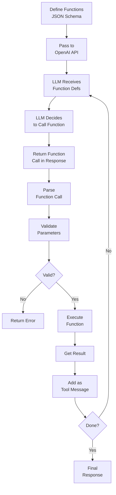

# Function Calling

## Detailed Explanation

Function calling is OpenAI's formalized approach to structured tool invocation. While tool calling is the general pattern (LLM requests execution of a function with structured parameters), function calling specifically refers to OpenAI's native implementation: define functions in JSON Schema format, pass to API, LLM returns structured function calls, system executes. Key distinction from generic tool calling: (1) native API support—built into model responses, (2) JSON Schema—OpenAI's preferred format, (3) parallel functions—multiple function calls in single response, (4) type safety—strict parameter validation. Mechanism: (1) define functions as JSON objects with name, description, parameters schema, (2) pass to chat completion with `tools` parameter, (3) LLM returns `tool_calls` in response, (4) parse and execute, (5) return results as tool messages, (6) loop until done. Advantages: seamless integration with OpenAI API, strong type safety, parallel execution built-in. Challenges: OpenAI-specific (not portable), JSON Schema complexity, learning curve. Best for: production systems using OpenAI models, teams familiar with OpenAI ecosystem. Complementary to: Claude's tool_use format (similar concept, different syntax).

## Core Intuition

Function calling is like having a contract with a function provider. You define the contract upfront: "I have these functions available, each takes these parameters with these types." LLM knows the contract and requests function calls following it exactly. The provider executes and returns results. This is more formal than generic tool calling—tighter integration, stricter contracts. Same concept as tool calling, but with OpenAI's specific structure and native API support.

## How It Works

Function calling operates through definition, schema specification, invocation, parsing, and execution:

1. **Function Definition** — Define in JSON Schema: name, description, parameters with types
2. **API Integration** — Pass functions to OpenAI chat completion API
3. **LLM Processing** — LLM reads function definitions, decides which to call
4. **Function Call Response** — LLM returns structured function calls in response
5. **Parsing** — Extract function name and parameters from response
6. **Execution** — Call actual functions with validated parameters
7. **Result Integration** — Return results back to LLM as tool messages
8. **Loop Control** — Continue if more calls needed, or finish



## Architecture / Trade-offs

**Integration Level:**
- Native API support — Built-in, seamless, easiest
- Custom parsing — More control, more work
- Hybrid — Use both for different scenarios

**Parameter Definition:**
- JSON Schema — OpenAI standard, verbose but precise
- Simplified schemas — Easier but less type safety
- Code-first (from Python types) — Generates schema from code

**Execution Model:**
- Sequential — One function call at a time
- Parallel — Multiple functions in one response (supported)
- Streaming — Stream function calls as LLM generates them

## Interview Q&A

**Q: What's the difference between function calling and tool calling?**
A: Tool calling is the general pattern (LLM requests function execution with structured parameters). Function calling is OpenAI's specific implementation. Same concept, different syntax. Tool calling (general) works across all LLM providers. Function calling (specific) is OpenAI's native feature.

**Q: When should you use OpenAI's function calling vs Claude's tool_use?**
A: If using OpenAI (GPT-4, GPT-3.5), use function calling—native API support, seamless integration. If using Claude, use tool_use (different syntax but same concept). For multi-model support, use adapter layer that translates between formats.

**Q: How do you define functions for the OpenAI API?**
A: JSON Schema format. Define: (1) name—unique function name, (2) description—what function does, include examples, (3) parameters—JSON schema with type, required fields, descriptions. Example:
```json
{
  "name": "calculate",
  "description": "Perform arithmetic. Example: calculate(expression='5+3')",
  "parameters": {
    "type": "object",
    "properties": {
      "expression": {"type": "string", "description": "Math expression"}
    },
    "required": ["expression"]
  }
}
```

**Q: Can you call multiple functions in one response?**
A: Yes. OpenAI supports parallel function calls—multiple functions in single response. Return all as tool messages, LLM processes results and continues. Faster than sequential (don't wait for first to finish before second).

**Q: How do you handle function parameter validation?**
A: (1) Schema validation—OpenAI validates against schema before LLM sees it (LLM shouldn't generate invalid), (2) Runtime validation—check parameters before executing, (3) Type coercion—convert types if safe, (4) Error return—if invalid, return error message to LLM (don't crash).

**Q: What's the difference between tool_choice and function_choice?**
A: `tool_choice` (Claude) specifies which tool agent must use. `function_choice` (OpenAI) similar—force function call or specify which function. Use when you know which function is needed upfront. Use `auto` (default) to let LLM decide.

## Best Practices

1. **JSON Schema is Critical** — Spend time getting schema right. Bad schema = LLM confusion, invalid calls.

2. **Detailed Descriptions** — Include examples in description. "Calculate arithmetic. Example: expression='5+3' returns 8."

3. **Type Precision** — Use correct JSON types. `"type": "number"` not `"type": "float"` (JSON doesn't distinguish).

4. **Required vs Optional** — Only mark as required if always present. Too many required fields = confusion.

5. **Enums for Constraints** — Use enum for restricted choices. `"enum": ["approve", "reject"]` is clearer than string.

6. **Support Parallel Calls** — Design system to handle multiple function calls in one response (faster).

7. **Validate Parameters** — Even though OpenAI validates, validate again before executing (defense in depth).

8. **Provide Feedback on Errors** — If function fails, return detailed error to LLM. LLM learns from feedback.

9. **Test with Real API** — Don't just test schema in isolation. Test actual OpenAI responses; real models deviate.

10. **Document Function Contract** — What does function guarantee? "Always succeeds", "May timeout", "May return empty"?

## Common Pitfalls

**Pitfall 1: Overly Complex Schema**
Issue: Schema has nested objects, complex constraints. JSON schema becomes hard to read. LLM confused.
Fix: Flatten if possible. Simple flat structure > nested objects. Use additional_properties: false to block extras.

**Pitfall 2: Missing Examples in Description**
Issue: LLM told "Calculate arithmetic" but no example. Guesses format.
Fix: Include examples. "Calculate arithmetic (e.g., expression='5+3') returns 8."

**Pitfall 3: No Parameter Validation**
Issue: LLM generates parameters. System executes without checking. Crashes on invalid data.
Fix: Validate parameters before executing. Check types, ranges, required fields.

**Pitfall 4: Not Supporting Parallel Calls**
Issue: System handles one function call at a time. LLM could call multiple simultaneously, but system doesn't support.
Fix: Design for parallel. Parse all function calls from response, execute in parallel (asyncio).

**Pitfall 5: Unclear Required Fields**
Issue: Mark many fields as required. LLM required to provide all, even when unsure. Hallucinations.
Fix: Only required if always present. Make optional if LLM might not know value.

**Pitfall 6: No Type Coercion**
Issue: Schema says integer, LLM sends "5" (string). Validation fails. Error.
Fix: Coerce types if safe (string "5" → int 5). Or handle gracefully.

**Pitfall 7: Functions Not Actually Called**
Issue: Define functions, pass to API, LLM returns calls. System parses but never actually executes.
Fix: Implement execution layer. Parse → validate → execute → return results.

**Pitfall 8: JSON Schema Misunderstanding**
Issue: Use wrong JSON schema format. LLM doesn't understand parameters. Invalid calls.
Fix: Learn JSON Schema spec. Test schema with validator. Start simple, add complexity gradually.

## Code Examples

### Example 1: OpenAI Function Definition

```python
from openai import OpenAI

client = OpenAI()

# Define functions
functions = [
    {
        "name": "calculate",
        "description": "Perform arithmetic calculations. Examples: '5+3', '10*4', '100/2'",
        "parameters": {
            "type": "object",
            "properties": {
                "expression": {
                    "type": "string",
                    "description": "Mathematical expression to evaluate"
                }
            },
            "required": ["expression"]
        }
    },
    {
        "name": "web_search",
        "description": "Search the web for information",
        "parameters": {
            "type": "object",
            "properties": {
                "query": {
                    "type": "string",
                    "description": "Search query"
                },
                "limit": {
                    "type": "integer",
                    "description": "Number of results (default: 10)",
                    "default": 10
                }
            },
            "required": ["query"]
        }
    }
]

def handle_function_calls(response):
    """Process function calls from OpenAI response."""
    if response.choices[0].finish_reason == "tool_calls":
        for tool_call in response.choices[0].message.tool_calls:
            function_name = tool_call.function.name
            arguments = json.loads(tool_call.function.arguments)
            
            if function_name == "calculate":
                result = eval(arguments["expression"])
                print(f"Calculated: {result}")
            
            elif function_name == "web_search":
                query = arguments["query"]
                limit = arguments.get("limit", 10)
                print(f"Searching: {query} (limit: {limit})")

# Make API call with functions
response = client.chat.completions.create(
    model="gpt-4",
    messages=[{"role": "user", "content": "What's 42 * 17? Then search for its significance."}],
    tools=[{"type": "function", "function": f} for f in functions]
)

handle_function_calls(response)
```

### Example 2: Parallel Function Calls

```python
def handle_parallel_calls(response):
    """Handle multiple function calls in parallel."""
    if response.choices[0].finish_reason == "tool_calls":
        calls = response.choices[0].message.tool_calls
        print(f"Processing {len(calls)} function calls in parallel")
        
        results = []
        for tool_call in calls:
            function_name = tool_call.function.name
            arguments = json.loads(tool_call.function.arguments)
            
            # Execute (in real system, parallelize with asyncio)
            if function_name == "calculate":
                result = eval(arguments["expression"])
            elif function_name == "web_search":
                result = f"Search results for {arguments['query']}"
            
            results.append({
                "tool_call_id": tool_call.id,
                "function": function_name,
                "result": result
            })
            print(f"  ✓ {function_name}: {result}")
        
        return results
```

### Example 3: Function Validation and Error Handling

```python
from jsonschema import validate, ValidationError

class FunctionCallValidator:
    def __init__(self, functions):
        self.functions = {f["name"]: f for f in functions}
    
    def validate_call(self, function_name: str, arguments: dict) -> tuple[bool, str]:
        """Validate function call against schema."""
        if function_name not in self.functions:
            return False, f"Function not found: {function_name}"
        
        schema = self.functions[function_name]["parameters"]
        try:
            validate(instance=arguments, schema=schema)
            return True, ""
        except ValidationError as e:
            return False, f"Validation error: {e.message}"
    
    def execute_with_validation(self, function_name: str, arguments: dict):
        """Execute function with validation."""
        valid, error = self.validate_call(function_name, arguments)
        
        if not valid:
            return {"success": False, "error": error}
        
        try:
            if function_name == "calculate":
                result = eval(arguments["expression"])
            else:
                result = f"Result for {function_name}"
            
            return {"success": True, "result": result}
        except Exception as e:
            return {"success": False, "error": f"Execution failed: {str(e)}"}

# Usage
validator = FunctionCallValidator(functions)
result = validator.execute_with_validation("calculate", {"expression": "5 + 3"})
print(result)  # {"success": True, "result": 8}
```

## Related Concepts

- **Tool Calling** — General pattern (function calling is OpenAI's implementation)
- **Tool Use** — Broader concept of using external tools
- **Structured Output** — Constraining LLM outputs to schema
- **Agent Loops** — Function calling within agent loop
- **Error Recovery** — Handling function call failures

