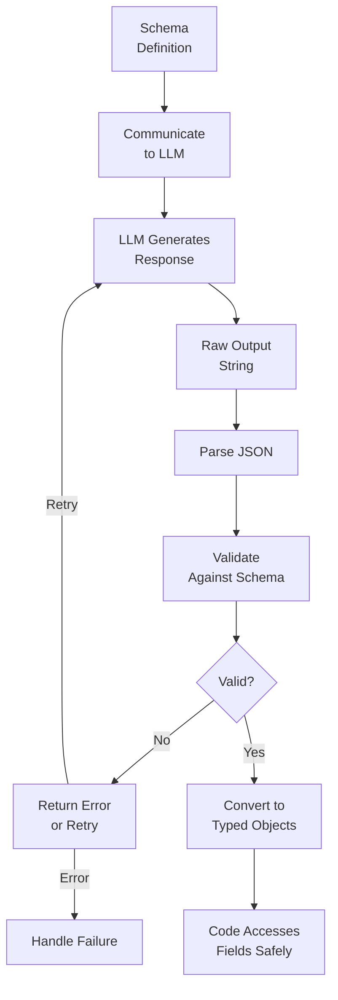

# Structured Output

## Detailed Explanation

Structured output constrains LLM responses to match specified schemas (JSON, type definitions, field constraints). While tool use is about calling external functions and tool calling is about structured invocation of tools, structured output is about ensuring the LLM's own response conforms to a schema. Example: instead of letting LLM respond with freeform text, constrain it to output JSON with fields {decision: string, confidence: float, reasoning: string}. Mechanism: (1) define output schema (JSON schema, TypeScript types, Pydantic models), (2) tell LLM about schema (in prompt or via API), (3) LLM generates response conforming to schema, (4) system validates response against schema, (5) parse into typed objects. Advantages: (1) downstream code reliably parses LLM output, (2) type safety (no "confidence" is a string instead of float), (3) enables composition (output of one agent becomes input to next), (4) easier testing (validate against schema), (5) reduces hallucinations (constrained outputs are more grounded). Challenges: (1) constraining LLM can reduce quality (flexibility lost), (2) LLM may still generate invalid output (requires validation), (3) over-specification (too many fields confuses LLM). Best for: production systems where outputs must be parsed programmatically. Critical for multi-step workflows.

## Core Intuition

Imagine ordering at a restaurant. Without structure: waiter says "give me your order" → you say "um, I want... maybe chicken? And rice?" → waiter confused. With structure: "pick one: [chicken/fish/vegetarian], sides: [rice/pasta/vegetables], cooking level: [rare/medium/well]" → you pick from options → order is clear, kitchen knows exactly what to make. Structured output is that menu: constrains responses into a clear format that downstream systems can reliably parse and act on.

## How It Works

Structured output operates through schema definition, prompt specification, generation, validation, and parsing:

1. **Schema Definition** — Define output format (JSON schema, Pydantic, TypeScript types)
   - Example: {decision: "approve"|"reject", confidence: 0.0-1.0, reasoning: string}
2. **Prompt Specification** — Communicate schema to LLM
   - Inline in prompt: "Respond with JSON: {decision: string, confidence: float}"
   - Via API: native schema support (Claude, OpenAI)
3. **LLM Generation** — LLM generates response conforming to schema
4. **Raw Output** — LLM response (may be valid or invalid JSON/format)
5. **Validation** — Check response against schema
   - Parse JSON, check types, validate constraints
6. **Handling Invalid Output** — If invalid, retry or error
7. **Parsing into Objects** — Convert validated output to typed objects
8. **Downstream Use** — Code reliably accesses fields



## Architecture / Trade-offs

**Schema Specification:**
- JSON Schema — Flexible, standard, complex
- Pydantic/TypedDict — Python-native, tight integration
- OpenAPI/TypeScript — Web-standard, language-agnostic

**Constraint Type:**
- Type constraints (int, string, bool) — Prevents type errors
- Enum constraints (choice from list) — Prevents invalid values
- Range constraints (min/max) — Prevents out-of-bounds values
- Pattern constraints (regex) — Validates format

**Flexibility:**
- Strict (all fields required) — Safe, restrictive
- Lenient (some fields optional) — Flexible, risky

**Validation Strategy:**
- Pre-execution (validate in prompt) — Catch early, may reduce quality
- Post-execution (validate after) — Full LLM quality, catch errors later
- Hybrid (suggest + validate) — Best of both

## Interview Q&A

**Q: What's the difference between tool calling and structured output?**
A: Tool calling = LLM invokes external functions with structured parameters. Structured output = LLM's response itself is structured. Related but different: tool calling is about calling tools; structured output is about formatting responses. Example: tool calling might be `<invoke name="recommendation"><param>product_id=123</param></invoke>`. Structured output might be `{"recommendation": {"product_id": 123, "score": 0.95, "reason": "popular"}}`.

**Q: Why constrain LLM output if it reduces flexibility?**
A: Because production systems need reliable parsing and downstream integration. Freeform text is hard to parse programmatically. Structured output lets code know: response is JSON with fields {decision, confidence, reasoning}. Code can safely access response.decision without checking if it exists or is a string. The constraint buys reliability.

**Q: What happens if LLM generates invalid structured output?**
A: Validation fails. Solutions: (1) Error—return error to user, (2) Retry—ask LLM to retry with clearer prompt, (3) Fallback—use default response, (4) Parse attempt—try to extract valid parts. Best: log failures, track patterns (if LLM consistently fails format, schema is too complex).

**Q: How do you prevent LLM from hallucinating when constrained to a schema?**
A: (1) Restrict choices to realistic values (enums), (2) Provide examples in prompt ("confidence must be 0.0-1.0, e.g., 0.87 for high confidence"), (3) Type constraints prevent some hallucinations (integer confidence score is harder to hallucinate than freeform text), (4) Validation catches obvious hallucinations (confidence > 1.0 is invalid).

**Q: Should all fields be required or some optional?**
A: Depends on use case. Required fields: safer (code expects them). Optional fields: flexible (LLM can skip unknown info). Best practice: mark as required only if always present. Optional if LLM might not know answer. Example: {decision: required, reasoning: required, confidence: optional}.

**Q: How do you compose structured outputs (one agent's output → next agent's input)?**
A: Define shared schema. Output of Agent A matches expected input schema of Agent B. Example: Agent A outputs {user_id: int, action: string}. Agent B expects input {user_id: int, action: string}. Can chain: A → B → C with guaranteed compatibility.

**Q: What's the performance impact of structured output?**
A: Minor overhead: validation (parse JSON, check schema) is fast (<1ms). Potential benefit: fewer retries (valid output on first try) outweighs validation cost. Constraint in prompt may slow LLM slightly (less freedom = slightly more tokens). Net: usually neutral or positive.

## Best Practices

1. **Use Native Schema Support** — If API offers native structured output (Claude messages with structured mode, OpenAI JSON mode), use it. More reliable than regex/parsing.

2. **Simple Schemas** — Don't overspecify. Too many fields confuse LLM. Core fields only.

3. **Provide Examples in Prompt** — Show 2-3 example responses matching schema. Teaches LLM the pattern.

4. **Make Fields Nullable/Optional** — If LLM might not know value, make optional rather than requiring a hallucinated value.

5. **Validate Post-Generation** — Even with schema in prompt, validate output. LLMs can still deviate.

6. **Handle Invalid Gracefully** — Don't crash on invalid output. Log, retry, or fallback.

7. **Type Constraints Prevent Some Errors** — integer field prevents string values, enum prevents arbitrary strings.

8. **Document Schema in Code** — If using Pydantic/TypedDict, code is self-documenting. Otherwise, maintain separate schema docs.

9. **Version Schemas** — As agents evolve, schemas change. Version them (OutputV1, OutputV2). Support multiple versions during migration.

10. **Test with Real LLM Outputs** — Don't assume LLM will perfectly follow schema. Test with actual outputs, find deviations, refine schema/prompt.

## Common Pitfalls

**Pitfall 1: Schema Too Complex**
Issue: Schema has 20 fields, nested objects, complex constraints. LLM confused, generates invalid output.
Fix: Simplify. Core fields only. Nested objects make parsing hard. Flatten if possible.

**Pitfall 2: No Examples in Prompt**
Issue: LLM told "respond with JSON schema X" but no examples. Guesses format.
Fix: Include 2-3 example outputs in prompt. "Example: {decision: 'approve', confidence: 0.92}".

**Pitfall 3: Required Fields LLM Can't Always Fill**
Issue: Schema requires "alternative_solution" field. LLM sometimes doesn't know it. Hallucinations.
Fix: Make optional. If LLM can't fill, leave empty. Better than hallucinated value.

**Pitfall 4: No Validation**
Issue: LLM generates "invalid JSON" or confidence=1.5 (out of range). Code crashes.
Fix: Always validate. Check JSON parseable, types correct, constraints satisfied.

**Pitfall 5: Silent Failures**
Issue: Validation fails, code silently uses default/empty response. LLM doesn't know.
Fix: Explicit error to LLM: "Invalid output: confidence must be 0.0-1.0. Got: 1.5. Retry."

**Pitfall 6: Schema Mismatch Between Agents**
Issue: Agent A outputs {decision: "yes"}, Agent B expects {recommendation: "accept"}. Incompatible.
Fix: Share schema. Both agents use same schema (or adapter layer).

**Pitfall 7: Overconstraining Reduces Quality**
Issue: Forcing binary decision (yes/no) when nuance needed. Output is low quality.
Fix: Balance: structure for parsing, but allow enough flexibility for quality.

**Pitfall 8: Not Testing Before Deployment**
Issue: Beautiful schema in code. Real LLM outputs consistently deviate. Validation fails 50% of time.
Fix: Test schema with real LLM before deploying. Adjust if LLM consistently fails.

## Code Examples

### Example 1: Pydantic-Based Structured Output

```python
from pydantic import BaseModel, Field, validator
from typing import Optional

class DecisionOutput(BaseModel):
    decision: str = Field(..., description="approve or reject")
    confidence: float = Field(..., ge=0.0, le=1.0, description="Confidence score 0-1")
    reasoning: str = Field(..., description="Why this decision")
    alternative: Optional[str] = Field(None, description="Alternative if applicable")
    
    @validator('decision')
    def validate_decision(cls, v):
        if v not in ['approve', 'reject']:
            raise ValueError('decision must be approve or reject')
        return v

def parse_llm_output(output_text: str) -> DecisionOutput:
    """Parse and validate LLM output."""
    import json
    try:
        # Parse JSON
        data = json.loads(output_text)
        # Validate against Pydantic schema
        result = DecisionOutput(**data)
        return result
    except json.JSONDecodeError as e:
        raise ValueError(f"Invalid JSON: {e}")
    except ValueError as e:
        raise ValueError(f"Validation failed: {e}")

# Example
llm_output = '''
{
    "decision": "approve",
    "confidence": 0.92,
    "reasoning": "User has good history",
    "alternative": null
}
'''

try:
    result = parse_llm_output(llm_output)
    print(f"Decision: {result.decision}, Confidence: {result.confidence}")
except ValueError as e:
    print(f"Error: {e}")
```

### Example 2: JSON Schema Validation

```python
import json
from jsonschema import validate, ValidationError

output_schema = {
    "type": "object",
    "properties": {
        "decision": {
            "type": "string",
            "enum": ["approve", "reject"]
        },
        "confidence": {
            "type": "number",
            "minimum": 0.0,
            "maximum": 1.0
        },
        "reasoning": {
            "type": "string"
        }
    },
    "required": ["decision", "confidence", "reasoning"]
}

def validate_and_parse(llm_output: str) -> dict:
    """Validate JSON output against schema."""
    try:
        # Parse JSON
        data = json.loads(llm_output)
        # Validate
        validate(instance=data, schema=output_schema)
        return data
    except json.JSONDecodeError as e:
        raise ValueError(f"Invalid JSON: {e}")
    except ValidationError as e:
        raise ValueError(f"Schema validation failed: {e.message}")

# Example
llm_output = '{"decision": "approve", "confidence": 0.92, "reasoning": "Good score"}'
try:
    result = validate_and_parse(llm_output)
    print(f"✓ Valid: {result}")
except ValueError as e:
    print(f"✗ Error: {e}")

# Invalid example
invalid_output = '{"decision": "maybe", "confidence": 1.5, "reasoning": "unclear"}'
try:
    result = validate_and_parse(invalid_output)
except ValueError as e:
    print(f"✗ Caught error: {e}")
```

### Example 3: Structured Output with Retry

```python
class StructuredOutputAgent:
    def __init__(self, schema: dict, max_retries: int = 3):
        self.schema = schema
        self.max_retries = max_retries
    
    def get_structured_response(self, prompt: str, llm_fn) -> dict:
        """Get response with structured output guarantee."""
        
        schema_description = json.dumps(self.schema)
        enhanced_prompt = f"{prompt}\n\nRespond with JSON matching this schema:\n{schema_description}\n\nExample: " + \
                        '{"decision": "approve", "confidence": 0.95}'
        
        for attempt in range(self.max_retries):
            # Get LLM response
            llm_output = llm_fn(enhanced_prompt)
            
            # Try to validate
            try:
                data = json.loads(llm_output)
                validate(instance=data, schema=self.schema)
                print(f"✓ Valid response (attempt {attempt + 1})")
                return data
            
            except (json.JSONDecodeError, ValidationError) as e:
                error_msg = str(e)[:100]
                print(f"✗ Attempt {attempt + 1} failed: {error_msg}")
                
                if attempt < self.max_retries - 1:
                    # Ask LLM to retry with error message
                    enhanced_prompt += f"\n\nPrevious attempt failed: {error_msg}. Retry with correct JSON format."
        
        raise ValueError(f"Failed to get valid structured output after {self.max_retries} attempts")

# Usage
agent = StructuredOutputAgent(schema=output_schema, max_retries=3)
try:
    result = agent.get_structured_response(
        "Should we approve user 123?",
        llm_fn=lambda p: '{"decision": "approve", "confidence": 0.88, "reasoning": "..."}'
    )
    print(f"Result: {result}")
except ValueError as e:
    print(f"Error: {e}")
```

## Related Concepts

- **Tool Calling** — Structured invocation of tools (related but different)
- **Tool Use** — Why and when to use tools
- **Agent Loops** — Structured output in multi-step workflows
- **Error Recovery** — Handling invalid structured output
- **Skill Composition** — Composing outputs/inputs of multiple skills

