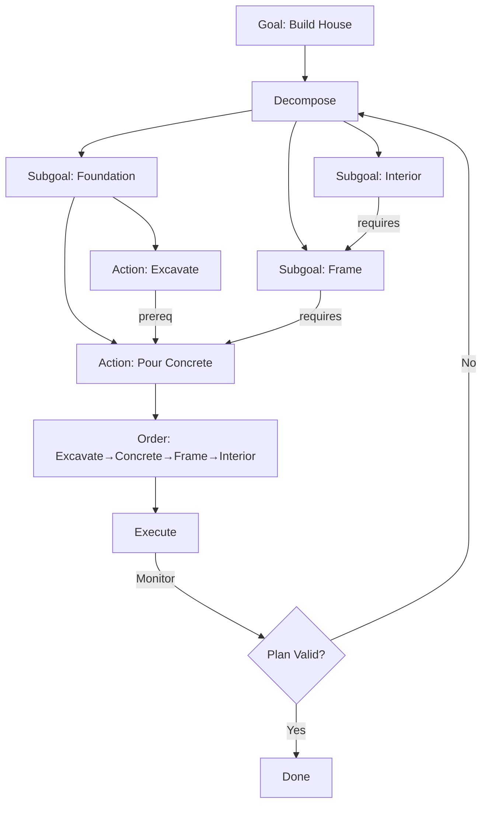

# Planning Agents

## Detailed Explanation

Planning agents decompose long-horizon tasks into multi-step plans before execution. Unlike reactive agents that respond step-by-step, planning agents think ahead: "To accomplish goal X, I need to do A, then B, then C. A has prerequisites P1, P2. Should I do P1 first or P2?" Planning involves: (1) goal decomposition—break goal into subgoals, (2) ordering constraints—identify dependencies (B can only run after A), (3) resource allocation—estimate cost/time per step, (4) contingency—handle failures. Planning agents excel at complex tasks (multi-step workflows, project planning, logistics) but struggle with unforeseen obstacles (rigid plans break easily). The key challenge: planning must account for partial observability (don't know full world state upfront) and stochasticity (real-world is unpredictable). Solutions: hierarchical planning (decompose recursively), reactive replanning (replan when environment changes), and contingency planning (include fallbacks). Planning is the opposite of pure reactivity: reactivity is fast and adaptive but shortsighted; planning is strategic but brittle. Best agents combine both: plan at high level, react at low level.

## Core Intuition

Imagine organizing a road trip. Reactive approach: "Drive wherever looks good." Terrible—you'll waste fuel, miss attractions, arrive late. Planning approach: (1) Define destination, (2) Research route options, (3) Book hotels, gas stops, (4) Plan daily drives, (5) Execute plan, (6) If road closed, replan around it. This is what planning agents do: think ahead, reduce surprises, but stay flexible for real-world changes.

## How It Works

Planning operates through decomposition and ordering:

1. **State Representation** — Current state of world and agent
2. **Goal Definition** — What needs to be achieved
3. **Action Decomposition** — Break goal into subgoals recursively
4. **Constraint Identification** — Which actions have dependencies
5. **Ordering** — Topological sort to determine execution sequence
6. **Execution** — Run plan step by step
7. **Monitoring & Replanning** — Check if assumptions hold; replan if not



## Architecture / Trade-offs

**Planning Strategies:**
1. **Hierarchical Planning** — Decompose goal recursively. Simple plans at high level.
2. **Graph Planning** — Build action graph, find solution path. Flexible but expensive.
3. **Temporal Planning** — Account for timing constraints. Necessary for real-world.

**Trade-off:** Detail vs Speed. Detailed plans are better but slower to generate. Sparse plans are fast but brittle.

## Interview Q&A

**Q: When plan vs when react?**
A: Plan for complex multi-step tasks where thinking ahead saves time. React for simple, fast-changing environments. Best agents: hierarchical planning (decompose), reactive execution (adapt to surprises).

**Q: What breaks plans?**
A: Unforeseen obstacles, changing goals, resource constraints. Solutions: (1) Contingency branches (if X fails, do Y), (2) Frequent replanning (replan every 5 steps), (3) Robust actions (choose actions that work across scenarios).

**Q: How to handle uncertainty in planning?**
A: Explicitly model uncertainty. Use probabilities: "Action A succeeds 90% of time." Build contingencies: "If A fails, try B." Use Markov Decision Processes (MDPs) for optimal planning under uncertainty.

**Q: How do you avoid over-planning?**
A: Set time budgets. Plan only as much detail as needed. "If I can't decide now, plan at execution time." Not every decision needs pre-thinking. High-level plan often enough.

**Q: Multi-agent planning—how does coordination work?**
A: Shared plan representation. Agent 1 knows Agent 2 will do X at time T. Coordination points: where agents must synchronize (Agent 1 waits for Agent 2 to finish). Backup plans if coordination fails.

## Best Practices

1. **Hierarchical Decomposition** — Break into achievable subgoals, not micro-actions.
2. **Identify Hard Constraints First** — Some orderings are mandatory; identify upfront.
3. **Plan to Detail Needed** — Don't over-plan. High-level plan often sufficient.
4. **Build Contingencies** — Plan for top 2-3 failure modes.
5. **Monitor Assumptions** — If assumptions break, replan.
6. **Bounded Replanning** — Don't replan constantly; only when needed.
7. **Track Commitment Points** — Decisions that are hard to undo; make these carefully.
8. **Parallel Planning** — Start next subgoal's planning while previous executes.

## Common Pitfalls

**Pitfall 1: Over-Detailed Plans**
Issue: Plan every micro-action. Takes forever to plan, plan is brittle.
Fix: Plan at appropriate abstraction. High-level action = many low-level actions.

**Pitfall 2: No Replanning**
Issue: Environment changes. Original plan is invalid, agent doesn't adapt.
Fix: Monitor assumptions. If assumption breaks, replan.

**Pitfall 3: No Contingencies**
Issue: First obstacle breaks plan, agent fails.
Fix: Plan for top failure modes. "If X unavailable, use Y" branches.

**Pitfall 4: Planning Paralysis**
Issue: Agent spends 10 seconds planning, world changes, plan is obsolete.
Fix: Time-box planning. Commit to best plan so far after N seconds.

**Pitfall 5: Ignoring Execution Feedback**
Issue: Plan assumes A will succeed, A fails, agent doesn't notice.
Fix: Explicit assertions during execution: "A should succeed. If not, replan."

## Code Examples

### Example 1: Hierarchical Planning

```python
class HierarchicalPlanner:
    def decompose(self, goal: str) -> list:
        decomposition = {
            "build_house": ["foundation", "frame", "interior"],
            "foundation": ["excavate", "pour_concrete"],
            "frame": ["raise_walls", "add_roof"]
        }
        return decomposition.get(goal, [goal])
    
    def order_tasks(self, subgoals: list) -> list:
        dependencies = {
            "frame": ["foundation"],
            "interior": ["frame"],
            "pour_concrete": ["excavate"]
        }
        ordered = []
        visited = set()
        
        def visit(goal):
            if goal in visited:
                return
            for dep in dependencies.get(goal, []):
                visit(dep)
            visited.add(goal)
            ordered.append(goal)
        
        for goal in subgoals:
            visit(goal)
        return ordered
    
    def plan(self, goal: str) -> list:
        subgoals = self.decompose(goal)
        return self.order_tasks(subgoals)
```

### Example 2: Reactive Replanning

```python
class ReactivePlanner:
    def __init__(self):
        self.plan = []
        self.assumptions = {}
    
    def plan_with_assumptions(self, goal: str):
        self.plan = self.decompose(goal)
        self.assumptions = {"resources": True, "no_delays": True}
        return self.plan
    
    def execute_with_monitoring(self):
        for step in self.plan:
            result = self.execute_step(step)
            if not result["success"]:
                if result["recoverable"]:
                    self.plan = self.replan_from_current()
                else:
                    raise Exception(f"Failed at {step}")
```

### Example 3: Contingency Planning

```python
class ContingencyPlanner:
    def plan_with_contingencies(self, goal: str):
        main_plan = self.generate_plan(goal)
        contingencies = {
            "resource_fail": self.generate_alt_plan(),
            "time_exceed": self.generate_faster_plan(),
            "obstacle": self.generate_detour_plan()
        }
        return {"main": main_plan, "contingencies": contingencies}
    
    def execute_with_fallback(self):
        for step in self.main_plan:
            try:
                self.execute_step(step)
            except Exception as e:
                contingency = self.contingencies.get(e.type)
                if contingency:
                    self.execute_contingency(contingency)
                else:
                    raise
```

## Related Concepts

- **Goal Decomposition** — Breaking goals into subgoals
- **Hierarchical Agents** — Multi-level agent organization
- **Reactive Agents** — Contrast: fast response vs strategic planning
- **MCTS** — Search-based planning
- **Error Recovery** — Handling plan failures
```
Prompt: "What's the answer to: If John has 3 apples and buys 2 more, how many does he have?"

Without CoT:
LLM: "5"

With CoT:
LLM: "John starts with 3 apples. He buys 2 more. 3 + 2 = 5. So John has 5 apples."
(Shows reasoning steps explicitly)
```

**Task Decomposition:**
```
Goal: "Analyze sales data and write report"

Decomposed:
  1. Load sales data from database
  2. Clean and preprocess
  3. Compute key metrics (revenue, growth, churn)
  4. Identify trends and anomalies
  5. Create visualizations
  6. Write executive summary
  7. Attach visualizations

Agent handles each subtask, passes results to next step.
```

**Tree-of-Thought (ToT):**
```
Instead of one linear path, explore multiple reasoning branches:

                    Start
                      |
          ____________|____________
         /            |            \
      Path 1       Path 2        Path 3
       / \          / \          / \
    ... ...      ... ...      ... ...
     |             |             |
   Bad          Good          Bad
   
Agent evaluates each path, follows most promising, backtracks if stuck.
```

**Multi-Step Reasoning with Tool Use:**
```
1. Agent receives task
2. Breaks into steps (planning)
3. For each step:
   a. Reasons about what tool/action needed
   b. Executes tool
   c. Observes result
   d. Adjusts plan based on new info
4. Repeats until goal achieved or max steps
```

## Key Properties / Trade-offs

| Approach | Reasoning Cost | Action Cost | Accuracy | Latency |
|----------|---|---|---|---|
| No planning | None | High (wrong tools) | Low | Fast |
| CoT | Low (1-2 steps) | Medium | Medium | Fast |
| Decomposition | Medium (break down) | Low (clear steps) | High | Slow |
| Tree-of-Thought | High (multiple paths) | Low | High | Slow |
| MCTS | Very High | Low | Very High | Slow |

**When to use each:**
- Simple tasks: no planning needed
- Domain-specific: decomposition works well
- Ambiguous tasks: CoT helps clarity
- High-stakes: tree-of-thought or MCTS for thorough exploration

## Common Mistakes / Gotchas

- **Over-planning:** Planning for 10 minutes on a 1-minute task. Set reasonable reasoning budget.
- **Rigid plans:** Plan changes as new info arrives. Agent should adapt, not blindly follow initial plan.
- **Assuming LLM reasoning is correct:** CoT helps, but LLM can still reason incorrectly. Validate results.
- **Tree explosion:** Exploring all paths leads to exponential growth. Use heuristics to prune unlikely branches.
- **No fallback:** If plan fails, agent needs alternative. Add re-planning on failure.
- **Missing context in decomposition:** Breaking down without understanding dependencies fails. Keep context across steps.
- **Latency explosion:** Each planning step adds LLM call. Budget calls carefully; batch where possible.

## Code Example

```python
from anthropic import Anthropic

client = Anthropic()

def agent_with_planning(task):
    """Agent that plans before acting."""
    messages = []
    
    # Step 1: Ask LLM to plan
    planning_prompt = f"""
    Task: {task}
    
    Before taking action, break this task into clear steps. What will you do?
    Respond with numbered steps (1. ... 2. ... etc.)
    """
    messages.append({"role": "user", "content": planning_prompt})
    
    # Get plan
    response = client.messages.create(
        model="claude-3-5-sonnet-20241022",
        max_tokens=512,
        messages=messages
    )
    plan = response.content[0].text
    print(f"Plan: {plan}")
    
    # Step 2: Execute plan with feedback
    messages.append({"role": "assistant", "content": plan})
    execution_prompt = f"""
    Now execute this plan. After each step, report what you found.
    Tools available: search_engine, calculator, database_query
    """
    messages.append({"role": "user", "content": execution_prompt})
    
    response = client.messages.create(
        model="claude-3-5-sonnet-20241022",
        max_tokens=1024,
        messages=messages
    )
    result = response.content[0].text
    print(f"Result: {result}")
    
    return result

# Example: Complex task requiring planning
task = "Find the total revenue from sales in Q1 2024, compare to Q1 2023, and identify top-performing products"
agent_with_planning(task)

# -----------

def agent_chain_of_thought(question):
    """Agent using chain-of-thought reasoning."""
    cot_prompt = f"""
    Answer the following question. Show your reasoning step-by-step:
    
    {question}
    
    Think through it:
    1. What do I know?
    2. What steps do I need?
    3. Compute / reason through
    4. Final answer
    """
    
    response = client.messages.create(
        model="claude-3-5-sonnet-20241022",
        max_tokens=1024,
        messages=[{"role": "user", "content": cot_prompt}]
    )
    print(response.content[0].text)

# Example
agent_chain_of_thought("If a store has 100 shirts, sells 23, then receives 45 new shipment, how many shirts do they have?")
```

## Interview Quick-Reference

| Question | What to say |
|---|---|
| "Why planning?" | Complex tasks require breaking down. Planning upfront → fewer mistakes, better tool use, lower cost. |
| "CoT effectiveness?" | Chain-of-Thought improves reasoning on complex tasks. Explicitly showing steps helps LLM and humans verify logic. |
| "When decomposition?" | Structured, multi-step tasks (data pipelines, workflows). Each subtask can be solved independently. |
| "Tree-of-Thought?" | For high-stakes, ambiguous tasks. Explore multiple paths, backtrack if stuck. More expensive but thorough. |
| "Planning overhead?" | Each planning step is an LLM call. Budget reasonably; don't plan for trivial tasks. |
| "Handle plan changes?" | Collect feedback after each step. Re-plan if results differ from expectations. |

## Related Topics
- [ReAct (Reasoning + Acting)](08-react-reasoning-acting.md) — formalized reasoning + action framework
- [Tree of Thought](09-tree-of-thought.md) — explore multiple reasoning paths
- [MCTS for Agents](10-mcts-for-agents.md) — principled tree search for planning
- [Agent Loops](02-agent-loops.md) — looping structure for multi-step tasks

## Resources
- [Chain-of-Thought Prompting Elicits Reasoning in LLMs](https://arxiv.org/abs/2201.11903)
- [Tree of Thoughts: Deliberate Problem Solving with LLMs](https://arxiv.org/abs/2305.10601)
- [ReAct: Synergizing Reasoning and Acting in LLMs](https://arxiv.org/abs/2210.03629)
- [Reasoning in Large Language Models](https://openai.com/research/)
