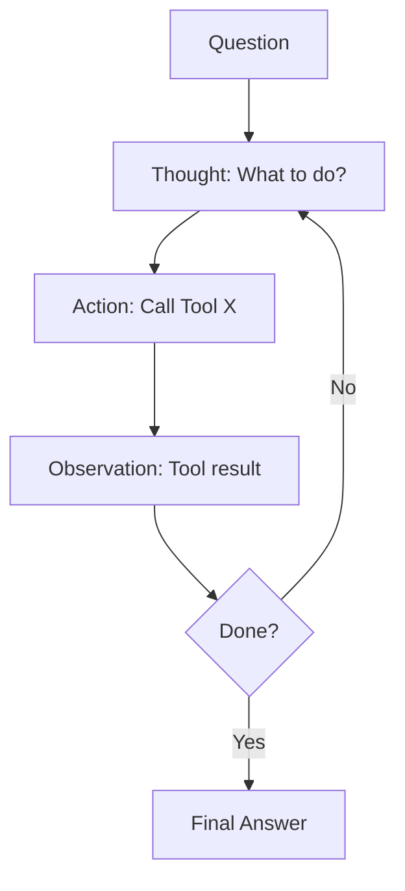

# ReAct: Reasoning + Acting

## Detailed Explanation

ReAct (Reasoning + Acting) interleaves reasoning steps with action execution. Instead of planning everything upfront (planning agents) or reacting blindly (reactive agents), ReAct agents think-act-observe-think-act cycles. Example: "I need to book a flight [Reason]. Let me search available flights [Act]. I found 3 options [Observe]. Option 2 is cheapest [Reason]. Let me check user budget [Act]. Budget is sufficient [Observe]. Book flight 2 [Reason+Act]." ReAct balances planning and reactivity: agents plan locally (next 1-2 steps) but adapt to observations immediately. This is more flexible than rigid plans and more intelligent than pure reaction. ReAct excels when: (1) environment is partially observable (need feedback), (2) outcomes are uncertain (observation reveals reality), (3) tasks require reasoning mid-execution. Key advantage: agents can correct mistakes immediately. Key disadvantage: requires frequent reasoning cycles, more LLM calls. Implementation: structure prompts as "Thought: X, Action: Y, Observation: Z" loops, letting LLM generate reasoning and actions simultaneously. The observation (tool result) becomes context for next reasoning step.

## Core Intuition

Imagine learning to play chess. Beginner: "I'll plan 5 moves ahead... oh, that leads to checkmate against me." Better: "I'll think 1-2 moves ahead, move, see opponent's response, reconsider." ReAct is the second approach: think a bit, act, observe, adjust, repeat. More robust than full planning because you adapt to surprises.

## How It Works

ReAct cycles through Think-Act-Observe:

1. **Thought** — LLM reasons about current state and next step
2. **Action** — LLM decides which tool to call with what params
3. **Observation** — Tool returns result
4. **Repeat** — Use observation as context for next thought



## Architecture / Trade-offs

**Reasoning Frequency:**
- Frequent (every step) — Better decisions, more LLM calls
- Sparse (every 3-5 steps) — Faster, fewer calls, less adaptive

**Action Granularity:**
- Fine-grained (small steps) — More reasoning opportunities, slower
- Coarse-grained (large steps) — Fewer reasoning cycles, less flexible

## Interview Q&A

**Q: ReAct vs planning agents—difference?**
A: Planning: "Plan everything upfront, execute." ReAct: "Plan 1 step, execute, observe, plan next step." ReAct adapts to surprises; planning is rigid. ReAct uses more LLM calls but is more flexible.

**Q: How many reasoning steps before acting?**
A: Depends on problem. Math: multiple reasoning steps before calculation. Search: reason about what to search for, then act. Rule of thumb: 1-2 reasoning steps per action is good balance.

**Q: How to prevent infinite loops?**
A: Set max steps (e.g., 10 ReAct cycles). Detect repeated states (same action repeated). If stuck, use fallback or escalate to user.

**Q: Cost of ReAct vs simpler approaches?**
A: ReAct costs more (multiple LLM calls per task). Worth it for complex reasoning, not for simple queries. Use simpler approaches for straightforward tasks.

**Q: How do you detect when agent is stuck?**
A: Repeated actions (same action twice in a row), same observation twice (action had no effect), max step limit reached. When stuck, escalate or try fallback approach.

## Best Practices

1. **Structure Prompts Clearly** — Use consistent format: "Thought: ... Action: ... Observation: ..."
2. **Limit Reasoning Steps** — 1-2 thoughts per action cycle. More is overthinking.
3. **Include Observation in Context** — Each thought should reference last observation.
4. **Stop When Done** — Explicit "Final Answer" signal, don't loop forever.
5. **Log Full Traces** — For debugging, keep complete thought-action-observation history.
6. **Bound Computation** — Max steps, max time, max tokens.
7. **Handle Tool Errors Gracefully** — If tool fails, reason about why and try alternative.

## Common Pitfalls

**Pitfall 1: Too Much Reasoning**
Issue: LLM rambles for 5 thoughts before acting. Slow and usually unnecessary.
Fix: One thought per action. Thought should be <50 tokens.

**Pitfall 2: Ignoring Observations**
Issue: LLM acts, observes result, but doesn't react to it.
Fix: Explicitly include observation in next prompt. "Last result was X. What now?"

**Pitfall 3: Infinite Loops**
Issue: Agent keeps repeating same action.
Fix: Detect repeated states. Max step limit. Explicit termination condition.

**Pitfall 4: Hallucinated Tools**
Issue: LLM calls tool that doesn't exist.
Fix: Validate action before executing. Provide explicit list of available tools.

## Code Examples

### Example 1: Basic ReAct Loop

```python
class ReactAgent:
    def __init__(self, client):
        self.client = client
        self.max_steps = 10
        self.trace = []
    
    def react_loop(self, question: str):
        context = question
        for step in range(self.max_steps):
            thought = self.client.messages.create(
                model="claude-3-5-sonnet-20241022",
                max_tokens=100,
                messages=[{"role": "user", "content": f"{context}\\nThought:"}]
            )
            thought_text = thought.content[0].text
            
            if "Final Answer" in thought_text:
                return thought_text
            
            action = self.parse_action(thought_text)
            observation = self.execute_action(action)
            self.trace.append({"thought": thought_text, "action": action, "obs": observation})
            
            context = f"{question}\\n{self.format_trace()}\\nNext:"
        
        return "Max steps"
    
    def parse_action(self, thought):
        return {"type": "search"}
    
    def execute_action(self, action):
        return f"Result"
    
    def format_trace(self):
        return "\\n".join([f"T: {t['thought']}, A: {t['action']}, O: {t['obs']}" for t in self.trace])
```

### Example 2: Structured ReAct Prompt

```python
REACT_PROMPT = """
Thought: (reason about what to do)
Action: (call tool, e.g., "search(query)")
Observation: (result)
... (repeat)
Final Answer: (response)
Question: {question}
"""

def react(client, question):
    response = client.messages.create(
        model="claude-3-5-sonnet-20241022",
        max_tokens=1000,
        messages=[{"role": "user", "content": REACT_PROMPT.format(question=question)}]
    )
    return response.content[0].text
```

### Example 3: Tool-Integrated ReAct

```python
class ToolReact:
    def __init__(self, client, tools: dict):
        self.client = client
        self.tools = tools
    
    def react_with_tools(self, question: str):
        messages = [{"role": "user", "content": question}]
        for _ in range(10):
            response = self.client.messages.create(
                model="claude-3-5-sonnet-20241022",
                max_tokens=500,
                messages=messages
            )
            
            text = response.content[0].text
            if "Final Answer" in text:
                return text
            
            tool_name, params = self.parse_tool(text)
            result = self.tools[tool_name](**params)
            
            messages.append({"role": "assistant", "content": text})
            messages.append({"role": "user", "content": f"Result: {result}"})
        
        return "Max steps"
    
    def parse_tool(self, text):
        import re
        match = re.search(r"Action: (\\w+)\\((.*?)\\)", text)
        if match:
            return match.group(1), {}
        return None, None
```

## Related Concepts

- **Planning Agents** — Upfront planning vs incremental
- **Tool Calling** — ReAct heavily uses tool calling
- **Agent Loops** — Core pattern of ReAct
- **Error Recovery** — Handling failed actions in ReAct
