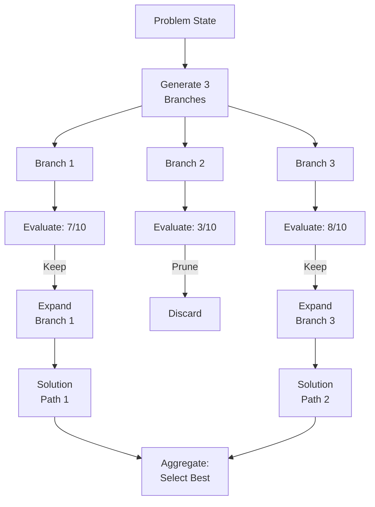

# Tree of Thought Reasoning

## Detailed Explanation

Tree of Thought (ToT) is a reasoning pattern where agents explore multiple solution paths simultaneously instead of following a single linear chain. When solving complex problems (math, planning, puzzle-solving), a single forward path often reaches dead-ends. ToT constructs a tree: at each step, generate multiple candidate next steps, evaluate and score them, prune low-promise branches, and continue deeper with promising ones. For example, in puzzle-solving: "Move A right, left, or up? Right leads closer to goal. From there, move B forward or backward? Forward is promising..." This branching exploration finds solutions linear reasoning misses. ToT trades latency for quality: exploring 3 branches × 5 steps requires 15+ LLM calls versus 1 for chain-of-thought. Use ToT for complex reasoning where quality matters more than speed. Implementation requires: (1) state representation (problem at current step), (2) branch generation (prompt for multiple next steps), (3) evaluation (score branches), (4) pruning (keep top-K), (5) aggregation (find best final path). Key advantage: systematic exploration beats single-path intuition. Key disadvantage: expensive and slow. Hybrid approach: use linear reasoning for simple cases, ToT for complex cases identified by a difficulty classifier.

## Core Intuition

Imagine solving a maze. Linear chain-of-thought: "Go right... hit dead-end... backtrack... go left... hit wall." You fumble forward one step at a time. Tree of Thought: "From here, 3 exits possible: right (leads to corridor), left (dead-end), up (stairs). Stairs look promising (lead to next level). Explore stairs..." You evaluate options before committing, find the exit faster.

## How It Works

ToT operates through iterative expansion and pruning:

1. **State Representation** — Current problem state: "5x5 puzzle with 3 pieces moved"
2. **Branch Generation** — Generate K alternatives: "Next moves: move A right, move B up, move C down"
3. **Evaluation** — Score branches (0-10): "A right: score 6, B up: score 9, C down: score 3"
4. **Pruning** — Keep top-N (typically 2): discard C down, explore A right and B up deeper
5. **Iteration** — For each remaining branch, generate next steps and repeat
6. **Aggregation** — When solutions found, select best by path quality or vote



## Architecture / Trade-offs

**Exploration Strategies:**
- **Breadth-First** — Explore all branches at depth N before going deeper. Comprehensive but expensive.
- **Depth-First** — Follow one branch deep. Fast but might explore wrong path.
- **Best-First** — Always expand highest-scoring branch. Greedy, fast, risks getting stuck.

**Cost vs Quality Trade-off:**
- Linear reasoning: 1 call, fast, lower quality
- ToT with K=3, prune-to-2: ~3*depth calls, moderate speed/quality
- ToT with K=5, prune-to-3: ~5*depth calls, slow, higher quality

## Interview Q&A

**Q: When use Tree of Thought vs Chain-of-Thought?**
A: Use CoT for speed-critical tasks (customer support, simple Q&A). Use ToT for quality-critical tasks (complex math, multi-step planning, design decisions). ToT is 10-50x slower but finds better solutions. For simple queries, linear reasoning is faster and just as good.

**Q: How many branches at each level?**
A: Generate 3-5, keep top 2. Branching of 5+ creates explosion: 5^5 = 3125 paths is too expensive. Branching of 2 might miss alternatives. Empirically, K=3 with prune-to-2 gives good balance.

**Q: How do you evaluate branches fairly?**
A: For well-defined problems (math, chess), use heuristics: distance to solution, pieces captured, etc. For open-ended, let LLM score: "Rate promise of these 3 approaches (1-10)." For harder problems, simulate one step deeper: "Try each approach briefly, which progresses furthest?"

**Q: Won't longer prompts (asking LLM to explore deeply) work instead?**
A: No. Asking "think step-by-step deeply" doesn't generate alternatives. It generates longer reasoning for one path. ToT's power is forcing generation and evaluation of multiple paths. The deliberation and pruning is what improves quality.

**Q: What if all branches fail?**
A: Backtrack: undo the most recent step, try different alternatives. If exhausted, increase depth or branching. If still stuck, the problem might be unsolvable with current constraints.

## Best Practices

1. **Start with Chain-of-Thought** — Simpler, faster. Only add ToT if quality is insufficient.

2. **Limit Branching** — Keep K=3, prune-to-2. Limits cost while exploring diversity.

3. **Early Stopping** — If a branch reaches goal early, stop immediately. Don't explore siblings.

4. **Batch Evaluation** — Evaluate all branches in one call: "Rate these 3 approaches..." Cheaper than separate calls.

5. **Use Heuristics** — For well-defined domains, scoring functions beat LLM evaluation.

6. **Set Depth Limits** — Prevent infinite exploration. Max depth = 5-10 steps.

7. **Cache Intermediate States** — If multiple branches share prefix, evaluate once.

8. **Validate Solutions** — After ToT finds solution, verify it. "Is solution X correct?"

## Common Pitfalls

**Pitfall 1: Branching Explosion**
Issue: 5 branches × 5 steps = 3125 paths. API bills go crazy.
Fix: Prune aggressively. K=3, keep 2. Limit depth. Use heuristics for faster evaluation.

**Pitfall 2: Poor Evaluation Metric**
Issue: You rate branches 1, 2, 3 but they're all bad. You explore garbage paths.
Fix: For well-defined problems, use domain-specific heuristics. For open-ended, use multiple scorers.

**Pitfall 3: Over-Exploring Easy Problems**
Issue: ToT for "What's 2+2?" Massive overkill.
Fix: Use problem difficulty as gate. Linear reasoning for simple; ToT for complex.

**Pitfall 4: Not Aggregating Solutions**
Issue: Multiple paths reach different answers. You return first one found, not best.
Fix: Explicitly aggregate: count votes, select highest-confidence path.

## Code Examples

### Example 1: Simple ToT for Math Problems

```python
def tot_solve_math(client, problem: str, depth: int = 0, max_depth: int = 3):
    if depth >= max_depth:
        return problem
    
    # Generate branches
    response = client.messages.create(
        model="claude-3-5-sonnet-20241022",
        max_tokens=200,
        messages=[{
            "role": "user",
            "content": f"{problem}\\n\\nWhat are 3 different approaches to solve this? List briefly."
        }]
    )
    approaches = response.content[0].text.split('\\n')[:3]
    
    # Evaluate and prune top 2
    best = []
    for approach in approaches:
        score_response = client.messages.create(
            model="claude-3-5-sonnet-20241022",
            max_tokens=50,
            messages=[{
                "role": "user",
                "content": f"Approach: {approach}\\nRate promise (0-10):"
            }]
        )
        try:
            score = float(score_response.content[0].text.strip())
            best.append((score, approach))
        except:
            best.append((5, approach))
    
    best.sort(reverse=True)
    for score, branch in best[:2]:
        result = tot_solve_math(client, f"{problem}\\nTrying: {branch}", depth+1, max_depth)
        if "answer" in result.lower():
            return result
    return problem
```

### Example 2: Batch Branch Evaluation

```python
def evaluate_branches_batch(client, state: str, branches: list):
    branches_text = "\\n".join([f"{i+1}. {b}" for i, b in enumerate(branches)])
    response = client.messages.create(
        model="claude-3-5-sonnet-20241022",
        max_tokens=100,
        messages=[{
            "role": "user",
            "content": f"State: {state}\\nRate these branches (0-10):\\n{branches_text}"
        }]
    )
    return response.content[0].text
```

### Example 3: ToT with Memoization

```python
class ToTSolver:
    def __init__(self, client, max_depth=5):
        self.client = client
        self.cache = {}
        self.max_depth = max_depth
    
    def solve(self, problem: str, depth: int = 0) -> str:
        if problem in self.cache:
            return self.cache[problem]
        
        if depth >= self.max_depth:
            return problem
        
        # Generate branches, evaluate, solve best recursively
        # ... implementation
        
        self.cache[problem] = solution
        return solution
```

## Related Concepts

- **MCTS for Agents** — Probabilistic version of ToT
- **Planning Agents** — Long-horizon planning using search
- **ReAct Agents** — Reasoning + Acting
- **Agent Evaluation** — Measure if ToT improves quality over CoT
- **Latency Optimization** — Minimize ToT exploration costs
