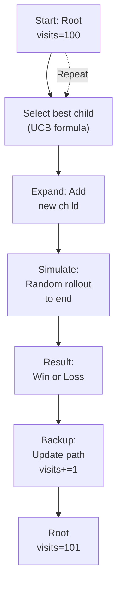

# Monte Carlo Tree Search for Agents

## Detailed Explanation

Monte Carlo Tree Search (MCTS) is a probabilistic version of tree search that balances exploration (trying new paths) and exploitation (pursuing promising ones). Unlike Tree of Thought which uses heuristic evaluation, MCTS uses simulation: play out each branch randomly to completion, count wins, and concentrate resources on best-performing branches. MCTS is especially useful for agents in environments with uncertain outcomes or when evaluation is expensive. MCTS has four phases: (1) selection—pick most promising node using UCB (upper confidence bound) formula, (2) expansion—add new child nodes, (3) simulation—play random rollouts from node to terminal state, (4) backup—update statistics for all nodes in path. MCTS excels when: (a) evaluation is expensive (don't evaluate every node), (b) outcomes are stochastic (simulation reveals likelihood), (c) horizon is long (planning many steps ahead). Use MCTS for game-playing agents, multi-step planning, or scenarios where search tree is too large to enumerate. Key advantage over ToT: MCTS adapts naturally to problem structure; nodes that lead to wins get more simulations. Key disadvantage: slower than heuristic evaluation; requires many rollouts to get accurate estimates. MCTS with neural networks (AlphaGo pattern) combines fast learned evaluation with principled exploration.

## Core Intuition

Imagine exploring a restaurant before committing to dinner. MCTS approach: "5 restaurants nearby. I know 2 well (often good). Try the 3 new ones once each (exploration phase). Track: Restaurant A was great 1/1 times, B was okay 1/2, C was bad 0/1, D was great 2/2, E was good 1/1. Now focus on D and E (exploitation), try them more times, refine understanding." This is MCTS: play out each option, measure success, focus on winners, balance new exploration with proven bets.

## How It Works

MCTS iterates four phases until computational budget exhausted:

1. **Selection** — Start at root, recursively choose best child using UCB formula: best = (wins/visits) + C*sqrt(log(parent_visits)/visits). This balances exploitation (high win rate) and exploration (low visit count).

2. **Expansion** — When reaching a node with unvisited children, add one randomly.

3. **Simulation** — From new node, play random moves until terminal state. Count outcome (win/loss).

4. **Backup** — Update all nodes in path with result. Increment visit count, add to win count.

Repeat these phases. More iterations = better exploration = better decisions.



## Architecture / Trade-offs

**Selection Strategies:**
- **Pure UCB** — Balances exploitation/exploration mathematically
- **Progressive Widening** — Add new children gradually, not all at once
- **Rave (Rapid Value Estimation)** — Consider all moves, not just path, for faster learning

**Simulation Strategies:**
- **Random Rollout** — Play randomly. Simple, fast, high variance
- **Informed Rollout** — Use domain heuristics for moves. Better quality, slower
- **Learned Rollout** — Use neural network for rollout. Best quality, expensive

**Trade-off Matrix:**
- Pure random rollout: fast, high variance, needs many simulations
- Informed rollout: moderate speed/quality, tuned per domain
- Neural network rollout: slow per rollout, lower variance, needs fewer simulations

## Interview Q&A

**Q: MCTS vs Tree of Thought—when use which?**
A: ToT for well-defined problems where you can evaluate branches directly (math, planning with clear goals). MCTS for stochastic environments (games, environments with uncertain outcomes) or when evaluation is expensive. MCTS thrives on playing out simulations; ToT thrives on cheap evaluation. For agent control in simulation, MCTS is natural. For reasoning/planning, ToT often faster.

**Q: How many simulations do you need?**
A: More simulations = better decisions but slower. In chess/Go: 1000-100000 simulations per move. For agents: 100-1000 often sufficient. Rule of thumb: run MCTS for 1-5 seconds, commit to best move found. Diminishing returns beyond that.

**Q: Why is UCB formula good?**
A: UCB balances two needs mathematically. First term (wins/visits) exploits best arms. Second term sqrt(log(parent)/visits) explores underdeveloped arms. Constant C tunes balance. UCB guarantees: if one arm is best, we'll find it (regret is logarithmic in rounds).

**Q: Can you combine MCTS with neural networks?**
A: Yes—this is AlphaGo's approach. Use network for: (1) evaluation (replace random rollout with network forward pass), (2) prior (network predicts move probabilities, use to weight UCB). This drastically reduces simulations needed. Trade-off: network training cost upfront, but inference very fast.

**Q: What if simulation is expensive (takes 10s per rollout)?**
A: MCTS becomes impractical. Switch to ToT or informed search. Or optimize simulation: parallel simulations (run 100 in parallel), faster approximations (lower fidelity simulation), or learned simulation (neural network approximates outcome).

## Best Practices

1. **Use UCB Formula** — Mathematically principled balance of exploration/exploitation. Don't hand-tune thresholds.

2. **Parallel Simulations** — Modern MCTS runs many simulations in parallel. 4-16 threads give near-linear speedup.

3. **Transposition Table** — Cache board positions. If same state reached via different move sequences, reuse statistics.

4. **Tuning C** — Exploration constant in UCB. Start with C=1, tune based on results. Higher C = more exploration.

5. **Early Stopping** — Don't always use full simulation budget. If one move has 95% visits (overwhelming favorite), commit early.

6. **Hybrid Evaluation** — Combine MCTS with heuristic: run N simulations, then evaluate based on final positions (instead of random rollout).

7. **Move Ordering** — If some moves are obviously bad, prune them before expansion. Speeds up search.

8. **Backup Strategy** — Simple backup (win/loss) works, but can use more granular rewards (points scored, progress toward goal).

## Common Pitfalls

**Pitfall 1: Insufficient Simulations**
Issue: Run only 10 simulations per move. Results are noisy, MCTS picks randomly.
Fix: Run 100-1000 minimum. Budget computation time accordingly.

**Pitfall 2: Bad Rollout Policy**
Issue: Random moves are terrible (illegal moves, obvious blunders). Simulations don't correlate with actual goodness.
Fix: Use informed rollout: domain heuristics for move selection. Trades speed for quality.

**Pitfall 3: Not Using Transposition Table**
Issue: Same position reached via different paths, statistics duplicated. Wastes simulations.
Fix: Hash board state, cache results. Amortize learning across paths.

**Pitfall 4: UCB Constant Not Tuned**
Issue: C=1 is default. For your domain, optimal C might be 0.1 or 10.
Fix: Tune C empirically. Vary it, measure win rate, pick best.

**Pitfall 5: Ignoring Parallelization**
Issue: Running MCTS serially on modern hardware is leaving performance on table.
Fix: Implement parallel MCTS. Root parallelization (multiple threads, shared root) is simplest.

## Code Examples

### Example 1: Basic MCTS for Games

```python
import math
import random

class MCTSNode:
    def __init__(self, parent=None, move=None):
        self.parent = parent
        self.move = move
        self.children = []
        self.visits = 0
        self.value = 0  # wins
    
    def ucb(self, c=1.0):
        if self.visits == 0:
            return float('inf')
        exploitation = self.value / self.visits
        exploration = c * math.sqrt(math.log(self.parent.visits) / self.visits)
        return exploitation + exploration
    
    def select_best(self, c=1.0):
        return max(self.children, key=lambda x: x.ucb(c))

class MCTSAgent:
    def __init__(self, game, simulations=100):
        self.game = game
        self.simulations = simulations
        self.root = MCTSNode()
    
    def search(self, state):
        for _ in range(self.simulations):
            node = self.select(self.root, state)
            reward = self.simulate(state)
            self.backup(node, reward)
        
        best_child = self.root.select_best(c=0)  # Pure exploitation
        return best_child.move
    
    def select(self, node, state):
        while not self.game.is_terminal(state):
            if len(node.children) < len(self.game.get_moves(state)):
                return self.expand(node, state)
            node = node.select_best(c=1.0)
        return node
    
    def expand(self, node, state):
        move = random.choice(self.game.get_moves(state))
        child = MCTSNode(parent=node, move=move)
        node.children.append(child)
        return child
    
    def simulate(self, state):
        while not self.game.is_terminal(state):
            move = random.choice(self.game.get_moves(state))
            state = self.game.apply_move(state, move)
        return self.game.get_reward(state)
    
    def backup(self, node, reward):
        while node:
            node.visits += 1
            node.value += reward
            node = node.parent
```

### Example 2: MCTS with Transposition Table

```python
class MCTSWithCache:
    def __init__(self, game, simulations=100):
        self.game = game
        self.simulations = simulations
        self.cache = {}  # state_hash -> node stats
    
    def get_cached(self, state_hash):
        if state_hash in self.cache:
            return self.cache[state_hash]
        return None
    
    def cache_result(self, state_hash, visits, value):
        if state_hash not in self.cache:
            self.cache[state_hash] = {'visits': 0, 'value': 0}
        self.cache[state_hash]['visits'] += visits
        self.cache[state_hash]['value'] += value
```

### Example 3: Parallel MCTS

```python
import threading

class ParallelMCTS:
    def __init__(self, game, simulations=100, threads=4):
        self.game = game
        self.simulations_per_thread = simulations // threads
        self.threads = threads
        self.root = MCTSNode()
        self.lock = threading.Lock()
    
    def search_parallel(self, state):
        thread_list = []
        for _ in range(self.threads):
            t = threading.Thread(target=self.search_worker, args=(state,))
            t.start()
            thread_list.append(t)
        
        for t in thread_list:
            t.join()
        
        return self.root.select_best(c=0).move
    
    def search_worker(self, state):
        for _ in range(self.simulations_per_thread):
            node = self.select(self.root, state)
            reward = self.simulate(state)
            with self.lock:
                self.backup(node, reward)
```

## Related Concepts

- **Tree of Thought** — Deterministic tree search with heuristic evaluation
- **Planning Agents** — Long-horizon planning using search
- **Simulation for Agents** — Environment simulation for testing
- **Agent Evaluation** — Comparing MCTS vs other search strategies
- **Reinforcement Learning** — MCTS used in RL (AlphaGo)
