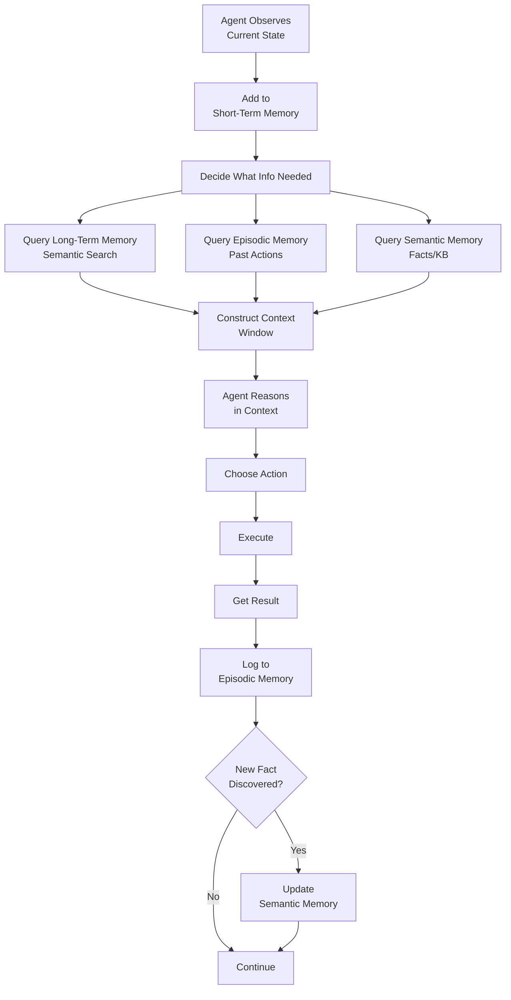

# Memory Types

## Detailed Explanation

Agents require multiple memory systems to function effectively: (1) short-term memory (context window)—immediate access, limited capacity, holds current conversation and recent facts, (2) long-term memory (vector DB, databases)—external persistent storage, large capacity, retrieves via semantic search or SQL, (3) episodic memory (action logs)—records every action, parameters, and outcome, enables reflection and debugging, (4) semantic memory (knowledge bases, facts)—static knowledge about world, grounds agent reasoning, prevents hallucinations. Each memory type serves different purpose and trades off capacity vs. latency vs. recency. Critical design choice: what stays in context window vs. what gets retrieval-augmented from external storage? Context window is fast but limited; external memory is large but slower. Best practice: use all types. Short-term holds active reasoning state, long-term provides background information, episodic enables learning, semantic prevents hallucination. Challenges: maintaining consistency (update all systems when fact changes), managing retrieval latency (semantic search adds 10-100ms), handling stale memory (old logs may be outdated), avoiding context overflow (too much memory → truncation → loss).

## Core Intuition

Imagine planning a multi-day trip. You have: (1) immediate context (current location, time, next destination), (2) long-term memory (notes about places from past trips), (3) action logs (record of what worked before: "took train at 9am, arrived 2pm"), (4) facts (Paris is 2 hours from London by train). Each serves different need. Lose immediate context and you're lost. Lose long-term memory and you can't learn. Lose action logs and you repeat mistakes. Lose facts and you make bad plans. Agents need all four.

## How It Works

Memory systems operate together through retrieval, updates, and context construction:

1. **Observation** — Agent observes current state (added to short-term memory)
2. **Retrieval** — Agent queries long-term, episodic, and semantic memory based on need
3. **Context Construction** — Combine short-term with retrieved long-term information
4. **Decision** — Agent reasons in context window with available information
5. **Action** — Agent executes action
6. **Logging** — Action + outcome logged to episodic memory
7. **Update** — If new fact discovered, update semantic memory



## Architecture / Trade-offs

**Memory Type Selection:**
- **Short-term only** — Simple, fast, but limited (can't remember context beyond window)
- **Short-term + Long-term** — Good balance, retrieval adds latency
- **All four types** — Complete, but complex to maintain consistency

**Short-Term (Context Window):**
- Capacity: 4K-200K tokens (LLM-dependent)
- Latency: 0ms (always available)
- Recency: Fresh (current state)
- Best for: active reasoning, current decision-making

**Long-Term (Vector DB / Database):**
- Capacity: Unlimited (external storage)
- Latency: 10-100ms (semantic search typical)
- Recency: Stale (retrieved info may be outdated)
- Best for: background context, historical information
- Optimization: approximate search (FAISS, etc.) for speed

**Episodic (Action Logs):**
- Capacity: Unlimited (append-only)
- Latency: 1-10ms (indexed retrieval)
- Recency: Complete history available
- Best for: reflection, learning from mistakes, debugging
- Query: "What happened when I tried X before?"

**Semantic (Knowledge Base):**
- Capacity: Large (structured or unstructured)
- Latency: 1-100ms (KB lookup or vector search)
- Recency: Static (facts don't change often)
- Best for: grounding, validation, preventing hallucination
- Query: "Is Paris capital of France?" or "What are the rules?"

## Interview Q&A

**Q: Why do agents need multiple memory types?**
A: Different information has different characteristics. Current context is small but essential. Past experiences are large but less relevant. Facts are static but grounding. Logs enable learning. One memory type doesn't fit all. Example: ChatGPT has context window (short-term) but no persistent episodic memory (why it forgets previous conversations).

**Q: What happens if you exceed the context window?**
A: Information gets truncated (lost) or older context gets removed. Solutions: (1) summarization—compress old context into summary, (2) chunking—split into multiple turns, (3) retrieval-augmented—keep important info in long-term, retrieve as needed. Trade-off: summarization loses detail, retrieval adds latency.

**Q: How do you retrieve the right information from long-term memory?**
A: Two approaches: (1) semantic search—embed query and memory, find closest matches (fast, approximate), (2) SQL/structured query—execute exact SQL on memory table (slow, precise). Hybrid: use semantic search to narrow down, then SQL for exact match. Optimization: cache frequent queries, use approximate search (FAISS).

**Q: How does episodic memory help agent learning?**
A: Agent logs every action and outcome. Later, can query: "When I called X with params Y, what happened?" Enables reflection: "I made the same mistake twice—need to change strategy." Supports debugging: "Where did I go wrong?" Episodic memory is the only way agents learn from experience (compared to pure LLM with no memory).

**Q: What's the difference between episodic and semantic memory?**
A: Episodic = specific events ("On 2024-01-15 at 3pm, I called function X with Y, got Z"). Semantic = general facts ("Function X takes parameters Y and Z"). Episodic is specific and temporal; semantic is general and timeless. Episodic enables learning; semantic enables grounding.

**Q: How do you maintain consistency across memory types?**
A: Challenge: update semantic KB, but old episodic logs still reference old fact. Solutions: (1) version facts (mark when fact changed), (2) re-index episodic logs periodically, (3) query semantic memory as source of truth (don't cache facts), (4) implement "cache invalidation" when fact changes. Hard problem (Phil Karlton: "There are only two hard things in Computer Science: cache invalidation and naming things").

**Q: How do you decide what goes in short-term vs. long-term?**
A: Short-term: current turn, recent events (last 5-10 actions), active reasoning state. Long-term: history beyond current session, background context, retrieved on-demand. Rule of thumb: if info needed for current action, put in short-term; if needed occasionally, retrieve from long-term. Monitor context window usage; if hitting limit, move less-relevant info to long-term.

## Best Practices

1. **Use All Four Types** — Short-term for immediate context, long-term for background, episodic for learning, semantic for grounding. Incomplete memory leads to errors.

2. **Separate Concerns** — Each memory type should be independent. Update one without affecting others. Consistency is achieved through querying, not shared state.

3. **Aggressive Retrieval** — Retrieve frequently from long-term memory. Better to refresh info than assume it's in context. Retrieval is cheap compared to mistakes.

4. **Log Everything** — Every action and outcome goes to episodic memory. No logging = no learning. Make logging fast (asynchronous if needed).

5. **Version Semantic Facts** — When updating KB, keep version history. "Fact X changed from value A to B on date Z." Enables rollback, debugging, understanding when change happened.

6. **Cache Carefully** — Long-term memory retrieval adds latency. Cache common queries, but invalidate when underlying data changes. Monitor cache hit rate.

7. **Summarize Aggressively** — When short-term memory fills, summarize old context. "User asked 5 questions about topic X. Key points: A, B, C." Compression loses detail but preserves essential info.

8. **Monitor Memory Freshness** — Track how old retrieved memory is. Very old information may be stale. Implement TTL (time-to-live) for cached data.

9. **Structured Episodic Logs** — Use schema: timestamp, action, parameters, outcome, metadata. Enables easy querying. Example: `{"timestamp": "2024-01-15T03:00:00Z", "action": "call_api", "params": {"endpoint": "/search", "query": "Paris"}, "outcome": "success", "result": {...}}`.

10. **Test Retrieval** — Verify that relevant memory is actually retrieved. "I searched for 'capital of France' in semantic memory. Did I get the right answer?" Human review or automated checks.

## Common Pitfalls

**Pitfall 1: Context Window Overflow**
Issue: Agent needs more context than window allows. System truncates, loses important info, agent fails.
Fix: Implement retrieval-augmented approach. Move less-critical info to long-term. Summarize aggressively. Monitor context usage.

**Pitfall 2: No Episodic Memory**
Issue: Agent can't learn. Makes same mistake repeatedly.
Fix: Log all actions and outcomes. Make logging efficient (async, batched). Query logs for reflection.

**Pitfall 3: Stale Long-Term Memory**
Issue: Retrieve outdated fact from long-term memory. Agent uses wrong information.
Fix: Version facts. Re-index periodically. Implement TTL. Use semantic memory as source of truth, not cache.

**Pitfall 4: Ungrounded Semantic Memory**
Issue: KB outdated, facts incorrect. Agent hallucinates or uses wrong facts.
Fix: Validate facts before adding. Implement review process. Flag uncertain facts. Graceful degradation (if fact uncertain, don't use).

**Pitfall 5: Retrieval Latency**
Issue: Semantic search adds 100ms per query. With multiple memory accesses, significant slowdown.
Fix: Use approximate search (FAISS). Cache frequent queries. Batch queries (retrieve multiple items at once). Monitor P99 latency.

**Pitfall 6: Inconsistency Across Memory Types**
Issue: Update semantic KB, but episodic logs reference old fact. Agent confused.
Fix: Implement consistency checks. Version all data. Query semantic memory as source of truth. Don't cache facts; retrieve on demand.

**Pitfall 7: Memory Explosion**
Issue: Episodic logs grow unbounded. Retrieval becomes slow.
Fix: Archive old logs. Implement retention policy (keep 1 year, archive older). Compress logs (summarize old actions).

**Pitfall 8: No Query Optimization**
Issue: Agent queries long-term memory naively. Retrieves everything, slow.
Fix: Use semantic search (not full scan). Index frequently-queried fields. Implement hierarchical retrieval (coarse→fine).

## Code Examples

### Example 1: Multi-Type Memory System

```python
from collections import deque
from datetime import datetime
import json

class MultiTypeMemory:
    def __init__(self, context_size=50):
        # Short-term: limited FIFO
        self.short_term = deque(maxlen=context_size)
        
        # Long-term: comprehensive history with timestamps
        self.long_term = []
        
        # Episodic: structured action logs
        self.episodic = []
        
        # Semantic: facts and rules
        self.semantic = {
            "Paris": "capital of France",
            "London": "capital of UK",
        }
    
    def observe(self, event: str):
        """Add observation to short-term memory."""
        self.short_term.append({
            "timestamp": datetime.now().isoformat(),
            "event": event
        })
    
    def log_action(self, action: str, params: dict, outcome: str):
        """Log action to episodic memory."""
        self.episodic.append({
            "timestamp": datetime.now().isoformat(),
            "action": action,
            "params": params,
            "outcome": outcome
        })
        
        # Also add to long-term for history
        self.long_term.append({
            "type": "action",
            "action": action,
            "timestamp": datetime.now().isoformat()
        })
    
    def query_semantic(self, fact: str):
        """Lookup fact from knowledge base."""
        return self.semantic.get(fact)
    
    def query_episodic(self, action: str) -> list:
        """Find past instances of action."""
        return [e for e in self.episodic if e["action"] == action]
    
    def get_context(self) -> str:
        """Build context for LLM from short-term + relevant long-term."""
        context = "=== SHORT-TERM CONTEXT ===\n"
        for item in self.short_term:
            context += f"{item['timestamp']}: {item['event']}\n"
        
        return context
    
    def update_semantic(self, fact: str, value: str):
        """Update knowledge base with version info."""
        self.semantic[fact] = value
        self.long_term.append({
            "type": "semantic_update",
            "fact": fact,
            "value": value,
            "timestamp": datetime.now().isoformat()
        })

# Usage
memory = MultiTypeMemory(context_size=50)

# Observe events
memory.observe("User asked: What is Paris?")

# Log action and outcome
memory.log_action("query_kb", {"fact": "Paris"}, "Found: capital of France")

# Query semantic memory
result = memory.query_semantic("Paris")
print(f"Paris is: {result}")

# Reflect on past actions
past_actions = memory.query_episodic("query_kb")
print(f"Past query_kb actions: {len(past_actions)}")
```

### Example 2: Retrieval-Augmented Context

```python
class RetrievalAugmentedMemory:
    def __init__(self, max_context_tokens=2000):
        self.short_term = []
        self.long_term = []
        self.max_context_tokens = max_context_tokens
        self.token_count = 0
    
    def add_to_short_term(self, text: str):
        """Add to immediate context."""
        tokens = len(text.split())
        self.token_count += tokens
        self.short_term.append(text)
        
        # If exceeding limit, retrieve from long-term instead
        if self.token_count > self.max_context_tokens:
            self._compress_short_term()
    
    def _compress_short_term(self):
        """Summarize old context, move to long-term."""
        if len(self.short_term) > 5:
            old_items = self.short_term[:len(self.short_term) // 2]
            summary = f"Summary of {len(old_items)} events: [compressed]"
            
            self.long_term.append(summary)
            self.short_term = self.short_term[len(self.short_term) // 2:]
            
            self.token_count = sum(len(t.split()) for t in self.short_term)
    
    def retrieve_relevant(self, query: str) -> list:
        """Retrieve relevant items from long-term memory."""
        # Simple matching (in practice: semantic search)
        relevant = [item for item in self.long_term if any(word in item for word in query.split())]
        return relevant[:5]  # Top 5 results
    
    def build_context(self, query: str = None) -> str:
        """Build context: short-term + relevant long-term."""
        context = "\n".join(self.short_term)
        
        if query:
            retrieved = self.retrieve_relevant(query)
            if retrieved:
                context += "\n\n=== RETRIEVED FROM LONG-TERM ===\n"
                context += "\n".join(retrieved)
        
        return context

# Usage
memory = RetrievalAugmentedMemory(max_context_tokens=500)

memory.add_to_short_term("User asked: What is AI?")
memory.add_to_short_term("I explained: AI is machine learning + reasoning")
memory.add_to_short_term("User asked follow-up: How does it work?")

context = memory.build_context(query="previous discussion about AI")
print(f"Context length: {len(context.split())} tokens")
```

### Example 3: Episodic Learning with Reflection

```python
class EpisodicLearningAgent:
    def __init__(self):
        self.episodic_log = []
        self.learned_patterns = []
    
    def log_episode(self, action: str, params: dict, outcome: str, success: bool):
        """Log episode with success indicator."""
        self.episodic_log.append({
            "action": action,
            "params": params,
            "outcome": outcome,
            "success": success,
            "timestamp": datetime.now().isoformat()
        })
    
    def reflect_on_failures(self) -> list:
        """Analyze failures to find patterns."""
        failures = [ep for ep in self.episodic_log if not ep["success"]]
        
        patterns = {}
        for ep in failures:
            action = ep["action"]
            if action not in patterns:
                patterns[action] = {"count": 0, "outcomes": []}
            patterns[action]["count"] += 1
            patterns[action]["outcomes"].append(ep["outcome"])
        
        return patterns
    
    def get_strategy_for_action(self, action: str) -> str:
        """Get learned strategy based on past episodes."""
        relevant = [ep for ep in self.episodic_log if ep["action"] == action]
        
        if not relevant:
            return "No prior experience"
        
        success_rate = sum(1 for ep in relevant if ep["success"]) / len(relevant)
        
        if success_rate > 0.8:
            return f"Strategy works well ({success_rate:.1%} success rate)"
        elif success_rate > 0.5:
            return f"Strategy needs improvement ({success_rate:.1%} success rate)"
        else:
            return f"Strategy failing ({success_rate:.1%} success rate) - try different approach"

# Usage
agent = EpisodicLearningAgent()

# Log some episodes
agent.log_episode("call_api", {"endpoint": "/search"}, "timeout", False)
agent.log_episode("call_api", {"endpoint": "/search"}, "success", True)
agent.log_episode("call_api", {"endpoint": "/search"}, "timeout", False)

# Reflect
failures = agent.reflect_on_failures()
print("Failed patterns:", failures)

# Get strategy
strategy = agent.get_strategy_for_action("call_api")
print("Strategy recommendation:", strategy)
```

## Related Concepts

- **Agent Memory Management** — Managing consistency across memory types
- **Context Window Management** — Optimizing limited context window
- **Agent Loops** — Loops read/write to memory systems
- **Observability** — Monitoring memory system performance
- **Knowledge Graphs** — Structured semantic memory
- **Vector Databases** — Backend for long-term memory
