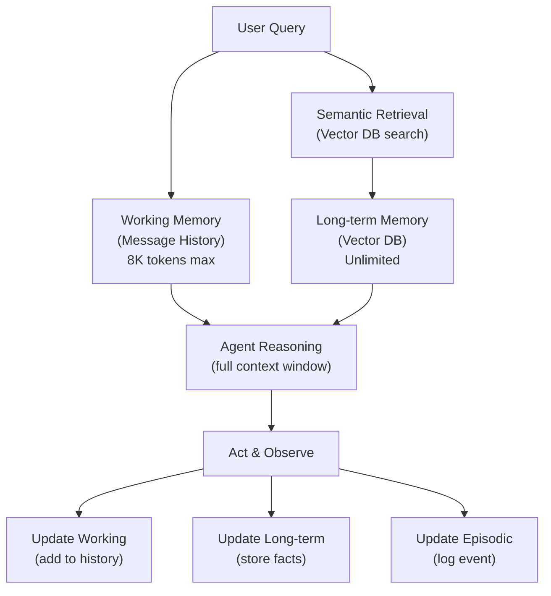
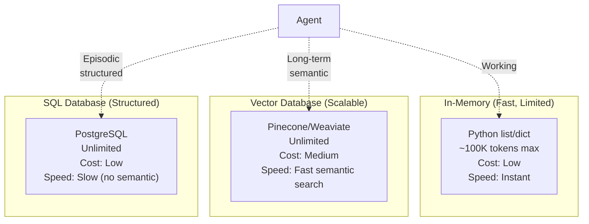

# Agent Memory Management

## Detailed Explanation

Agent memory management is the practice of maintaining, organizing, and retrieving information that agents need across multiple interactions or steps. Without memory, an agent starts fresh each interaction, unable to learn from history or maintain context. Memory can be short-term (recent interactions in a conversation), long-term (persistent knowledge across sessions), or episodic (specific events/decisions). The challenge: agents have limited context windows (tokens), so memory must be managed efficiently—keeping important information accessible while discarding or summarizing old/irrelevant data.

Why it matters: Memory transforms agents from stateless functions into stateful entities that can learn, adapt, and provide coherent multi-turn experiences. Without memory management, context windows fill up, costs explode, and agents lose track of what they've learned. Production agents require sophisticated memory strategies.

**Key clarification:** Agent memory ≠ database. Databases store persistent data (facts, user info). Agent memory stores conversational context, decisions, and reasoning traces—used during active reasoning, usually temporary.

## Core Intuition

Imagine a conversation with a human assistant. You ask question 1; they answer. Then question 2—they remember answer 1 and build on it. Later you ask "like in #1?"—they recall. A human brain manages memory naturally. AI agents need explicit memory management: remembering prior messages, retrieving relevant facts, summarizing old context when space runs out.

## How It Works

**Memory Types (3 layers):**

1. **Short-term / Working Memory (Context Window)**
   - Current conversation or task sequence
   - Stored in message history
   - Example: Last 10 exchanges with user
   - Capacity: Limited by LLM context window (e.g., 8K tokens)
   - Retrieval: Instant (always available)

2. **Long-term / Knowledge Memory (Persistent Store)**
   - Facts, patterns, learned information
   - Stored in vector DB, knowledge base, or SQL database
   - Example: "User prefers flights after 2pm" (learned from past bookings)
   - Capacity: Unlimited (can store terabytes)
   - Retrieval: Semantic search (find similar concepts)

3. **Episodic Memory (Event Log)**
   - Specific events/decisions and their outcomes
   - Example: "On 2025-05-15, user rejected 3 flights because too expensive"
   - Used for: Learning patterns, debugging, audit trails
   - Capacity: Unlimited
   - Retrieval: By timestamp, event type, or semantic search

**Memory Management Pattern:**

```
Step 1: Observe new input
  ↓
Step 2: Retrieve relevant long-term memory
  (search knowledge base for similar situations)
  ↓
Step 3: Build working memory (context window)
  (combine: current query + retrieved facts + recent history)
  ↓
Step 4: Reason and act
  (agent has full context)
  ↓
Step 5: Update memory
  (store new facts, decisions, patterns)
```

**Example: Booking Agent Over Multiple Sessions**

```
Session 1:
  User: "I need flights to LA next week"
  Agent: Searches, finds options, user picks one
  → Store in episodic memory: "User booked LAX flight on 2025-05-20"
  → Store in knowledge memory: "User prefers evening flights"

Session 2 (next week):
  User: "Any flights to SF?"
  Agent: Retrieves memory: "This user prefers evening flights"
  → Shows evening flights first
  → User is happy (agent remembered)
  → Store: "User also interested in SF"

Session 3 (next month):
  User: "Help with travel"
  Agent: Retrieves memory: "This user books flights to LA, SF; prefers evenings"
  → Can offer proactive suggestions
```

**Memory Strategies (Handling Limited Context):**

1. **Sliding Window (Simple, stateless)**
   - Keep last N messages only
   - Example: last 10 exchanges
   - When full, delete oldest, add newest
   - Pro: Simple, controlled size
   - Con: Loses history, can forget important context

2. **Summarization (Compress old context)**
   - Every N messages, summarize into bullet points
   - Example: 20 messages → "User asked about flights, booked LAX, concerned about price"
   - Pro: Retains gist of old context
   - Con: Loses details, summarization is lossy

3. **Semantic Retrieval (Retrieve relevant context)**
   - Store all past messages in vector DB
   - When context fills, retrieve most relevant old messages
   - Example: "What did user say about budget?" → query vector DB
   - Pro: Can access deep history when needed
   - Con: Complex, requires vector embeddings

4. **Hierarchical Memory (Combine strategies)**
   - Layer 1: Sliding window (recent 10 messages)
   - Layer 2: Summarized older context (last week)
   - Layer 3: Vector DB (searchable long-term knowledge)
   - Pro: Best of all—responsive + comprehensive
   - Con: Most complex to implement

**Memory Architecture:**



## Architecture / Trade-offs

**Memory Storage Options:**



**Trade-offs:**

1. **Context Window Size vs. Cost**
   - Large window (8K tokens): Full history, better reasoning, 10x cost
   - Small window (2K tokens): Cheap, fast, loses context
   - **Decision:** Use small window with semantic retrieval (best of both)

2. **Fresh Data vs. Stale Cache**
   - Always retrieve latest: Current, accurate, slower
   - Cache retrieved data: Fast, might miss updates
   - **Decision:** Cache for 5-10 min; refresh on explicit "update" request

3. **In-Memory vs. Persistent Storage**
   - In-memory: Fast, ephemeral (lost on restart)
   - Persistent (DB): Slow, survives restarts
   - **Decision:** Use both—cache in memory for current session, persist for future sessions

4. **Exact Retrieval vs. Semantic Retrieval**
   - Exact (SQL): "Get all user bookings" → precise but requires structured queries
   - Semantic (vector): "What did user say about budget?" → fuzzy but powerful
   - **Decision:** Use semantic for context/reasoning, exact for facts/audit logs

## Interview Q&A

**Q1: What types of memory should an agent have for a multi-turn conversation system?**
A: Three layers: (1) Working memory—recent context (current message history, ~5-10 exchanges), in LLM context window; (2) Long-term memory—learned patterns (user preferences, facts), in vector DB, retrieved on demand; (3) Episodic memory—audit log of decisions, in SQL DB for compliance/debugging. Working gives responsiveness; long-term gives personalization; episodic gives accountability.

**Q2: How do you prevent an agent's context window from filling up with old, irrelevant messages?**
A: Three strategies: (1) Sliding window—keep only last N messages; old ones deleted; (2) Summarization—compress every 20 messages into bullet points; (3) Semantic retrieval—store all in vector DB, retrieve only relevant messages when needed. Best: combine (1) + (3)—keep last 10 messages, retrieve older ones from vector DB when asking about history.

**Q3: What's the trade-off between storing memory in-memory vs. in a database?**
A: In-memory (Python dict): Ultra-fast, but lost on restart; good for single-session temp data. Database (Postgres, Vector DB): Slower, but persists across sessions; good for long-term learnings. Solution: Use both. Keep session data in-memory cache; persist important learnings in DB for next session.

**Q4: How do you efficiently retrieve relevant old context when the agent's context window is full?**
A: Use semantic/vector search. Convert old messages to embeddings, store in vector DB (Pinecone, Weaviate). When context full, query: "What did user say about budgets?" → vector search finds relevant old messages → add to context. Much more efficient than sliding window (which loses info) or summarization (which is lossy).

**Q5: When building a multi-agent system, how should memory be shared between agents?**
A: Shared knowledge (global facts): Shared vector DB or knowledge base that all agents can read/search. Private memory (agent-specific learnings): Each agent has private episodic memory. Example: Agent_A learns "user likes X", stores in shared KB. Agent_B searches KB, sees this preference, uses it. Prevents redundant learning.

**Q6: How do you know when to forget or prune old information from agent memory?**
A: Retention policy: (1) Time-based—discard anything older than 30 days; (2) Relevance-based—remove facts that no longer match current user interests; (3) Access-based—keep frequently accessed facts, prune rarely used ones; (4) Conflict-based—if new fact contradicts old fact, remove old. Solution: Combine (1) + (2)—auto-prune every 30 days, plus relevance scoring.

**Q7: What happens if an agent's memory contains incorrect information? How do you prevent it from propagating?**
A: Risk: Agent learns "user likes red" from one interaction, but user actually hates red. Then agent keeps suggesting red. Prevention: (1) Confidence scoring—tag memories with confidence (from 1 interaction = low; from 10 = high); (2) Validation—ask user "You prefer red?" to confirm; (3) Correction—explicit "I was wrong, I prefer blue" updates memory; (4) Versioning—store old facts, can revert if new info is better.

**Q8: How do you balance memory freshness with query cost in a semantic retrieval system?**
A: Two costs: (1) embedding queries (converting to vectors) costs tokens, (2) retrieving from DB costs latency. Solution: (1) Cache embeddings for common queries (5-min TTL); (2) Batch retrieve (get top-K candidates instead of searching every time); (3) Lazy loading—only retrieve if current context doesn't cover query; (4) Periodic refresh—update embeddings daily, not per-query.

## Best Practices

1. **Always have three memory layers.** Working (context window), Long-term (vector DB/KB), Episodic (audit log). Single-layer systems are inflexible and scale poorly.

2. **Use embeddings for semantic memory.** Store important facts/decisions as embeddings in vector DB. When context full, semantically search for relevant old context. Much better than summarization.

3. **Implement a sliding window for working memory.** Keep last N messages (10-20 depending on context window size). When full, drop oldest. Simple and effective.

4. **Summarize after every N interactions.** Every 20-50 messages, create a summary: "User asked about X, concerned about Y, decided on Z". Add to memory as context. Later, when retrieving history, include summary.

5. **Tag memories with confidence and source.** Memories from user input = high confidence. Memories inferred by agent = lower confidence. Tag source (user said vs. agent inferred). Use this when deciding what to trust.

6. **Implement explicit memory refresh.** When user says "Remember, I actually prefer...", agent updates memory immediately. Don't wait for automatic updates.

7. **Monitor memory size and cost.** Alert if: message history >50% of context window, or retrieval queries >10 per interaction (sign of bad chunking). Adjust strategy accordingly.

8. **Use vector embeddings for both semantic search AND deduplication.** If two messages are semantically similar (cosine similarity >0.95), they're duplicates. Keep only one. Saves space and cost.

9. **Implement memory versioning.** Old facts might become stale. Version them. If new fact contradicts old fact, don't delete—store both with timestamps. Can revert if new info turns out wrong.

10. **Test memory-dependent scenarios.** Multi-turn conversations, long-horizon tasks, user preference learning. Don't just test single interactions. Memory issues appear at scale.

## Common Pitfalls

1. **Context window bloat.** Agent's message history grows unbounded (never deletes old messages). After 100 exchanges, context window full. Agent becomes slow and expensive. **Fix:** Implement sliding window. Keep last N messages; delete oldest when full.

2. **Lossy summarization.** Agent summarizes history every 50 messages: "User asked Q1, Q2". But Q1 details are lost. Later user says "Like I said about Q1..." and agent doesn't know details. **Fix:** Keep original messages in vector DB; summarization is supplement, not replacement.

3. **No memory between sessions.** Agent learns from Session 1 ("User prefers X"). Session 2 starts, agent forgets. No persistence. **Fix:** Persist important facts to database after each session. Load on session start.

4. **Memory hallucination.** Agent thinks it remembers something but doesn't (confuses two users, two conversations). Returns wrong personalization. **Fix:** Tag all memories with user ID, session ID, timestamp. Verify on retrieval: does this memory belong to current user/session?

5. **Semantic retrieval returns irrelevant results.** Vector search finds "red car" when agent asks "budget"—both have words, but semantically different. Agent wastes context on irrelevant memory. **Fix:** Use better embeddings (more semantic models) or add metadata filtering ("only budget-related").

6. **No memory conflict resolution.** Two facts conflict: "User prefers red" vs. "User avoids red". Agent doesn't know which to trust. **Fix:** Implement confidence scoring. Higher confidence wins. Or ask user to disambiguate.

7. **Memory poisoning by inference.** Agent infers "User likes X" from limited data. Later this inference propagates as fact. Becomes hard to undo. **Fix:** Separate facts (user said) from inferences (agent inferred). Lower confidence for inferences. Require multiple signals before treating as fact.

8. **Expensive memory retrieval.** Agent retrieves semantic memory for every interaction. Thousands of queries to vector DB per day. Cost explodes. **Fix:** Implement smart filtering (only retrieve if uncertain), caching (5-min TTL for common queries), batching (retrieve top-K not every single result).

9. **Memory not versioned.** Agent stores fact at timestamp T1. User corrects at T2 but agent still uses old fact. No way to know which version is current. **Fix:** Version all memories. Include timestamp, source. Use version control semantics.

10. **No memory decay.** Old memories stay indefinitely, accumulating. System becomes cluttered. Signal-to-noise ratio drops. **Fix:** Implement decay—memories older than 90 days get lower confidence. Or explicit pruning—delete old unused facts.

## Code Examples

**Example 1: Simple Sliding Window Memory (Basic)**
```python
from collections import deque
from anthropic import Anthropic

class SlidingWindowAgent:
    def __init__(self, max_messages: int = 10):
        self.max_messages = max_messages
        self.message_history = deque(maxlen=max_messages)
        self.client = Anthropic()
    
    def chat(self, user_message: str) -> str:
        """Single turn: user -> agent -> response"""
        # Add user message to history
        self.message_history.append({"role": "user", "content": user_message})
        
        # Get response (deque automatically drops oldest when full)
        response = self.client.messages.create(
            model="claude-3-5-sonnet-20241022",
            max_tokens=512,
            messages=list(self.message_history)  # Convert deque to list
        )
        
        # Add assistant response
        assistant_message = response.content[0].text
        self.message_history.append({"role": "assistant", "content": assistant_message})
        
        print(f"[Memory: {len(self.message_history)}/{self.max_messages} messages]")
        return assistant_message

# Usage
agent = SlidingWindowAgent(max_messages=5)
print(agent.chat("What's 2+2?"))
print(agent.chat("Double that result"))
print(agent.chat("What was the first question I asked?"))
```

**Example 2: Multi-layer Memory (Advanced)**
```python
import json
from typing import Dict, List, Any
from anthropic import Anthropic

class MultiLayerMemoryAgent:
    def __init__(self):
        self.client = Anthropic()
        self.working_memory = []  # Recent messages
        self.long_term_memory = {}  # Facts: {topic: [facts]}
        self.episodic_memory = []  # Events: [{timestamp, event, outcome}]
    
    def update_long_term(self, topic: str, fact: str):
        """Learn a fact"""
        if topic not in self.long_term_memory:
            self.long_term_memory[topic] = []
        self.long_term_memory[topic].append(fact)
        print(f"[Learned] {topic}: {fact}")
    
    def retrieve_relevant(self, query: str) -> str:
        """Find relevant long-term facts"""
        relevant = []
        for topic, facts in self.long_term_memory.items():
            if query.lower() in topic.lower():
                relevant.extend(facts)
        return "; ".join(relevant) if relevant else "No relevant facts"
    
    def chat(self, user_message: str) -> str:
        """Chat with multi-layer memory"""
        # Retrieve relevant long-term memory
        relevant_facts = self.retrieve_relevant(user_message)
        
        # Build context: working memory + relevant facts
        context = list(self.working_memory)
        if relevant_facts:
            context.append({
                "role": "user",
                "content": f"[Relevant context: {relevant_facts}]\n{user_message}"
            })
        else:
            context.append({"role": "user", "content": user_message})
        
        # Get response
        response = self.client.messages.create(
            model="claude-3-5-sonnet-20241022",
            max_tokens=512,
            messages=context
        )
        
        assistant_message = response.content[0].text
        
        # Update memories
        self.working_memory.append({"role": "user", "content": user_message})
        self.working_memory.append({"role": "assistant", "content": assistant_message})
        
        # Keep working memory bounded (sliding window)
        if len(self.working_memory) > 10:
            self.working_memory = self.working_memory[-10:]
        
        # Log episodic memory
        self.episodic_memory.append({
            "timestamp": str(__import__('time').time()),
            "user_query": user_message,
            "agent_response": assistant_message[:100]  # First 100 chars
        })
        
        return assistant_message

# Usage
agent = MultiLayerMemoryAgent()
agent.update_long_term("preferences", "User prefers concise answers")
agent.update_long_term("preferences", "User is interested in AI")

response1 = agent.chat("Tell me about agents")
print(f"Response 1: {response1[:100]}...\n")

response2 = agent.chat("What did I ask before?")
print(f"Response 2: {response2[:100]}...\n")

print(f"Episodic memory: {json.dumps(agent.episodic_memory, indent=2)}")
```

**Example 3: Semantic Memory with Vector Retrieval (Production)**
```python
import json
from typing import List, Dict
from anthropic import Anthropic

class SemanticMemoryAgent:
    def __init__(self):
        self.client = Anthropic()
        self.message_history = []
        # Simulated vector DB (in production: use Pinecone, Weaviate, etc.)
        self.vector_store = []  # [{text, embedding, timestamp}]
    
    def embed_text(self, text: str) -> List[float]:
        """Simulate text embedding (in production: use actual embeddings)"""
        # Placeholder: hash-based pseudo-embedding
        hash_val = hash(text)
        return [(hash_val >> i) % 100 for i in range(10)]
    
    def semantic_search(self, query: str, top_k: int = 3) -> List[str]:
        """Find semantically similar memories"""
        if not self.vector_store:
            return []
        
        query_embed = self.embed_text(query)
        
        # Simple similarity: count matching elements
        scores = []
        for item in self.vector_store:
            similarity = sum(1 for a, b in zip(query_embed, item["embedding"]) if abs(a - b) < 50)
            scores.append((item["text"], similarity))
        
        # Return top-K
        scores.sort(key=lambda x: x[1], reverse=True)
        return [text for text, _ in scores[:top_k]]
    
    def store_memory(self, text: str):
        """Store fact in vector DB"""
        self.vector_store.append({
            "text": text,
            "embedding": self.embed_text(text),
            "timestamp": str(__import__('time').time())
        })
    
    def chat(self, user_message: str) -> str:
        """Chat with semantic memory"""
        # Retrieve relevant memories
        relevant = self.semantic_search(user_message, top_k=2)
        context = f"[Relevant memories: {'; '.join(relevant)}]\n" if relevant else ""
        
        # Build full message
        full_message = context + user_message
        
        # Add to history
        self.message_history.append({"role": "user", "content": user_message})
        
        # Get response
        response = self.client.messages.create(
            model="claude-3-5-sonnet-20241022",
            max_tokens=512,
            messages=self.message_history + [{"role": "user", "content": full_message}]
        )
        
        assistant_message = response.content[0].text
        self.message_history.append({"role": "assistant", "content": assistant_message})
        
        # Extract and store key facts (simulated)
        if "important" in assistant_message.lower():
            self.store_memory(assistant_message[:100])
        
        return assistant_message

# Usage
agent = SemanticMemoryAgent()
agent.store_memory("User prefers detailed technical explanations")
agent.store_memory("User works in AI/ML field")

response = agent.chat("Explain transformers?")
print(f"Response: {response[:150]}...\n")
print(f"Vector store size: {len(agent.vector_store)}")
```

## Related Concepts
- Agent Loops — memory updated across iterations
- Multi-Agent Systems — shared memory between agents
- Agent Evals — testing memory-dependent behavior
- Context Window Management — managing token limits

## Resources
- [Long-term Memory in Language Models](https://arxiv.org/abs/2306.00945)
- [Vector Embeddings for Semantic Search](https://platform.openai.com/docs/guides/embeddings)
- [Memory Networks](https://arxiv.org/abs/1410.3916)
