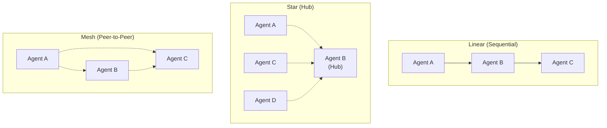
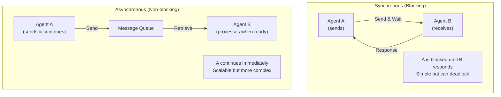

# Agent Communication

## Detailed Explanation

Agent communication is the mechanism by which multiple AI agents exchange information, coordinate decisions, and collaborate on shared goals. In multi-agent systems, communication transforms isolated agents into a coordinated team. Communication can be: direct (agent A sends message to agent B), broadcast (agent sends to many agents), hierarchical (agents communicate through supervisor), or peer-to-peer (agents discover and negotiate with each other).

Why it matters: Single agents hit scalability limits. Multi-agent systems can parallelize work, specialize by domain, and solve larger problems. But without proper communication, you get chaos—duplicate work, conflicting decisions, deadlocks. Communication protocols are what make multi-agent systems coherent.

**Key clarification:** Agent communication ≠ user interface chat. This is machine-to-machine: structured messages, defined protocols, automated negotiation. The goal is coordination and information flow, not natural conversation.

## Core Intuition

Imagine a team of humans solving a problem. Alice works on research, Bob on analysis, Carol on implementation. They communicate through meetings, emails, shared documents. They must understand each other (shared language), agree on formats (JSON, not prose), handle delays (email isn't instant), and resolve conflicts (two versions of the plan). Multi-agent AI has identical challenges.

## How It Works

**Communication Pattern (5 stages):**

1. **Message Formation:** Agent A decides what to send and to whom.
   - Example: "I found 5 candidates. Send to filtering_agent"
   - Message structure: {sender: A, recipient: B, type: "candidates", data: [...]}

2. **Transmission:** Message travels via channel (queue, network, memory).
   - Synchronous: A waits for B's response (blocking)
   - Asynchronous: A continues; B responds when ready
   - Example: A puts message in shared queue; B picks it up

3. **Reception:** Agent B receives and parses the message.
   - Example: B reads queue, deserializes JSON, validates schema
   - If invalid → error; if valid → process

4. **Processing:** Agent B acts on the received information.
   - Example: "Received 5 candidates. I'll filter and rank them."
   - B may call tools, consult its knowledge, reach conclusions

5. **Response:** Agent B sends reply back to A (or broadcasts result).
   - Example: "Filtered to 3 candidates, ranked by match"
   - Closes communication loop

**Example: Two-Agent Workflow**

```
Agent_Researcher: "I found 5 flight options for NYC→LA"
  → Message: {type: "candidates", data: [F1, F2, F3, F4, F5]}

Agent_Optimizer: Receives message
  → Ranks by price, filters by timing
  → "3 good options: F2 ($400), F3 ($380), F4 ($420)"

Agent_Researcher: Receives ranking
  → Presents to user
  → "Pick one of these 3"
```

**Communication Topologies:**



**Message Format (JSON Example):**

```json
{
  "version": "1.0",
  "sender": "agent_researcher",
  "recipient": "agent_optimizer",
  "timestamp": "2026-05-17T10:30:00Z",
  "message_id": "msg_12345",
  "type": "task_request",
  "payload": {
    "task": "rank_candidates",
    "candidates": [
      {"id": 1, "score": 0.85, "cost": 400},
      {"id": 2, "score": 0.82, "cost": 380}
    ]
  },
  "priority": "high",
  "timeout": 30
}
```

## Architecture / Trade-offs

**Communication Architectures:**



**Trade-offs:**

1. **Synchronous vs. Asynchronous**
   - Sync: Simple, immediate feedback, can deadlock
   - Async: Scalable, decoupled, harder to debug
   - **Decision:** Use sync for small teams (2-3 agents); async for large systems (10+ agents)

2. **Centralized Hub vs. Peer-to-Peer**
   - Hub: One coordinator → simple, bottleneck risk
   - P2P: Agents negotiate → distributed, complex coordination
   - **Decision:** Hub for simple workflows; P2P for collaborative reasoning

3. **Structured Messages vs. Free-form Text**
   - Structured (JSON schema): Reliable, validatable, but rigid
   - Free-form: Flexible, natural, error-prone
   - **Decision:** Always use structured + schema validation for production

4. **Broadcast vs. Direct**
   - Broadcast: One message to all → simple but wasteful
   - Direct: Targeted messages → efficient but requires routing
   - **Decision:** Use direct by default; broadcast for global updates only

## Interview Q&A

**Q1: Why do multi-agent systems need explicit communication protocols instead of just LLMs reasoning about each other?**
A: LLMs can infer intent from context, but this is unreliable at scale. Explicit protocols (message types, schemas, timeouts) prevent ambiguity, enable verification, and allow debugging. Example: If Agent A sends 5 candidates to Agent B, a schema ensures B understands this is a list, not prose. Without it, B might misparse and fail silently.

**Q2: What's the difference between synchronous and asynchronous agent communication? When would you use each?**
A: Sync: A sends message, waits for B's response, then continues. Simple, immediate feedback, but A is blocked (risk of deadlock if B is slow or fails). Async: A sends and continues; B processes when ready, sends response later. Scalable and fault-tolerant, but harder to coordinate (need to track which response is for which request). Use sync for small teams (2-3 agents), async for production systems (10+ agents).

**Q3: How do you handle communication failures (agent offline, message lost, timeout) in multi-agent systems?**
A: (1) Timeout: If A doesn't hear from B in 30s, retry or fallback; (2) Message IDs: Tag each message with unique ID; B acknowledges receipt; (3) Dead-letter queue: Messages B can't process go to queue for inspection; (4) Circuit breaker: If B fails 3x, temporarily stop sending it work; (5) Replication: Critical messages sent to multiple agents for redundancy.

**Q4: What's the trade-off between a centralized hub topology vs. peer-to-peer communication in multi-agent systems?**
A: Hub (star): One coordinator agent routes all messages. Simple logic, easy to debug, single point of failure (if hub dies, system stops). P2P (mesh): Agents negotiate directly. Distributed, resilient, but coordination is complex (agents must agree on who does what). Use hub for simple sequential workflows; P2P for collaborative reasoning or consensus.

**Q5: How do you prevent an agent from getting stuck waiting for a response from another agent?**
A: (1) Timeouts: Set maximum wait time (e.g., 30s). If B doesn't respond, A proceeds with fallback; (2) Async patterns: A doesn't wait; it sends message and moves on; (3) Heartbeats: B sends periodic "I'm alive" signals so A knows B hasn't crashed; (4) Circuit breakers: If B is slow/failing, stop routing work to it temporarily; (5) Alternative agents: If B doesn't respond, route work to Agent C.

**Q6: What message schema and format should multi-agent systems use? JSON, Protocol Buffers, something else?**
A: JSON is simplest for LLMs (they understand it natively). Protocol Buffers (protobuf) are more efficient and have strict schema. For most agentic systems: JSON + JSON Schema for validation. This gives you simplicity (LLMs parse JSON easily), schema enforcement (validate before processing), and debuggability (read messages in log files). Use protobuf only if bandwidth is critical (very high message volume).

**Q7: How do you coordinate decisions when multiple agents disagree (e.g., Agent A wants Option 1, Agent B wants Option 2)?**
A: (1) Voting: Each agent votes; majority wins; (2) Hierarchy: Senior agent decides; (3) Negotiation: Agents exchange arguments until consensus; (4) Priority: Predefined priorities (cost > speed > quality); (5) Escalation: If disagreement unresolved, ask human. For most cases: voting (simple) or hierarchy (clear authority). Negotiation is complex but gives best results if you have time.

**Q8: What happens if you use LLMs with free-form text communication instead of structured message schemas?**
A: Risk: Agent A writes "send me good options" and Agent B misunderstands as "filter bad options." Free-form is flexible but error-prone. Agents will hallucinate interpretations, misparse, and fail silently. Always use structured messages (JSON schema) + validation. Free-form text only for human-readable logging/debugging, not machine-to-machine communication.

## Best Practices

1. **Define message schemas explicitly.** Don't rely on LLM inference. Write JSON Schema for each message type. Validate all incoming messages. Reject invalid messages early.

2. **Use message IDs for tracking.** Tag each message with unique ID (UUID). Log sender, recipient, timestamp, ID. Enables debugging ("which response is for which request?") and duplicate detection.

3. **Implement timeouts for all communication.** Default 30 seconds. If Agent B doesn't respond in time, A should timeout and use fallback logic. Prevents indefinite waiting and deadlocks.

4. **Start with synchronous, centralized hub for simplicity.** Async and P2P are harder to debug. Only move to these patterns when you prove you need them (bottleneck in hub, latency issues, etc.).

5. **Log all messages (sent and received).** Critical for debugging multi-agent issues. Store in structured format with timestamp, sender, recipient, message ID, content. Allows you to replay execution.

6. **Use async for large systems (10+ agents).** Synchronous communication doesn't scale—too many agents waiting for responses. Move to message queues (RabbitMQ, Kafka) for decoupling.

7. **Implement retry logic with exponential backoff.** If message send fails, retry with increasing delays (1s, 2s, 4s, ...). Handles transient failures and prevents overwhelming a slow agent.

8. **Version your message schemas.** As systems evolve, message formats change. Use version field in messages. Support old and new formats for backward compatibility.

9. **Monitor communication latency and failures.** Alert if: message loss rate >1%, avg latency >5s, or timeouts >10%. These indicate system health issues (agents failing, bottlenecks, network issues).

10. **Implement circuit breakers for reliability.** If Agent B fails to respond 3x in a row, temporarily stop routing work to it. After timeout, try again. Prevents cascading failures.

## Common Pitfalls

1. **Free-form text instead of structured messages.** Agent A sends "I found results" and Agent B interprets as "try searching more." Communication breaks silently. **Fix:** Always use JSON schema with validation.

2. **No timeouts.** Agent A waits forever for Agent B's response. If B crashes, A hangs indefinitely, blocking the entire system. **Fix:** Set timeout for all communication (default 30s). On timeout, use fallback.

3. **Synchronous communication for many agents.** With 10+ agents, each waiting for others' responses, you get deadlocks and cascading timeouts. **Fix:** Move to async (message queues) when you have >5 agents.

4. **No message IDs.** A sends request, B sends two responses (e.g., retry). A receives both and processes twice. **Fix:** Use unique message IDs. Track responses per request ID.

5. **Lost or dropped messages.** Agent A sends "do X" but it gets lost in queue/network. B never does X. System silently fails. **Fix:** Implement acknowledgments. A sends; B replies "got it"; A knows message arrived.

6. **No version tracking.** Old Agent A sends old message format. New Agent B expects new format. Parsing fails. **Fix:** Include version in every message. Support multiple versions for backward compatibility.

7. **Unbounded message queues.** Messages accumulate if agents can't keep up. Memory bloats, latency explodes. **Fix:** Set max queue size. Drop old/low-priority messages if queue full. Monitor queue length.

8. **Communication centralized in one agent (hub is single point of failure).** Hub crashes → entire system stops. **Fix:** For critical systems, replicate hub. Use failover to backup hub.

9. **No retry logic.** Transient network glitch drops message. Agent doesn't retry, silently fails. **Fix:** Implement retry with exponential backoff (1s, 2s, 4s, ...).

10. **Coupling between agents.** Changes to Agent B's message format break Agent A (and C, D, ...). **Fix:** Use contract-based approach: define message schemas separately. Both agents depend on schema, not on each other's code.

## Code Examples

**Example 1: Synchronous Direct Communication (Anthropic API)**
```python
from anthropic import Anthropic
import json
from typing import Dict, Any

class Agent:
    def __init__(self, name: str):
        self.name = name
        self.client = Anthropic()
        self.inbox = []
    
    def send_message(self, recipient: "Agent", message: Dict[str, Any]):
        """Send structured message to another agent"""
        structured_msg = {
            "sender": self.name,
            "recipient": recipient.name,
            "type": message.get("type"),
            "data": message.get("data"),
            "message_id": f"msg_{len(recipient.inbox)}"
        }
        print(f"[{self.name}] Sending to {recipient.name}: {structured_msg['type']}")
        recipient.receive_message(structured_msg)
    
    def receive_message(self, message: Dict[str, Any]):
        """Receive and process message"""
        self.inbox.append(message)
        print(f"[{self.name}] Received: {message['type']}")

# Example: Two agents collaborating
researcher = Agent("Researcher")
optimizer = Agent("Optimizer")

# Researcher finds candidates
researcher.send_message(optimizer, {
    "type": "candidates",
    "data": [
        {"id": 1, "score": 0.9, "cost": 400},
        {"id": 2, "score": 0.8, "cost": 380}
    ]
})

# Optimizer processes and ranks
print(f"\n[Optimizer] Processing {len(optimizer.inbox[0]['data'])} candidates...")
candidates = optimizer.inbox[0]['data']
ranked = sorted(candidates, key=lambda x: x['score'] - x['cost']/1000, reverse=True)

optimizer.send_message(researcher, {
    "type": "ranking",
    "data": ranked[:2]  # Send top 2
})

print(f"\n[Researcher] Received ranking with {len(researcher.inbox[0]['data'])} options")
```

**Example 2: Asynchronous Communication with Message Queue**
```python
import queue
import threading
import time
from typing import Dict, Any

class MessageQueue:
    def __init__(self):
        self.queue = queue.Queue()
    
    def send(self, message: Dict[str, Any]):
        self.queue.put(message)
    
    def receive(self, timeout: float = 5.0) -> Dict[str, Any]:
        try:
            return self.queue.get(timeout=timeout)
        except queue.Empty:
            return None

class AsyncAgent:
    def __init__(self, name: str, msg_queue: MessageQueue):
        self.name = name
        self.msg_queue = msg_queue
        self.running = False
    
    def run(self):
        """Agent main loop - process messages asynchronously"""
        self.running = True
        while self.running:
            message = self.msg_queue.receive(timeout=1.0)
            if message and message.get("recipient") == self.name:
                print(f"[{self.name}] Processing: {message.get('type')}")
                self.process_message(message)
    
    def process_message(self, message: Dict[str, Any]):
        if message["type"] == "task":
            # Simulate work
            time.sleep(0.5)
            print(f"[{self.name}] Completed task: {message['data']}")
    
    def send(self, recipient: str, msg_type: str, data: Any):
        self.msg_queue.send({
            "sender": self.name,
            "recipient": recipient,
            "type": msg_type,
            "data": data,
            "timestamp": time.time()
        })

# Example
q = MessageQueue()
agent_a = AsyncAgent("Agent_A", q)
agent_b = AsyncAgent("Agent_B", q)

# Start agents in threads
t1 = threading.Thread(target=agent_a.run)
t2 = threading.Thread(target=agent_b.run)
t1.start()
t2.start()

# Send messages asynchronously
agent_a.send("Agent_B", "task", "analyze_data")
time.sleep(0.1)
agent_a.send("Agent_B", "task", "generate_report")

# Let them process
time.sleep(2)

agent_a.running = False
agent_b.running = False
```

**Example 3: Production Communication with Validation and Retry**
```python
import json
import time
from typing import Dict, Any, Optional
from dataclasses import dataclass
from enum import Enum

class MessageType(Enum):
    TASK_REQUEST = "task_request"
    TASK_RESPONSE = "task_response"
    ACKNOWLEDGMENT = "acknowledgment"
    ERROR = "error"

@dataclass
class Message:
    sender: str
    recipient: str
    message_id: str
    msg_type: MessageType
    payload: Dict[str, Any]
    timestamp: float
    timeout: float = 30.0

    def to_json(self) -> str:
        return json.dumps({
            "sender": self.sender,
            "recipient": self.recipient,
            "message_id": self.message_id,
            "type": self.msg_type.value,
            "payload": self.payload,
            "timestamp": self.timestamp
        })

class ProductionAgent:
    def __init__(self, name: str):
        self.name = name
        self.pending_requests = {}  # Track messages waiting for responses
        self.message_history = []
    
    def send_with_retry(self, message: Message, max_retries: int = 3) -> bool:
        """Send message with exponential backoff retry"""
        for attempt in range(max_retries):
            try:
                # Validate message
                self._validate_message(message)
                
                # Simulate sending
                print(f"[{self.name}] Sending {message.msg_type.value} to {message.recipient} (attempt {attempt + 1})")
                
                # Store in history
                self.message_history.append({
                    "time": time.time(),
                    "message": message.to_json(),
                    "success": True
                })
                
                return True
                
            except Exception as e:
                delay = 2 ** attempt  # Exponential backoff: 1s, 2s, 4s
                print(f"  Error: {e}. Retrying in {delay}s...")
                time.sleep(delay)
        
        return False
    
    def _validate_message(self, message: Message):
        """Validate message structure and schema"""
        if not message.sender or not message.recipient:
            raise ValueError("Sender and recipient required")
        if not message.message_id:
            raise ValueError("Message ID required")
        if message.timeout <= 0:
            raise ValueError("Timeout must be positive")

# Usage
agent_a = ProductionAgent("Researcher")
msg = Message(
    sender="Researcher",
    recipient="Optimizer",
    message_id="msg_001",
    msg_type=MessageType.TASK_REQUEST,
    payload={"candidates": [1, 2, 3]},
    timestamp=time.time(),
    timeout=30.0
)

success = agent_a.send_with_retry(msg, max_retries=3)
print(f"Message sent: {success}")
```

## Related Concepts
- Multi-Agent Systems — using communication for coordination
- Agent Routing — directing messages to specialized agents
- Error Recovery — handling communication failures
- Agent Evals — testing multi-agent systems

## Resources
- [Agent-Based Modeling](https://en.wikipedia.org/wiki/Agent-based_model)
- [Message Passing in Distributed Systems](https://en.wikipedia.org/wiki/Message_passing)
- [ReAct: Synergizing Reasoning and Acting](https://arxiv.org/abs/2210.03629)
