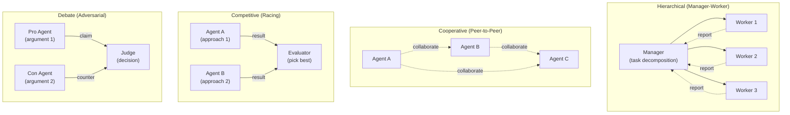

# Multi-Agent Systems

## Detailed Explanation

A multi-agent system is a collection of autonomous agents working together to solve problems that individual agents cannot solve alone. Each agent specializes in a domain (analysis, design, engineering, strategy) and communicates with others to share information, delegate work, and coordinate decisions. The power comes from specialization—instead of one generalist agent being mediocre at everything, you have experts in each domain. Communication and coordination overhead is the cost.

Why it matters: Single agents hit scalability limits. Complex problems (design a product, analyze market + strategy + engineering) require multiple perspectives and expertise. Multi-agent systems enable parallel work, specialization, and better solutions through debate and collaboration. They scale better than single agents and produce higher quality outputs.

**Key clarification:** Multi-agent ≠ just running multiple agents in parallel. Multi-agent requires active coordination, communication, and goal alignment. Running 5 independent agents that don't talk is just parallelism, not a system.

## Core Intuition
A team of humans beats one expert. A generalist architect struggling with data analysis, backend design, and UI/UX design. Instead: data analyst, backend engineer, UI designer—each expert, working together, solving the problem faster and better. AI agents work the same way.

## How It Works

**Multi-Agent Execution Pattern (5 stages):**

1. **Receive Task:** User or orchestrator receives complex task.
   - Example: "Design a go-to-market strategy for a B2B SaaS product"
   - Task is ambiguous, requires multiple expertise areas

2. **Decompose (Manager):** Manager agent breaks task into subtasks.
   - Marketing research → Market Analyst
   - Competitive analysis → Strategist  
   - Product positioning → Product Manager
   - Example output: "1) Analyze market size & competitors 2) Define positioning 3) Create GTM plan"

3. **Delegate (In Parallel):** Manager assigns subtasks to specialist agents.
   - Market Analyst: Gathers data, trends, competitive landscape (5 min)
   - Strategist: Analyzes margins, market dynamics (5 min)
   - Product Manager: Positions in market (5 min)
   - All run in parallel (3x faster than sequential)

4. **Collaborate (Inter-agent Communication):**
   - Analyst writes: "Market size $50B, growing 15% YoY, dominated by Enterprise vendors"
   - Strategist reads and responds: "This suggests we position as SMB-focused alternative"
   - Product Manager reads and refines: "Yes, SMB focus with enterprise-grade features"
   - Agents build on each other's outputs (blackboard or message passing)

5. **Synthesize (Manager Aggregates):**
   - Manager reads all outputs
   - Combines into coherent strategy: "Target SMB market, position as enterprise-grade for SMBs, ...
   - Returns to user: One integrated strategy from multiple perspectives

**Coordination Patterns (4 Topologies):**



**Communication Methods:**

1. **Blackboard (Shared Memory):** All agents read/write to shared state. Simple but less formal. Good for asynchronous work.
2. **Message Passing:** Agent A sends explicit message to Agent B. Formal, auditable, but requires routing/addressing.
3. **Broadcast:** Agent announces to all others. Good for updates, but noisy with many agents.

**Example: 3-Agent Marketing Strategy Task**

```
User: "Create GTM strategy for B2B SaaS product"

Manager:
  Subtask 1 → Research Agent: "Analyze market trends and competitors"
  Subtask 2 → Analysis Agent: "Evaluate pricing strategies"
  Subtask 3 → Strategy Agent: "Recommend go-to-market approach"

Research Agent (executing):
  → Gathers data: "Market size $10B, 5 major competitors, SMB underserved"
  → Writes to blackboard

Analysis Agent (executing in parallel):
  → Calculates: "SaaS unit economics: $5k-50k ACVs, 3-5 year payback"
  → Writes to blackboard

Strategy Agent (executing, reads others' outputs):
  → Reads research: "OK, market is large and fragmented"
  → Reads analysis: "OK, premium pricing is viable"
  → Synthesizes: "Recommend targeting SMB segment, $15k/year pricing, inbound marketing"

Manager:
  → Reads all outputs
  → Integrates: "Final GTM: Focus SMB segment, premium positioning, inbound+partnerships"
  → Returns to user
```

## Architecture / Trade-offs

**Multi-Agent System Architectures:**

| Aspect | Single Agent | Multi-Agent Hierarchical | Multi-Agent Cooperative | Multi-Agent Competitive |
|--------|---|---|---|---|
| Specialization | Generalist (70% quality) | Specialists (90%+ quality) | Peers (85% each) | Explorers (varies) |
| Latency | 10s (sequential) | 10-20s (parallel + coordination) | 15s (negotiation) | 8s (parallel racing) |
| Cost | 1x LLM calls | 3-5x (N agents) | 3-5x (N agents) | 3-5x (N agents, best picked) |
| Complexity | Low (single control) | Medium (manager overhead) | High (all-to-all coordination) | Medium (evaluator needed) |
| Robustness | Single failure = fail | Redundancy (reassign tasks) | Flexible (peers adapt) | Redundancy (alternatives) |
| Reasoning Quality | Limited (one perspective) | High (diverse expertise) | High (collaborative) | Variable (pick best) |
| Best For | Simple, well-defined tasks | Clear decomposition (analysis+strategy) | Brainstorming, negotiation | Exploring alternatives |

**Trade-offs:**

1. **Specialization vs. Coordination Overhead**
   - Specialized agents (good quality) need more coordination
   - Generalist agent (poor quality) needs no coordination
   - **Decision:** Specialize if task complexity >8/10; otherwise, single agent

2. **Parallel Speed vs. Communication Latency**
   - N agents in parallel: theoretically N× faster
   - But coordination adds latency: managers waiting for workers, agents reading results
   - Actual speedup: 2-3x (not N×) due to coordination overhead
   - **Decision:** Parallel good for I/O-bound work (waiting for data); bad for compute-heavy

3. **Hierarchical Simplicity vs. Cooperative Flexibility**
   - Hierarchical: Manager decides everything, simple but rigid
   - Cooperative: Agents negotiate, flexible but complex
   - **Decision:** Hierarchical for clear task breakdown; cooperative for creative/exploratory work

4. **Synchronous vs. Asynchronous**
   - Sync: All agents wait for slowest worker (reliable, latency bloat)
   - Async: Agents work independently (fast, harder to coordinate)
   - **Decision:** Async preferred for >3 agents; use timeouts for reliability

## Interview Q&A

**Q1: When should you use a multi-agent system vs. a single agent?**
A: Multi-agent for: complex tasks (product design, market analysis + strategy), tasks benefiting from specialization (you need expert analyst + expert strategist), or tasks exploring multiple approaches (racing). Single agent for: simple, well-defined queries (lookup, simple computation), low latency requirements (<1s), or cost-constrained scenarios. Rule of thumb: if task requires expertise from 3+ distinct domains, use multi-agent.

**Q2: What's the difference between hierarchical and cooperative multi-agent systems?**
A: Hierarchical: One manager breaks task into subtasks, delegates to workers. Workers execute independently, report results. Manager aggregates. Good for clear task decomposition (analysis → design → implementation). Cooperative: Agents are peers, negotiate directly, consult each other. Good for brainstorming, creative tasks, consensus-building. Hierarchical is faster (clear authority); cooperative is more flexible (no bottleneck).

**Q3: How do you handle communication between agents? What's the best approach?**
A: Three options: (1) Blackboard—agents read/write to shared state (simple but loose); (2) Message passing—A sends to B explicitly (formal, auditable); (3) Broadcast—agent announces to all (noisy but efficient). Best: use blackboard for asynchronous work (each agent reads at own pace), message passing for dependent work (A needs B's output before proceeding). Log all communication for debugging.

**Q4: What happens if multi-agent system is slower than a single agent?**
A: Likely causes: (1) Too many agents—O(N²) coordination overhead dominates; (2) Synchronous waiting—manager waits for slowest worker; (3) Non-parallel work—agents work sequentially, not in parallel. Fixes: (1) Reduce to 3-5 key agents; (2) Use async communication; (3) Parallelize work—workers should execute in parallel, not sequentially.

**Q5: How do you prevent agents from going into deadlock or infinite loops?**
A: (1) Timeouts—each agent has max time for task (30s default). If timeout, escalate or use fallback. (2) Clear exit criteria—agent knows when work is done (e.g., "stop when you have 3 recommendations"); (3) Max rounds for debate—debate agents have max iterations (3-5 rounds) before judge decides. (4) Priority resolution—if A waits for B and B waits for A, priority system breaks tie.

**Q6: How do you measure if a multi-agent system is actually better than single agent?**
A: Measure: (1) Quality—does result solve the problem better? (2) Latency—is coordination latency worth the improved quality? (3) Cost—3-5x more LLM calls, but better result, is it worth it? (4) Robustness—if one agent fails, does system recover? (5) Coverage—can multi-agent handle edge cases single agent misses? Benchmark: single agent baseline (quality, latency, cost), then multi-agent. Multi-agent should win on at least 2 metrics.

**Q7: In a competitive multi-agent system (racing approaches), how do you pick the best result?**
A: Three strategies: (1) Evaluator agent—specialized agent reads all results, scores, picks best; (2) Voting—users or other agents vote; (3) Ensemble—combine results (if each agent wrote a paragraph, concatenate all). Evaluator is most reliable but adds latency. Voting needs humans. Ensemble loses focus. Use evaluator for production; voting for feedback loops.

**Q8: How do you scale a multi-agent system to 20+ agents without coordination chaos?**
A: Don't try—20 agents = O(400) communication pairs. Instead: (1) Hierarchical nesting—have teams (5 agents each), each team has manager, top-level manager coordinates teams; (2) Specialization zones—agents organized by domain (marketing team, engineering team); (3) Async only—no synchronization, agents post and read independently. Goal: reduce communication from O(N²) to O(N log N) via hierarchical structure.

## Best Practices

1. **Start with 3-5 agents, expand only if needed.** N agents = O(N²) coordination overhead. Sweet spot is 3-5 (quick coordination, good coverage). More than 10 becomes chaos.

2. **Define agent roles clearly.** Each agent should have clear expertise: "Data analyst specializes in metrics and trends" not "general analyst." Prevents overlap and confusion.

3. **Use async communication by default.** Agents post to blackboard, read others' outputs at own pace. Avoid sync ("wait for all") which adds latency.

4. **Implement timeouts for all inter-agent communication.** If Agent A waits for Agent B, set timeout (30s default). On timeout, escalate or use fallback. Prevents indefinite waiting.

5. **Log all agent-to-agent communication.** Critical for debugging. When result is wrong, replay communication: did agents understand each other? Was information accurate?

6. **Have a manager/orchestrator agent.** Even in cooperative systems, one agent should coordinate overall flow. Prevents chaos and ensures progress.

7. **Test multi-agent on diverse scenarios.** Not all problems need multi-agent. Test on simple tasks (where single agent wins) and complex tasks (where multi-agent wins) to find your threshold.

8. **Implement graceful degradation.** If one agent fails, system should reassign its work or use fallback. Never fail the whole system for one agent.

9. **Version agent roles and responsibilities.** If you change agent specifications, old requests might fail. Version them: agent_v1, agent_v2. Can replay with correct versions.

10. **Monitor inter-agent latency and cost.** Track: communication overhead (should be <20% of total latency), cost per agent (should be <cost of single agent). If exceeds, reconsider multi-agent approach.

## Common Pitfalls

1. **Too many agents.** 10+ agents = communication explosion. Each pair of agents = potential interaction. O(N²) coordination overhead dominates quality gains. **Fix:** Start with 3-5. Add agents only if needed.

2. **Synchronous waiting bottleneck.** Manager waits for all workers before proceeding. One slow worker blocks everyone. **Fix:** Use async communication. Manager reads results at own pace; workers proceed independently.

3. **Unclear role overlap.** Agent A and B both do "analysis." Duplicate work, conflicting results. **Fix:** Clear specialization—Agent A does "market analysis", Agent B does "competitive analysis". Non-overlapping domains.

4. **Deadlock in peer-to-peer systems.** A waits for B, B waits for C, C waits for A. System hangs. **Fix:** Timeouts + priority resolution. If deadlock detected, priority system picks who goes first.

5. **Agents hallucinating collaboration.** Agent A claims it consulted with Agent B, but never did. Result is inaccurate. **Fix:** Log all communication. Agent says "I asked B for X" → verify message in log. No log entry = hallucination.

6. **No fallback when agent fails.** Agent B crashes. Manager waits forever. System blocks. **Fix:** Implement retry (retry 2x), fallback (use different agent), escalate (report to human). Never let one agent block entire system.

7. **Debate agents arguing forever.** Thesis and antithesis agents go rounds endlessly, no winner. **Fix:** Set max rounds (3-5). After max rounds, judge decides even if not unanimous.

8. **Communication format mismatch.** Agent A writes JSON; Agent B expects plaintext. B doesn't understand A's output. **Fix:** Explicit message schema. All agents agree on format (JSON, structured template, etc.). Validate schema on receipt.

9. **No measurement of multi-agent benefit.** Deploy multi-agent system without knowing if it's better than single agent. Might be slower and more expensive. **Fix:** Benchmark single agent (baseline), then multi-agent. Multi-agent should win on at least quality or coverage.

10. **Synchronization overhead overlooked.** Coordination latency is huge but hidden. N agents take 10s for computation but 20s for coordination. **Fix:** Profile communication overhead. If coordination > 50% of latency, reconsider. Maybe fewer agents or async approach.

## Code Examples

**Example 1: Simple Hierarchical System (Manager + Workers)**
```python
from anthropic import Anthropic

def hierarchical_multi_agent(task: str) -> dict:
    """Manager decomposes, workers execute, manager synthesizes"""
    client = Anthropic()
    
    # Step 1: Manager breaks down task
    manager_response = client.messages.create(
        model="claude-3-5-sonnet-20241022",
        max_tokens=512,
        messages=[{
            "role": "user",
            "content": f"Break this into 3 specific subtasks for specialists:\n{task}\n\nList subtasks clearly."
        }]
    )
    subtasks = manager_response.content[0].text
    print(f"[Manager] Subtasks:\n{subtasks}\n")
    
    # Step 2: Workers execute (in parallel, we simulate sequentially)
    worker_results = {}
    
    # Worker 1: Analyst
    analyst_response = client.messages.create(
        model="claude-3-5-sonnet-20241022",
        max_tokens=256,
        messages=[{
            "role": "user",
            "content": f"As an analyst, provide data-driven insights:\n{task}"
        }]
    )
    worker_results["analyst"] = analyst_response.content[0].text
    print(f"[Analyst]:\n{worker_results['analyst']}\n")
    
    # Worker 2: Strategist
    strategist_response = client.messages.create(
        model="claude-3-5-sonnet-20241022",
        max_tokens=256,
        messages=[{
            "role": "user",
            "content": f"As a strategist, recommend approach:\n{task}\n\nAnalyst said: {worker_results['analyst']}"
        }]
    )
    worker_results["strategist"] = strategist_response.content[0].text
    print(f"[Strategist]:\n{worker_results['strategist']}\n")
    
    # Step 3: Manager synthesizes
    synthesis_response = client.messages.create(
        model="claude-3-5-sonnet-20241022",
        max_tokens=512,
        messages=[{
            "role": "user",
            "content": f"""Synthesize into final plan:
Task: {task}
Analyst insights: {worker_results['analyst']}
Strategic recommendation: {worker_results['strategist']}
Provide integrated plan."""
        }]
    )
    final_plan = synthesis_response.content[0].text
    print(f"[Manager] Final Plan:\n{final_plan}")
    
    return {
        "subtasks": subtasks,
        "analyst_input": worker_results["analyst"],
        "strategist_input": worker_results["strategist"],
        "final_plan": final_plan
    }

# Usage
result = hierarchical_multi_agent("Design a go-to-market strategy for a B2B SaaS product")
```

**Example 2: Competitive System (Racing Approaches)**
```python
from typing import Dict, List
from anthropic import Anthropic

def competitive_multi_agent(task: str, num_approaches: int = 3) -> Dict:
    """Multiple agents propose different approaches, evaluator picks best"""
    client = Anthropic()
    
    approaches = {}
    
    # Step 1: Generate multiple approaches in parallel
    for i in range(num_approaches):
        response = client.messages.create(
            model="claude-3-5-sonnet-20241022",
            max_tokens=256,
            messages=[{
                "role": "user",
                "content": f"""Approach {i+1}: Generate a unique solution to:
{task}

Think creatively. Use a different strategy than typical."""
            }]
        )
        approaches[f"approach_{i+1}"] = response.content[0].text
        print(f"[Agent {i+1}] Approach:\n{approaches[f'approach_{i+1}']}\n")
    
    # Step 2: Evaluator picks best
    evaluation_prompt = "Rate these approaches for quality, feasibility, innovation:\n"
    for key, approach in approaches.items():
        evaluation_prompt += f"\n{key}:\n{approach}\n"
    evaluation_prompt += "\nWhich is best? Explain."
    
    eval_response = client.messages.create(
        model="claude-3-5-sonnet-20241022",
        max_tokens=512,
        messages=[{"role": "user", "content": evaluation_prompt}]
    )
    evaluation = eval_response.content[0].text
    print(f"[Evaluator] Assessment:\n{evaluation}")
    
    return {
        "approaches": approaches,
        "evaluation": evaluation
    }

# Usage
result = competitive_multi_agent("Come up with innovative features for an AI assistant")
```

**Example 3: Cooperative System (Agents Consulting Each Other)**
```python
from anthropic import Anthropic

def cooperative_multi_agent(task: str) -> Dict:
    """Agents consult each other iteratively, building consensus"""
    client = Anthropic()
    
    # Shared blackboard (all agents can read/write)
    blackboard = {
        "task": task,
        "round": 0,
        "insights": {}
    }
    
    agents = ["market_analyst", "product_specialist", "strategist"]
    
    # Iterate: each agent reads others' insights and builds on them
    for round_num in range(2):  # 2 rounds of collaboration
        blackboard["round"] = round_num + 1
        print(f"\n=== Round {round_num + 1} ===")
        
        for agent_name in agents:
            # Agent reads what others wrote
            context = "\n".join([
                f"{k}: {v}" for k, v in blackboard["insights"].items()
            ])
            
            response = client.messages.create(
                model="claude-3-5-sonnet-20241022",
                max_tokens=256,
                messages=[{
                    "role": "user",
                    "content": f"""You are a {agent_name}.
Task: {task}

Prior insights from other agents:
{context if context else "None yet."}

Add your perspective:"""
                }]
            )
            
            insight = response.content[0].text
            blackboard["insights"][agent_name] = insight
            print(f"[{agent_name}]: {insight[:100]}...")
    
    return blackboard

# Usage
result = cooperative_multi_agent("Build a sustainability strategy for a tech company")
```

## Related Concepts
- Agent Loops — individual agent's decision loop
- Agent Routing — directing work to specialized agents
- Agent Communication — messaging between agents
- Hierarchical Agents — manager-worker pattern
- Competitive Agents — racing/voting approaches

## Resources
- [Multi-Agent Systems: A Modern Approach](https://mitpress.mit.edu/9780262133616/)
- [AutoGen: Enabling Next-Gen LLM Applications](https://arxiv.org/abs/2308.08155)
- [LangGraph: Multi-Agent Orchestration](https://python.langchain.com/docs/langgraph/)

## Code Example

```python
from anthropic import Anthropic

client = Anthropic()

def multi_agent_system(task):
    """Multi-agent system with manager and specialist workers."""
    
    # Define agents with role/expertise
    agents = {
        "manager": {
            "role": "Project manager, coordinates subtasks",
            "system": "You are a project manager. Break the task into clear subtasks and delegate to specialists."
        },
        "analyst": {
            "role": "Data analyst, interprets information",
            "system": "You are a data analyst. Focus on data, metrics, and factual analysis."
        },
        "strategist": {
            "role": "Strategist, recommends decisions",
            "system": "You are a strategist. Focus on decisions, trade-offs, and long-term impact."
        }
    }
    
    # Shared blackboard (all agents can read/write)
    blackboard = {
        "task": task,
        "subtasks": [],
        "analysis": {},
        "recommendations": {},
        "status": "started"
    }
    
    # Manager breaks down task
    print("=== Manager Planning ===")
    response = client.messages.create(
        model="claude-3-5-sonnet-20241022",
        max_tokens=512,
        system=agents["manager"]["system"],
        messages=[{"role": "user", "content": f"Task: {task}\n\nBreak this into 3-4 subtasks for specialists."}]
    )
    plan = response.content[0].text
    print(plan)
    blackboard["subtasks"] = plan
    
    # Analyst handles data subtask
    print("\n=== Analyst Analysis ===")
    response = client.messages.create(
        model="claude-3-5-sonnet-20241022",
        max_tokens=512,
        system=agents["analyst"]["system"],
        messages=[{"role": "user", "content": f"Task: {task}\n\nProvide factual analysis and key metrics."}]
    )
    analysis = response.content[0].text
    print(analysis)
    blackboard["analysis"] = analysis
    
    # Strategist provides recommendations
    print("\n=== Strategist Recommendations ===")
    response = client.messages.create(
        model="claude-3-5-sonnet-20241022",
        max_tokens=512,
        system=agents["strategist"]["system"],
        messages=[{
            "role": "user",
            "content": f"Task: {task}\n\nGiven the analysis above, provide strategic recommendations.\n\nAnalysis:\n{analysis}"
        }]
    )
    recommendations = response.content[0].text
    print(recommendations)
    blackboard["recommendations"] = recommendations
    
    # Manager synthesizes results
    print("\n=== Manager Summary ===")
    response = client.messages.create(
        model="claude-3-5-sonnet-20241022",
        max_tokens=512,
        system=agents["manager"]["system"],
        messages=[{
            "role": "user",
            "content": f"""Task: {task}

Specialists provided:
Analysis: {analysis}
Recommendations: {recommendations}

Synthesize into final plan."""
        }]
    )
    final_plan = response.content[0].text
    print(final_plan)
    blackboard["status"] = "completed"
    
    return blackboard

# Example
task = "Design a marketing strategy for a new AI product targeting enterprises"
result = multi_agent_system(task)
```

## Interview Quick-Reference

| Question | What to say |
|---|---|
| "What is multi-agent system?" | Multiple specialized agents working together. Each expert in domain, communicate to solve complex problems. |
| "When use multi-agent?" | Complex tasks benefiting from specialization (design team, analysis + strategy). Simple tasks: overkill. |
| "Hierarchical vs cooperative?" | Hierarchical: clear manager (good for task decomposition). Cooperative: peer (good for brainstorming, collaboration). |
| "Coordination cost?" | N agents = O(N²) communication overhead. Usually 3-10 agents optimal; more than that, diminishing returns. |
| "Failure handling?" | One agent fails → reassign or retry. Use timeouts, fallbacks. Log all communications for debugging. |
| "Evaluation?" | Compare multi-agent result to single agent. Multi-agent should be better (specialization) and/or faster (parallelism). |

## Related Topics
- [Hierarchical Agents](15-hierarchical-agents.md) — manager-worker pattern
- [Cooperative Agents](16-cooperative-agents.md) — peer-to-peer agents
- [Competitive Agents](17-competitive-agents.md) — racing/voting approaches
- [Agent Communication](13-agent-communication.md) — protocols and message passing
- [Agent Loops](02-agent-loops.md) — individual agent's decision loop

## Resources
- [Multi-Agent Systems: A Modern Approach to Distributed Artificial Intelligence](https://mitpress.mit.edu/9780262133616/)
- [Agents as Reasoning Engines (OpenAI)](https://openai.com/research/agents-as-reasoning-engines)
- [LangGraph: Multi-Agent Orchestration](https://python.langchain.com/docs/langgraph/)
- [AutoGen: Enabling Next-Gen LLM Applications via Multi-Agent Conversation](https://arxiv.org/abs/2308.08155)
