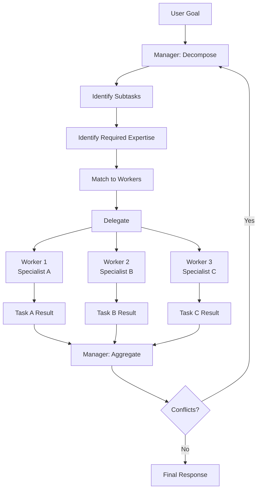

# Hierarchical Agents

## Detailed Explanation

Hierarchical agents organize multi-agent systems into layers where higher-level agents delegate tasks to lower-level specialists. A manager agent receives a user goal and decomposes it into subtasks, assigning each to domain-expert workers. Workers solve their specialized subtask independently, then return results to the manager, who aggregates and synthesizes them into a cohesive response. This mirrors organizational structures: CEO sets strategy, directors run departments, managers supervise teams. Hierarchical organization excels at complex problems requiring different expertise (data analyst, engineer, product manager) but introduces coordination overhead and potential bottlenecks at manager levels. The key advantage: specialization—each worker becomes expert in a narrow domain, producing higher quality than generalists. The key disadvantage: communication latency and manager becoming bottleneck if poorly designed. When to use: complex tasks with clear decomposition, multiple specialized knowledge domains, need for quality per subtask. When not to: simple tasks (overhead not worth it), tasks requiring tight coordination, unpredictable task dependencies.

## Core Intuition

Imagine building a product: CEO plans direction, engineering manager assigns features to engineers, each engineer builds their module independently, manager integrates. Better than one person doing everything (specialist knowledge) but slower than flat team (coordination overhead). Hierarchical agents work the same way: manager breaks problem into specialized subtasks, each worker solves their part expertly, manager coordinates the solution. Trade-off: quality vs speed.

## How It Works

Hierarchical agents operate through task decomposition, delegation, and aggregation:

1. **Manager Receives Goal** — User submits complex task
2. **Task Decomposition** — Manager analyzes goal, identifies subtasks and required expertise
3. **Delegation** — Manager assigns subtasks to appropriate workers
4. **Parallel Execution** — Workers solve their subtasks independently and in parallel
5. **Result Collection** — Manager gathers results from all workers
6. **Aggregation** — Manager synthesizes results, resolves conflicts, produces final response
7. **Feedback Loop** — If aggregation reveals new subtasks or conflicts, manager re-delegates



## Architecture / Trade-offs

**Hierarchy Depth:**
- Shallow (1-2 levels) — Fast, low communication overhead, limited specialization
- Deep (3+ levels) — More specialization, higher latency, more complex coordination

**Delegation Strategy:**
- Function-based — Each worker handles type of task (analyst, engineer, manager)
- Domain-based — Each worker knows specific domain (databases, caching, ML)
- Skill-based — Each worker has specific capability (prompt optimization, tool calling)

**Manager Role:**
- Heavy coordination — Manager breaks down task, assigns, monitors, aggregates (tight control, slower)
- Light coordination — Manager only routes; workers self-organize (faster, potential inconsistency)

**Scaling:**
- Vertical — Add more hierarchy levels for bigger problems (increases latency)
- Horizontal — Add workers at same level (flat scalability, manager becomes bottleneck)

## Interview Q&A

**Q: When should you use hierarchical agents instead of a single agent?**
A: Use hierarchy when: (1) task needs multiple expert domains, (2) specialization improves quality, (3) subtasks can be solved independently. Don't use if: simple task (overhead not worth it), tight coupling between subtasks, or unpredictable dependencies. Measure: does specialization + decomposition save tokens/time vs single agent's generalist approach?

**Q: What's the bottleneck in hierarchical systems?**
A: The manager becomes bottleneck if it: (1) takes too long to decompose, (2) has limited bandwidth (can only manage N workers), (3) becomes sequential (waits for each worker instead of parallel dispatch). Solutions: (1) pre-compute decompositions, (2) limit manager span (max 5-7 direct workers), (3) parallelize worker execution with asyncio, (4) use peer-to-peer workers for some tasks.

**Q: How do you handle conflicts in aggregation?**
A: Conflicts occur when workers disagree or produce incompatible results. Solutions: (1) Define aggregation rules upfront (majority vote, trust highest-confidence worker), (2) Have manager re-query conflicting workers for explanations, (3) Escalate to human, (4) Use voting/weighted average if tasks allow. Example: two analysts disagree on recommendation. Manager asks each to defend their view, chooses based on evidence strength.

**Q: How do you choose which worker gets which subtask?**
A: Match subtask type to worker specialization. Use explicit routing: if subtask is "data analysis" → send to analyst worker; if "code generation" → send to engineer. Can use: (1) keyword matching (look for "SQL", "query" in task), (2) ML classifier (trained on task-to-worker mappings), (3) Explicit function routing (Python function maps task type to worker), (4) Worker self-nomination (workers bid on tasks). Rule: make routing deterministic and fast; don't spend 10s routing a 1s task.

**Q: What if a worker fails or times out?**
A: Strategies: (1) Retry the worker (temporary failure), (2) Route to backup worker with different specialization, (3) Have manager solve directly as fallback, (4) Escalate to user. Example: engineer worker timeout (too complex task). Manager can: escalate to senior engineer, break task smaller for junior engineer, or handle directly. Track failure rates per worker to detect systematic issues.

**Q: How many hierarchy levels should you have?**
A: Rule of thumb: 2-3 levels max. Each level adds latency. Examples: (1) Single manager + workers = 1 level (good for most problems), (2) CEO + directors + managers = 2 levels (for very complex systems), (3) 3+ levels = rare, only for massive organizational structures. If you have 4+ levels, reconsider: are subtasks really that complex or are you over-engineering?

**Q: How to prevent a worker from becoming a bottleneck?**
A: Workers become bottlenecks if: (1) sequential processing (handle one task at a time), (2) complex internal computation (slow solver), (3) resource-constrained (GPU worker, limited quota). Solutions: (1) Parallelize internally (batch requests), (2) Pre-compute results (caching), (3) Simplify task routing (don't route complex tasks to slow worker), (4) Add worker replicas (multiple workers per specialty).

## Best Practices

1. **Design Clear Specialization** — Each worker expert in narrow domain (analyst, engineer, strategist). Don't make workers "do everything"; specialization is the point.

2. **Explicit Routing** — Use deterministic routing rules. "If task contains keyword 'database', route to DB specialist." Avoid guessing or expensive ML classifiers for simple routing.

3. **Parallel Dispatch** — Don't wait for one worker to finish before sending next task. Use asyncio.gather() to parallelize. Manager sends all subtasks simultaneously.

4. **Set Timeouts** — Each worker should have timeout (e.g., max 30s per subtask). If timeout, manager routes to fallback or escalates.

5. **Define Aggregation Rules Upfront** — How does manager combine results? Majority vote? Weighted by confidence? Concatenation? Define before workers run; adapting mid-aggregation is error-prone.

6. **Monitor Manager Load** — Track time spent in manager (decomposing, aggregating). If >50% of total latency is manager, you need better parallelization or faster decomposition.

7. **Limit Manager Span** — Max 5-7 direct workers per manager. Above that, add intermediate managers (go deeper). Wide shallow trees create communication overhead.

8. **Cache Decompositions** — If same goal asked repeatedly, reuse decomposition. Don't re-solve "how do I decompose X?" every time.

9. **Fallback Patterns** — Always have fallback: if workers fail, manager can (1) re-try, (2) route to different worker, (3) solve directly, (4) escalate. Design this upfront.

10. **Log Full Hierarchy** — For debugging, log which manager asked which worker to do what, when, with what result. Trace the whole tree.

## Common Pitfalls

**Pitfall 1: Unclear Subtask Definitions**
Issue: Manager breaks task into vague subtasks. Workers confused about scope, overlap, missing pieces.
Fix: Be explicit. "Analyze user retention data for cohort aged 18-25 from last 90 days" not "analyze retention data." Include constraints.

**Pitfall 2: No Parallelization**
Issue: Manager sends task to Worker 1, waits, gets result, then sends to Worker 2. Sequential defeats the purpose.
Fix: Dispatch all subtasks in parallel using asyncio.gather(). Manager should wait for all workers at once.

**Pitfall 3: Manager Becomes Bottleneck**
Issue: Manager is slow (spends 20s decomposing, 10s aggregating). Total latency dominated by manager overhead.
Fix: Pre-compute decompositions. Simplify aggregation. If manager is bottleneck, you're not scaling; reconsider if hierarchy is needed.

**Pitfall 4: Workers Don't Specialize**
Issue: Workers are generalists, each could do any task. Defeats the specialization benefit.
Fix: Design workers to be domain experts. Analyst knows SQL, data visualization. Engineer knows Python, system design. Strategist knows trade-offs, cost analysis.

**Pitfall 5: No Handling of Worker Failure**
Issue: Worker times out or fails. No fallback. Manager hangs.
Fix: Always have timeouts. Always have fallback (retry, different worker, escalate). Design fault tolerance upfront.

**Pitfall 6: Over-Complex Hierarchy**
Issue: 4+ levels of hierarchy. Each level adds latency. Total latency becomes unacceptable.
Fix: Limit to 2-3 levels. If task is complex, simplify decomposition or add workers at same level instead of going deeper.

**Pitfall 7: Aggregation Conflicts Unresolved**
Issue: Workers disagree. No clear rule for which result to trust. Manager unsure how to combine.
Fix: Define aggregation rules upfront. "Majority vote", "Trust highest-confidence", "Merge with human review". Don't decide during aggregation.

## Code Examples

### Example 1: Basic Hierarchical Agent

```python
import asyncio
from typing import List, Dict

class SpecialistWorker:
    def __init__(self, name: str, specialty: str):
        self.name = name
        self.specialty = specialty
    
    async def solve(self, task: str) -> Dict[str, str]:
        """Solve task in specialist domain."""
        await asyncio.sleep(0.5)  # Simulate work
        return {
            "worker": self.name,
            "specialty": self.specialty,
            "result": f"Solved '{task}' using {self.specialty}"
        }

class ManagerAgent:
    def __init__(self, workers: List[SpecialistWorker]):
        self.workers = {w.specialty: w for w in workers}
        self.task_assignments = {
            "data": "data",
            "analysis": "data",
            "code": "engineer",
            "implement": "engineer",
            "strategy": "strategist",
            "trade-off": "strategist"
        }
    
    def decompose_task(self, goal: str) -> List[Dict]:
        """Break goal into subtasks and assign to workers."""
        subtasks = []
        keywords = goal.lower().split()
        
        # Simple keyword-based routing
        specialties_needed = set()
        for kw in keywords:
            if kw in self.task_assignments:
                specialties_needed.add(self.task_assignments[kw])
        
        # If no clear specialties, use all
        if not specialties_needed:
            specialties_needed = set(self.workers.keys())
        
        for i, specialty in enumerate(specialties_needed):
            subtasks.append({
                "id": i,
                "specialty": specialty,
                "task": f"{goal} (aspect: {specialty})"
            })
        
        return subtasks
    
    async def delegate_and_aggregate(self, goal: str) -> str:
        """Decompose, delegate to workers, aggregate results."""
        # Decompose
        subtasks = self.decompose_task(goal)
        print(f"Manager decomposed into {len(subtasks)} subtasks")
        
        # Delegate and execute in parallel
        results = []
        tasks = []
        for subtask in subtasks:
            worker = self.workers[subtask["specialty"]]
            tasks.append(worker.solve(subtask["task"]))
        
        results = await asyncio.gather(*tasks)
        
        # Aggregate
        final = f"Goal: {goal}\n"
        for r in results:
            final += f"  {r['worker']}: {r['result']}\n"
        
        return final

# Usage
async def main():
    workers = [
        SpecialistWorker("Analyst", "data"),
        SpecialistWorker("Engineer", "engineer"),
        SpecialistWorker("Strategist", "strategist")
    ]
    manager = ManagerAgent(workers)
    
    result = await manager.delegate_and_aggregate(
        "Implement data analysis and strategy for recommendation system"
    )
    print(result)

asyncio.run(main())
```

### Example 2: Manager Agent with Fault Tolerance

```python
import asyncio
from typing import Optional

class FaultTolerantManager:
    def __init__(self, workers: Dict, max_retries: int = 2, timeout: int = 5):
        self.workers = workers
        self.max_retries = max_retries
        self.timeout = timeout
    
    async def call_worker_with_retry(self, specialty: str, task: str) -> Optional[Dict]:
        """Call worker with retry and timeout handling."""
        for attempt in range(self.max_retries):
            try:
                worker = self.workers[specialty]
                result = await asyncio.wait_for(
                    worker.solve(task),
                    timeout=self.timeout
                )
                return result
            except asyncio.TimeoutError:
                print(f"⏱️  {specialty} worker timeout on attempt {attempt + 1}")
                if attempt < self.max_retries - 1:
                    await asyncio.sleep(1)  # Wait before retry
            except Exception as e:
                print(f"❌ {specialty} worker error: {e}")
                return {"worker": specialty, "result": "FAILED", "error": str(e)}
        
        return None  # All retries exhausted
    
    async def delegate_with_fallback(self, goal: str) -> str:
        """Delegate with fallback handling."""
        subtasks = self.decompose_task(goal)
        
        results = []
        tasks = []
        for subtask in subtasks:
            tasks.append(
                self.call_worker_with_retry(subtask["specialty"], subtask["task"])
            )
        
        results = await asyncio.gather(*tasks)
        
        # Check for failures
        failed = [r for r in results if r is None or r.get("result") == "FAILED"]
        if failed:
            print(f"⚠️  {len(failed)} workers failed, using fallback")
            # Fallback: manager solves directly or escalates
            return "Escalated to human review"
        
        return "\n".join([f"{r['worker']}: {r['result']}" for r in results])
    
    def decompose_task(self, goal: str) -> List[Dict]:
        # Same as before
        return [{"specialty": "data", "task": goal}]
```

### Example 3: Hierarchical Cascade (Multi-Level)

```python
class HierarchicalCascade:
    def __init__(self):
        self.top_manager = ManagerAgent(name="CEO")
        self.departments = {
            "engineering": ManagerAgent(name="Engineering Manager"),
            "data": ManagerAgent(name="Data Manager"),
            "product": ManagerAgent(name="Product Manager")
        }
    
    async def decompose_and_delegate_recursive(self, goal: str, level: int = 0) -> str:
        """Multi-level hierarchy: CEO delegates to department managers."""
        indent = "  " * level
        print(f"{indent}→ Level {level} Manager: decomposing '{goal}'")
        
        # Top-level decomposition
        if level == 0:
            # CEO breaks into department tasks
            department_tasks = {
                "engineering": f"{goal} (engineering perspective)",
                "data": f"{goal} (data perspective)",
                "product": f"{goal} (product perspective)"
            }
        else:
            # Department manager breaks into specialist tasks
            department_tasks = {k: goal for k in self.departments.keys()}
        
        # Parallel delegation to next level
        results = []
        tasks = []
        for dept, task in department_tasks.items():
            if level == 0:
                # Delegate to department managers
                mgr = self.departments.get(dept)
                if mgr:
                    tasks.append(mgr.delegate_and_aggregate(task))
        
        if tasks:
            results = await asyncio.gather(*tasks)
        
        return "\n".join(results)

# Usage
async def main():
    cascade = HierarchicalCascade()
    result = await cascade.decompose_and_delegate_recursive(
        "Build recommendation system"
    )
    print(result)

asyncio.run(main())
```

## Related Concepts

- **Multi-Agent Systems** — Broader patterns beyond hierarchy
- **Cooperative Agents** — Peer-to-peer alternative to hierarchy
- **Skill Composition** — Combining skills hierarchically
- **Agent Loops** — Iteration patterns within hierarchies
- **Error Recovery** — Handling failures in delegated tasks

