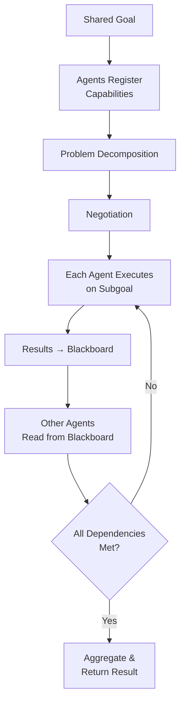

# Cooperative Agents

## Detailed Explanation

Cooperative agents are peer entities that work together as equals to achieve shared goals through negotiation and bidirectional communication. Unlike hierarchical systems where a manager directs workers, cooperative agents autonomously decide when to collaborate, what to ask for, and how to share results. Key mechanisms: (1) shared state (blackboard pattern)—all agents see and update central state, (2) peer communication—agents ask each other for help, negotiate requirements, (3) negotiation protocols—establish agreements before execution, (4) coordination points—synchronization when agents need each other's results. Cooperative systems excel at problems with naturally decomposable subgoals where different agents have different expertise and can make independent decisions. Challenges: (1) deadlock—agent A waits for B, B waits for A; solutions include timeouts and negotiation protocols, (2) communication overhead—O(N²) possible messages between N agents; mitigated by limiting agent count (3-5 agents ideal), (3) inconsistency—agents may have conflicting local states; solved by shared blackboard. Cooperative agents are more flexible than hierarchy (no single point of failure) but require careful coordination to avoid deadlocks and communication chaos. Best for problems where agents are roughly equal in capability and need to negotiate rather than follow orders.

## Core Intuition

Imagine a team of researchers: no one's the boss. Researcher A is stuck on a problem, asks B for help. B says "I can help if you share your data first." They agree, exchange data, B provides insights, A finishes the work. This is cooperation: equals negotiating, helping, making joint decisions. Contrast with hierarchy: manager assigns tasks, workers execute. Cooperation = "Can we work together?" Hierarchy = "I'm assigning you..."

## How It Works

Cooperative agents operate through negotiation and shared blackboard:

1. **Goal Alignment** — Agents agree on shared goals and what counts as success
2. **Agent Registration** — Agents advertise their capabilities ("I do data analysis", "I write code")
3. **Problem Decomposition** — One agent identifies a problem, breaks it into subgoals
4. **Negotiation** — Agents negotiate who does what, what data/format is needed, when
5. **Execution** — Each agent works on assigned subgoal independently
6. **Shared State Updates** — All agents write results to blackboard; others read
7. **Synchronization** — Agents wait for dependent results on blackboard
8. **Aggregation** — Final agent synthesizes all results into answer



## Architecture / Trade-offs

**Communication Model:**
- Centralized (Blackboard) — All agents read/write shared state. Simple but single point of contention.
- Decentralized (Peer-to-peer) — Agents communicate directly. Flexible but O(N²) possible connections.
- Hybrid — Agents use blackboard for state, direct messaging for negotiation.

**Negotiation Strategy:**
- Consensus — All agents must agree. Slow but fair.
- Voting — Majority decides. Fast but risk of minority disagreement.
- Delegation — One agent decides after consulting others. Fast, risk of poor decisions.
- Auction — Agents bid on tasks. Incentive-compatible but complex.

**Agent Count:**
- 2-3 agents — Simple coordination, low communication overhead, limited problem complexity
- 4-5 agents — Good balance, still manageable coordination, clear role specialization
- 6+ agents — Exponential communication complexity, recommend hierarchy instead

**Failure Modes:**
- Deadlock (A waits for B, B waits for A): mitigated by timeouts, partial results
- Starvation (agent never gets needed data): mitigated by priority queues, timeouts
- Inconsistency (agents disagree on shared state): mitigated by locking, versioning

## Interview Q&A

**Q: Cooperative vs Hierarchical agents—when to use which?**
A: Cooperative: agents are equals, problem requires negotiation and joint decisions, no clear manager. Hierarchical: clear decomposition, manager directs, agents are specialists. Cooperative is more flexible (no bottleneck), hierarchical is simpler to coordinate. For "multiple experts need to agree", use cooperative. For "break task and assign", use hierarchical.

**Q: How do you prevent deadlock in cooperative agents?**
A: Deadlock happens when Agent A waits for B's result, B waits for A's result. Prevention: (1) Use timeouts—if waiting >5s, timeout and use partial result, (2) Define negotiation protocol upfront—agree on order before executing, (3) Partial results—agents can proceed with incomplete data, (4) External mediator—if deadlock detected, mediator breaks tie. Example: A needs B's analysis to finalize report. Negotiate first: "I'll start writing section 1, you do analysis, then I'll finish."

**Q: How do you handle conflicting decisions among agents?**
A: Conflicts occur when agents disagree on solution approach. Solutions: (1) Define consensus rules upfront (majority vote, highest-confidence agent), (2) Force re-negotiation—agents explain their position, find compromise, (3) Delegate to arbiter agent—neutral party decides, (4) Use voting with confidence scores—weight votes by agent confidence. Example: two agents disagree on algorithm. Each presents evidence. Vote by evidence quality, not just count.

**Q: What's the communication overhead in cooperative systems?**
A: N agents can have O(N²) pairwise communication. With 3 agents: 6 possible messages. 5 agents: 20 messages. 10 agents: 90 messages. To manage: (1) Limit to 3-5 agents (manageable O(N²)), (2) Use broadcast instead of pairwise (all agents hear one message), (3) Use blackboard (write once, read many—O(N) instead of O(N²)), (4) Group agents into teams, coordinate between teams. For 10+ agents, reconsider architecture—use hierarchy or teams.

**Q: How to implement shared state without race conditions?**
A: Blackboard needs locking to prevent two agents updating simultaneously. Solutions: (1) Optimistic locking—agents write, if conflict, retry, (2) Pessimistic locking—agent locks blackboard section, updates, unlocks, (3) Versioning—each update creates new version; agents read consistent snapshots, (4) Event log—append-only log of updates; agents replay to get consistent state. Simplest: use Python dict with threading.Lock for small systems; for scalability, use versioned database.

**Q: When are cooperative agents better than a single agent with tools?**
A: Single agent pros: simple, no coordination overhead, single LLM call. Single agent cons: might miss solutions using multiple perspectives, can't truly leverage domain expertise. Cooperative pros: multiple perspectives, true domain expertise, robustness. Cooperative cons: coordination overhead, latency. Use cooperative if: (1) problem benefits from multiple specialized views, (2) diversity improves solution quality, (3) agents can work in parallel. Use single agent if: simple problem, latency critical, overhead not worth it.

## Best Practices

1. **Define Shared Goals Upfront** — Before agents start, align on what success looks like. "Build a product recommendation system" → agree on metrics (latency, accuracy, cost).

2. **Limit Agent Count** — Keep to 3-5 agents. Each agent adds communication overhead. For 10+ agents, use hierarchy or teams.

3. **Use Blackboard Pattern** — Central shared state (dict, database). Agents read/write results. Simple O(N) communication, no complex peer-to-peer.

4. **Explicit Capability Advertising** — Each agent declares what it can do: "I do data analysis", "I write code", "I manage infrastructure". Agents match problems to capabilities.

5. **Negotiation Protocol** — Define upfront how agents negotiate. "Agent with capability X asks other agents for permission. 60s timeout for response. Majority vote decides." Prevents chaos.

6. **Timeouts Everywhere** — Waiting for agent response? Timeout after 5s, use partial result. Prevents deadlock and infinite waits.

7. **Partial Results OK** — Agents don't need perfect data to make progress. "I'll proceed with 80% of the data, adjust later if needed." Avoids deadlock.

8. **Version All Updates** — Track who updated what when. If conflict, agents can detect and re-negotiate. "Agent A wrote v1, Agent B updated to v2" → clear history.

9. **Monitor Communication** — Track messages: how many per agent, latency, conflicts. If O(N²) communication gets out of hand, reconsider architecture.

10. **Parallel Execution** — Agents should run in parallel (asyncio). Don't serialize communication; all agents work simultaneously.

## Common Pitfalls

**Pitfall 1: Too Many Agents**
Issue: 10+ agents → O(N²) communication → chaos. Agents spend more time coordinating than solving.
Fix: Keep to 3-5 agents. If more needed, use hierarchy (teams of agents, team leaders coordinate).

**Pitfall 2: Deadlock Not Handled**
Issue: Agent A waits for B, B waits for A. System hangs.
Fix: Add timeouts. "If waiting >5s, timeout and use partial result." Break symmetry in negotiation.

**Pitfall 3: No Shared Goals**
Issue: Agents pull in different directions. Agent A optimizes for speed, B for accuracy. Conflict.
Fix: Align on goals first. "We optimize for accuracy within 5s latency." Clear, shared constraint.

**Pitfall 4: Communication Overhead Not Monitored**
Issue: System becomes slow because agents are spending more time negotiating than solving.
Fix: Log communication. If agents spend >50% time on coordination, problem is too complex for cooperation.

**Pitfall 5: Blackboard Race Conditions**
Issue: Two agents write to blackboard simultaneously. Data corruption.
Fix: Use locking (threading.Lock for small systems) or versioning (database handles multi-writer consistency).

**Pitfall 6: Agents Can't Read/Write Results**
Issue: Agents finish work but forget to update blackboard. Other agents never see results.
Fix: Enforce discipline: "Last line of every agent solve: blackboard[self.name] = result"

**Pitfall 7: No Fallback if Negotiation Fails**
Issue: Agents can't agree on approach. System hangs waiting for consensus.
Fix: Define fallback: "If no consensus after 10s, agent with highest expertise decides." Always have a decision path.

## Code Examples

### Example 1: Basic Cooperative Agents with Blackboard

```python
import asyncio
from typing import Dict, Any

class CooperativeAgent:
    def __init__(self, name: str, specialty: str):
        self.name = name
        self.specialty = specialty
    
    async def solve(self, task: str, blackboard: Dict[str, Any]) -> Dict:
        await asyncio.sleep(0.3)
        result = f"Solution from {self.specialty}: {task[:30]}"
        return {"agent": self.name, "result": result}

class CooperativeSystem:
    def __init__(self, agents: list):
        self.agents = {a.name: a for a in agents}
        self.blackboard = {}
    
    async def collaborate(self, goal: str):
        print(f"Shared Goal: {goal}")
        
        # Agents negotiate and execute in parallel
        tasks = [
            agent.solve(goal, self.blackboard)
            for agent in self.agents.values()
        ]
        results = await asyncio.gather(*tasks)
        
        # Write results to blackboard
        for result in results:
            self.blackboard[result['agent']] = result['result']
            print(f"  {result['agent']}: {result['result']}")
        
        return self.blackboard

# Usage
async def main():
    agents = [
        CooperativeAgent("Alice", "data"),
        CooperativeAgent("Bob", "engineering"),
        CooperativeAgent("Carol", "strategy")
    ]
    system = CooperativeSystem(agents)
    await system.collaborate("Build recommendation system")

asyncio.run(main())
```

### Example 2: Cooperative Agents with Negotiation

```python
class NegotiatingAgent:
    def __init__(self, name: str, specialty: str):
        self.name = name
        self.specialty = specialty
        self.required_data = {}
    
    async def negotiate(self, blackboard: Dict, other_agents: Dict) -> bool:
        """Negotiate with other agents for needed data."""
        # Advertise need
        print(f"{self.name}: I need {self.specialty} data")
        
        # Ask other agents
        for other_name, other_agent in other_agents.items():
            if other_name != self.name and hasattr(other_agent, 'specialty'):
                # Simple negotiation: request format
                print(f"  → Requesting from {other_name}")
                await asyncio.sleep(0.1)
        
        return True
    
    async def solve_with_negotiation(self, goal: str, blackboard: Dict, others: Dict):
        # Negotiate first
        if await self.negotiate(blackboard, others):
            # Then solve
            await asyncio.sleep(0.2)
            result = f"{self.name} solved {goal}"
            blackboard[self.name] = result
            return result
        else:
            print(f"❌ {self.name}: negotiation failed")
            return None

# Negotiation protocol example
class CooperativeSystemWithNegotiation:
    def __init__(self, agents: list):
        self.agents = {a.name: a for a in agents}
        self.blackboard = {}
    
    async def run_with_negotiation(self, goal: str):
        print(f"Goal: {goal}\n1. Negotiation Phase")
        
        # Phase 1: All agents negotiate
        tasks = [
            agent.negotiate(self.blackboard, self.agents)
            for agent in self.agents.values()
        ]
        await asyncio.gather(*tasks)
        
        print("\n2. Execution Phase")
        
        # Phase 2: All agents solve
        tasks = [
            agent.solve_with_negotiation(goal, self.blackboard, self.agents)
            for agent in self.agents.values()
        ]
        results = await asyncio.gather(*tasks)
        
        return results
```

### Example 3: Cooperative Agents with Conflict Resolution

```python
from enum import Enum

class ConflictResolutionStrategy(Enum):
    MAJORITY_VOTE = 1
    CONFIDENCE_WEIGHTED = 2
    ARBITER = 3

class ConflictResolvingAgent:
    def __init__(self, name: str, specialty: str, confidence: float = 0.5):
        self.name = name
        self.specialty = specialty
        self.confidence = confidence
    
    async def propose_solution(self, goal: str) -> Dict:
        await asyncio.sleep(0.2)
        return {
            "agent": self.name,
            "proposal": f"Approach by {self.specialty}",
            "confidence": self.confidence
        }

class ConflictResolvingSystem:
    def __init__(self, agents: list, strategy: ConflictResolutionStrategy = ConflictResolutionStrategy.MAJORITY_VOTE):
        self.agents = agents
        self.strategy = strategy
    
    async def gather_proposals(self, goal: str) -> list:
        """All agents propose solutions."""
        tasks = [agent.propose_solution(goal) for agent in self.agents]
        return await asyncio.gather(*tasks)
    
    def resolve_conflict(self, proposals: list) -> Dict:
        """Resolve conflicting proposals."""
        if self.strategy == ConflictResolutionStrategy.MAJORITY_VOTE:
            # Simplistic: pick first (in real system, count votes)
            return proposals[0]
        
        elif self.strategy == ConflictResolutionStrategy.CONFIDENCE_WEIGHTED:
            # Pick highest-confidence proposal
            best = max(proposals, key=lambda p: p['confidence'])
            return best
        
        elif self.strategy == ConflictResolutionStrategy.ARBITER:
            # Arbiter (highest confidence agent) decides
            arbiter = max(proposals, key=lambda p: p['confidence'])
            print(f"Arbiter: {arbiter['agent']} decides")
            return arbiter
    
    async def run(self, goal: str):
        print(f"Goal: {goal}")
        proposals = await self.gather_proposals(goal)
        
        print("\nProposals:")
        for p in proposals:
            print(f"  {p['agent']}: {p['proposal']} (confidence: {p['confidence']})")
        
        final = self.resolve_conflict(proposals)
        print(f"\nFinal Decision: {final['agent']}'s approach")
        return final

# Usage
async def main():
    agents = [
        ConflictResolvingAgent("Alice", "data", confidence=0.9),
        ConflictResolvingAgent("Bob", "engineering", confidence=0.7),
        ConflictResolvingAgent("Carol", "strategy", confidence=0.8)
    ]
    system = ConflictResolvingSystem(agents, ConflictResolutionStrategy.CONFIDENCE_WEIGHTED)
    await system.run("Design new system")

asyncio.run(main())
```

## Related Concepts

- **Hierarchical Agents** — Top-down alternative to peer cooperation
- **Multi-Agent Systems** — Broader patterns for agent coordination
- **Agent Communication** — Protocols for peer-to-peer messaging
- **Skill Composition** — How agents combine capabilities

