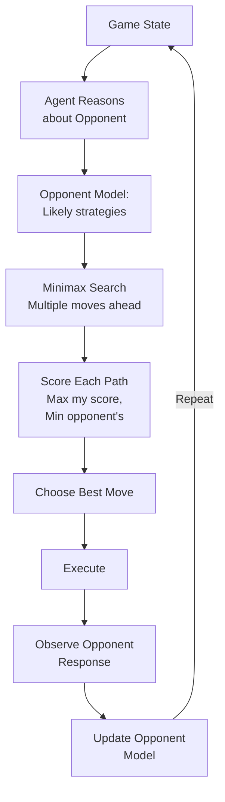

# Competitive Agents

## Detailed Explanation

Competitive agents operate in adversarial environments where success of one agent reduces payoff for others (zero-sum or negative-sum games). Unlike cooperative agents that share goals, competitive agents have conflicting objectives. Examples: (1) game playing (chess AI competing against opponent), (2) auction systems (bidders compete for items), (3) market simulation (trading agents compete for profit), (4) adversarial examples (one agent generates attacks, another defends). Key mechanisms: (1) game-theoretic analysis—understand opponent strategy, find best response, (2) minimax search—maximize your score while minimizing opponent's, (3) equilibrium—find stable strategies where neither player improves by deviating, (4) simulation—predict opponent moves multiple steps ahead. Competitive systems are harder to analyze than cooperative because opponent's strategy is unknown and adaptive. Solutions: (1) assume rational opponent (plays optimally), (2) use Nash equilibrium (mutual best response), (3) model uncertainty (opponent's strategy is probabilistic), (4) adaptive learning—update model of opponent as game progresses. Applications: (1) game AI (chess, Go, poker), (2) security (red team vs blue team), (3) resource allocation (agents competing for limited resources), (4) pricing strategies (competing businesses adjust prices). Best for problems with clear win/loss conditions, known rules, and where LLM needs to outsmart adversary.

## Core Intuition

Imagine two chess players: each trying to win, knowing the other is trying to win. Not cooperating; directly competing. Each thinks "What will opponent do? What's my best response?" Player A plays move X; Player B responds with move Y that counters X. Back and forth. Competitive agents work the same way: reason about opponent's strategy, find your best counter-strategy, anticipate opponent's adaptation. Pure competition: your gain is opponent's loss.

## How It Works

Competitive agents operate through game-theoretic reasoning and adversarial search:

1. **Game Setup** — Define game rules, possible actions, payoff function (who wins/loses)
2. **Opponent Modeling** — Build model of how opponent will play (rational, random, greedy)
3. **Lookahead Search** — Simulate multiple moves ahead (my move → opponent's response → my counter)
4. **Evaluation** — Score each outcome (how many points for me? opponent?)
5. **Best Response** — Choose action that maximizes my payoff assuming opponent responds optimally
6. **Adaptation** — As opponent plays, update model of their strategy
7. **Execute and Observe** — Play move; see opponent's response; update beliefs



## Architecture / Trade-offs

**Opponent Model:**
- Deterministic (opponent always plays optimally) — Simpler analysis, unrealistic
- Stochastic (opponent plays with probabilities) — Realistic, more complex
- Adaptive (opponent learns as game progresses) — Most realistic, hardest to analyze

**Lookahead Depth:**
- Shallow (1-2 moves ahead) — Fast computation, potentially suboptimal play
- Deep (5-10 moves ahead) — Strong play, slower computation
- Very Deep (20+ moves ahead) — Near-optimal but may be too slow for real-time

**Evaluation Strategy:**
- Minimax — Max your score, min opponent's simultaneously
- Alpha-beta Pruning — Minimax with cutoffs; ignore branches opponent won't allow
- Monte Carlo Tree Search — Sample random playouts; weight by results

**Learning:**
- Static (same strategy all game) — Simple, predictable
- Adaptive (learn opponent's style) — Stronger but requires data
- Self-play (train against yourself) — Very strong but expensive

## Interview Q&A

**Q: Competitive agents vs cooperative agents—difference?**
A: Cooperative: shared goals, agents help each other. Competitive: opposing goals, agents try to outsmart each other. Competitive is game-theoretic (think multiple moves ahead, model opponent). Use competitive for adversarial scenarios (security, games, negotiation where parties have conflicting interests).

**Q: What's minimax and why is it used?**
A: Minimax = "maximize your score, minimize opponent's score simultaneously." Used in game AI to find best move assuming opponent also plays optimally. Example: chess. You evaluate a move by: if I play X, opponent plays their best response Y, then I play my best response to Y, etc. Minimax explores this tree, scoring leaf nodes (game end), propagating scores up (max for my turn, min for opponent's turn), finding the best move. Works for perfect-information games (both players see all state).

**Q: How to handle imperfect information (opponent's hidden state)?**
A: In perfect information (chess), you know all state. In imperfect information (poker, negotiation), opponent has hidden info. Solutions: (1) Monte Carlo sampling—simulate opponent's hidden state according to belief distribution, (2) Regret minimization—play strategies that minimize regret if wrong about opponent state, (3) Game theory—use mixed strategies (randomize), which are robust to opponent knowing your strategy. Imperfect information games are much harder; minimax doesn't directly work.

**Q: How do you prevent being exploited by adapting opponent?**
A: If opponent learns your strategy and adapts, you need to adapt too. But if opponent keeps adapting, you're in arms race. Solutions: (1) Unpredictability—randomize strategy (opponent can't predict), (2) Robustness—play strategy that's good against many opponent models, not just one, (3) Meta-learning—learn to learn the opponent's learning strategy, (4) commitment—announce strategy, then commit (opponent can't exploit you if they know in advance, they just avoid you). Example: pricing in auction. Don't always bid same amount; randomize. Don't always accept first offer; sometimes walk away.

**Q: What's Nash Equilibrium and when is it relevant?**
A: Nash Equilibrium = strategy where neither player improves by unilaterally changing (mutual best response). Example: In Prisoner's Dilemma, both defect = Nash Eq (neither benefits from switching unilaterally). Relevant when: (1) game is played repeatedly (agents learn equilibrium), (2) agents are rational (play best response), (3) you want stable outcome. Not relevant when: agents are learning (haven't reached equilibrium yet), or you want to exploit non-rational opponent (Nash Eq assumes rationality). Computing Nash Eq is hard for large games; often approximated or solved for specific game structures.

**Q: How do you model and update opponent strategy?**
A: Start with prior (e.g., "opponent plays randomly"). After observing moves, update posterior (e.g., "opponent prefers aggressive strategy based on last 5 moves"). Methods: (1) Bayesian update—prior + observed moves → posterior, (2) Frequency counting—count opponent's actions, estimate probabilities, (3) Temporal window—recent moves matter more than old ones, (4) Clustering—group opponent moves into strategy clusters (aggressive, defensive, balanced). Update continuously as game progresses. Use updated model to predict next move.

**Q: When should you choose competition over cooperation?**
A: Competition: opposing goals, win/loss condition, zero-sum (my gain = opponent's loss), adversarial setting (security, games, negotiation over scarce resources). Cooperation: aligned goals, shared success, non-zero-sum (both can win). In practice: hybrid. Example: Business negotiation. You and opponent have competing interests (price), but both want deal. Cooperate on non-essential terms (payment schedule), compete on price. Identify overlap (win-win) and conflict (win-lose) explicitly.

## Best Practices

1. **Model Opponent Explicitly** — Don't assume opponent is black-box. Build model: "opponent prefers aggressive strategy", "opponent has budget limit X", "opponent values fairness". Update model continuously.

2. **Lookahead Bounded** — Don't search infinitely. Set depth limit (e.g., 5-10 moves for real-time games). Balance computational cost vs solution quality.

3. **Evaluate Positions Carefully** — Scoring function determines strategy. Chess evaluates material (pieces captured); poker evaluates expected winnings; auction evaluates profit. Wrong scoring = bad play.

4. **Use Alpha-Beta Pruning** — Standard optimization for minimax. Ignore branches opponent won't allow (because they have better options). Cuts search time dramatically.

5. **Adapt as Opponent Adapts** — Don't stick to static strategy. Learn opponent's patterns. If opponent learns your patterns, randomize or shift strategy.

6. **Handle Imperfect Information** — If opponent has hidden state, sample/simulate. Don't assume full observability.

7. **Test Against Multiple Opponents** — Train against one opponent style, you overfit. Test against: random agents, defensive agents, aggressive agents, adaptive agents.

8. **Exploit Non-Rationality** — If opponent isn't rational (makes mistakes, emotional reactions), exploit it. If they overcommit to strategy, punish. If they're unpredictable, play defensive.

9. **Commitment and Credibility** — Sometimes credibly committing to strategy makes you stronger. "I will not negotiate on price" (if credible). Opponent adapts expecting you won't budge.

10. **Time-Bounded Decisions** — Real-time games require fast decisions. Use iterative deepening: return best move found so far when time runs out.

## Common Pitfalls

**Pitfall 1: Assuming Opponent is Rational**
Issue: Opponent doesn't play optimally. You plan for rational opponent; actual opponent does something dumb; you're not prepared.
Fix: Build robust strategy that works against multiple opponent types (rational, random, aggressive, defensive). Test against various opponent models.

**Pitfall 2: Static Strategy**
Issue: You commit to strategy; opponent learns it and exploits it.
Fix: Randomize or adapt. If opponent learns you always bid high, sometimes bid low. Keep opponent guessing.

**Pitfall 3: Shallow Lookahead**
Issue: You only think 1 move ahead. Opponent thinks 5 moves ahead and outsmarts you.
Fix: Increase lookahead depth. Trade off computation time vs strategy strength. At minimum, think 3-5 moves ahead.

**Pitfall 4: Bad Evaluation Function**
Issue: You score positions incorrectly. Your agent optimizes for wrong metric.
Fix: Validate evaluation function. Test: "If evaluation says position A is better, do you actually win more in A?" If not, evaluation is wrong.

**Pitfall 5: No Opponent Modeling**
Issue: Treat opponent as black-box. Don't learn their strategy.
Fix: Observe opponent's moves. Build distribution over their strategies. Update as you learn. Use posterior for planning.

**Pitfall 6: Overthinking (Analysis Paralysis)**
Issue: You explore too many moves, take too long to decide. Real-time game passes you by.
Fix: Time-bound search. Return best move found after N seconds. Iterative deepening: start shallow, deepen if time permits.

**Pitfall 7: Ignoring Hidden Information**
Issue: Game has hidden state (opponent's hand, hidden objectives). You assume full observability.
Fix: Model uncertainty. Sample opponent's hidden state according to belief. Update belief as more info revealed.

**Pitfall 8: Exploiting vs Exploring**
Issue: You find strategy that beats current opponent; you always play it. Opponent adapts; you're now exploitable.
Fix: Balance: exploit winning strategy (70% of time) vs explore alternatives (30% of time). Keep opponent uncertain.

## Code Examples

### Example 1: Basic Minimax Agent

```python
class GameState:
    def __init__(self, position, is_maximizing_player_turn=True):
        self.position = position
        self.is_max_turn = is_maximizing_player_turn
    
    def get_possible_moves(self):
        # Return list of possible next positions
        return [self.position + 1, self.position - 1, self.position * 2]
    
    def evaluate(self):
        # Return score (higher = better for max player)
        return abs(self.position - 10)

class MinimaxAgent:
    def __init__(self, max_depth=5):
        self.max_depth = max_depth
    
    def minimax(self, state: GameState, depth: int) -> tuple:
        """Returns (best_score, best_move)"""
        
        # Terminal node or max depth
        if depth == 0:
            return (state.evaluate(), None)
        
        if state.is_max_turn:
            # Maximizing player: choose move that maximizes score
            best_score = float('-inf')
            best_move = None
            
            for move in state.get_possible_moves():
                new_state = GameState(move, is_maximizing_player_turn=False)
                score, _ = self.minimax(new_state, depth - 1)
                
                if score > best_score:
                    best_score = score
                    best_move = move
            
            return (best_score, best_move)
        else:
            # Minimizing player: choose move that minimizes score
            best_score = float('inf')
            best_move = None
            
            for move in state.get_possible_moves():
                new_state = GameState(move, is_maximizing_player_turn=True)
                score, _ = self.minimax(new_state, depth - 1)
                
                if score < best_score:
                    best_score = score
                    best_move = move
            
            return (best_score, best_move)
    
    def get_best_move(self, state: GameState):
        _, best_move = self.minimax(state, self.max_depth)
        return best_move

# Usage
agent = MinimaxAgent(max_depth=4)
state = GameState(position=5)
move = agent.get_best_move(state)
print(f"Best move: {move}")
```

### Example 2: Opponent Modeling and Adaptation

```python
from collections import defaultdict

class OpponentModel:
    def __init__(self):
        self.move_history = []
        self.move_counts = defaultdict(int)
    
    def update(self, move):
        """Observe opponent's move and update model."""
        self.move_history.append(move)
        self.move_counts[move] += 1
    
    def get_most_likely_move(self):
        """Predict opponent's next move."""
        if not self.move_counts:
            return None
        return max(self.move_counts, key=self.move_counts.get)
    
    def get_move_distribution(self):
        """Get probability distribution over moves."""
        total = sum(self.move_counts.values())
        return {move: count / total for move, count in self.move_counts.items()}

class AdaptiveCompetitiveAgent:
    def __init__(self):
        self.opponent_model = OpponentModel()
        self.my_moves = []
    
    def choose_move(self, possible_moves):
        """Choose move based on opponent model."""
        opponent_likely_move = self.opponent_model.get_most_likely_move()
        
        if opponent_likely_move is None:
            # No history; play randomly
            return possible_moves[0]
        
        # Choose move that counters opponent's likely move
        best_move = None
        for move in possible_moves:
            # Evaluate: if I play move, what's my expected payoff?
            # Assuming opponent plays their likely move
            payoff = self.evaluate_outcome(move, opponent_likely_move)
            if best_move is None or payoff > self.evaluate_outcome(best_move, opponent_likely_move):
                best_move = move
        
        return best_move
    
    def evaluate_outcome(self, my_move, opponent_move):
        """Score outcome of my_move vs opponent_move."""
        # Simplified: higher is better
        return my_move - opponent_move
    
    def play_round(self, possible_moves):
        move = self.choose_move(possible_moves)
        self.my_moves.append(move)
        return move
    
    def observe_opponent(self, opponent_move):
        self.opponent_model.update(opponent_move)

# Usage: play multiple rounds
agent = AdaptiveCompetitiveAgent()
opponent_moves = [1, 2, 1, 1, 3, 1]  # Opponent's sequence
my_moves = [2, 1, 2, 1, 2, 2]

for my_move, opp_move in zip(my_moves, opponent_moves):
    print(f"Round: Me={my_move}, Opponent={opp_move}")
    agent.observe_opponent(opp_move)

print(f"Final opponent model: {agent.opponent_model.get_move_distribution()}")
```

### Example 3: Monte Carlo Tree Search (Competitive Version)

```python
import random
from math import sqrt

class MCTSNode:
    def __init__(self, state, parent=None):
        self.state = state
        self.parent = parent
        self.children = []
        self.visits = 0
        self.value = 0
    
    def ucb_score(self, exploration=1.41):
        """Upper Confidence Bound: balances exploitation vs exploration."""
        if self.visits == 0:
            return float('inf')
        
        exploitation = self.value / self.visits
        exploration_term = exploration * sqrt(log(self.parent.visits) / self.visits)
        return exploitation + exploration_term
    
    def select_child(self):
        """Select child with highest UCB score."""
        return max(self.children, key=lambda c: c.ucb_score())

class MCTSCompetitiveAgent:
    def __init__(self, num_simulations=1000):
        self.num_simulations = num_simulations
    
    def search(self, root_state):
        """Run MCTS: selection, expansion, simulation, backprop."""
        root = MCTSNode(root_state)
        
        for _ in range(self.num_simulations):
            node = root
            
            # Selection: traverse tree using UCB
            while node.children:
                node = node.select_child()
            
            # Expansion: add child if not fully explored
            if node.visits > 0 and len(node.children) < len(node.state.get_possible_moves()):
                move = self._select_unexplored_move(node)
                new_state = node.state.apply_move(move)
                child = MCTSNode(new_state, parent=node)
                node.children.append(child)
                node = child
            
            # Simulation: random playout from node
            value = self._simulate_random_playout(node.state)
            
            # Backprop: update ancestors
            while node is not None:
                node.visits += 1
                node.value += value
                node = node.parent
        
        # Return best move (most visited child)
        best_child = max(root.children, key=lambda c: c.visits)
        return best_child.state
    
    def _select_unexplored_move(self, node):
        explored_moves = [child.state for child in node.children]
        for move in node.state.get_possible_moves():
            if move not in explored_moves:
                return move
    
    def _simulate_random_playout(self, state):
        """Simulate game to end with random moves."""
        current = state
        for _ in range(10):  # Random depth
            possible = current.get_possible_moves()
            if not possible:
                break
            current = current.apply_move(random.choice(possible))
        return current.evaluate()
```

## Related Concepts

- **Game Theory** — Mathematical foundation for competitive analysis
- **Minimax Search** — Core algorithm for two-player zero-sum games
- **MCTS (Monte Carlo Tree Search)** — Simulation-based search for competitive domains
- **Adversarial Examples** — Security context of competitive agents
- **Reinforcement Learning** — Learning optimal strategy through play

