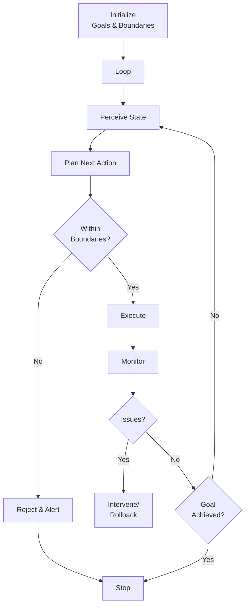

# Autonomous Agents

## Detailed Explanation

Autonomous agents operate without human supervision in closed loops: perceive environment → plan → execute → perceive feedback → repeat. Core challenge: without human oversight, mistakes compound (one error triggers chain of bad decisions). Safety mechanisms: (1) bounded autonomy—agent can only do certain actions (can't delete, only read), (2) monitoring—human watches and can intervene, (3) boundaries—explicit limits (budget cap, time limit), (4) rollback—easily undo last N actions. Levels of autonomy: (1) fully manual (user does everything), (2) assisted (agent suggests, user approves), (3) delegated (agent decides, user reviews logs), (4) autonomous (agent decides, no approval needed, human monitors), (5) full autonomy (no human involvement). Trade-off: more autonomy = faster but riskier (mistakes compound), less autonomy = safer but slower (bottleneck on human). Examples: trading bots (autonomous, high risk), customer support bots (delegated, moderate risk), content moderation (assisted, low risk). Best for: high-volume tasks (thousands per day), low-risk domains (recommendations not medical), well-defined domains (agent won't encounter surprises).

## Core Intuition

Hire an employee to work alone overnight without supervision. You trust them, but not completely. You set boundaries: "You can approve invoices under $1000, but above that, leave for me to review tomorrow." You check logs in morning. If they made mistakes, you fix and retrain. Autonomous agents are similar: trusted but bounded, with monitoring and easy rollback.

## How It Works

Autonomous agents operate through perception-planning-execution loops with safety boundaries:

1. **Initialization** — Set agent goals, boundaries, success criteria
2. **Perception** — Agent observes state (metrics, events, tasks)
3. **Planning** — Agent decides next action(s)
4. **Execution** — Agent takes action(s) within boundaries
5. **Monitoring** — Human or automated system watches for issues
6. **Feedback** — Agent receives outcome, updates internal state
7. **Loop** — Repeat until goal achieved or boundary hit



## Architecture / Trade-offs

**Autonomy Level:**
- **Assisted** — Agent suggests, human approves every action
- **Delegated** — Agent acts, human reviews logs periodically
- **Autonomous** — Agent acts freely within bounds, human monitors metrics
- **Full** — No human involvement at all (risky without perfect safety)

**Boundaries:**
- **Action constraints** — Agent can only do X, not Y
- **Budget constraints** — Can't spend more than $1000/day
- **Time constraints** — Must complete in 1 hour
- **Data constraints** — Can only access certain data
- **Combined** — Multiple constraints together

**Monitoring:**
- **Metrics-based** — Monitor key metrics, alert if anomaly
- **Log-based** — Review action logs periodically
- **Real-time** — Stream data to human, intervene if needed
- **Sampling** — Review 1% of actions, assume rest OK

**Rollback:**
- **Action-level** — Undo last action only
- **Session-level** — Undo all actions in current session
- **Checkpoint** — Save checkpoints, rollback to known good state

## Interview Q&A

**Q: How do you safely make agents autonomous?**
A: Don't. Always have supervision mechanism. (1) Bounded action space (restrict dangerous actions), (2) Budget limits (cap spending/impact), (3) Monitoring (watch metrics), (4) Logging (record all decisions), (5) Rollback (easily undo). Perfect safety is impossible; aim for "when things go wrong, we catch and fix quickly."

**Q: What's the difference between autonomous and just a scheduled job?**
A: Scheduled job runs same thing on schedule. Autonomous agent adapts to environment, makes decisions, responds to anomalies. Agent is reactive; job is static. Example: scheduled job sends email at 9am. Autonomous agent decides IF to send, WHEN, WHAT content.

**Q: How do you prevent autonomous agents from making mistakes?**
A: You don't completely. Prevention: (1) validation (check decisions before executing), (2) diversity (try multiple strategies, pick best), (3) conservatism (bias toward inaction), (4) monitoring (catch errors early). Recovery: (1) logging (understand what went wrong), (2) rollback (undo), (3) retrain (improve agent).

**Q: When should you intervene in autonomous agent?**
A: (1) Metrics anomaly (success rate dropped), (2) Decision outside norms (agent chose rarely-chosen action), (3) High-cost decision (big impact), (4) Failure detection (agent explicitly failed). Don't intervene on every decision; that's not autonomy.

**Q: How do you test autonomous agents?**
A: (1) Simulation (test in safe environment with fake data), (2) Canary rollout (deploy to 1% of traffic, monitor), (3) Limits (set tight boundaries initially, loosen as confidence grows), (4) Adversarial (try to break it), (5) Rollback readiness (ensure rollback works before deploying).

**Q: What's the cost of autonomy in terms of latency vs safety?**
A: More autonomy → faster (no human approval needed) but riskier. Assisted (humans approve everything) is slowest but safest. Find right balance for domain. E.g., trading: high autonomy (milliseconds matter). Customer support: delegated (hours for human review).

## Best Practices

1. **Start Conservative** — Initialize agent with narrow scope. Gradually expand as confidence grows.

2. **Explicit Boundaries** — Define clearly: "Agent can approve orders <$500, not >$500." Ambiguity = mistakes.

3. **Comprehensive Logging** — Log every decision with reasoning. "Why did you approve this? Reason: customer has 5-year history, no returns."

4. **Monitoring Dashboard** — Real-time view of agent activity. Key metrics, anomaly alerts.

5. **Easy Rollback** — Ensure quick undo. "Undo last 10 actions" should be one click.

6. **Regular Audits** — Weekly review of agent decisions. Sample 5-10 random decisions, check if reasonable.

7. **Human-Agent Handoff** — Define when agent escalates to human. "If confidence <70%, escalate."

8. **Version Control** — Track agent versions. "Agent v2.3 from June 2024." Easy to revert if v2.4 has issues.

9. **Testing Culture** — Always test in simulation first. Mistakes in simulation are free.

10. **Transparency** — When agent makes decision affecting user, explain why. Builds trust.

## Common Pitfalls

**Pitfall 1: Too Much Autonomy Too Fast**
Issue: Agent runs wild, makes many mistakes, hard to undo.
Fix: Incremental autonomy. Start with assisted, move to delegated, then autonomous.

**Pitfall 2: Unclear Boundaries**
Issue: "Agent can approve invoices" is vague. Does it include international? Recurring? Disputed?
Fix: Precise boundaries: "Invoices <$500, domestic, non-disputed, payment >30 days."

**Pitfall 3: No Monitoring**
Issue: Agent runs autonomously, makes mistakes, no one notices for a week. Compounded damage.
Fix: Real-time monitoring. Key metrics visible. Automatic alerts on anomalies.

**Pitfall 4: Expensive Mistakes**
Issue: Agent autonomous in high-impact domain (deletion, spending). One bug = disaster.
Fix: Constrain impact. "Delete only documents <1 week old." "Spend max $100/day."

**Pitfall 5: Hard to Rollback**
Issue: Need to undo agent's actions but it's complicated (interdependencies, cascading changes).
Fix: Design for rollback upfront. Log atomic operations. Enable undo.

**Pitfall 6: No Auditing**
Issue: Agent running for months, no one checking decisions. Drifts from intended behavior.
Fix: Regular audits. Monthly review of sample decisions.

**Pitfall 7: Agent Learns Bad Behavior**
Issue: Agent tries something risky, it works once, learns "this works." Does it again, fails.
Fix: Reflection constraints. "Don't learn from outlier successes." Require statistical significance.

## Code Examples

### Example 1: Bounded Autonomous Agent

```python
from enum import Enum
from typing import List

class ApprovalStatus(Enum):
    AUTO_APPROVED = "auto"
    AUTO_REJECTED = "auto_reject"
    ESCALATED = "escalate"

class BoundedAutonomousAgent:
    def __init__(self, max_amount: float = 500, confidence_threshold: float = 0.8):
        self.max_amount = max_amount
        self.confidence_threshold = confidence_threshold
        self.decisions = []
    
    def decide(self, request: dict) -> ApprovalStatus:
        """Decide on approval request within boundaries."""
        amount = request.get("amount", 0)
        confidence = request.get("confidence", 0)
        customer_history = request.get("customer_history", {})
        
        # Boundary 1: amount limit
        if amount > self.max_amount:
            self.log_decision(request, ApprovalStatus.ESCALATED, "Amount exceeds limit")
            return ApprovalStatus.ESCALATED
        
        # Boundary 2: confidence threshold
        if confidence < self.confidence_threshold:
            self.log_decision(request, ApprovalStatus.ESCALATED, "Low confidence")
            return ApprovalStatus.ESCALATED
        
        # Boundary 3: customer risk
        if customer_history.get("chargeback_rate", 0) > 0.1:
            self.log_decision(request, ApprovalStatus.ESCALATED, "High chargeback customer")
            return ApprovalStatus.ESCALATED
        
        # All boundaries passed: auto-approve
        self.log_decision(request, ApprovalStatus.AUTO_APPROVED, "Passed all checks")
        return ApprovalStatus.AUTO_APPROVED
    
    def log_decision(self, request: dict, status: ApprovalStatus, reason: str):
        """Log decision for auditing."""
        self.decisions.append({
            "request_id": request.get("id"),
            "amount": request.get("amount"),
            "status": status.value,
            "reason": reason
        })
    
    def audit(self) -> dict:
        """Audit decisions."""
        auto_approved = sum(1 for d in self.decisions if d["status"] == "auto")
        escalated = sum(1 for d in self.decisions if d["status"] == "escalate")
        return {
            "total": len(self.decisions),
            "auto_approved": auto_approved,
            "escalated": escalated,
            "approval_rate": auto_approved / (len(self.decisions) + 1)
        }

# Usage
agent = BoundedAutonomousAgent(max_amount=500)
requests = [
    {"id": 1, "amount": 100, "confidence": 0.9, "customer_history": {"chargeback_rate": 0.01}},
    {"id": 2, "amount": 600, "confidence": 0.95, "customer_history": {"chargeback_rate": 0.01}},
]

for req in requests:
    status = agent.decide(req)
    print(f"Request {req['id']}: {status.value}")

audit = agent.audit()
print(f"\nAudit: {audit['approval_rate']:.0%} auto-approval")
```

### Example 2: Agent with Rollback

```python
from dataclasses import dataclass

@dataclass
class Action:
    action_type: str
    data: dict
    timestamp: str

class RollbackableAgent:
    def __init__(self):
        self.actions = []  # Action history
        self.state = {}
    
    def execute_action(self, action_type: str, data: dict) -> bool:
        """Execute action and log it."""
        action = Action(action_type, data, str(datetime.now()))
        
        try:
            if action_type == "approve":
                self.state[f"approved_{data['id']}"] = True
            elif action_type == "send_email":
                self.state[f"emailed_{data['user_id']}"] = True
            
            self.actions.append(action)
            return True
        except Exception as e:
            print(f"Action failed: {e}")
            return False
    
    def rollback(self, num_actions: int = 1) -> int:
        """Undo last N actions."""
        undone = 0
        for _ in range(num_actions):
            if self.actions:
                action = self.actions.pop()
                # Undo the action
                if action.action_type == "approve":
                    self.state.pop(f"approved_{action.data['id']}", None)
                undone += 1
        return undone
    
    def get_state(self):
        """Return current state."""
        return self.state

# Usage
from datetime import datetime
agent = RollbackableAgent()
agent.execute_action("approve", {"id": "order_1"})
agent.execute_action("send_email", {"user_id": "user_1"})
print(f"State after actions: {agent.get_state()}")

agent.rollback(num_actions=1)
print(f"State after rollback: {agent.get_state()}")
```

### Example 3: Monitoring and Alerting

```python
class MonitoredAutonomousAgent(BoundedAutonomousAgent):
    def __init__(self, *args, **kwargs):
        super().__init__(*args, **kwargs)
        self.metrics = {
            "approval_rate": 0.7,
            "avg_amount": 300,
            "error_count": 0
        }
    
    def update_metrics(self):
        """Update metrics from decisions."""
        if not self.decisions:
            return
        
        auto = sum(1 for d in self.decisions if d["status"] == "auto")
        self.metrics["approval_rate"] = auto / len(self.decisions)
        self.metrics["avg_amount"] = sum(d["amount"] for d in self.decisions) / len(self.decisions)
    
    def check_anomalies(self) -> List[str]:
        """Detect anomalies in agent behavior."""
        alerts = []
        
        if self.metrics["approval_rate"] > 0.9:
            alerts.append("Approval rate unusually high (>90%)")
        if self.metrics["approval_rate"] < 0.3:
            alerts.append("Approval rate unusually low (<30%)")
        if self.metrics["error_count"] > 5:
            alerts.append("High error count")
        
        return alerts

# Usage
agent = MonitoredAutonomousAgent(max_amount=500)
agent.decide({"id": 1, "amount": 100, "confidence": 0.95, "customer_history": {"chargeback_rate": 0.01}})
agent.update_metrics()
anomalies = agent.check_anomalies()
print(f"Alerts: {anomalies if anomalies else 'None'}")
```

## Related Concepts

- **Error Recovery** — Handling agent failures gracefully
- **Monitoring** — Detecting anomalies in agent behavior
- **Safety Alignment** — Ensuring agent stays safe
- **Agent Loops** — The perception-action loop
- **Human-Agent Collaboration** — When agent escalates to human
