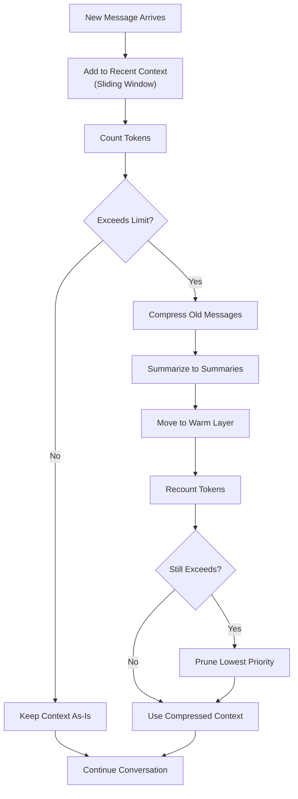
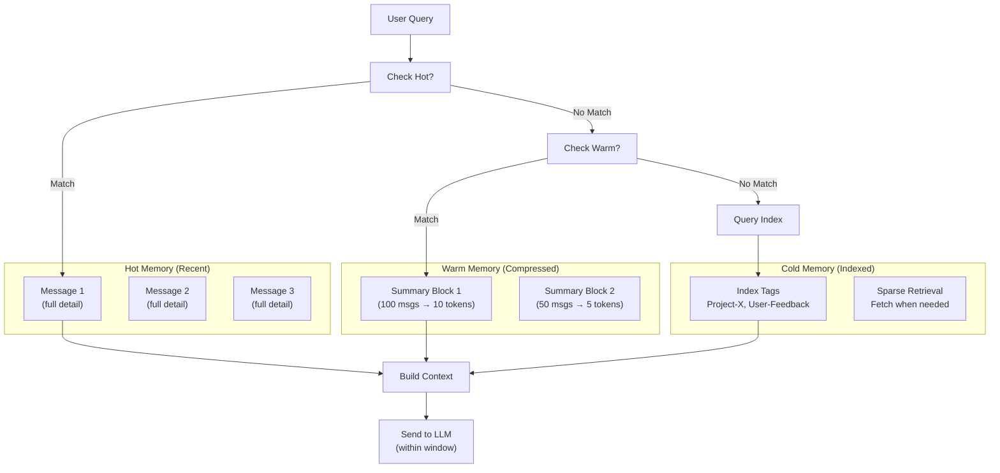

# Context Window Management in Agents

## Detailed Explanation

Context window management addresses a fundamental limitation of language models: finite token budgets (4K for older models, 200K+ for modern ones). In multi-turn agent conversations, message history accumulates rapidly—100+ turns is common. Without active management, the conversation will exceed the model's context window, causing errors or forcing truncation. Context management strategies—summarization, pruning, hierarchical retrieval, and sliding windows—allow agents to maintain longer conversations while staying within token limits. The key challenge is preserving critical information while compressing less important details. A poorly summarized context loses nuance needed for reasoning; aggressive pruning might remove facts the agent needs later. Production agents implement multiple strategies simultaneously: keeping recent messages verbatim (sliding window), summarizing older blocks (compression), ranking messages by importance (selective inclusion), and retrieving only relevant facts when needed (RAG-style retrieval). The goal is to maintain enough context for good reasoning while fitting within the model's limitations.

## Core Intuition

Think of a long research project with thousands of notes. You can't review all notes every day—too much. Instead: keep today's notes on your desk (recent context), summarize yesterday's work into a one-page abstract (compressed history), reference the project index to find relevant old notes when needed (retrieval). Agents do the same: keep recent messages full detail, compress older messages into summaries, retrieve from memory only when explicitly needed.

## How It Works

Context management operates through several coordinated strategies:

1. **Sliding Window (Recent Messages)** — Keep the last N messages verbatim. These are fresh and used for immediate reasoning. Typical value: 5-20 messages depending on model and task.

2. **Summarization of Historical Context** — Compress old messages into summaries. Technique: "Summarize this conversation in 3-5 key points." Trade-off: faster token usage vs losing nuance.

3. **Hierarchical Memory** — Organize context in layers. Hot layer (recent, full detail), warm layer (compressed summaries), cold layer (only metadata/references). Access hot → warm → cold as needed.

4. **Importance Ranking & Pruning** — Score messages by importance (mentioned in recent context, user explicitly marked important, contains unique information). Remove low-scoring old messages first.

5. **Sparse Retrieval (RAG-style)** — Instead of keeping all history, index messages and only retrieve relevant ones. When user asks about "Project X," fetch only messages mentioning "Project X."

6. **Token Counting & Budget Allocation** — Count tokens used by each message, track total. When approaching limit, trim according to priority (recent > important > old).

7. **Context Refresh & Re-summarization** — Periodically re-summarize as new information arrives. Old summary becomes "stale knowledge," new summary incorporates recent events.

**Context Management Flow:**


## Architecture / Trade-offs

**Key Strategies & Trade-offs:**

1. **Sliding Window vs Hierarchical Memory**
   - Sliding Window: Simple, predictable, ~30-50% token savings (keeps recent messages)
   - Hierarchical: Complex, adaptive, ~70-90% savings (keeps recent + compressed + indexed)
   - Trade-off: Simplicity vs compression efficiency

2. **Summarization vs Information Loss**
   - Aggressive summarization (compress 50 messages to 5 lines): 95% token reduction, high info loss
   - Gentle summarization (compress with key details): 70% reduction, low info loss
   - Trade-off: Token budget vs reasoning quality

3. **Retrieval-Based vs Static Context**
   - Static: Keep fixed context window, fast, predictable
   - Retrieval-based: Dynamically fetch relevant memories, adaptive, requires indexing overhead
   - Trade-off: Latency vs contextual relevance

**Architecture Diagram:**


**Trade-off Matrix:**
- **Low compression, High quality:** Keep 20 recent messages (token-heavy, high accuracy)
- **Medium compression, Medium quality:** Keep 10 recent + 1 summary (balanced)
- **High compression, Lower quality:** Keep 5 recent + 2 summaries + retrieval (token-efficient, potential accuracy loss)

## Interview Q&A

**Q: A conversation has grown to 10,000 tokens. The model's context window is 4K. How would you handle this?**
A: Multi-layered approach: (1) Keep last 10 messages verbatim (~1500 tokens), (2) Summarize messages 11-50 into a compact summary (~500 tokens), (3) Create metadata summary of messages 51+ (only topic tags, ~100 tokens). This keeps important recent context and critical info from older messages while staying within the 4K limit. If still over budget, prune oldest summaries or use sparse retrieval—only fetch messages relevant to the current query.

**Q: Why not just use a larger context window (200K tokens)?**
A: Cost and latency. Larger windows = longer processing time (quadratic in some implementations), higher API costs (charged by token), and increased latency. A 200K window might take 5-10 seconds to process. For real-time agents, this is unacceptable. Context management trades off some memory capacity for speed and cost efficiency. You get 98% of the benefit with 20% of the cost by using smart compression instead of brute-force larger windows.

**Q: How do you decide what to summarize vs keep verbatim?**
A: Use recency + importance scoring. Scoring formula: `score = recency_weight * (time_since_message) + importance_weight * (explicit_importance_tag + mention_frequency)`. Keep high-scoring messages recent (verbatim), summarize medium-scoring ones, prune low-scoring. For example: recent user queries always kept, responses to those queries summarized if old, meta-commentary pruned. This preserves critical context while shedding low-value noise.

**Q: What's the latency impact of summarization? Doesn't summarizing cost tokens too?**
A: Yes, but worthwhile trade-off. Summarizing 50 messages (4000 tokens) into a 200-token summary costs ~500 tokens for the summarization call, but then saves ~3800 tokens on every subsequent message. After 2-3 more messages, you've recovered the cost. For long conversations (50+ turns), summarization pays for itself. For short conversations (5 turns), skip summarization—keep all messages.

**Q: How do you handle user asking about something from 50 messages ago after summarization?**
A: This is the key challenge. Solutions: (1) Keep summaries detailed enough to capture critical info (works 80% of the time), (2) Index old messages and retrieve relevant ones when user asks (requires extra API call but recovers full context), (3) Versioned summaries—keep 3-5 different summaries emphasizing different aspects so you have multiple retrieval angles. In practice, option 2 (sparse retrieval) is most robust: when user asks about "Project X," retrieve all messages mentioning it, reconstruct that sub-conversation in context.

**Q: How would you implement context window management in a production agent?**
A: Build a ContextManager class: (1) Token counter—track tokens per message, total, and remaining budget, (2) Sliding window—always keep last N messages, (3) Summarizer—compress old blocks when needed, (4) Importance ranker—score messages by relevance, (5) Retrieval interface—optional sparse lookup. Before each LLM call, run context assembly: get recent messages, add summaries if over budget, remove lowest-importance oldest messages until within limit. Measure token usage to refine strategy over time.

**Q: Multi-agent conversations—how does context management change?**
A: Much harder. Single-agent: summarize the conversation history. Multi-agent: you also need to track who said what, preserve role distinction, maintain turn order. A summary "Agent A proposed X, Agent B countered with Y, decision: Z" needs more detail to be useful in subsequent decisions. Strategy: use role-aware summarization that preserves agent identity and decision rationale. Keep last N turns from each agent, summarize older turns per-agent to preserve individual context.

## Best Practices

1. **Always Measure Token Usage First** — Before implementing context management, profile real conversations. Count tokens for each message type. You might find 80% of tokens come from system prompts or assistant responses, not history. Fix the big leak before implementing complex compression.

2. **Keep Recent Messages Verbatim** — No matter what strategy, always keep last 5-10 messages in full detail. These are fresh and critical for reasoning. Compression introduces errors; avoid it for recent context.

3. **Summarization is Not Lossless** — When you summarize, you lose nuance. A summary "User asked about pricing" loses details like "User was frustrated about lack of volume discounts." Accept that summarized context is slightly less accurate and plan for it.

4. **Implement Sliding Window First, Add Complexity Later** — Start with the simplest strategy: keep last N messages, discard older ones. This is token-efficient (50% savings), easy to implement, and works well for most conversations. Only add summarization/retrieval if you need longer context than sliding window provides.

5. **Make Summarization Dimensions Explicit** — A good summary should have structure: "Key Facts: [3-5 points], Decisions Made: [list], Open Questions: [list]". Unstructured summaries ("During this period, we discussed many things") are useless. Force structure.

6. **Track Compression Ratio and Accuracy** — Monitor how much context you're compressing and validate it's not hurting quality. If accuracy drops 5%+ after implementing context management, your compression is too aggressive. Back off.

7. **Use Sparse Retrieval for Long Conversations** — For conversations >100 turns, don't try to compress everything. Use sparse retrieval: embed recent messages, embed user's latest query, retrieve top-K similar old messages, reconstruct that context. This is more flexible than static summarization.

8. **Test Edge Cases Explicitly** — Agents often refer back to early context. Test: conversation with 200 turns, ask agent about something from turn 5. Does it remember? If not, your context strategy is broken. Add explicit retrieval for these cases.

9. **Version Your Summarization Prompts** — As you learn what works, maintain multiple summarization styles. Use "tight" (3-5 lines), "detailed" (10-15 lines), "timeline" (events in order), "decision-focused" (decisions + reasoning). Let conversation context choose which summary style to use.

10. **Monitor for Hallucination After Summarization** — Summarization can introduce errors. Agent might hallucinate details from summaries that were never real. Set up monitoring: flag any references to summarized context and verify they actually occurred.

## Common Pitfalls

**Pitfall 1: Over-Aggressive Summarization**
Issue: You compress 100 messages to 3 sentences. Agent loses critical details, starts giving worse answers. You optimize token count but destroy quality.
Fix: Measure quality before/after summarization. Keep summaries at 1-2 sentences per 10-20 original messages, not 1 sentence per 100. Test on real conversations; summarization is not free.

**Pitfall 2: Static Context Window Kills Flexibility**
Issue: You hard-code "keep last 20 messages" regardless of conversation length. For short conversations, you're wasting tokens. For long complex ones, you're cutting off context too early.
Fix: Make window size adaptive. Use formula: `window_size = min(total_messages, max(5, remaining_tokens / avg_message_tokens))`. Adjust based on conversation type.

**Pitfall 3: Losing Information in the Summarization** 
Issue: Early conversation established important constraints ("Only recommend solutions under $1000") but this gets summarized away. Later in conversation, agent violates the constraint.
Fix: Extract and preserve constraint information separately. Parse summaries to identify and preserve hard constraints. Don't rely on summarization to preserve non-obvious constraints.

**Pitfall 4: No Way to Recover Old Context When Needed**
Issue: You prune old messages to save tokens. User asks "What did we discuss on Tuesday?" Agent can't answer because context was deleted.
Fix: Always maintain some form of indexing or retrieval, even if you prune the full messages. Keep at minimum: timestamp, topic tags, summary. Use these to retrieve relevant old context when needed.

**Pitfall 5: Forgetting Role Context in Multi-Turn Conversations**
Issue: Multiple agents or user+assistant. Summarization strips away who said what. Reconstructed context is confusing.
Fix: Preserve speaker identity and role in summaries. Use format: "User said X, Assistant A responded Y, Assistant B added Z." Don't just compress to "The team discussed X and reached conclusion Z."

**Pitfall 6: Measuring Token Count Inconsistently**
Issue: You estimate tokens using one method, API counts using another. You think you're at 3K tokens but actually at 4K and hit the limit.
Fix: Use official token counters from the library (e.g., `tiktoken` for OpenAI, Anthropic SDK's `count_tokens`). Count before every API call, not estimates.

**Pitfall 7: Summarizing Too Early**
Issue: After message 20, you start summarizing. After message 30, the summary is obsolete anyway. You've added work without benefit.
Fix: Only summarize when approaching the context window limit. Until then, keep everything. Add complexity only when needed.

## Code Examples

### Example 1: Sliding Window Context Manager

```python
import anthropic
from collections import deque

class SlidingWindowContextManager:
    """Keep only recent N messages, discard old ones"""
    
    def __init__(self, window_size: int = 10):
        self.window = deque(maxlen=window_size)
        self.client = anthropic.Anthropic()
    
    def add_message(self, role: str, content: str) -> None:
        """Add message to sliding window"""
        self.window.append({"role": role, "content": content})
    
    def get_context(self) -> list:
        """Get current messages in window"""
        return list(self.window)
    
    def query(self, user_message: str) -> str:
        """Query with sliding window context"""
        self.add_message("user", user_message)
        
        # Use only messages in window
        response = self.client.messages.create(
            model="claude-3-5-sonnet-20241022",
            max_tokens=300,
            messages=self.get_context()
        )
        
        assistant_message = response.content[0].text
        self.add_message("assistant", assistant_message)
        
        return assistant_message
    
    def get_stats(self) -> dict:
        """Show context window state"""
        return {
            "messages_in_window": len(self.window),
            "window_size": self.window.maxlen,
            "oldest_message": self.window[0] if self.window else None
        }

# Usage:
# manager = SlidingWindowContextManager(window_size=10)
# manager.query("Question 1?")
# manager.query("Follow-up to question 1?")
# manager.query("Question 50?")  # Only keeps last 10 questions
```

### Example 2: Hierarchical Memory with Summarization

```python
import anthropic
from datetime import datetime, timedelta

class HierarchicalMemoryAgent:
    """Keep recent messages verbatim, summarize older ones"""
    
    def __init__(self, client, recent_count: int = 5):
        self.client = client
        self.recent_count = recent_count
        self.all_messages = []
        self.summaries = []
    
    def add_message(self, role: str, content: str) -> None:
        """Add message with timestamp"""
        self.all_messages.append({
            "role": role,
            "content": content,
            "timestamp": datetime.now()
        })
    
    def should_summarize(self) -> bool:
        """Summarize when we have many old messages"""
        return len(self.all_messages) > self.recent_count + 10
    
    def summarize_old_messages(self) -> str:
        """Create summary of messages beyond recent window"""
        # Get messages to summarize (all except recent_count)
        messages_to_summarize = self.all_messages[:-self.recent_count]
        
        # Build text from messages
        conversation_text = "\n".join([
            f"{m['role'].upper()}: {m['content']}"
            for m in messages_to_summarize
        ])
        
        # Summarize via Claude
        summary = self.client.messages.create(
            model="claude-3-5-sonnet-20241022",
            max_tokens=200,
            messages=[{
                "role": "user",
                "content": f"Summarize this conversation in 3-5 key points:\n\n{conversation_text}"
            }]
        )
        
        summary_text = summary.content[0].text
        
        # Move summarized messages to summaries list
        self.all_messages = self.all_messages[-self.recent_count:]
        self.summaries.append(summary_text)
        
        return summary_text
    
    def get_context(self) -> list:
        """Build context: summaries + recent messages"""
        context = []
        
        # Add summary as system context if available
        if self.summaries:
            context.append({
                "role": "user",
                "content": f"[Historical context: {self.summaries[-1]}]"
            })
        
        # Add recent messages
        context.extend(self.all_messages)
        
        return context
    
    def query(self, user_message: str) -> str:
        """Query with hierarchical memory"""
        self.add_message("user", user_message)
        
        # Summarize if needed
        if self.should_summarize():
            self.summarize_old_messages()
        
        # Get context and query
        response = self.client.messages.create(
            model="claude-3-5-sonnet-20241022",
            max_tokens=300,
            messages=self.get_context()
        )
        
        assistant_message = response.content[0].text
        self.add_message("assistant", assistant_message)
        
        return assistant_message

# Usage:
# agent = HierarchicalMemoryAgent(client, recent_count=5)
# for i in range(100):
#     agent.query(f"Question {i}?")  # Auto-summarizes old messages as needed
```

### Example 3: Token-Aware Context Manager

```python
import anthropic
import tiktoken

class TokenAwareContextManager:
    """Manage context by token budget, not message count"""
    
    def __init__(self, client, max_tokens: int = 4000, reserve_tokens: int = 500):
        self.client = client
        self.max_tokens = max_tokens
        self.reserve_tokens = reserve_tokens  # Leave room for response
        self.messages = []
        self.encoding = tiktoken.encoding_for_model("gpt-3.5-turbo")
    
    def count_tokens(self, text: str) -> int:
        """Count tokens in text"""
        return len(self.encoding.encode(text))\n    \n    def get_context_tokens(self, messages: list) -> int:\n        """Count total tokens in messages\"\"\"\n        total = 0\n        for msg in messages:\n            total += self.count_tokens(msg[\"content\"]) + 4  # 4 tokens overhead per message\n        return total\n    \n    def add_message(self, role: str, content: str) -> None:\n        \"\"\"Add message, trim if over budget\"\"\"\n        self.messages.append({\"role\": role, \"content\": content})\n        self.trim_to_budget()\n    \n    def trim_to_budget(self) -> None:\n        \"\"\"Remove oldest messages until within token budget\"\"\"\n        while self.get_context_tokens(self.messages) > (self.max_tokens - self.reserve_tokens):\n            if len(self.messages) > 1:\n                self.messages.pop(0)  # Remove oldest\n            else:\n                break\n    \n    def query(self, user_message: str) -> str:\n        \"\"\"Query with token-aware context\"\"\"\n        self.add_message(\"user\", user_message)\n        \n        context_tokens = self.get_context_tokens(self.messages)\n        print(f\"Context: {context_tokens}/{self.max_tokens} tokens\")\n        \n        response = self.client.messages.create(\n            model=\"claude-3-5-sonnet-20241022\",\n            max_tokens=min(500, self.max_tokens - context_tokens - 100),\n            messages=self.messages\n        )\n        \n        assistant_message = response.content[0].text\n        self.add_message(\"assistant\", assistant_message)\n        \n        return assistant_message\n    \n    def get_stats(self) -> dict:\n        \"\"\"Show context state\"\"\"\n        return {\n            \"messages\": len(self.messages),\n            \"tokens_used\": self.get_context_tokens(self.messages),\n            \"tokens_remaining\": self.max_tokens - self.get_context_tokens(self.messages),\n            \"percent_full\": 100 * self.get_context_tokens(self.messages) / self.max_tokens\n        }\n\n# Usage:\n# manager = TokenAwareContextManager(client, max_tokens=4000)\n# for i in range(100):\n#     response = manager.query(f\"Question {i}?\")\n#     stats = manager.get_stats()\n#     print(f\"{stats['percent_full']:.1f}% full, {stats['messages']} messages\")\n```

## Related Concepts

- **Agent Memory Management** — Different memory types (short-term, long-term, external)
- **Observability for Agents** — Monitor context size, summarization quality
- **Error Recovery** — Handle context-window-exceeded errors gracefully
- **Latency Optimization** — Larger context = slower responses; management reduces latency
- **Multi-Agent Systems** — Context management is harder with multiple agents
