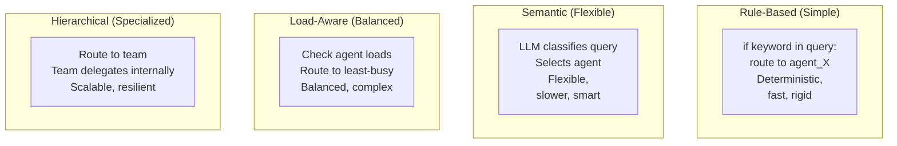
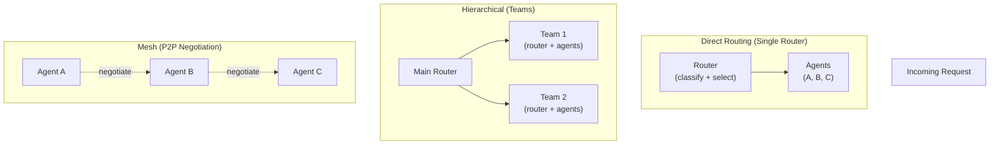

# Agent Routing

## Detailed Explanation

Agent routing is the mechanism that directs incoming requests to the most appropriate agent or specialized worker for handling. In systems with multiple agents, routing decides "which agent should handle this query?" It's the traffic director of multi-agent systems. Routing can be rule-based (if category==billing, route to billing_agent), semantic (LLM decides which agent best fits), load-balanced (route to least-busy agent), or hierarchical (route to team of specialists).

Why it matters: Without routing, you have a single agent doing everything (bottleneck, high cost, poor performance). With routing, you distribute work across specialized agents, each optimized for their domain. This enables scalability, specialization, and fault isolation. Routing decisions directly affect system latency, cost, and quality.

**Key clarification:** Agent routing ≠ load balancing. Load balancing distributes work evenly across identical workers. Agent routing selects the best specialized worker for the task—different agents, different capabilities.

## Core Intuition

Imagine a customer service organization. A call comes in. The receptionist (router) listens briefly and decides: "This is a billing issue → route to billing team" or "Technical problem → route to tech support" or "General info → route to info desk." Good routing gets customers to the right expert quickly. Bad routing sends them to the wrong place, wasting time.

## How It Works

**Routing Pattern (4 stages):**

1. **Receive Request:** Router gets incoming query or task.
   - Example: "I have a question about my invoice"
   - Router needs: query text, metadata (user ID, priority, category hints)

2. **Classify/Understand:** Router determines what type of request this is.
   - Rule-based: Pattern matching (if contains "billing" → billing type)
   - Semantic: LLM classifies (ask LLM: "Is this billing or technical?")
   - Learning-based: Model trained on past routing decisions

3. **Select Agent:** Router picks best-fit agent for this request type.
   - Option 1: Deterministic routing (category → always goes to agent_x)
   - Option 2: Load-aware (routes to least-busy agent of type x)
   - Option 3: Capability-based (check agent versions, pick newest)

4. **Forward & Monitor:** Router sends request to selected agent, tracks result.
   - If agent fails: retry, escalate, or reroute to backup agent
   - Monitor latency: if slow, log and potentially reroute future similar requests

**Routing Strategies (Comparison):**



**Example: E-commerce Routing**

```
Query: "I need to return an item ordered last week"

Rule-Based Router:
  if "return" in query → route to returns_agent
  ✓ Fast (1ms), predictable
  ✗ Can't handle: "My package arrived damaged"

Semantic Router:
  LLM thinks: "This is a return request"
  → Route to returns_agent
  ✓ Flexible (handles "refund", "damaged", etc)
  ✗ Slower (100ms+ for LLM call)

Load-Aware Router:
  returns_agent has queue=5
  refunds_agent has queue=2
  → Route to refunds_agent (similar capability, less busy)

Hierarchical Router:
  → Route to customer_service_team
  team_supervisor: "Is this a return?"
    → Yes → delegate to returns_specialist
    → No → delegate to shipping_specialist
```

**Routing Architectures:**



## Architecture / Trade-offs

**Routing Strategy Comparison:**

| Strategy | Speed | Accuracy | Complexity | Use Case |
|----------|-------|----------|-----------|----------|
| Rule-Based | 1ms | 70% (brittle) | Low | Simple categories |
| Semantic (LLM) | 100-200ms | 90%+ | Medium | Complex domains |
| Load-Aware | 10ms + checks | 75% | Medium | High volume |
| Hierarchical | 50ms + delegation | 95% | High | Large teams |
| ML-Based | 5-50ms | 92% | High | Scale + learning |

**Trade-offs:**

1. **Speed vs. Accuracy**
   - Fast routing (rule-based): 1ms, but misclassifies 30% of requests
   - Accurate routing (semantic): 100ms, but correct 90% of time
   - **Decision:** Use rule-based for <1% error tolerance; semantic for complex domains

2. **Specialization vs. Generalization**
   - Highly specialized agents (narrow, expert): Good accuracy, poor coverage (missing cases)
   - General agents: Cover all cases, poor accuracy, high cost
   - **Decision:** Balance: 5-10 specialized agents + 1 fallback generalist

3. **Centralized vs. Distributed Routing**
   - Centralized: One router (single point of failure, bottleneck)
   - Distributed: Each agent can route (resilient, complex)
   - **Decision:** Centralized for <10 agents; distributed for >20 agents

4. **Static vs. Dynamic Routing**
   - Static: Same requests always go to same agent
   - Dynamic: Routing adapts based on load, performance, learning
   - **Decision:** Start static; move to dynamic when load varies or agents learn

## Interview Q&A

**Q1: How do you decide between rule-based, semantic (LLM), and load-aware routing?**
A: Rule-based for simple cases (category obvious from keywords): "billing" → billing_agent. Semantic when classification is complex (LLM decides): "My invoice doesn't match my memory" could be billing or technical. Load-aware when agents are identical but you want load balancing. Hierarchical when you have teams of specialists. In practice: use rule-based first (fast), fall back to semantic for unmatched cases.

**Q2: What happens if a routed agent fails or times out? How do you handle it?**
A: Three strategies: (1) Retry with timeout: try same agent again, max 2 retries with increasing delays; (2) Reroute: if timeout, route to different agent (fallback); (3) Escalate: if all agents fail, escalate to human or return error to user. Best practice: Implement all three—retry for transient failures, reroute for agent-specific issues, escalate for systemic failures.

**Q3: In a system with 10+ specialized agents, how do you prevent requests from being misrouted?**
A: (1) Classify precisely: Use semantic classification (LLM) not rules. Rules break with edge cases; LLM understands nuance. (2) Confidence scoring: LLM returns confidence (70%, 95%, etc.). If low confidence, escalate or try multiple agents. (3) Feedback loop: Log misroutes. If request was routed to Agent A but should have been B, update routing model. (4) Testing: Test routing on diverse examples before production.

**Q4: How do you load-balance across multiple agents of the same type?**
A: Track: (1) Queue length—how many requests waiting? (2) Response time—how slow is agent? (3) Error rate—is agent failing? Route new request to agent with best metrics (shortest queue + lowest latency + lowest error rate). But don't change routing constantly (causes thrashing). Update routing decisions every 10-30 seconds.

**Q5: What's the trade-off between having many specialized agents vs. fewer general agents?**
A: Many specialized: High accuracy (agent is expert at its domain), but high complexity (manage many agents), and poor coverage (edge cases unhandled). Few general: Low complexity, good coverage, but low accuracy (generalist is weaker) and high cost per request (general agent needs more reasoning). Solution: 5-10 specialized agents for 80% of requests + 1 general fallback for edge cases.

**Q6: How do you make routing decisions observable/explainable to users?**
A: (1) Log all routing decisions: timestamp, request, classification, selected agent. (2) Return routing info to user: "Routing to billing specialist (85% confidence)". (3) Explain fallbacks: "Primary routing failed, trying fallback agent". (4) Track accuracy: measure how often routing was correct (post-hoc from outcomes). (5) Allow override: user can say "I'd rather talk to sales" to change routing.

**Q7: In a hierarchical routing system (main router → teams → agents), how do you prevent coordination overhead?**
A: (1) Keep hierarchies shallow: max 2-3 levels. Deeper → more hops → slower. (2) Pre-filter at each level: main router eliminates wrong teams before delegating. (3) Async delegation: team doesn't wait for answer before reporting; returns early. (4) Caching: remember past delegations (request type X→team Y); reuse. (5) Monitoring: track delegation latency; if >100ms, consider flattening structure.

**Q8: How do you know if your routing strategy is working well? What metrics matter?**
A: (1) Routing accuracy: % of requests routed to correct agent (measure via outcomes). (2) Latency: time from request to routing decision (target <50ms). (3) Coverage: % of requests that can be routed (should be >95%). (4) Load balance: variance in agent queue lengths (lower is better). (5) Cost per request: routed agents more specialized → lower cost. (6) User satisfaction: do users report "talked to the right person?"

## Best Practices

1. **Start simple, evolve complexity.** Begin with rule-based routing (fast, obvious). Add semantic routing only when rule-based fails >5% of time. Add load-balancing when agents are saturated.

2. **Implement confidence scoring.** If semantic classifier returns <80% confidence, escalate to human or try multiple agents. Don't route confidently on weak signals.

3. **Use semantic routing as fallback.** Rules for 80% of obvious cases. LLM for ambiguous cases. This gives you speed + accuracy.

4. **Monitor routing accuracy post-hoc.** Log routing decision. Later, measure outcome: was request resolved? If not, was wrong agent routed? Use this to improve router.

5. **Implement graceful degradation.** If primary agent fails, reroute to secondary. If all agents fail, escalate. Never silently fail.

6. **Version your routing logic.** Keep old routing rules. A/B test new routing strategy. If new is worse, revert. Don't deploy blind.

7. **Keep agent specs clear.** Each agent should have clear purpose: "This agent handles billing only. Anything not billing, reject and reroute." Prevents scope creep.

8. **Use load metrics, not just queue length.** Queue length is misleading if agents have different speeds. Use: queue_length / agent_speed = estimated_wait_time.

9. **Batch similar requests.** If 10 requests for same type come in, route all 10 to same agent. Reduces context switching. Agent can optimize for batch.

10. **Test routing with adversarial examples.** Don't just test obvious cases. Test edge cases, ambiguous requests, new domains. Routing should handle surprises gracefully.

## Common Pitfalls

1. **Rigid rule-based routing breaks on variants.** Rules: if "billing" in query → billing_agent. But "I have a payment problem" doesn't contain "billing". Request misrouted. **Fix:** Use semantic routing; rules are for common cases only.

2. **No fallback for misroutes.** Query routed to Agent A but really needs Agent B. Agent A can't help. Request fails. **Fix:** Implement rerouting. If agent says "not my domain", try next best agent.

3. **Load imbalance kills performance.** All requests routed to Agent A (it's the best). Agent A gets overwhelmed, queue grows, latency explodes. Other agents idle. **Fix:** Load-balance. Route to least-busy agent of appropriate type.

4. **Routing decision latency overlooked.** Main router runs LLM classification. Each request adds 100ms+ latency. Becomes bottleneck. **Fix:** Cache classification results. Reuse for similar requests. Or use faster rule-based for high-volume cases.

5. **Too many agents, no discovery mechanism.** System has 20 agents. How does router know about all of them? If new agent added, router doesn't know. **Fix:** Use service discovery (registry of agents). Router queries registry: "Who can handle billing?"

6. **Routing accuracy not measured.** Deploy new router, don't know if it's better or worse. **Fix:** Log all routing decisions. Measure: how often was routed agent able to resolve the request? Use as accuracy metric.

7. **Routing not explainable.** User asks "Why was I routed to this agent?" Router can't explain. User loses trust. **Fix:** Log classification confidence and reasoning. Return to user: "85% confident this is a billing issue."

8. **No handling of boundary cases.** Request is both billing AND technical. Router forced to pick one. **Fix:** Allow multi-agent routing. Route to both agents; have them coordinate or return multiple perspectives.

9. **Routing decisions not versioned.** Old routing rule deleted. Can't replay/debug old requests. **Fix:** Version routing rules. Store: which rule version was used for this request. Can replay with old rule if needed.

10. **Routing not adapted based on feedback.** Router makes decisions but never learns if they were right. **Fix:** Feedback loop: log routing decision, measure outcome, update router accordingly. Continuous improvement.

## Code Examples

**Example 1: Rule-Based Routing (Fast & Simple)**
```python
from anthropic import Anthropic

class RuleBasedRouter:
    def __init__(self):
        self.client = Anthropic()
        self.agents = {
            "billing": "Handles invoices, payments, refunds",
            "technical": "Handles bugs, errors, crashes",
            "general": "General info, fallback"
        }
    
    def classify(self, query: str) -> str:
        """Classify query type via rules"""
        query_lower = query.lower()
        
        if any(w in query_lower for w in ["invoice", "payment", "billing", "charge", "refund"]):
            return "billing"
        elif any(w in query_lower for w in ["error", "bug", "crash", "not working", "broken"]):
            return "technical"
        else:
            return "general"
    
    def route(self, query: str) -> str:
        agent_type = self.classify(query)
        print(f"Routing to {agent_type} agent")
        
        # Simulate agent response
        response = self.client.messages.create(
            model="claude-3-5-sonnet-20241022",
            max_tokens=256,
            messages=[{
                "role": "user",
                "content": f"[Agent: {self.agents[agent_type]}]\n{query}"
            }]
        )
        return response.content[0].text

# Usage
router = RuleBasedRouter()
result = router.route("I was charged twice for my subscription")
print(result[:100])
```

**Example 2: Semantic Routing (Smart Classification)**
```python
class SemanticRouter:
    def __init__(self):
        self.client = Anthropic()
        self.agents = ["billing", "technical", "general"]
    
    def classify_semantic(self, query: str) -> tuple:
        """LLM classifies query"""
        response = self.client.messages.create(
            model="claude-3-5-sonnet-20241022",
            max_tokens=100,
            messages=[{
                "role": "user",
                "content": f"""Classify this query into ONE category: billing, technical, or general.
                
Query: "{query}"

Response format: CATEGORY: [category]
CONFIDENCE: [0-100]
REASON: [one sentence]"""
            }]
        )
        
        text = response.content[0].text
        lines = text.split("\n")
        category = "general"
        confidence = 50
        
        for line in lines:
            if "CATEGORY:" in line:
                category = line.split(":")[-1].strip().lower()
            elif "CONFIDENCE:" in line:
                confidence = int(line.split(":")[-1].strip().rstrip("%"))
        
        return category, confidence
    
    def route(self, query: str) -> str:
        agent_type, confidence = self.classify_semantic(query)
        print(f"Routing to {agent_type} agent (confidence: {confidence}%)")
        
        if confidence < 70:
            print(f"  ⚠️  Low confidence. Might consider fallback agent.")
        
        response = self.client.messages.create(
            model="claude-3-5-sonnet-20241022",
            max_tokens=256,
            messages=[{
                "role": "user",
                "content": f"[{agent_type.title()} Agent]\n{query}"
            }]
        )
        return response.content[0].text

# Usage
router = SemanticRouter()
result = router.route("My payment didn't go through but I was still charged")
print(result[:100])
```

**Example 3: Load-Aware Routing (Balanced Distribution)**
```python
from typing import Dict, List

class LoadAwareRouter:
    def __init__(self):
        self.client = Anthropic()
        self.agents = {
            "billing_agent_1": {"load": 5, "type": "billing"},
            "billing_agent_2": {"load": 2, "type": "billing"},
            "technical_agent": {"load": 8, "type": "technical"},
            "general_agent": {"load": 3, "type": "general"}
        }
    
    def classify(self, query: str) -> str:
        if any(w in query.lower() for w in ["billing", "payment", "invoice"]):
            return "billing"
        return "general"
    
    def select_agent(self, agent_type: str) -> str:
        """Select least-busy agent of given type"""
        candidates = [
            (name, info) for name, info in self.agents.items()
            if info["type"] == agent_type
        ]
        
        if not candidates:
            candidates = [(name, info) for name, info in self.agents.items()]
        
        best_agent = min(candidates, key=lambda x: x[1]["load"])
        return best_agent[0]
    
    def route(self, query: str) -> str:
        agent_type = self.classify(query)
        agent_name = self.select_agent(agent_type)
        
        # Update load
        self.agents[agent_name]["load"] += 1
        print(f"Routing to {agent_name} (load: {self.agents[agent_name]['load']})")
        
        response = self.client.messages.create(
            model="claude-3-5-sonnet-20241022",
            max_tokens=256,
            messages=[{
                "role": "user",
                "content": f"[Agent: {agent_name}]\n{query}"
            }]
        )
        
        # Decrement load after processing
        self.agents[agent_name]["load"] -= 1
        return response.content[0].text

# Usage
router = LoadAwareRouter()
for i in range(3):
    print(f"\nRequest {i+1}:")
    router.route(f"I have a billing question #{i+1}")
```

## Related Concepts
- Multi-Agent Systems — agents being routed to
- Agent Communication — routers coordinating with agents
- Agent Monitoring — tracking routing performance

## Resources
- [Routing Strategies in Microservices](https://en.wikipedia.org/wiki/Routing)
- [Multi-Agent Systems Coordination](https://arxiv.org/abs/2306.00945)
