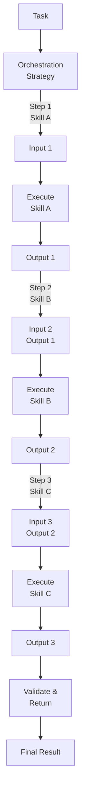

# Skill Composition

## Detailed Explanation

Skill composition builds complex agent behaviors by combining reusable, modular skills. A skill is a self-contained capability (search, summarize, analyze, plan, execute) that solves one narrow problem. Rather than writing monolithic code for each task, decompose into skills, then compose them via orchestration. Key mechanisms: (1) skill definition—define interface (input/output), (2) skill library—maintain collection of reusable skills, (3) orchestration—define composition pattern (sequence, conditional, loop, parallel), (4) skill routing—choose which skill for each step, (5) error handling—what if skill fails?, (6) context passing—share state between skills. Advantages: modularity (reuse skills across tasks), clarity (each skill is simple), scalability (add new skills without rewriting orchestration), composability (combine skills in new ways). Challenges: (1) skill interfaces must be compatible (output of one = input of next), (2) state passing (skills need shared context), (3) error recovery (if step 2 fails, how to retry or fallback), (4) composition complexity (many skills = many ways to combine them). Best for: (1) multi-step tasks with clear steps (analyze → summarize → recommend), (2) knowledge work (search, extract, synthesize), (3) workflows where steps repeat or vary by condition. Not ideal for: (1) single-step tasks (composition overhead not worth it), (2) tightly coupled steps (each step heavily depends on prior step's details).

## Core Intuition

Imagine cooking a recipe: reusable skills are wash, chop, cook, blend, plating. To make dish A: wash→chop→cook. To make dish B: chop→cook→blend→plate. Reusing skills saves work; composing them creates variety. Each skill is independent (can wash vegetables or chicken); combine them into workflows. This is skill composition: building workflows by combining reusable skills. Add or remove skills; reorder; add conditionals (if burnt, start over); parallelize (chop while cooking).

## How It Works

Skill composition operates through definition, library, routing, and orchestration:

1. **Skill Definition** — Each skill has input, output, optional parameters, error modes
   - Example: SearchSkill(query: str) → results: List[str]
2. **Skill Library** — Collection of available skills: {SearchSkill, AnalyzeSkill, SummarizeSkill, PlanSkill}
3. **Orchestration Template** — Define composition pattern: sequence, conditional, parallel, loop
4. **Skill Routing** — For each step, choose which skill to execute
5. **Context Passing** — Pass results between skills (output of skill A = input to skill B)
6. **Error Handling** — Handle failures: retry, fallback, escalate
7. **Execution** — Run orchestration, collecting results
8. **Validation** — Check outputs match expected schema before passing to next skill



## Architecture / Trade-offs

**Composition Patterns:**
- Sequential — Skill A → B → C. Simple, each step uses prior output. Fast to understand.
- Conditional — If condition, run A, else run B. Flexible, adds complexity.
- Parallel — Run A, B, C simultaneously. Faster, needs synchronization.
- Loop — Repeat Skill A until condition. Useful for iterative tasks.

**Skill Granularity:**
- Fine-grained (search single result, analyze one data point) — More flexibility, more composition
- Coarse-grained (search + analyze combined) — Faster execution, less reusable

**State Management:**
- Pass-through (each skill receives input, returns output, no side effects) — Clean, composable
- Stateful (skills read/write shared context) — Powerful but harder to reason about

**Error Handling:**
- Fail-fast (if skill fails, stop) — Simple, may lose valuable work
- Retry (skill fails, try again) — Recovers from transient failures
- Fallback (skill fails, try alternative skill) — More robust

**Skill Distribution:**
- Local (all skills run in-process) — Fast, simple, can't scale
- Remote (skills are microservices) — Scalable, adds latency and complexity

## Interview Q&A

**Q: When should you use skill composition vs a single agent?**
A: Use skill composition if: (1) task has clear steps (search → analyze → summarize), (2) steps are reusable (use search in multiple tasks), (3) different team owns different skills (DB team owns query skill, NLP team owns summarize). Use single agent if: task is simple (one LLM call), or steps are tightly coupled (each step heavily depends on details of prior step). Rule of thumb: if you can describe task as "do A, then B, then C" with clear interfaces, use composition.

**Q: How do you handle skill errors in composition?**
A: Different strategies: (1) Fail-fast—if skill fails, stop and return error. Good if later steps depend on prior step. (2) Retry—if skill fails, retry (maybe transient). Good for flaky services. (3) Fallback—if primary skill fails, use alternative skill. Example: if web search fails, use local database instead. (4) Partial results—if skill fails, continue with empty/default value. Good if later skills can handle incomplete input. Choose based on criticality and dependencies.

**Q: How do you compose skills with different output formats?**
A: Example: SearchSkill returns [results with URLs, titles]. AnalyzeSkill expects {data: str, metadata: dict}. Mismatch. Solutions: (1) Adapters—transform SearchSkill output to AnalyzeSkill input format, (2) Standardize—define canonical format, all skills use it, (3) Schema validation—check output matches expected schema, fail if not, (4) Flexible input—make AnalyzeSkill accept multiple formats. Best: standardize on canonical format (JSON schema); each skill validates input/output.

**Q: How do you avoid skill composition becoming a complex DAG (directed acyclic graph)?**
A: Problem: compose 20 skills in complex ways → explosion of possible compositions, hard to understand. Solutions: (1) Limit depth—max 5-7 steps in sequence, (2) Predefined pipelines—don't compose arbitrary; define standard pipelines (analyze pipeline = search → analyze → summarize), (3) Skill categorization—skills belong to categories (input, processing, output); compose across categories, not within, (4) Visual orchestration—represent composition as diagram; hard to read diagrams = too complex. Rule: if composition is hard to explain to human, it's too complex.

**Q: How do you test skill composition?**
A: Unit test each skill independently. Then integration test compositions: (1) Mock-based—mock dependencies (if skill depends on API, mock API responses), (2) Happy path—test normal case, (3) Error paths—test each skill failing, (4) End-to-end—real dependencies, real skill execution. Example: test "search → analyze" with mocked search results. Test "analyze fails" and verify fallback works. Test real search + real analyze. Build test pyramid: many unit tests, fewer integration, few E2E.

**Q: When should composition be dynamic (decide at runtime) vs static (predefined)?**
A: Static composition: pipeline is hardcoded. "Always: search → analyze → summarize." Fast, predictable, but inflexible. Dynamic: decide at runtime which skill to run next. "If search found results, analyze them; else escalate." Flexible, handles varied inputs, but slower and harder to debug. Use static for: well-understood, repeating workflows. Use dynamic for: unpredictable tasks, varied input types, tasks with branching logic. Hybrid: static pipelines for common cases, dynamic routing for edge cases.

## Best Practices

1. **Define Clear Skill Interfaces** — Each skill has strict input/output schema. Document assumptions. Example: SearchSkill(query: str, max_results: int=10) → List[Dict{url, title, snippet}].

2. **Use Canonical Formats** — All skills use same format for shared data (JSON schema, Python dataclasses). Reduces adapters, errors.

3. **Skill Naming is Important** — Skill names should be self-explanatory. "SearchWebSkill" better than "skill_1". Easy to understand composition when names are clear.

4. **Separate Orchestration from Skills** — Skills are domain logic. Orchestration is plumbing. Keep them separate. Don't embed "if X then call Y" inside skill; put it in orchestrator.

5. **Make Skills Testable** — Each skill should be testable in isolation with mocked dependencies. No external API calls in unit tests.

6. **Cache Skill Results** — If expensive skill is called multiple times with same input, cache result. "Search for 'AI trends'" called twice → cache, don't repeat.

7. **Monitor Skill Performance** — Track: execution time per skill, failure rate, error types. If SearchSkill is slow, optimize or replace. If AnalyzeSkill fails 10% of time, investigate.

8. **Version Skills** — Skill interfaces may change. Version them: SearchSkillV1, SearchSkillV2. Allows safe updates, gradual migration.

9. **Parallel Skills When Possible** — If skills don't depend on each other, run in parallel. "search + analyze" can run together; "search then analyze" must sequence.

10. **Document Assumptions** — Each skill has assumptions: "assumes input is clean JSON", "requires API key", "memory intensive, don't call with large datasets". Document them.

## Common Pitfalls

**Pitfall 1: Incompatible Skill Interfaces**
Issue: SearchSkill outputs {results: [...]}, but AnalyzeSkill expects {data: [...]}. Type mismatch → runtime error.
Fix: Define canonical data format. All skills use it. Add schema validation.

**Pitfall 2: Tight Coupling Between Skills**
Issue: Skill B assumes specific output format from Skill A. If A's output changes, B breaks.
Fix: Design interfaces to be stable. Version skills. Use adapters for format conversions.

**Pitfall 3: No Error Handling in Composition**
Issue: Skill A fails. Whole composition fails. No fallback, no retry.
Fix: Design error handling upfront. Decide: retry, fallback, escalate, partial results. Implement for each skill dependency.

**Pitfall 4: Skill Composition Becomes Unmaintainable**
Issue: 20+ skills, composed in complex ways. No one understands full pipeline. Hard to debug.
Fix: Limit complexity. Predefined pipelines. Visualize composition. Document assumptions.

**Pitfall 5: Missing Context Between Skills**
Issue: Skill A finds result X. Skill B needs context about how X was found (timestamp, source). A doesn't provide it.
Fix: Design context passing. All skills add metadata to outputs. Downstream skills access context.

**Pitfall 6: No Validation of Skill Outputs**
Issue: Skill A outputs malformed data. Skill B crashes trying to parse it.
Fix: Validate after each skill. Check output schema. Log validation errors. Fail or escalate.

**Pitfall 7: Stateful Skills in Composition**
Issue: Skill A reads/writes global state. Skill B doesn't know about it. State inconsistency.
Fix: Make skills stateless. Pass state explicitly. Or use shared context object that all skills see.

**Pitfall 8: No Monitoring**
Issue: Skill composition is slow. No visibility into which step is bottleneck.
Fix: Monitor each skill: time, failures, error types. Visualize performance. Optimize slow skills.

## Code Examples

### Example 1: Basic Sequential Skill Composition

```python
from typing import List, Dict, Any
from dataclasses import dataclass

@dataclass
class SkillResult:
    success: bool
    data: Any
    error: str = None

class Skill:
    def __init__(self, name: str):
        self.name = name
    
    async def execute(self, input_data: Any) -> SkillResult:
        raise NotImplementedError

class SearchSkill(Skill):
    def __init__(self):
        super().__init__("search")
    
    async def execute(self, query: str) -> SkillResult:
        # Simulate search
        results = [
            {"title": "Result 1", "snippet": f"Info about {query}"},
            {"title": "Result 2", "snippet": f"More about {query}"}
        ]
        return SkillResult(success=True, data=results)

class AnalyzeSkill(Skill):
    def __init__(self):
        super().__init__("analyze")
    
    async def execute(self, results: List[Dict]) -> SkillResult:
        # Analyze results
        analysis = {
            "count": len(results),
            "summary": f"Found {len(results)} relevant results"
        }
        return SkillResult(success=True, data=analysis)

class SummarizeSkill(Skill):
    def __init__(self):
        super().__init__("summarize")
    
    async def execute(self, analysis: Dict) -> SkillResult:
        summary = f"Summary: {analysis['summary']}"
        return SkillResult(success=True, data=summary)

class SkillCompositor:
    def __init__(self, skills: List[Skill]):
        self.skills = {s.name: s for s in skills}
    
    async def compose(self, initial_input: Any, skill_sequence: List[str]) -> SkillResult:
        """Execute skills sequentially."""
        current_input = initial_input
        
        for skill_name in skill_sequence:
            skill = self.skills[skill_name]
            result = await skill.execute(current_input)
            
            if not result.success:
                return SkillResult(success=False, data=None, error=f"{skill_name} failed: {result.error}")
            
            current_input = result.data
        
        return SkillResult(success=True, data=current_input)

# Usage
async def main():
    skills = [SearchSkill(), AnalyzeSkill(), SummarizeSkill()]
    compositor = SkillCompositor(skills)
    
    result = await compositor.compose(
        initial_input="AI trends 2024",
        skill_sequence=["search", "analyze", "summarize"]
    )
    
    print(f"Success: {result.success}")
    print(f"Result: {result.data}")
```

### Example 2: Conditional Skill Composition

```python
from enum import Enum

class TaskType(Enum):
    RESEARCH = "research"
    ANALYSIS = "analysis"
    DECISION = "decision"

class ConditionalSkillCompositor:
    def __init__(self, skills: Dict[str, Skill]):
        self.skills = skills
    
    async def compose_with_condition(self, task_type: TaskType, input_data: Any) -> SkillResult:
        """Execute different skill sequences based on task type."""
        
        if task_type == TaskType.RESEARCH:
            # Research pipeline: search → analyze → summarize
            sequence = ["search", "analyze", "summarize"]
        
        elif task_type == TaskType.ANALYSIS:
            # Analysis pipeline: analyze → evaluate
            sequence = ["analyze", "evaluate"]
        
        elif task_type == TaskType.DECISION:
            # Decision pipeline: search → analyze → decide
            sequence = ["search", "analyze", "decide"]
        
        else:
            return SkillResult(success=False, error="Unknown task type")
        
        # Execute pipeline
        current_input = input_data
        for skill_name in sequence:
            skill = self.skills[skill_name]
            result = await skill.execute(current_input)
            
            if not result.success:
                return SkillResult(success=False, error=f"{skill_name} failed")
            
            current_input = result.data
        
        return SkillResult(success=True, data=current_input)

# Usage
async def main():
    compositor = ConditionalSkillCompositor(skills_dict)
    
    # Different tasks, different pipelines
    result1 = await compositor.compose_with_condition(TaskType.RESEARCH, "climate change")
    result2 = await compositor.compose_with_condition(TaskType.DECISION, "buy stocks?")
```

### Example 3: Skill Composition with Fallback and Error Handling

```python
class RobustSkillCompositor:
    def __init__(self, skills: Dict[str, Skill], fallback_skills: Dict[str, List[str]]):
        self.skills = skills
        self.fallback_skills = fallback_skills  # {primary: [fallback1, fallback2]}
    
    async def execute_with_fallback(self, skill_name: str, input_data: Any, max_retries: int = 2) -> SkillResult:
        """Execute skill with retry and fallback."""
        
        # Try primary skill
        skill = self.skills[skill_name]
        for attempt in range(max_retries):
            result = await skill.execute(input_data)
            if result.success:
                return result
            print(f"  ⚠️  {skill_name} attempt {attempt + 1} failed")
        
        # Try fallback skills
        fallbacks = self.fallback_skills.get(skill_name, [])
        for fallback_name in fallbacks:
            print(f"  → Trying fallback: {fallback_name}")
            fallback = self.skills[fallback_name]
            result = await fallback.execute(input_data)
            if result.success:
                print(f"  ✓ Fallback succeeded: {fallback_name}")
                return result
        
        return SkillResult(success=False, error=f"All attempts failed for {skill_name}")
    
    async def compose_with_recovery(self, input_data: Any, skill_sequence: List[str]) -> SkillResult:
        """Execute sequence with fallback recovery."""
        current_input = input_data
        
        for skill_name in skill_sequence:
            result = await self.execute_with_fallback(skill_name, current_input)
            if not result.success:
                return result
            current_input = result.data
        
        return SkillResult(success=True, data=current_input)

# Usage
fallback_mapping = {
    "search": ["cached_search", "manual_search"],
    "analyze": ["basic_analyze"]
}
compositor = RobustSkillCompositor(skills_dict, fallback_mapping)
result = await compositor.compose_with_recovery(input_data, ["search", "analyze", "summarize"])
```

## Related Concepts

- **Tool Use** — Skills use tools to accomplish goals
- **Planning & Reasoning** — Orchestration patterns for skill composition
- **Agent Loops** — Iterative execution of skills
- **Error Recovery** — Handling skill failures and fallbacks
- **Modular Design** — Breaking complex tasks into reusable components

