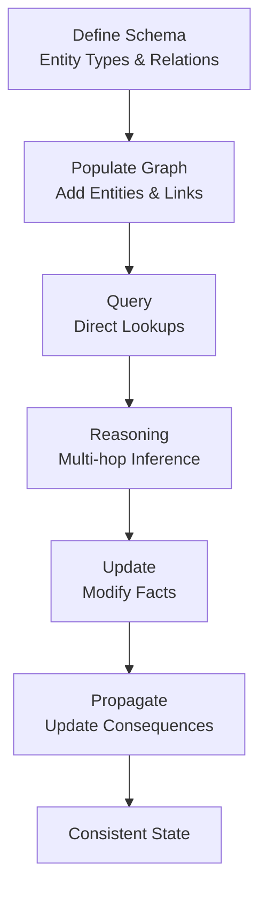

# Knowledge Graphs

## Detailed Explanation

Knowledge graphs (KGs) represent information as structured networks of entities and relationships. Format: graph nodes (entities like "Paris", "France") with edges (relationships like "capital_of"). Advantages over unstructured text: semantic clarity (relationships explicit, not implicit), enabling reasoning (agent can deduce "if Paris is capital of France, and France is in Europe, then Paris is in Europe"), enabling structured queries (SQL-like questions), supporting updates (change one relationship, not regenerate all text). Integration with agents: (1) use KG as semantic memory (grounding), (2) query KG to answer questions, (3) reason over KG (multi-hop queries), (4) update KG when learning new facts. Construction: manual (expensive, accurate), automatic (fast, noisy), hybrid (semi-automatic with human review). Challenges: maintaining consistency (if relation changes, update all connected facts), handling uncertainty (some relations probabilistic), scaling (large graphs slow to query). Trade-offs: structured KG (enables reasoning, requires schema) vs unstructured text (flexible, harder to reason). Best for: factual domains (medical, financial, geographic), applications requiring reasoning (recommendation, question-answering), scenarios where consistency matters (legal, compliance).

## Core Intuition

Imagine a map of relationships: "Alice knows Bob, Bob works at Acme, Acme is in Boston, Boston is in Massachusetts." From this network, you can deduce: "Alice indirectly knows someone at Acme" (multi-hop). Update one fact (Bob moves to StartupCorp), and relevant deductions automatically change. Knowledge graphs are this—a map of facts you can navigate and reason about.

## How It Works

Knowledge graphs operate through entity representation, relationship definition, querying, and reasoning:

1. **Entity Definition** — Define entity types (Person, Company, Location) and properties (name, location)
2. **Relationship Definition** — Define edge types (works_at, located_in, knows)
3. **Population** — Add entities and relationships (import from data or user input)
4. **Querying** — Retrieve entity properties or related entities ("What companies are in Boston?")
5. **Reasoning** — Infer new facts from existing ones ("If A→B and B→C, then A→C")
6. **Updating** — Modify facts, handle consistency



## Architecture / Trade-offs

**Representation:**
- **RDF** — Standard semantic web format (interoperable, verbose)
- **Property Graph** — More compact, property-rich edges
- **Hypergraph** — Support many-to-many relations (complex)

**Storage:**
- **In-memory** — Fast but limited to single machine
- **Graph Database** — Neo4j, ArangoDB (optimized for traversal)
- **Relational DB** — SQL tables (familiar but less natural)

**Reasoning:**
- **No inference** — Just store and retrieve (fast, limited deduction)
- **Forward chaining** — Pre-compute all deductions (slow to build, fast to query)
- **Backward chaining** — Compute on-demand (slow to query, no prep)
- **Hybrid** — Cache common deductions, compute rare ones on demand

**Consistency:**
- **Loose** — Contradictions allowed (flexible, inaccurate)
- **Strict** — Validate constraints (slower, more accurate)

## Interview Q&A

**Q: When should you use a knowledge graph vs embeddings/vectors?**
A: KGs for structured, relational reasoning (multi-hop queries, deduction). Vectors for similarity ("find similar documents"). Both: use KG for facts, vectors for semantics. Example: KG stores "Paris is capital of France"; vectors find conceptually related places.

**Q: How do you handle uncertainty in knowledge graphs?**
A: Store confidence scores: edge from "Treatment A helps Disease B" with confidence 0.7 (70% sure). Query confidence: "Find treatments for disease with >80% confidence." Update: if confidence drops below threshold, mark as uncertain or remove.

**Q: How do you scale knowledge graphs to millions of entities?**
A: (1) Sharding: split graph across machines, (2) Indexing: index frequently-queried properties, (3) Sampling: for ML, sample subgraph not full graph, (4) Approximate: use approximate reasoning for speed.

**Q: What's the relationship between knowledge graphs and ontologies?**
A: Ontology = schema (defines what types, relations are allowed). KG = data (actual instances). Ontology is blueprint; KG is the built house. Good ontology enables better reasoning.

**Q: How do you detect and resolve inconsistencies in KGs?**
A: (1) Constraints: define rules ("Persons can't be Locations"), check violations, (2) Reasoning: use rules to detect contradictions ("If A→B and A→¬B, contradiction"), (3) Versioning: track changes, revert bad updates, (4) Human review: flag uncertain facts for expert validation.

**Q: Can you update a knowledge graph without recomputing everything?**
A: Not always. Deleting an entity might invalidate many inferred facts (expensive). Best: incremental updates. Add facts → recompute affected inferences only. Version graph: maintain old snapshots for rollback.

## Best Practices

1. **Start Simple** — Don't over-engineer. Start with core entities/relations, add as needed.

2. **Clear Schema** — Define entity types and relationships precisely. Ambiguous schema → bad queries.

3. **Source Attribution** — Track where each fact came from. "This fact from Wikipedia June 2024." Enables audit and updates.

4. **Consistency Checks** — Regular validation. "No two people with same ID", "Company must be located in valid location."

5. **Redundancy Avoidance** — Don't store redundant facts. If A→B and B→C, don't also store A→C (infer it). Reduces update burden.

6. **Caching for Performance** — Cache common multi-hop queries. "Who works at Acme?" is popular → cache result.

7. **Versioning** — Version the graph. "Graph v2.1 from June 2024." Enables rollback and audit.

8. **Human Curation** — For high-value/high-stakes facts (medical), have human experts review before adding.

9. **Documentation** — Document schema, constraints, reasoning rules. Future developers need to understand.

10. **Performance Monitoring** — Track query latency. As graph grows, queries slow down → optimize.

## Common Pitfalls

**Pitfall 1: Ambiguous Schema**
Issue: Relationship "parent_of" is unclear (biological? legal? step?). Queries return wrong results.
Fix: Precise definitions. "Biological_parent_of", "Legal_guardian_of", etc.

**Pitfall 2: Redundancy Explosion**
Issue: Store both A→B and all inferences from A→B. Graph bloats, updates are expensive.
Fix: Store only raw facts. Compute inferences on-demand or cache selectively.

**Pitfall 3: Stale Graph**
Issue: Add fact "Bob works at Acme" in 2020. Bob left in 2022 but graph not updated. Old info still used.
Fix: Version facts. "Valid from 2020-01-01 to 2022-12-31." Expire old facts.

**Pitfall 4: Inconsistency**
Issue: Graph has "A→B and ¬B" (contradiction). Reasoning breaks.
Fix: Validate before adding. Define constraints, check violations.

**Pitfall 5: Scalability Ignored**
Issue: Graph works fine with 10K entities. Buy 1M entity dataset, everything times out.
Fix: Plan for scale. Use graph database not hand-rolled solution. Implement caching/indexing.

**Pitfall 6: No Audit Trail**
Issue: Fact changed. Don't know why, who, when. Can't debug.
Fix: Log all changes. Track source (user_id, timestamp, reason).

**Pitfall 7: Query Explosion**
Issue: Multi-hop query traverses entire graph. "Find friends of friends of friends" = exponential time.
Fix: Query limits. "Max 3 hops", "max 1000 results". Sampling.

## Code Examples

### Example 1: Simple Knowledge Graph

```python
from typing import Dict, List, Set

class SimpleKG:
    def __init__(self):
        self.entities = {}  # entity_id -> {name, type, properties}
        self.relations = []  # [(from, relation, to), ...]
    
    def add_entity(self, entity_id: str, name: str, entity_type: str):
        """Add entity to graph."""
        self.entities[entity_id] = {
            "name": name,
            "type": entity_type
        }
    
    def add_relation(self, from_id: str, relation: str, to_id: str):
        """Add relationship."""
        if from_id in self.entities and to_id in self.entities:
            self.relations.append((from_id, relation, to_id))
    
    def query_neighbors(self, entity_id: str, relation: str = None) -> List[Dict]:
        """Find related entities."""
        results = []
        for from_id, rel, to_id in self.relations:
            if from_id == entity_id and (relation is None or rel == relation):
                results.append({
                    "entity_id": to_id,
                    "name": self.entities[to_id]["name"],
                    "relation": rel
                })
        return results
    
    def multi_hop_query(self, start_id: str, path: List[str], max_depth: int = 3) -> List[str]:
        """Multi-hop traversal: follow relation chain."""
        current = [start_id]
        for step, relation in enumerate(path):
            if step >= max_depth:
                break
            next_nodes = []
            for node in current:
                for result in self.query_neighbors(node, relation):
                    next_nodes.append(result["entity_id"])
            current = next_nodes
        return current

# Usage
kg = SimpleKG()
kg.add_entity("alice", "Alice", "Person")
kg.add_entity("acme", "Acme Inc", "Company")
kg.add_entity("boston", "Boston", "Location")
kg.add_relation("alice", "works_at", "acme")
kg.add_relation("acme", "located_in", "boston")

neighbors = kg.query_neighbors("alice", "works_at")
print(f"Alice works at: {[n['name'] for n in neighbors]}")

multi_hop = kg.multi_hop_query("alice", ["works_at", "located_in"])
print(f"Alice's company is in: {[kg.entities[e]['name'] for e in multi_hop]}")
```

### Example 2: Knowledge Graph with Confidence

```python
@dataclass
class Fact:
    from_entity: str
    relation: str
    to_entity: str
    confidence: float  # 0-1, how sure?
    source: str
    date: str

class ConfidenceAwareKG:
    def __init__(self):
        self.facts = []  # List[Fact]
    
    def add_fact(self, from_e: str, rel: str, to_e: str, confidence: float, source: str, date: str):
        """Add fact with confidence score."""
        fact = Fact(from_e, rel, to_e, confidence, source, date)
        self.facts.append(fact)
    
    def query_confident(self, from_e: str, rel: str, min_confidence: float = 0.8) -> List[str]:
        """Query facts above confidence threshold."""
        results = []
        for fact in self.facts:
            if fact.from_entity == from_e and fact.relation == rel:
                if fact.confidence >= min_confidence:
                    results.append((fact.to_entity, fact.confidence))
        return results
    
    def audit_low_confidence(self) -> List[Fact]:
        """Find uncertain facts."""
        return [f for f in self.facts if f.confidence < 0.5]

# Usage
kg = ConfidenceAwareKG()
kg.add_fact("treatment_a", "helps", "disease_b", 0.85, "clinical_trial", "2024-01-01")
kg.add_fact("treatment_a", "helps", "disease_c", 0.30, "anecdotal", "2024-02-01")

confident = kg.query_confident("treatment_a", "helps", min_confidence=0.8)
print(f"Confident treatments: {confident}")
```

### Example 3: Graph Reasoning with Rules

```python
class ReasoningKG:
    def __init__(self):
        self.entities = {}
        self.relations = []
        self.inferred = set()  # Inferred facts
    
    def add_relation(self, from_id, rel, to_id):
        self.relations.append((from_id, rel, to_id))
    
    def apply_rules(self):
        """Apply reasoning rules to infer new facts."""
        # Rule: if A located_in B and B located_in C, then A located_in C
        changed = True
        while changed:
            changed = False
            for (a, rel, b) in list(self.relations):
                if rel == "located_in":
                    for (b2, rel2, c) in self.relations:
                        if b == b2 and rel2 == "located_in":
                            new_fact = (a, "located_in", c)
                            if new_fact not in self.inferred:
                                self.inferred.add(new_fact)
                                changed = True
    
    def get_all_facts(self):
        """Return original + inferred facts."""
        return list(self.relations) + list(self.inferred)

# Usage
kg = ReasoningKG()
kg.add_relation("paris", "located_in", "france")
kg.add_relation("france", "located_in", "europe")
kg.apply_rules()

facts = kg.get_all_facts()
for a, rel, b in facts:
    if rel == "located_in":
        print(f"{a} is located in {b}")
```

## Related Concepts

- **Semantic Memory** — Knowledge bases as semantic memory
- **Retrieval-Augmented Generation** — Query KG for context
- **Embeddings** — Embedding KG entities for similarity
- **Agent Loops** — Agents query KG for reasoning
- **Safety Alignment** — KG for policy/rule enforcement
