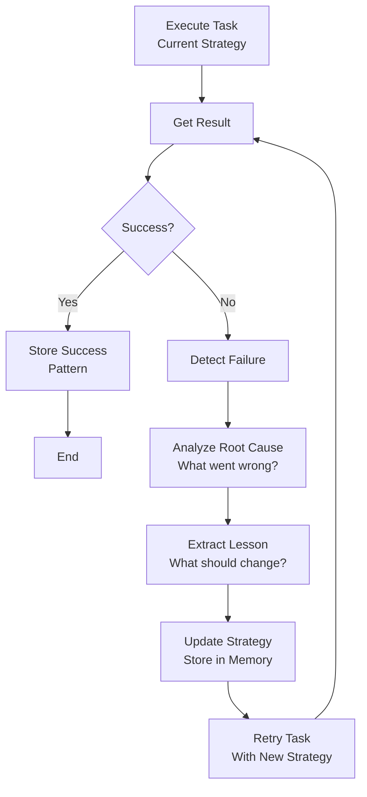

# Reflection and Self-Improvement

## Detailed Explanation

Reflection enables agents to learn from past failures and successes by analyzing their own behavior. Agent reflects by: (1) reviewing past actions (episodic memory), (2) identifying failures and why they occurred, (3) extracting lessons (what pattern should be avoided?), (4) applying lessons to improve future behavior. Core mechanism: structured reflection loop—execute task, detect failure, analyze root cause, update strategy, retry with new approach. Advantages: agents improve without retraining (online learning), can handle new scenarios by reflecting on analogous past cases, builds interpretability (agents explain their own reasoning changes). Challenges: reflection takes time and tokens (added latency), requires reliable failure detection (can't reflect on unknown failures), requires safe experimentation (agent might try harmful approaches while "learning"). Best for: long-running agents (customer support bots, research agents), scenarios where agent encounters novel situations (agents need to adapt in real-time), high-stakes domains (medical assistants) where explaining reasoning changes builds trust. Related: meta-learning (learn-to-learn), curriculum learning (adapt task difficulty), online learning (adapt to changing environment).

## Core Intuition

Imagine an expert learning from mistakes. First attempt at a problem fails; expert reviews what went wrong, learns principle ("never assume X"), applies lesson to second attempt, succeeds. Reflection is this process: automated self-critique and improvement. Agent plays role of both executor and critic—executes, then critiques own performance.

## How It Works

Reflection operates through cycles: execute → detect failure → analyze → update → retry:

1. **Execution** — Agent attempts task with current strategy
2. **Outcome** — Task succeeds or fails
3. **Detection** — Agent recognizes failure (explicit marker or poor metric)
4. **Analysis** — Agent analyzes why it failed ("I misunderstood the prompt", "I chose wrong tool", "I hallucinated")
5. **Lesson Extraction** — Convert failure to lesson ("When X happens, use Y instead")
6. **Strategy Update** — Store lesson in memory, apply to future attempts
7. **Retry** — Attempt task again with new strategy



## Architecture / Trade-offs

**Reflection Scope:**
- **Shallow** — Detect pass/fail only. "I failed; try different approach."
- **Deep** — Analyze specific step where failure occurred. "Step 3 failed because reason X; change step 3."
- **Meta** — Analyze why your strategy for analyzing failures is wrong. ("My analysis was wrong; improve analysis itself.")

**Reflection Frequency:**
- **After every failure** — Learn immediately, but expensive (lots of reflection)
- **Periodic (every 10 failures)** — Batch reflection, more efficient
- **Adaptive** — Reflect when confidence drops, or on high-stakes tasks

**Memory Management:**
- **Store all lessons** — Complete but memory bloat, retrieval slow
- **Store top-10 lessons** — Balance between completeness and efficiency
- **Summarize lessons** — Compress similar lessons into one ("When X happens, do Y")

**Retry Strategy:**
- **Greedy** — Always use latest strategy (might overshoot)
- **Exploration** — Try different strategies, see which works best
- **Conservative** — Keep old strategy if new one unproven

## Interview Q&A

**Q: How is reflection different from fine-tuning?**
A: Fine-tuning: retrain model weights on new data (expensive, slow, permanent). Reflection: agent updates strategy in memory (fast, reversible, online). Reflection is for tactics (prompt changes, strategy tweaks); fine-tuning is for fundamentals (model behavior patterns).

**Q: How do you detect when reflection is needed?**
A: (1) Explicit signals: task marked as failed, (2) Metrics: success rate drops, (3) Timeout: took longer than expected, (4) User feedback: "That was wrong", (5) Heuristics: "I used tool X and it timed out three times in a row". Best: combine multiple signals.

**Q: What prevents an agent from reflecting forever?**
A: (1) Max reflection iterations: "Try at most 3 times then give up", (2) Diminishing returns: stop reflecting if last 2 reflections didn't improve outcome, (3) Token budget: stop if reflection uses too many tokens, (4) Timeout: global timeout on entire task including reflection.

**Q: How do you keep agent from confidently reflecting on wrong analysis?**
A: (1) Uncertainty awareness: "I'm 40% confident in this analysis; get human input", (2) Diversity: try multiple reflection strategies, pick best, (3) Validation: "My new strategy is based on assumption X; verify X before committing", (4) Conservatism: bias toward keeping old strategy unless new one clearly better.

**Q: Can reflection agents overfit to specific failure patterns?**
A: Yes. "This specific thing went wrong; never do this again." Might be too specific. Solution: (1) generalize lessons ("avoid tool X" vs "avoid tool X with parameter Y"), (2) store uncertainty ("avoid tool X 70% of time"), (3) periodically audit lessons ("Is this lesson still valid?").

**Q: How do you handle reflection latency in real-time systems?**
A: (1) Reflection offline: after request completes, reflect asynchronously, (2) Summarized reflection: extract minimal lesson quickly, (3) Caching: store precomputed reflections, reuse for similar failures, (4) Sampling: reflect on 10% of failures, extrapolate to rest.

## Best Practices

1. **Structured Reflection** — Use template: "What failed? Why? What should change? How will you change it?" Unstructured reflection is vague.

2. **Actionable Lessons** — Extract specific, testable lessons. "I should be more careful" is too vague. "When tool X times out, use tool Y instead" is actionable.

3. **Diverse Strategies** — Don't just reflect; experiment. "Plan A failed; let me try Plan B, C, D" before revising strategy.

4. **Bounded Reflection** — Set iteration limits. "Max 3 retries with reflection" prevents infinite loops.

5. **Confidence Tracking** — Don't treat all reflections as equal. "I'm 80% confident in this lesson" vs "I'm 20% confident" (might need human review).

6. **Persistent Lessons** — Store reflections in memory (episodic + semantic). Future tasks benefit.

7. **Periodic Audit** — Every week, review lessons learned. Are they still correct? Discard outdated ones.

8. **Human-in-the-Loop** — For high-stakes decisions, have human review agent's reflection before applying.

9. **Diverse Failure Analysis** — Don't assume failure cause. "Tool returned wrong result" OR "I misunderstood tool output" OR "My prompt was ambiguous"—test each hypothesis.

10. **Measure Improvement** — Track whether reflections actually improve performance. Discard lessons that don't help.

## Common Pitfalls

**Pitfall 1: Shallow Reflection**
Issue: Agent says "I failed" but doesn't analyze why. Tries same approach again.
Fix: Require specific root-cause analysis. Template: "Failure reason: ___, Lesson: ___, Action: ___"

**Pitfall 2: Confabulation in Reflection**
Issue: Agent confidently explains failure with made-up reason. Learns wrong lesson.
Fix: Require evidence. "State three specific facts supporting your analysis."

**Pitfall 3: Overfitting to One Failure**
Issue: One failure causes agent to change strategy drastically. Breaks other tasks.
Fix: Require statistical evidence. "Only change strategy if same failure occurs 3+ times."

**Pitfall 4: Reflection Loops**
Issue: Agent keeps reflecting, keeps failing, never moves forward.
Fix: Iteration limits. "Max 3 reflection rounds; then escalate to human."

**Pitfall 5: Ignoring Reflection**
Issue: Agent reflects, extracts lesson, but doesn't apply it to next task.
Fix: Active memory retrieval. Before each task: "What relevant lessons apply here?"

**Pitfall 6: Stale Lessons**
Issue: Lesson was correct in 2024, wrong in 2025. Agent still applies old lesson.
Fix: Version lessons. "Tool X changed in May 2025; old lessons about tool X invalid."

**Pitfall 7: Reflection Latency**
Issue: Reflection takes so long that system becomes slow.
Fix: Async reflection. Reflect after request completes; apply to next similar request.

## Code Examples

### Example 1: Basic Reflection Loop

```python
from dataclasses import dataclass
from typing import List

@dataclass
class Lesson:
    id: str
    condition: str  # "When X happens..."
    action: str     # "Do Y instead..."
    confidence: float

class ReflectingAgent:
    def __init__(self):
        self.lessons: List[Lesson] = []
        self.attempt_count = 0
        self.max_attempts = 3
    
    def execute_task(self, task: str) -> bool:
        """Execute task, return True if success."""
        self.attempt_count += 1
        
        # Check applicable lessons
        applicable = [l for l in self.lessons if task.find(l.condition) != -1]
        
        if applicable:
            top_lesson = max(applicable, key=lambda l: l.confidence)
            print(f"  Applying lesson: {top_lesson.action}")
        
        # Simulate execution
        success = hash(task + str(self.attempt_count)) % 2 == 0
        return success
    
    def reflect_on_failure(self, task: str, error: str) -> None:
        """Analyze failure and extract lesson."""
        # Simplified analysis
        if "timeout" in error:
            lesson = Lesson(
                id=f"lesson_{len(self.lessons)}",
                condition="tool_timeout",
                action="use_faster_tool_alternative",
                confidence=0.8
            )
        elif "wrong_parameter" in error:
            lesson = Lesson(
                id=f"lesson_{len(self.lessons)}",
                condition="parameter_mismatch",
                action="validate_parameters_before_call",
                confidence=0.9
            )
        else:
            lesson = Lesson(
                id=f"lesson_{len(self.lessons)}",
                condition="generic_failure",
                action="try_different_approach",
                confidence=0.5
            )
        
        self.lessons.append(lesson)
        print(f"  Learned: {lesson.action}")
    
    def attempt_with_reflection(self, task: str) -> bool:
        """Attempt task with reflection loop."""
        for attempt in range(self.max_attempts):
            print(f"Attempt {attempt + 1}:")
            success = self.execute_task(task)
            
            if success:
                print(f"  ✓ Success on attempt {attempt + 1}\n")
                return True
            else:
                error = "execution_failed"
                print(f"  ✗ Failed: {error}")
                if attempt < self.max_attempts - 1:
                    self.reflect_on_failure(task, error)
        
        print(f"Failed after {self.max_attempts} attempts\n")
        return False

# Usage
agent = ReflectingAgent()
agent.attempt_with_reflection("search_database")
agent.attempt_with_reflection("search_database")
```

### Example 2: Confidence-Weighted Reflection

```python
class ConfidentReflectingAgent(ReflectingAgent):
    def reflect_with_confidence(self, task: str, error: str, evidence: List[str]) -> None:
        """Reflect only if confident in analysis."""
        # Evaluate confidence based on evidence
        confidence = len(evidence) / 3.0  # More evidence = higher confidence
        
        if confidence < 0.5:
            print(f"  Low confidence ({confidence:.0%}); skipping reflection")
            return
        
        analysis = self._analyze_error(error, evidence)
        lesson = Lesson(
            id=f"lesson_{len(self.lessons)}",
            condition=analysis["condition"],
            action=analysis["action"],
            confidence=confidence
        )
        
        self.lessons.append(lesson)
        print(f"  Learned with {confidence:.0%} confidence: {lesson.action}")
    
    def _analyze_error(self, error: str, evidence: List[str]) -> dict:
        """Analyze error with evidence."""
        if any("timeout" in e for e in evidence):
            return {"condition": "tool_timeout", "action": "use_faster_alternative"}
        elif any("wrong_output" in e for e in evidence):
            return {"condition": "wrong_output", "action": "validate_output_format"}
        else:
            return {"condition": "unknown", "action": "try_different_approach"}

# Usage
agent = ConfidentReflectingAgent()
strong_evidence = ["timeout occurred", "timeout repeated", "different tool succeeded"]
agent.reflect_with_confidence("search", "timeout", strong_evidence)
```

### Example 3: Audit and Refresh Lessons

```python
from datetime import datetime, timedelta

@dataclass
class VersionedLesson:
    id: str
    condition: str
    action: str
    confidence: float
    created_at: datetime
    last_validated: datetime
    valid_until: datetime

class AuditingAgent(ReflectingAgent):
    def __init__(self):
        super().__init__()
        self.lessons_v2: List[VersionedLesson] = []
    
    def get_valid_lessons(self) -> List[VersionedLesson]:
        """Return only non-expired lessons."""
        now = datetime.now()
        return [l for l in self.lessons_v2 if now < l.valid_until]
    
    def audit_lessons(self) -> None:
        """Periodically validate lessons."""
        now = datetime.now()
        needs_validation = [l for l in self.lessons_v2 if now > l.last_validated + timedelta(days=7)]
        
        for lesson in needs_validation:
            # In practice: test lesson, get feedback
            still_valid = hash(lesson.id) % 2 == 0  # Mock
            
            if still_valid:
                lesson.last_validated = now
                lesson.valid_until = now + timedelta(days=30)
                print(f"  ✓ Validated: {lesson.action}")
            else:
                # Remove or mark as deprecated
                self.lessons_v2.remove(lesson)
                print(f"  ✗ Removed stale lesson: {lesson.action}")
    
    def add_lesson_with_expiry(self, condition: str, action: str, confidence: float, valid_days: int = 30):
        """Add lesson with automatic expiry."""
        now = datetime.now()
        lesson = VersionedLesson(
            id=f"lesson_{len(self.lessons_v2)}",
            condition=condition,
            action=action,
            confidence=confidence,
            created_at=now,
            last_validated=now,
            valid_until=now + timedelta(days=valid_days)
        )
        self.lessons_v2.append(lesson)

# Usage
agent = AuditingAgent()
agent.add_lesson_with_expiry("tool_timeout", "use_cache", 0.8, valid_days=30)
agent.audit_lessons()
```

## Related Concepts

- **Episodic Memory** — Storing past actions that reflection analyzes
- **Error Recovery** — Recovery vs learning (respond vs improve)
- **Agent Loops** — Reflection is a loop within the main agent loop
- **Observability** — Monitoring reflection quality
- **Meta-Learning** — Learning to improve learning (reflection at meta-level)
- **Human-Agent Collaboration** — Human reviews agent's reflections
