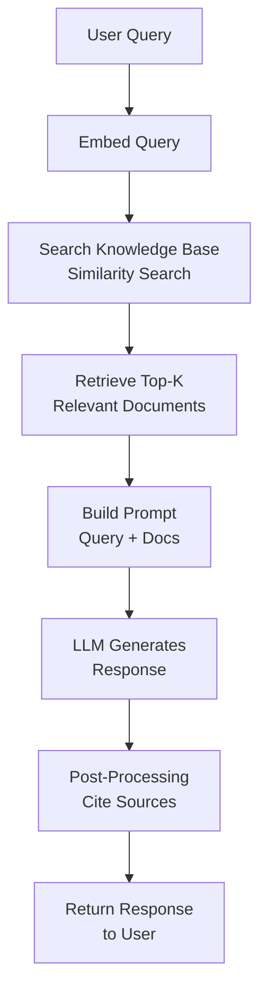

# Retrieval-Augmented Generation

## Detailed Explanation

Retrieval-augmented generation (RAG) combines information retrieval with LLM generation: agent searches external knowledge base, retrieves relevant documents, includes them in context, then generates response grounded in retrieved information. Core motivation: LLMs have knowledge cutoff and can hallucinate; RAG provides ground truth from documents. Mechanism: (1) user query → embed query, (2) search knowledge base for relevant documents, (3) add top-K results to context window, (4) LLM generates response conditioned on retrieved docs. Advantages: access to current information (documents can be updated daily), reduces hallucination (grounded in real data), enables fact-checking (cite sources), reduces token usage (retrieve only relevant, not entire knowledge base). Challenges: retrieval quality determines answer quality (bad retrieval → bad generation), latency (retrieval adds time), managing stale documents (old docs may be outdated), handling contradictions (multiple docs may disagree). Trade-offs: dense retrieval (embedding-based, fast but approximate) vs sparse retrieval (keyword-based, slow but precise), top-K size (larger = more context but slower, smaller = faster but may miss relevant info). Best for: factual QA (customer support, knowledge bases), current events (news, market data), large document collections where loading everything is infeasible.

## Core Intuition

Imagine answering a complex question. Instead of relying on memory alone (which is fallible and has cutoff date), you first search a library for relevant books, then read those books to construct your answer. Your answer is grounded in what the books say, you can cite sources, and your information is current (updated daily). RAG is this process for agents: search library (vector DB), read relevant docs, ground response in them.

## How It Works

RAG operates through retrieval, augmentation, and generation:

1. **Query Embedding** — Convert user query to embedding
2. **Retrieval** — Search knowledge base (vector DB, BM25, hybrid) for top-K similar documents
3. **Context Augmentation** — Add retrieved documents to prompt context
4. **Generation** — LLM generates response conditioned on query + retrieved docs
5. **Optional: Post-Processing** — Rank results by relevance, filter by confidence, cite sources



## Architecture / Trade-offs

**Retrieval Strategy:**
- **Dense (Embedding-based)** — Fast, semantic understanding, approximate. FAISS, Pinecone, vector DB
- **Sparse (Keyword-based)** — Slow, exact matching, limited semantic. BM25, TF-IDF
- **Hybrid** — Combine both for best of both. Balance speed and accuracy

**Knowledge Base:**
- **Unstructured (Raw documents)** — Easy to add, harder to search precisely
- **Structured (Database with schema)** — Hard to add, easy to search precisely
- **Chunked (Split long docs into passages)** — Balance between both

**Top-K Selection:**
- **Small K (1-3)** — Fast, limited context, risks missing relevant info
- **Large K (5-20)** — Slower, more context, risks irrelevant noise
- **Dynamic K** — Retrieve until confidence threshold met

**Ranking:**
- **Similarity only** — Simple, fast
- **Multi-factor (relevance + freshness + quality)** — Better results, slower
- **Reranking (retrieve 100, rerank to top-5)** — Best quality but expensive

## Interview Q&A

**Q: When should you use RAG vs fine-tuning?**
A: RAG for dynamic/changing information (current events, user data, FAQs). Fine-tuning for fixed knowledge that won't change (domain-specific reasoning, specific style). RAG is faster to update; fine-tuning is more capable but requires retraining. Use RAG for facts, fine-tuning for behavior.

**Q: How do you handle retrieval failure (document not in base)?**
A: (1) Return "I don't know" with confidence score, (2) Fall back to LLM's own knowledge with caveat, (3) Suggest user provide document or clarify, (4) Log for later indexing. Don't fabricate when retrieval fails.

**Q: What's the difference between dense and sparse retrieval?**
A: Dense (embeddings) captures semantic similarity ("dog" matches "canine") but is approximate; sparse (keywords) matches exact terms but misses synonyms. Hybrid combines both: use BM25 for recall, rerank with embeddings for relevance.

**Q: How do you handle long documents?**
A: Chunk into passages (250-500 tokens typical). Index passages, not full documents. When retrieving, return relevant passages, optionally include broader document context. Trade-off: small chunks = precise but lose context, large chunks = contextual but may include irrelevant.

**Q: How do you evaluate RAG quality?**
A: (1) Retrieval metrics: precision (are retrieved docs relevant?), recall (are all relevant docs retrieved?), (2) Generation metrics: does generated answer match ground truth?, (3) Latency: retrieval + generation time, (4) User satisfaction: A/B testing.

**Q: How do you handle outdated documents in knowledge base?**
A: (1) Add document timestamp, filter by recency, (2) Implement TTL (time-to-live)—remove docs older than threshold, (3) Version docs (keep history, but mark old versions), (4) Monitor for stale information in generation.

## Best Practices

1. **Right-Sized Context Window** — Include enough docs for coverage but not so many that LLM gets overwhelmed. Typical: 3-5 docs, each 500 tokens.

2. **Document Chunking Strategy** — Split long documents into passages that are semantically coherent. Test chunk size (250, 500, 1000 tokens) on your domain.

3. **Hybrid Retrieval** — Combine dense (semantic) and sparse (keyword) for best coverage. BM25 for recall, embeddings for relevance.

4. **Reranking** — Retrieve more (top-50), rerank to fewer (top-5). Improves quality without slowing initial retrieval.

5. **Metadata Filtering** — Include doc metadata (date, source, category) in search. Enables filtering ("news articles from last week", "internal docs only").

6. **Caching** — Cache common queries and their retrieval results. Many users ask similar questions.

7. **Citation** — Include document source in response. "According to X document, ..." builds trust.

8. **Confidence Scoring** — Return retrieval confidence. If low confidence, tell user.

9. **Feedback Loop** — When retrieval fails, log it. Use logs to improve: add documents, improve chunking, adjust embedding model.

10. **Regular Re-indexing** — Periodically rebuild index as docs change. Monthly re-index typical.

## Common Pitfalls

**Pitfall 1: Poor Retrieval Quality**
Issue: Retrieved docs irrelevant to query. LLM can't generate good response.
Fix: Validate retrieval independently. If retrieval quality <80%, improve before improving generation.

**Pitfall 2: Hallucinations Despite RAG**
Issue: LLM still makes up facts not in retrieved docs.
Fix: Add explicit prompt: "Answer only based on provided documents. If not found, say 'not found'."

**Pitfall 3: Context Overload**
Issue: Retrieve 50 documents, all in context. LLM drowns in information.
Fix: Limit to top-5 or dynamic cutoff. Rerank to reduce noise.

**Pitfall 4: Stale Documents**
Issue: Knowledge base outdated. User gets wrong information.
Fix: Track document age. Remove stale docs. Update docs regularly.

**Pitfall 5: Embedding Model Mismatch**
Issue: Use embedding model A to build index, but embedding model B to query. Terrible retrieval.
Fix: Use same embedding model throughout. Test model before committing.

**Pitfall 6: No Citation**
Issue: LLM generates response with retrieved docs but doesn't cite source.
Fix: Prompt explicitly to cite sources. Format: "Source: document_name"

**Pitfall 7: Ignoring Retrieval Latency**
Issue: Retrieval adds 100ms, generation adds 500ms. Response takes 600ms. User perceives slowness.
Fix: Cache frequent queries. Use approximate search. Stream results.

## Code Examples

### Example 1: Basic RAG with Embeddings

```python
import numpy as np
from typing import List, Tuple

class SimpleRAG:
    def __init__(self, documents: List[str]):
        self.documents = documents
        # In practice: use real embeddings (OpenAI, Sentence-BERT)
        self.embeddings = [self._mock_embed(doc) for doc in documents]
    
    def _mock_embed(self, text: str) -> np.ndarray:
        """Mock embedding (in reality: use real model)."""
        return np.random.randn(384)  # 384-dim vector
    
    def retrieve(self, query: str, top_k: int = 3) -> List[Tuple[str, float]]:
        """Retrieve top-K documents by similarity."""
        query_embedding = self._mock_embed(query)
        
        # Cosine similarity
        similarities = []
        for i, doc_embedding in enumerate(self.embeddings):
            similarity = np.dot(query_embedding, doc_embedding) / (
                np.linalg.norm(query_embedding) * np.linalg.norm(doc_embedding) + 1e-8
            )
            similarities.append((self.documents[i], similarity))
        
        # Sort by similarity, return top-K
        similarities.sort(key=lambda x: x[1], reverse=True)
        return similarities[:top_k]
    
    def build_context(self, query: str, top_k: int = 3) -> str:
        """Build context from retrieved documents."""
        retrieved = self.retrieve(query, top_k)
        context = f"Query: {query}\n\nRelevant documents:\n"
        for doc, score in retrieved:
            context += f"\n[Relevance: {score:.2f}] {doc}\n"
        return context

# Usage
documents = [
    "Python is a programming language created by Guido van Rossum.",
    "Machine learning is a subset of artificial intelligence.",
    "Paris is the capital of France and located on the Seine river."
]

rag = SimpleRAG(documents)
context = rag.build_context("What is the capital of France?", top_k=2)
print(context)
```

### Example 2: RAG with Reranking

```python
class RerankingRAG(SimpleRAG):
    def retrieve_and_rerank(self, query: str, initial_k: int = 10, final_k: int = 3) -> List[Tuple[str, float]]:
        """Retrieve more documents, then rerank to top-K."""
        # Stage 1: Retrieve initial_k (fast, approximate)
        initial_retrieved = self.retrieve(query, initial_k)
        
        # Stage 2: Rerank (more expensive but accurate)
        reranked = []
        for doc, initial_score in initial_retrieved:
            # Reranking: check how well doc answers query
            relevance_score = self._rerank_score(query, doc)
            reranked.append((doc, relevance_score))
        
        # Sort by rerank score, return final_k
        reranked.sort(key=lambda x: x[1], reverse=True)
        return reranked[:final_k]
    
    def _rerank_score(self, query: str, document: str) -> float:
        """Compute reranking score (in practice: use cross-encoder)."""
        # Simple heuristic: overlap between query and document keywords
        query_words = set(query.lower().split())
        doc_words = set(document.lower().split())
        overlap = len(query_words & doc_words) / (len(query_words) + 1)
        return overlap

# Usage
rag = RerankingRAG(documents)
retrieved = rag.retrieve_and_rerank("France capital", initial_k=5, final_k=2)
print("After reranking:")
for doc, score in retrieved:
    print(f"  {score:.2f}: {doc[:50]}...")
```

### Example 3: RAG with Citation and Metadata

```python
from dataclasses import dataclass
from datetime import datetime

@dataclass
class Document:
    id: str
    content: str
    source: str
    date: datetime
    category: str

class MetadataRAG:
    def __init__(self, documents: List[Document]):
        self.documents = documents
    
    def retrieve_with_metadata(self, query: str, top_k: int = 3, category: str = None) -> List[Document]:
        """Retrieve with metadata filtering."""
        candidates = self.documents
        
        # Filter by category if provided
        if category:
            candidates = [d for d in candidates if d.category == category]
        
        # Filter by recency (last 30 days)
        now = datetime.now()
        candidates = [d for d in candidates if (now - d.date).days < 30]
        
        # Mock retrieval (in practice: use embeddings)
        return candidates[:top_k]
    
    def format_with_citations(self, query: str, top_k: int = 3) -> str:
        """Format retrieved docs with citations."""
        retrieved = self.retrieve_with_metadata(query, top_k)
        
        context = f"Based on the following sources:\n\n"
        for i, doc in enumerate(retrieved, 1):
            context += f"[{i}] {doc.source} ({doc.date.strftime('%Y-%m-%d')})\n"
            context += f"    {doc.content[:100]}...\n\n"
        
        context += f"Answer to '{query}': [Generated response would cite sources]\n"
        
        return context

# Usage
docs = [
    Document("1", "Python 3.12 released in October 2023", "Python.org", datetime(2023, 10, 1), "news"),
    Document("2", "AI safety guidelines updated 2024", "OpenAI Blog", datetime(2024, 1, 15), "research"),
]

rag = MetadataRAG(docs)
result = rag.format_with_citations("Recent Python updates")
print(result)
```

## Related Concepts

- **Knowledge Graphs** — Structured representation of documents for better retrieval
- **Embedding Models** — Converting text to vectors for semantic search
- **Agent Loops** — RAG integrated into agent decision-making
- **Context Window Management** — Managing limited context with retrieved docs
- **Observability for Agents** — Monitoring RAG retrieval quality
- **Error Recovery** — Handling retrieval failures gracefully
