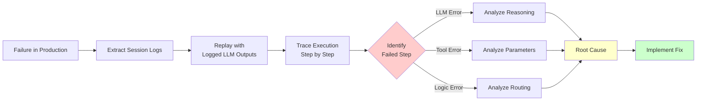
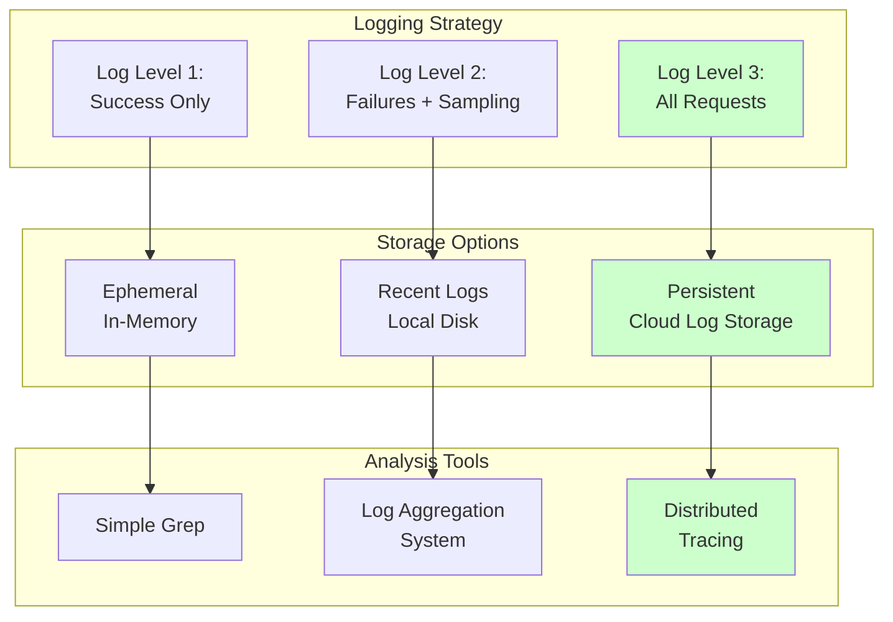

# Agent Debugging

## Detailed Explanation

Agent debugging is systematic investigation of agent failures after they occur. When an agent fails—reaches wrong conclusion, uses wrong tool, or takes too long—debugging answers: "What exactly happened and why?" Because agents are probabilistic (LLM sampling introduces randomness), failures are often non-deterministic, making debugging harder than traditional software. Core debugging techniques: comprehensive logging (capture every step, tool call, LLM response), execution tracing (visualize decision flow), deterministic replay (re-run same execution with fixed seeds), and root cause analysis (isolate which component failed—LLM reasoning, tool selection, tool parameter validation, result interpretation). Good debugging reduces investigation time from hours to minutes and prevents future similar failures. Production agents require debugging infrastructure: structured logs with session IDs, ability to replay specific requests, tracing tools to visualize multi-step flows, and runbooks for common failure patterns (hallucinated tool results, timeout loops, bad parameter extraction).

## Core Intuition

Debugging an agent is like debugging a colleague's multi-step work process: "What did they do at each step? Which step failed? Why did they choose that step?" You can't know without them showing you their work. With proper logging, you can replay and inspect every decision.

## How It Works

Agent debugging follows a systematic pipeline: a failure occurs, collect logs for that session, replay to confirm reproducibility, trace execution to pinpoint failure location, analyze root cause, implement fix, add regression test.

**Stage 1: Identify Failure**
Problem: Agent produced wrong output or failed to complete task.
- User reports: "Agent booked wrong flight"
- Monitoring alert: "Success rate dropped 15%"
- QA testing: "Test case failed intermittently"

**Stage 2: Collect & Structured Logging**
Log every step in agent execution with session ID for easy retrieval:
```
{
  "session_id": "sess_xyz789",
  "timestamp": "2026-05-17T10:30:45Z",
  "step": 1,
  "type": "llm_call",
  "prompt": "User query: ...",
  "model": "claude-3-5-sonnet-20241022",
  "response": "I will search for flights...",
  "tokens_used": 150
}
{
  "session_id": "sess_xyz789",
  "timestamp": "2026-05-17T10:30:46Z",
  "step": 2,
  "type": "tool_call",
  "tool": "search_flights",
  "parameters": {"from": "NYC", "to": "LA", "date": "2026-01-15"},
  "result": [{"id": "F001", "price": 350}],
  "status": "success"
}
{
  "session_id": "sess_xyz789",
  "timestamp": "2026-05-17T10:30:47Z",
  "step": 3,
  "type": "tool_call",
  "tool": "book_flight",
  "parameters": {"flight_id": "F001", "passenger": "John Doe"},
  "result": {"error": "Flight F001 not available"},
  "status": "error"
}
```

**Stage 3: Replay Execution (Deterministically)**
Re-run the session using logged inputs. Key challenge: LLM sampling is random, so identical prompts may produce different outputs. Options:
- Set temperature=0 (deterministic, but less natural)
- Store LLM response in log, don't re-run
- Use sampled seed to reproduce randomness



**Stage 4: Pinpoint Failure Location**
Trace shows: Step 1 (LLM reasoning) → good, Step 2 (tool selection) → good, Step 3 (tool call with params) → FAILED. Root causes:
- LLM chose wrong tool (reasoning error)
- LLM chose correct tool but with wrong parameters (extraction error)
- Tool returned error (tool reliability issue)
- Agent didn't handle tool error (recovery logic missing)

**Stage 5: Analyze Root Cause**
For each failure type, different analysis:
- LLM reasoning error: Show prompt + response to LLM expert, ask "what misled the model?"
- Parameter extraction error: Check if tool requires reformatting (e.g., "2026-01-15" format)
- Tool failure: Check if tool was unavailable, had rate limits, returned malformed response
- Logic error: Is there a decision point that was wrong (e.g., "retry with different parameters" didn't trigger)

**Stage 6: Implement Fix**
- Reasoning errors: improve prompt clarity, add examples
- Parameter errors: add validation and reformatting
- Tool errors: add fallback tool, add retry logic with backoff
- Logic errors: add explicit error handling, fix state transitions

**Stage 7: Regression Testing**
Add failed case to test suite to prevent regression.

## Architecture / Trade-offs

Debugging infrastructure must balance comprehensiveness (log everything) vs overhead (logging costs CPU, storage). Strategies differ by deployment phase and cost tolerance.



**Key Trade-offs:**

1. **Logging Granularity:** Log only failures (cheap, misses context) vs log all requests (comprehensive but expensive). Best: log failures 100%, sample successes 10%, log all in production incidents.

2. **Determinism vs Realism:** Set temperature=0 for reproducibility but loses natural variation. Recommendation: log LLM outputs in production, use those for replay. Don't re-sample.

3. **PII in Logs:** Logging user queries may expose sensitive data. Implement: redaction (remove email, phone), sampling (don't log all user data), encryption at rest, access control.

4. **Tracing Overhead:** Structured tracing on every request adds latency. Sampling: only trace 1% of requests in production, trace 100% in staging.

## Interview Q&A

**Q: How do you debug when an agent produces a wrong answer?**
A: Systematic approach: (1) identify exact session using timestamp/user ID, (2) retrieve all logs for that session, (3) replay to confirm reproducibility, (4) trace execution step-by-step to find where it diverged, (5) analyze root cause at that step (was it LLM reasoning, wrong tool, bad parameters, or logic error?), (6) fix that component, (7) add regression test. Takes 10-30 minutes with good infrastructure, hours without.

**Q: Why is deterministic replay hard with LLMs?**
A: LLMs use sampling (temperature > 0) to avoid repeating same outputs. Different runs of same prompt produce different answers. Solution: (1) In production, log the LLM's actual response so you can replay with that exact output, (2) In testing, use temperature=0 for reproducibility, or (3) If re-sampling is necessary, use a fixed seed to make randomness reproducible (though this isn't guaranteed across LLM versions).

**Q: What should you log for debugging?**
A: Minimum: session ID, timestamp, step number, component type (llm_call, tool_call, decision), inputs, outputs, status (success/error). For failures additionally log: error message, stack trace, context (prior steps). Avoid: raw user data, API keys, large data structures. Use: structured JSON logging with consistent schema for easy parsing.

**Q: How do you handle PII in logs?**
A: Don't log raw user queries if they contain sensitive data (email, SSN, etc.). Options: (1) redact before logging (mask email as "***@***.com"), (2) hash and store mapping separately, (3) only log non-sensitive fields (task type, not content), (4) add encryption at rest for logs, (5) implement access control (only engineers can read production logs). Recommendation: combine redaction + encryption + access control.

**Q: How do you distinguish between LLM error, tool error, and logic error?**
A: Trace the execution: Step 1 (LLM reasoning about task) — look at LLM output, does it make sense? Step 2 (tool selection) — did agent choose correct tool or wrong one? Step 3 (parameter extraction) — did agent extract parameters correctly? Step 4 (tool invocation) — did tool accept parameters or return error? Step 5 (result interpretation) — did agent understand tool result? Each step narrows failure cause. Example: Tool returned 3 flights, agent selected flight 1 → tool error not agent error.

**Q: Can you replay a multi-step agent loop?**
A: Yes, if you've logged tool results. Pseudocode: (1) get logged session, (2) for each step, extract LLM input, (3) replay LLM call (use logged response if available, or re-sample), (4) extract tool calls from response, (5) inject logged tool results instead of calling tool, (6) continue to next step. This avoids re-executing tools (which may have side effects) while testing LLM logic.

**Q: What are common failure modes?**
A: (1) Hallucinated tool results — agent claims tool returned data it didn't, (2) Wrong tool selection — agent chose search instead of book, (3) Parameter extraction error — agent wrote "date: Tomorrow" instead of "2026-01-15", (4) Infinite loop — agent keeps retrying same failed tool, (5) Timeout — agent spent too long on one step, (6) Prompt injection — user input tricked agent into wrong behavior. Each requires different debugging approach.

## Best Practices

1. **Structured logging from start.** Define log schema early: session_id, timestamp, step, component_type, inputs, outputs, status. Consistent schema makes parsing/analysis 10x easier. Use JSON format for searchability.

2. **Log with session IDs.** Every request gets unique session_id. Use session_id in all logs for that request. When user reports "my booking failed", instantly search logs by session_id, get full trace.

3. **Store LLM outputs in logs.** Don't just store tokens_used. Store actual LLM responses so you can replay without re-querying API. Saves cost and enables offline debugging.

4. **Include error context.** When step fails, log not just "Error: timeout" but also context: what tool was calling, what parameters, how long it had been running. Context cuts debugging time 5x.

5. **Sample wisely for cost.** Log 100% of failures, sample 10% of successes. In staging, log 100%. In production, reduce to stay within storage budget. Failures are rare (1-5%), successes are common (95-99%).

6. **Set up log aggregation.** Use system to aggregate logs (CloudWatch, Datadog, ELK stack). Enable: search by session_id, filter by status (errors only), sort by timestamp. Manual log hunting is too slow.

7. **Create runbooks for common failures.** When you debug failure, document it: "Type: Hallucinated tool result. Symptoms: agent claims tool returned X but log shows Y. Fix: add validation step after tool calls." Next time this happens, operator follows runbook instead of investigating from scratch.

8. **Test your debugging tools.** Ensure replay works, ensure tracing captures all steps, ensure log search is fast. Break these in production → can't debug when you need to. Test regularly on known-good sessions.

9. **Automate failure reproduction.** When test fails, automatically capture and store full logs. Engineer can then replay locally. Reproducing locally is faster than debugging in production.

10. **Link logs to monitoring.** When monitoring alert fires ("Success rate dropped"), include link to sample of failed sessions' logs. Operator clicks link, sees traces of failed requests, debugs in 5 minutes vs 2 hours.

## Common Pitfalls

**Pitfall 1: No Logs**
Issue: Agent failed 2 hours ago. By the time alert fires, logs are gone. Can't debug.
Fix: Log everything (failures) + sample (successes). Store for ≥7 days. Cost is cheap compared to debugging time.

**Pitfall 2: Insufficient Context**
Issue: Log says "Tool error: failed". But which tool? What parameters? What was user asking? Can't debug.
Fix: Log inputs, outputs, and context. When step fails, log everything needed to understand: prior steps, current state, parameters, error.

**Pitfall 3: Non-Deterministic Logs**
Issue: Try to replay failure. LLM produces different output this time (random sampling). Can't tell if fix worked.
Fix: In logs, store the LLM's original response. When replaying, use stored response (don't re-query). This makes replay deterministic.

**Pitfall 4: PII Leakage**
Issue: Log user's email address, credit card, SSN. Logs exposed in breach. Privacy violation.
Fix: Redact sensitive data before logging. Use regex to mask PII: "***@***.com" instead of "user@example.com".

**Pitfall 5: Logs Too Verbose**
Issue: Every log entry is 10KB. Millions of requests → petabytes of storage.
Fix: Log structured data, not raw objects. Store IDs not full objects. Example: log "user_id: 123" not "user: {...full profile...}".

**Pitfall 6: Debugging Blind**
Issue: Agent failed. Engineer thinks they know the cause, implements fix without seeing logs. Fix doesn't work.
Fix: Always look at actual logs first. Let data guide hypothesis, not intuition.

**Pitfall 7: Unfixable After Discovery**
Issue: Discover failure 1 week later. Investigate logs, find it was caused by API change 3 days ago. By then, too late to correlate.
Fix: Implement monitoring + alerting so failures detected within hours, not days. Include timestamps for correlation.

## Code Examples

### Example 1: Structured Logging with Session Tracking

```python
import json
import logging
import uuid
from anthropic import Anthropic

client = Anthropic()

class DebuggedAgent:
    """Agent with comprehensive structured logging."""
    def __init__(self, log_file="agent_debug.jsonl"):
        self.log_file = log_file
        self.session_id = str(uuid.uuid4())[:8]
        self.step_counter = 0
    
    def log(self, component_type: str, inputs: dict, outputs: dict, status: str = "success"):
        """Structured logging with session ID."""
        self.step_counter += 1
        log_entry = {
            "session_id": self.session_id,
            "timestamp": __import__("datetime").datetime.utcnow().isoformat(),
            "step": self.step_counter,
            "component_type": component_type,
            "inputs": inputs,
            "outputs": outputs,
            "status": status
        }
        
        with open(self.log_file, "a") as f:
            f.write(json.dumps(log_entry) + "\n")
        
        if status == "error":
            print(f"⚠️ Step {self.step_counter} failed: {component_type}")
    
    def execute_task(self, task: str):
        """Execute with full logging."""
        # Step 1: LLM reasoning
        llm_input = {"prompt": task}
        response = client.messages.create(
            model="claude-3-5-sonnet-20241022",
            max_tokens=256,
            messages=[{"role": "user", "content": task}]
        )
        llm_output = {"response": response.content[0].text, "tokens": response.usage.input_tokens}
        self.log("llm_reasoning", llm_input, llm_output)
        
        return {"session_id": self.session_id, "result": llm_output["response"]}

# Test
agent = DebuggedAgent()
result = agent.execute_task("What is 2+2?")
print(f"\nSession: {result['session_id']}")
```

### Example 2: Replay Mechanism with Logged LLM Outputs

```python
import json

class ReplayableAgent:
    """Agent with replay capability using logged outputs."""
    def __init__(self, log_file="execution_log.jsonl"):
        self.log_file = log_file
        self.logs = []
    
    def load_session(self, session_id: str):
        """Load all logs for a session."""
        self.logs = []
        with open(self.log_file, "r") as f:
            for line in f:
                log = json.loads(line)
                if log.get("session_id") == session_id:
                    self.logs.append(log)
        return self.logs
    
    def replay(self, session_id: str, verbose: bool = True):
        """Replay execution using logged outputs."""
        logs = self.load_session(session_id)
        
        print(f"Replaying session {session_id} ({len(logs)} steps)")
        
        for log in logs:
            step = log["step"]
            component = log["component_type"]
            inputs = log["inputs"]
            outputs = log["outputs"]
            status = log["status"]
            
            status_indicator = "✓" if status == "success" else "✗"
            print(f"  {status_indicator} Step {step}: {component}")
            
            if status == "error":
                print(f"     Input: {str(inputs)[:60]}")
                print(f"     Error: {str(outputs)[:60]}")
            
            if verbose:
                print(f"     Output: {str(outputs)[:80]}")
        
        return logs

# Test
replayer = ReplayableAgent()
# Assuming we have logs, replay a session
# logs = replayer.replay("sess_xyz789")
print("Replayer ready. Use replay('session_id') to debug.")
```

### Example 3: Tracing Execution Flow with Root Cause Analysis

```python
class ExecutionTracer:
    """Trace execution and identify root cause of failures."""
    def __init__(self):
        self.trace = []
    
    def record(self, step: dict):
        """Record step in trace."""
        self.trace.append(step)
    
    def analyze_failure(self):
        """Analyze trace to find root cause."""
        for i, step in enumerate(self.trace):
            if step.get("status") == "error":
                return self._diagnose_step(i)
        return {"diagnosis": "No failures found"}
    
    def _diagnose_step(self, failure_step_idx: int):
        """Diagnose what went wrong at failure step."""
        failed_step = self.trace[failure_step_idx]
        component = failed_step.get("component_type")
        
        diagnosis = {
            "failed_step": failure_step_idx,
            "component": component,
            "inputs": failed_step.get("inputs"),
            "error": failed_step.get("outputs", {}).get("error")
        }
        
        # Root cause analysis
        if component == "tool_call":
            diagnosis["root_cause"] = "Tool failed or returned error"
            diagnosis["fix"] = "Check tool parameters, add error handling"
        elif component == "llm_reasoning":
            diagnosis["root_cause"] = "LLM chose wrong path"
            diagnosis["fix"] = "Improve prompt, add examples"
        elif component == "parameter_extraction":
            diagnosis["root_cause"] = "Failed to extract parameters"
            diagnosis["fix"] = "Add validation, reformatting"
        
        return diagnosis

# Test
tracer = ExecutionTracer()
tracer.record({"step": 1, "component_type": "llm_reasoning", "status": "success"})
tracer.record({"step": 2, "component_type": "tool_call", "inputs": {"tool": "search"}, "outputs": {"error": "Invalid params"}, "status": "error"})

diagnosis = tracer.analyze_failure()
print(f"Diagnosis: {json.dumps(diagnosis, indent=2)}")
```

## Related Concepts

- **Agent Evals** — One-time testing before production; debugging is post-production failure analysis
- **Agent Monitoring** — Detects that failures occurred; debugging explains why
- **Agent Testing** — Prevents failures through comprehensive testing before deployment
