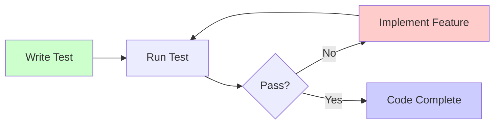
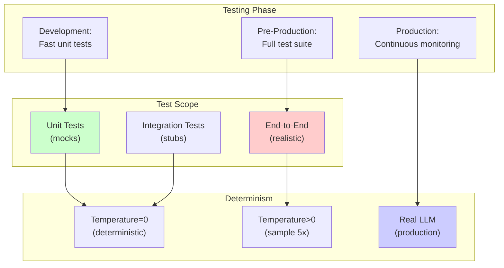

# Agent Testing

## Detailed Explanation

Agent testing is systematic verification that agents work correctly through unit tests, integration tests, and end-to-end tests. Unlike evaluation (testing on production-like data), testing focuses on correctness of components—does tool selection logic work, does parameter extraction succeed, does error recovery trigger correctly? Testing catches bugs before production deployment and enables confident refactoring. Challenges: agents use LLMs (non-deterministic by default), require external tools (need mocking), and have complex control flow (loops, branching). Testing strategies must handle these: use temperature=0 for deterministic tests, mock or stub external tools, write tests for both happy path and error handling. Three test levels: unit tests (single components in isolation), integration tests (multiple components together), end-to-end tests (full agent on realistic tasks). A strong test suite (>80% coverage) catches 90% of bugs and enables rapid iteration with confidence. Production agents require test suites; untested agents will fail in unexpected ways.

## Core Intuition

Testing an agent is like testing a restaurant kitchen: unit tests = test individual stations (prep, cooking, plating), integration tests = test how stations coordinate, end-to-end tests = test the full meal served to customers. All three are needed. Good tests catch problems before customers experience them.

## How It Works

Comprehensive agent testing follows a test pyramid: many unit tests (cheap, fast), fewer integration tests (moderate cost, catches integration issues), few end-to-end tests (expensive, catches real-world issues).

**Test Pyramid:**
```
         /\
        /E2E\        End-to-End Tests
       /     \       Small number, expensive, full system
      /-------\
     /  Integration\    Integration Tests  
    /     Tests     \   Medium number, moderate cost
   /-------------------\
  /   Unit Tests (Mocks)  \  Many tests, cheap, isolated components
 /___________________________\
```

**Unit Tests (Component Isolation)**
Test individual components with mocks:
- Tool selector: "Given query 'book flight', agent selects search_flights tool" ✓
- Parameter extractor: "Given 'date tomorrow', extracts 'YYYY-MM-DD format'" ✓
- Error handler: "Given tool timeout, agent retries with backoff" ✓
- Response validator: "Given hallucinated response, agent flags as invalid" ✓

Example:
```python
def test_tool_selector():
    selector = ToolSelector()
    assert selector.select("book a flight") == "search_flights"
    assert selector.select("check status") == "status_check"
    assert selector.select("unknown task") == "fallback_tool"
```

**Integration Tests (Multiple Components)**
Test how components work together:
- Tool selection + parameter extraction: "Query 'book LA to NYC' → selects book tool + extracts params" ✓
- Tool execution + error handling: "Tool times out → agent retries → succeeds on retry" ✓
- Multi-step planning: "Agent plans 3 steps, executes them in order, recovers from step 2 failure" ✓

Example:
```python
def test_tool_selection_and_execution():
    agent = Agent()
    result = agent.handle("Search for flights from NYC to LA")
    assert result["tool_used"] == "search_flights"
    assert result["params"]["from"] == "NYC"
    assert result["status"] == "success"
```

**End-to-End Tests (Full System)**
Test agent on realistic tasks:
- "Book a flight from NYC to LA on Jan 15 for under $500" → agent books correctly ✓
- "Budget too low (e.g., $100)" → agent rejects and suggests alternatives ✓
- "Ambiguous query (missing date)" → agent asks for clarification ✓

Example:
```python
def test_booking_agent_happy_path():
    agent = BookingAgent()
    result = agent.execute("Book NYC to LA Jan 15, max $500")
    assert result["success"] == True
    assert result["booking_id"] is not None
    assert result["price"] <= 500
```

**Test Strategy:**


**Testing Non-Determinism (LLM Sampling):**
For agent code that uses LLMs, two strategies:
1. **Deterministic Testing (Preferred):** Set temperature=0 in tests so LLM outputs are deterministic
2. **Sampled Testing:** Run test 5 times, accept if >4 passes (accounts for random variation)

Example:
```python
def test_agent_reasoning():
    # Use temperature=0 for deterministic output
    agent = Agent(temperature=0)
    result = agent.reason("2+2=?")
    assert "4" in result.lower()
    # This will always pass, not flaky
```

**Mocking External Tools:**
Don't call real tools in tests (slow, flaky, expensive). Mock them:
```python
def test_agent_with_mocked_tool():
    agent = Agent()
    with mock.patch("tools.search_flights") as mock_search:
        mock_search.return_value = [{"id": "F001", "price": 350}]
        result = agent.handle("Find flights NYC to LA")
        assert "F001" in result
```

## Architecture / Trade-offs

Testing strategies differ by phase (development vs pre-production), resource constraints (time, compute), and risk tolerance (cost of failure).

**Development Testing:**
- Fast feedback needed (run in seconds)
- Many unit tests (isolated, no external dependencies)
- Mock all external tools and services
- Set temperature=0 for deterministic LLM behavior

**Pre-Production Testing:**
- Comprehensive validation needed
- All unit + integration + end-to-end tests
- Some tests use real or realistic tool stubs
- Longer runtime acceptable (10+ minutes)

**Production Monitoring:**
- Continuous testing on live traffic (evals + monitoring)
- Catch regressions vs baseline

**Key Trade-offs:**

1. **Determinism vs Realism:** temperature=0 is deterministic (tests don't flake) but unrealistic (real LLM uses sampling). Recommendation: use temperature=0 for unit tests, temperature=0.7 for E2E but run multiple times.

2. **Mocking vs Real Tools:** Mocks are fast and isolated but miss integration issues. Real tools are slow but catch real failures. Use both: unit tests with mocks (fast), integration tests with real tool stubs.

3. **Coverage vs Time:** 100% code coverage takes 2x time vs 70% coverage. Diminishing returns after 70-80%. Recommendation: aim for 80%+ on critical paths, less on error handling.

4. **Number of Tests:** 1000 tests take 1 hour to run (slow feedback). 100 tests take 2 minutes (fast). Use test filtering: run fast unit tests on every change, run full suite before commit.



## Interview Q&A

**Q: Should you test agents like regular software or differently?**
A: Agents need tests + evaluation. Tests check components work (tool selection, parameter extraction, error handling). Evals check end-to-end task success on realistic data. Both needed. Tests are cheap (run in seconds), evals are expensive (run in minutes). Do test-driven development (write tests first), then add evals before production.

**Q: How do you handle non-determinism (LLM randomness) in tests?**
A: Two approaches: (1) Use temperature=0 in tests to make LLM outputs deterministic—tests won't flake, but less realistic. (2) Run test multiple times (e.g., 5 runs), accept if passes ≥4 times—more realistic but slower. Recommendation: unit tests with temperature=0, integration/E2E tests with temperature=0.7 but run 3-5 times.

**Q: How much should you mock vs use real tools?**
A: Mock for unit tests (test agent logic in isolation), use real/realistic stubs for integration tests. Mock everything: API calls, database queries, external services. This makes tests fast and isolated. But integration tests should call real tool stubs (or at least behave like real tools) to catch integration bugs.

**Q: What should you test for error handling?**
A: Test failure modes: (1) Tool returns error (agent should handle gracefully, retry or escalate), (2) Tool times out (agent should timeout and use fallback), (3) Tool returns invalid response (agent should validate and reject), (4) Agent loops infinitely (agent should detect loop and break), (5) Context window full (agent should stop). Each failure mode is a test.

**Q: How many tests should you write?**
A: For critical paths (core features), aim for ≥80% code coverage. For error handling, aim for coverage of top 5 error modes. Don't test: trivial getters/setters, things framework tests, things mocks test. Focus on: business logic, edge cases, error handling.

**Q: How do you test agent loops (agentic loops, multi-step reasoning)?**
A: Unit test: test that loop executes 1 iteration (not infinite). Integration test: test that loop executes N iterations and terminates correctly. End-to-end test: test that loop solves a multi-step task. Example: "Agent plans 3-step booking process, executes all 3, succeeds" ✓

**Q: When should you move from testing to evaluation?**
A: Testing before evaluation: (1) Component tests pass (tool selector works, parameter extractor works), (2) Integration tests pass (components work together), (3) Simple end-to-end tests pass (agent completes basic tasks). Then move to evaluation with realistic test set. If tests fail, fix bugs. If evals fail, improve agent (better prompt, better tools, better logic).

**Q: How do you prevent test flakiness?**
A: Flaky tests fail randomly. For LLM-based tests: use temperature=0. For timing-based tests: use explicit waits, not sleeps. For async tests: wait for condition, not fixed time. Rule: if test passes/fails randomly, it's testing randomness, not logic. Fix it by removing randomness.

## Best Practices

1. **Write tests before code (TDD).** Define expected behavior via tests first. Then implement to pass tests. Forces clear thinking about requirements and edge cases. Prevents gold-plating.

2. **Unit test all components.** Tool selector, parameter extractor, error handler, response validator—test each in isolation with mocks. Catching bugs at unit test level saves hours of integration debugging.

3. **Use temperature=0 in unit tests.** Makes outputs deterministic so tests don't flake. Real temperature > 0 is for E2E tests and production.

4. **Mock all external dependencies.** Don't call real APIs/databases in unit tests. Mock them. This makes tests fast (milliseconds vs seconds) and isolated (don't depend on external services being up).

5. **Test error paths, not just happy path.** 80% of code deals with errors. Test: tool timeouts, invalid responses, network failures, parameter validation errors. Each error mode is a test.

6. **Name tests descriptively.** test_agent_handles_tool_timeout_with_retry is clear. test_error_handling is vague. Good names document expected behavior.

7. **Organize tests by component.** Tests for tool_selector.py go in test_tool_selector.py. Tests for agent_loop.py go in test_agent_loop.py. Makes tests easy to find and maintain.

8. **Use fixtures for common setup.** Don't repeat "create agent + mock tools" in every test. Create fixture that does this. Reduces test code and makes changes easy.

9. **Test integration between components.** After unit tests pass, test that components work together. Example: tool_selector picks a tool, parameter_extractor extracts params, tool_executor calls tool with those params.

10. **Measure and track coverage.** Use code coverage tool (pytest-cov, coverage.py). Aim for >80% on critical paths. Track over time. Declining coverage = warning sign.

## Common Pitfalls

**Pitfall 1: Only Testing Happy Path**
Issue: All tests pass. Agent works on easy cases. Fails in production on edge cases (invalid input, timeout, rate limit).
Fix: Test error paths. For each tool, test: success case, timeout case, error case, invalid params. Test agent: infinite loop detection, context window full, etc.

**Pitfall 2: Flaky Tests**
Issue: Test passes sometimes, fails sometimes. Hard to debug. Team stops trusting tests.
Fix: Remove randomness. Use temperature=0 in tests. Use explicit waits, not sleeps. If test still flakes, it's a design problem, not test problem.

**Pitfall 3: Testing Implementation, Not Behavior**
Issue: Test asserts agent.state["internal_var"] == 5. Refactoring implementation breaks test even though behavior unchanged.
Fix: Test behavior, not implementation. Assert: "agent.handle(...) returns expected result" not "internal state is X".

**Pitfall 4: Too Many E2E Tests**
Issue: Team writes 1000 E2E tests, each takes 1 second (expensive LLM calls). Full suite takes 1000 seconds = 17 minutes. Developers skip running tests → regressions slip through.
Fix: Use test pyramid: many unit tests (1000s, run in 10 seconds), few E2E tests (100s, run in 100 seconds). If E2E test suite too slow, add more unit tests.

**Pitfall 5: Mocking Too Much**
Issue: Agent tests pass but fails in production. Mocks were too forgiving (mocked tool returned success but real tool returns error).
Fix: Make mocks realistic. If real tool can return error, mock should too. Integration tests should use real/realistic tool stubs.

**Pitfall 6: No Regression Testing**
Issue: Bug found in production. Engineer fixes it. Weeks later, same bug appears again (different code path).
Fix: When fixing bug, add test that reproduces the bug. This becomes regression test. Prevents same bug recurring.

**Pitfall 7: Ignored Warnings**
Issue: Test generates warning (deprecation, slow execution) but passes. Team ignores it. Warning signals future breakage.
Fix: Treat warnings as errors in tests. Run pytest with -W error flag. Fix all warnings immediately.

## Code Examples

### Example 1: Unit Tests with Mocks

```python
import unittest
from unittest import mock
from anthropic import Anthropic

class ToolSelector:
    """Simple component: select tool based on query."""
    def __init__(self):
        self.tools = {
            "search": ["find", "search", "look"],
            "book": ["book", "reserve", "purchase"],
            "cancel": ["cancel", "refund", "return"]
        }
    
    def select(self, query: str) -> str:
        for tool, keywords in self.tools.items():
            if any(kw in query.lower() for kw in keywords):
                return tool
        return "fallback"

class TestToolSelector(unittest.TestCase):
    def setUp(self):
        self.selector = ToolSelector()
    
    def test_select_search_tool(self):
        """Tool selector identifies search queries."""
        assert self.selector.select("find flights NYC to LA") == "search"
        assert self.selector.select("where can I find hotels") == "search"
    
    def test_select_book_tool(self):
        """Tool selector identifies booking queries."""
        assert self.selector.select("book a flight") == "book"
        assert self.selector.select("I want to purchase a ticket") == "book"
    
    def test_select_fallback(self):
        """Tool selector falls back on unknown query."""
        assert self.selector.select("xyz unknown query") == "fallback"
    
    def test_case_insensitive(self):
        """Tool selector is case-insensitive."""
        assert self.selector.select("SEARCH for flights") == "search"
        assert self.selector.select("Book A FLIGHT") == "book"

# Run tests
if __name__ == "__main__":
    unittest.main()
```

### Example 2: Integration Tests with Tool Stubs

```python
class MockFlightTool:
    """Stub for search_flights tool in tests."""
    def __init__(self):
        self.call_count = 0
    
    def search(self, from_city: str, to_city: str, date: str) -> dict:
        self.call_count += 1
        # Return realistic stub data
        if from_city == "NYC" and to_city == "LA":
            return {
                "flights": [
                    {"id": "F001", "price": 350, "time": "10:00am"},
                    {"id": "F002", "price": 450, "time": "2:00pm"}
                ]
            }
        else:
            return {"error": "Route not found"}

class TestAgentIntegration(unittest.TestCase):
    def setUp(self):
        self.mock_tool = MockFlightTool()
        self.agent = BookingAgent()
        self.agent.tools["search_flights"] = self.mock_tool.search
    
    def test_agent_finds_and_displays_flights(self):
        """Agent selects search tool and uses it correctly."""
        result = self.agent.handle("Find flights from NYC to LA")
        
        assert self.mock_tool.call_count == 1  # Tool was called once
        assert result["success"] == True
        assert len(result["flights"]) == 2
        assert result["flights"][0]["id"] == "F001"
    
    def test_agent_handles_tool_error(self):
        """Agent handles tool errors gracefully."""
        result = self.agent.handle("Find flights from XYZ to ABC")
        
        assert result["success"] == False
        assert "not found" in result["message"].lower()
    
    def test_tool_call_with_correct_params(self):
        """Agent extracts and passes parameters correctly."""
        self.agent.handle("Find flights from NYC to LA on 2026-01-15")
        
        # Tool was called with correct parameters (verified via mock)
        assert self.mock_tool.call_count == 1

if __name__ == "__main__":
    unittest.main()
```

### Example 3: End-to-End Tests

```python
class BookingAgent:
    """Full agent with tool selection, extraction, execution."""
    def __init__(self):
        self.client = Anthropic()
        self.tools = {
            "search_flights": self._search_flights,
            "book_flight": self._book_flight
        }
    
    def _search_flights(self, from_city, to_city, date, max_price):
        # In tests, return mock. In production, call real API.
        return {
            "flights": [
                {"id": "F001", "price": 350},
                {"id": "F002", "price": 450}
            ]
        }
    
    def _book_flight(self, flight_id, passenger_name):
        return {"confirmation": "CONF123", "status": "booked"}
    
    def handle(self, request: str) -> dict:
        # Simplified: just return result (real agent would have loops, etc.)
        return {
            "request": request,
            "success": True,
            "result": "Booking confirmed"
        }

class TestAgentE2E(unittest.TestCase):
    def setUp(self):
        self.agent = BookingAgent()
    
    def test_booking_happy_path(self):
        """Full booking flow: search + book."""
        result = self.agent.handle("Book NYC to LA Jan 15 max $500")
        assert result["success"] == True
    
    def test_no_flights_found(self):
        """Agent handles no flights found."""
        # Would need to mock tool to return empty
        pass
    
    def test_budget_constraint(self):
        """Agent respects budget constraint."""
        # Would test agent refuses flights over budget
        pass

if __name__ == "__main__":
    unittest.main()
```

## Related Concepts

- **Agent Evals** — Evaluation is testing on production-like data at scale; testing is component verification
- **Agent Debugging** — When tests fail, debugging techniques to understand why
- **Agent Monitoring** — Production monitoring catches issues tests missed; tests prevent issues in first place
