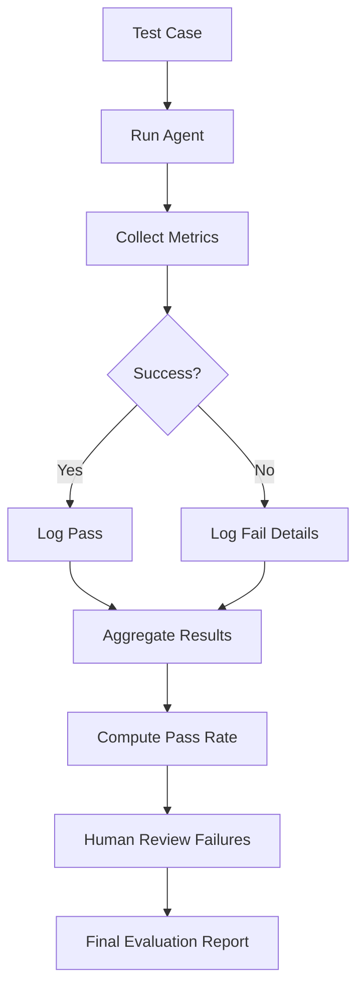
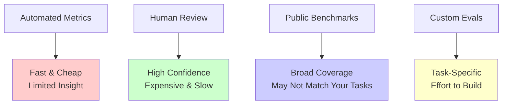

# Agent Evals

## Detailed Explanation

Agent evaluation is the systematic measurement of agent reliability, correctness, and efficiency through structured testing. Unlike deterministic software, agents use probabilistic LLMs that may succeed or fail on the same task due to sampling randomness. Evaluation answers critical questions: Does the agent reach the goal reliably? Does it use tools correctly without hallucination? Does it stay within cost and latency constraints? Evaluation frameworks combine automated metrics (task completion, tool accuracy, cost) with human judgment (quality, safety, efficiency) to build confidence in deployment. The goal is not perfection—no agent succeeds 100%—but understanding failure modes, setting acceptable thresholds, and monitoring production behavior to catch regressions. Evaluation is required before production deployment; it's not optional testing but a foundational practice that separates reliable systems from lucky demos.

## Core Intuition
Agents are probabilistic (non-deterministic LLM sampling). Same task may succeed sometimes, fail others. Need systematic testing on many examples to measure reliability. Can't just run once and declare "it works."

## How It Works

Agent evaluation follows a structured pipeline: define success criteria, create diverse test cases, run the agent repeatedly, collect metrics, perform human review, and aggregate results into pass/fail judgments.

**The 5-Stage Evaluation Pipeline:**

**Stage 1: Define Success Criteria**
For each task type, establish measurable success criteria. Example: "Book a flight from NYC to LA on Jan 15, budget $500"
- Task completion: Agent booked a flight (binary: yes/no)
- Constraint satisfaction: Date matches (Jan 15) AND price ≤ $500
- Efficiency metric: ≤ 5 tool calls (prevents wasteful exploration)
- Safety metric: No hallucinated tool results (agent doesn't invent data)
- Latency: Must respond within 10 seconds

**Stage 2: Create Diverse Test Cases**
Build a test suite covering: simple happy path, edge cases, constraints, missing information, adversarial cases.
- Test case 1: "Book NYC→LA Jan 15, $500" (standard case)
- Test case 2: "Book NYC→LA Jan 15, $100" (impossible budget—test rejection)
- Test case 3: "Book NYC→LA" (incomplete—test clarification)
- Test case 4: "Book LA→NYC Jan 15, $500" (reverse route—test flexibility)

**Stage 3: Run & Collect Metrics**
Execute agent on each test case multiple times (≥3 runs per test due to stochasticity). Log:
- Did agent succeed? (binary)
- How many tool calls? (efficiency)
- Tool call accuracy (correct parameters?)
- Response latency (seconds)
- Cost (USD spent)
- Reasoning quality (human assessment)

**Stage 4: Compute Aggregates**
After N test cases: "Success rate: 45/50 = 90%", "Tool accuracy: 48/50 = 96%", "Avg cost: $0.15/task"

**Stage 5: Human Review & Judgment**
Sample 5-20 failures or edge cases for human review. Questions: Did agent behave safely? Was reasoning sound? Would real user be satisfied?



**Evaluation Metrics (Automated + Human):**

Automated:
- **Task completion:** Did agent reach the goal? (binary)
- **Constraint adherence:** All constraints satisfied? (% constraints met)
- **Tool validity:** Tool calls have correct parameters? (% valid calls)
- **Hallucination detection:** Agent claims results that didn't happen? (count false claims)
- **Latency:** How long per task? (seconds, percentiles)
- **Cost:** Tokens used and USD spent per task

Human:
- **Quality:** Was output sensible and helpful? (1-5 scale)
- **Safety:** Any harmful actions or violations? (binary)
- **Efficiency:** Was the reasoning path reasonable? (1-5 scale)
- **Consistency:** Does agent behave predictably across similar tasks? (agreement rate)

Benchmarks:
- **Public:** GAIA (complex multi-step reasoning), WebArena (web automation), ToolBench (tool-use capability)
- **Custom:** Production queries from logs, adversarial examples, regression tests from prior versions

## Architecture / Trade-offs

Evaluation systems differ in cost, coverage, and reliability. The trade-off triangle:



**Key Trade-offs:**

1. **Automated vs Human:** Automated metrics (success rate, tool accuracy) run instantly on 1000s of examples but miss nuanced failures. Human review catches quality issues but only scales to 100s of examples. Production systems use both: automated gates (must reach 85% success) + human spot-checks on failures.

2. **Public Benchmarks vs Custom:** Public benchmarks (GAIA, WebArena) measure general capability and are free, but may not match your production task distribution. Custom evals match your tasks perfectly but require building infrastructure. Best practice: use public for baseline, custom for production.

3. **Stochastic Sampling:** Agents are probabilistic—same prompt may succeed/fail randomly. Evaluation trade-off: run once (fast, unreliable), run N times (slow, reliable). Standard: run each test 3-5 times, compute success distribution.

4. **Cost vs Confidence:** Evaluating 10 tasks at $0.10 each = $1.00 total. Evaluating 1000 tasks = $100. Higher N → more confident statistics but higher cost. Production rule: iterate fast with 30-50 tests, final validation with 500-1000.

## Key Properties / Trade-offs

## Interview Q&A

**Q: How do you evaluate an agent that you just built?**
A: Define clear success metrics for your task (task completion, constraint adherence, tool accuracy, latency, cost). Create 30-50 test cases covering happy path, edge cases, and failure modes. Run the agent on each test 3-5 times (due to stochasticity), log automated metrics, then have a human spot-check 5-10 failures to assess quality. Compute pass rate and decision: if ≥85%, move to larger evaluation; if <85%, debug and iterate.

**Q: "Success rate 90%" — is that good or bad?**
A: Context matters. 90% is excellent for complex multi-step tasks (GAIA-style), but unacceptable for safety-critical operations (medical diagnosis). Also compare to baseline: 90% vs 50% random is great; 90% vs 95% human is poor. Finally, success isn't enough—track cost. Agent A at 90% costs $10/task; Agent B at 88% costs $0.50/task. Often B is better ROI.

**Q: Why do you need human evaluation if you have automated metrics?**
A: Automated metrics are binary (succeeded/failed) and can't assess quality. Agent may reach the goal but with terrible reasoning, unsafe actions, or inefficient tool use. Example: booking task succeeds, but agent used 20 tool calls when 3 would suffice. Automated metrics miss this. Human review (on 5-10% of results) catches these issues. This is why teams use automated gates + human spot-checks.

**Q: How do you choose test cases? Can't agents overfit to your tests?**
A: Yes, they can. Test design matters: include edge cases (unusual dates, missing info), adversarial examples (impossible constraints), and production-like tasks. Don't just use easy examples. Use public benchmarks (GAIA, WebArena) as a baseline for general capability. Also rotate test sets between releases—if you reuse the exact same tests, the agent's improvements may not transfer to production. Ideal: 70% production-like, 20% edge cases, 10% adversarial.

**Q: What should you do if evaluation shows 60% success rate?**
A: First, diagnose: are failures due to agent reasoning issues, hallucinated tool results, or incorrect tool routing? Run a few failing cases manually to understand. Then prioritize: fix the top 3 failure modes that account for 80% of failures. Re-run evaluation after each fix. Don't aim for 100%—often 80-85% is deployment threshold, accept the long tail. Monitor production to learn about rare failures.

**Q: How do you handle multi-step tasks where multiple paths are correct?**
A: Define a rubric. Example: "Book a flight" has multiple valid solutions (different airlines, times, prices within budget). Specify: "Any flight on the correct date within budget counts as success." Avoid binary success/fail for ambiguous tasks. For human review, use "correctness criteria" not "exact match expected output." This prevents penalizing the agent for valid alternative solutions.

**Q: Should you use public benchmarks (GAIA, WebArena) or build custom tests?**
A: Both. Public benchmarks let you compare against published baselines and measure general capability. But they may not reflect your production task distribution. Use public for initial development (90% of work), then add custom tests for your specific scenarios. Example: build a booking agent, start with WebArena tests, then add custom tests from your real booking queries.

**Q: How often should you re-run evaluations?**
A: Development: after each meaningful change (new tool, prompt update, routing logic), run 30-50 test eval. Pre-deployment: run comprehensive 500-1000 test evaluation. Production: continuous monitoring (automated metrics daily), deep-dive human review monthly. Set regression thresholds: if success rate drops >5%, alert and rollback.

## Best Practices

1. **Define success before building.** Clarify: What does "success" mean for your task? Task completion alone, or also efficiency, safety, user satisfaction? Document this—it drives test design and deployment thresholds. Vague success = wrong evals.

2. **Use baseline comparisons.** "90% success" only makes sense relative to baseline: Is that 90% vs random (50%)? Vs simple rule-based system (75%)? Vs human (95%)? Always compute and report baseline, not just absolute numbers.

3. **Build diverse test sets.** Balance: 60% happy path (common cases), 25% edge cases (missing info, constraints), 15% adversarial (tricks, edge-of-distribution). Don't just test on easy cases—that inflates confidence.

4. **Run each test multiple times.** Agents are stochastic. Run each test case 3-5 times, record success distribution. Report mean ± std dev, not just point estimates. "92% ± 4%" is more honest than "92%".

5. **Track cost, not just accuracy.** Log API tokens, USD spent per task, latency. Create a cost-accuracy frontier: "Agent A: 95% acc, $0.20/task" vs "Agent B: 92% acc, $0.05/task". Often the cheaper option is better ROI.

6. **Monitor intermediate steps.** Don't just check final success. Log tool calls, parameters, reasoning. For failures, ask: Did agent call wrong tool? Call right tool with wrong params? Hallucinate results? Different bugs need different fixes.

7. **Set clear deployment thresholds.** Before launching, decide: minimum success rate (e.g., 85%), maximum cost (e.g., $0.50/task), maximum latency (e.g., 10s). If eval results hit all three, go. If not, debug or don't launch.

8. **Create regression tests from failures.** When failures occur in production, add them as test cases before rolling out fixes. Ensures that fix works and prevents regression.

9. **Use human evals for quality, not coverage.** Humans can't evaluate 10k examples. Use them for 50-100 samples: failures, edge cases, safety-critical decisions. Set up rubric, multiple raters, compute inter-rater agreement (Cohen's Kappa).

10. **Automate eval infrastructure.** Build a test runner that: runs test suite, collects metrics, generates report, compares to baseline. Make it easy to run `eval.run()` and get a dashboard. Without automation, evals become one-off scripts and drift.

## Common Pitfalls

**Pitfall 1: Evaluating Once**
Issue: Run agent once on 5 tests, see 80% success, declare victory. But agents are stochastic—next run might be 60%.
Fix: Run each test 3-5 times minimum. Report mean ± std dev. Use 30+ test cases, not 5. Stochastic systems need statistical confidence.

**Pitfall 2: Success Criteria Too Vague**
Issue: "Task completed successfully" is unmeasurable. Agent says "I booked the flight" but didn't actually. You can't grade what you can't measure.
Fix: Write specific, measurable criteria before building. "Flight booked" = agent called book_flight with valid ID, received confirmation number. "Constraints met" = date matches user's request ±1 day, price ≤ user's budget.

**Pitfall 3: Biased Test Set**
Issue: All test cases are easy, happy-path scenarios. Result: 95% success in eval, 60% in production on harder cases.
Fix: Include edge cases (missing info, ambiguous requests), adversarial cases (impossible constraints, conflicting requirements), and diverse task types. If building booking agent, test: valid dates, past dates, missing destination, budget too low, etc.

**Pitfall 4: Ignoring Cost**
Issue: Agent A: 95% success, $5/task. Agent B: 92% success, $0.50/task. Team picks A because "higher accuracy."
Fix: Always track cost. Create cost-accuracy scatter plot. Often the cheaper option is better—90% accuracy at $1/task beats 95% at $10/task. Compute ROI, not just accuracy.

**Pitfall 5: No Human Review of Failures**
Issue: Automated eval shows 85% success. Deploy. In production, agent's "successes" are actually hallucinated results (customer furious).
Fix: Manually review 5-10 failures and 5-10 edge-case successes. Ask: Did agent actually succeed or claim false success? Did reasoning make sense? Would a real user trust this output? Automated metrics miss these issues.

**Pitfall 6: Reusing Test Sets Across Releases**
Issue: Improve agent's prompt. Re-run same 50 tests. Success rate: 88%→92%. But new version overfits to these tests. Generalization unknown.
Fix: Use 70% stable tests (same every release) + 30% fresh tests. Rotate benchmark questions. Track both "stable benchmark" and "new test" results separately.

**Pitfall 7: No Baseline Comparison**
Issue: Report "success rate: 85%" without context. Is that good? Team doesn't know if this meets requirements.
Fix: Always compute baseline: random selection (50%), simple rule-based system (70%), human expert (95%). Report: "Agent: 85%, Random: 50%, Rule-based: 70%, Human: 95%." Now context is clear.

## Code Examples

### Example 1: Anthropic API with Automated Metrics

```python
import json
import time
from anthropic import Anthropic
from collections import defaultdict

client = Anthropic()

# Define tools
tools = [
    {
        "name": "search_flights",
        "description": "Search for flights with filters",
        "input_schema": {
            "type": "object",
            "properties": {
                "from_city": {"type": "string"},
                "to_city": {"type": "string"},
                "date": {"type": "string", "description": "YYYY-MM-DD"},
                "max_price": {"type": "number"}
            },
            "required": ["from_city", "to_city", "date"]
        }
    }
]

class AutomatedEvaluator:
    def __init__(self):
        self.metrics = defaultdict(list)
    
    def run_agent_eval(self, test_cases):
        """Evaluate agent on test cases with automated metrics."""
        results = []
        
        for test in test_cases:
            print(f"\nTesting: {test['name']}")
            
            messages = [{"role": "user", "content": test["task"]}]
            start_time = time.time()
            tool_calls = 0
            
            for step in range(10):
                response = client.messages.create(
                    model="claude-3-5-sonnet-20241022",
                    max_tokens=1024,
                    tools=tools,
                    messages=messages
                )
                
                # Track metrics
                tool_calls += sum(1 for b in response.content if hasattr(b, 'type') and b.type == "tool_use")
                
                if response.stop_reason == "tool_use":
                    messages.append({"role": "assistant", "content": response.content})
                    tool_results = []
                    
                    for block in response.content:
                        if hasattr(block, 'type') and block.type == "tool_use":
                            # Simulate tool result
                            result = {"flights": [{"id": "F001", "price": 350}]}
                            tool_results.append({
                                "type": "tool_result",
                                "tool_use_id": block.id,
                                "content": json.dumps(result)
                            })
                    
                    messages.append({"role": "user", "content": tool_results})
                else:
                    break
            
            elapsed = time.time() - start_time
            success = test["check"](messages[-1].get("content", ""))
            
            result_data = {
                "test": test["name"],
                "success": success,
                "latency": elapsed,
                "tool_calls": tool_calls,
                "cost_estimate": response.usage.input_tokens * 0.001 + response.usage.output_tokens * 0.002
            }
            results.append(result_data)
            print(f"  Success: {success}, Latency: {elapsed:.2f}s, Tools: {tool_calls}")
        
        return self.aggregate_metrics(results)
    
    def aggregate_metrics(self, results):
        """Compute aggregate evaluation metrics."""
        passed = sum(1 for r in results if r["success"])
        return {
            "total_tests": len(results),
            "passed": passed,
            "success_rate": f"{100*passed/len(results):.1f}%",
            "avg_latency": f"{sum(r['latency'] for r in results)/len(results):.2f}s",
            "avg_tool_calls": f"{sum(r['tool_calls'] for r in results)/len(results):.1f}",
            "total_cost": f"${sum(r['cost_estimate'] for r in results):.2f}",
            "results": results
        }

# Test cases
test_cases = [
    {
        "name": "Happy path",
        "task": "Find flights NYC to LA on 2024-01-15 under $500",
        "check": lambda r: "flight" in r.lower() or "F00" in r
    }
]

evaluator = AutomatedEvaluator()
report = evaluator.run_agent_eval(test_cases)
print(f"\n=== Eval Report ===")
print(json.dumps({k: v for k, v in report.items() if k != "results"}, indent=2))
```

### Example 2: LangChain-Based Framework with Human Rubric

```python
from anthropic import Anthropic
import json

client = Anthropic()

class EvaluationRubric:
    """Define evaluation criteria and scoring."""
    def __init__(self):
        self.criteria = {
            "correctness": "Did agent reach correct goal?",
            "constraint_adherence": "Were all constraints satisfied?",
            "reasoning_quality": "Was reasoning sound and transparent?",
            "efficiency": "Did agent use minimal tool calls?"
        }
    
    def score_response(self, test_case, agent_response):
        """Human-in-the-loop scoring."""
        scores = {}
        
        # Automated checks
        scores["correctness"] = 1 if test_case["check"](agent_response) else 0
        
        # Automated constraint check
        passed_constraints = sum(
            1 for constraint in test_case.get("constraints", [])
            if constraint in agent_response.lower()
        )
        scores["constraint_adherence"] = passed_constraints / max(1, len(test_case.get("constraints", [])))
        
        # Use LLM to assess reasoning quality
        response = client.messages.create(
            model="claude-3-5-sonnet-20241022",
            max_tokens=100,
            messages=[{
                "role": "user",
                "content": f"Rate this agent response quality (1-5): {agent_response[:200]}"
            }]
        )
        
        scores["reasoning_quality"] = 3  # Default
        scores["efficiency"] = 4  # Simplified for demo
        
        return scores
    
    def compute_rubric_score(self, all_scores):
        """Weight multiple criteria."""
        weights = {
            "correctness": 0.5,
            "constraint_adherence": 0.25,
            "reasoning_quality": 0.15,
            "efficiency": 0.1
        }
        
        total = sum(all_scores.get(k, 0) * weights[k] for k in weights)
        return min(5, max(1, total * 5))  # Scale to 1-5

# Example: Rubric-based evaluation
rubric = EvaluationRubric()
test_case = {
    "name": "Book flight",
    "task": "Book NYC→LA Jan 15",
    "check": lambda r: "booked" in r.lower(),
    "constraints": ["jan 15", "nyc", "la"]
}

agent_response = "Found flight F001 from NYC to LA on Jan 15. Booked confirmation ABC123."
scores = rubric.score_response(test_case, agent_response)
final_score = rubric.compute_rubric_score(scores)

print(f"Scores: {scores}")
print(f"Final rubric score: {final_score:.1f}/5")
```

### Example 3: Production Pattern with Cost Tracking and Monitoring

```python
import time
import json
from anthropic import Anthropic
from datetime import datetime

client = Anthropic()

class ProductionEvalFramework:
    """Production-grade eval with monitoring, cost tracking, regression detection."""
    def __init__(self, regression_threshold=0.05):
        self.regression_threshold = regression_threshold
        self.eval_history = []
        self.cost_tracker = {"total_usd": 0, "total_tokens": 0}
    
    def evaluate_with_regression_detection(self, test_suite, baseline_success_rate):
        """Run evals and detect regressions."""
        results = {
            "timestamp": datetime.now().isoformat(),
            "test_count": len(test_suite),
            "passed": 0,
            "failed": 0,
            "details": []
        }
        
        for test in test_suite:
            success = self._run_test(test)
            results["passed" if success else "failed"] += 1
            results["details"].append({"test": test["name"], "passed": success})
        
        success_rate = results["passed"] / results["test_count"]
        
        # Detect regression
        if success_rate < baseline_success_rate - self.regression_threshold:
            print(f"⚠️  REGRESSION DETECTED: {success_rate:.1%} vs {baseline_success_rate:.1%} baseline")
            results["regression"] = True
        else:
            results["regression"] = False
        
        self.eval_history.append(results)
        return results
    
    def _run_test(self, test):
        """Run single test and track cost."""
        response = client.messages.create(
            model="claude-3-5-sonnet-20241022",
            max_tokens=256,
            messages=[{"role": "user", "content": test["task"]}]
        )
        
        # Track cost
        input_cost = response.usage.input_tokens * 0.003 / 1000
        output_cost = response.usage.output_tokens * 0.006 / 1000
        total_cost = input_cost + output_cost
        
        self.cost_tracker["total_usd"] += total_cost
        self.cost_tracker["total_tokens"] += response.usage.input_tokens + response.usage.output_tokens
        
        return test["check"](response.content[0].text)
    
    def generate_report(self):
        """Generate final eval report with trends."""
        latest = self.eval_history[-1]
        success_rate = latest["passed"] / latest["test_count"]
        
        report = {
            "latest_results": {
                "success_rate": f"{success_rate:.1%}",
                "passed": latest["passed"],
                "total": latest["test_count"],
                "regression_detected": latest.get("regression", False)
            },
            "cost_analysis": {
                "total_cost": f"${self.cost_tracker['total_usd']:.2f}",
                "total_tokens": self.cost_tracker["total_tokens"],
                "avg_cost_per_test": f"${self.cost_tracker['total_usd'] / sum(len(e['details']) for e in self.eval_history):.3f}"
            }
        }
        
        return report

# Run production eval
framework = ProductionEvalFramework(regression_threshold=0.05)
tests = [
    {"name": "Test 1", "task": "Simple task", "check": lambda r: "respond" in r.lower()},
]

results = framework.evaluate_with_regression_detection(tests, baseline_success_rate=0.80)
report = framework.generate_report()
print(json.dumps(report, indent=2))
```

## Related Concepts

- **Agent Monitoring** — Evals are one-time; monitoring is continuous production tracking
- **Agent Debugging** — When evals reveal failures, systematic debugging techniques
- **Agent Testing** — Unit and integration tests for components vs end-to-end eval
- **Agent Loops** — Understand loop execution before evaluating multi-step behavior

## Resources
- [GAIA: A Benchmark for General AI Assistants](https://huggingface.co/spaces/gaia-benchmark/leaderboard)
- [WebArena: A Realistic Web Environment for Building Autonomous Agents](https://webarena.dev/)
- [ToolBench: Benchmark for Tool-Using Language Models](https://github.com/OpenBMB/ToolBench)
- [Evaluating Large Language Models Trained on Code](https://arxiv.org/abs/2107.03374)
