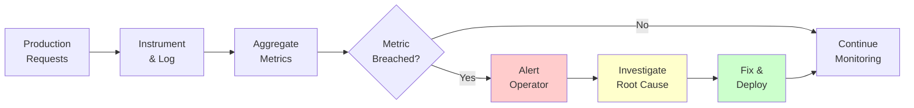
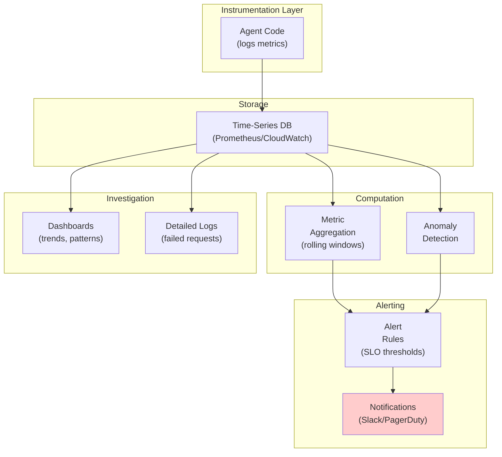

# Agent Monitoring

## Detailed Explanation

Agent monitoring is continuous production observation of agent behavior to detect failures, degradation, cost anomalies, and hallucinations. Unlike evaluation (one-time testing), monitoring runs perpetually on live traffic. Key metrics include: success rate (did agent complete task?), tool accuracy (were tool calls valid?), latency (response time), cost (tokens spent), and hallucination rate (false claims in output). Monitoring differs from system monitoring (uptime, server health) because it focuses on agent *intelligence*—does the LLM's reasoning still work, or has it regressed? Real-world agents degrade over time: distribution shift (user queries change), model drift (base model gets updated), or new failure modes (previously unseen tasks). Monitoring must set Service Level Objectives (SLOs): "Success rate ≥ 85%", "P95 latency < 5 seconds", "Cost < $0.50/task". When SLOs breach, alert and trigger investigation. Good monitoring catches regressions within hours, not days.

## Core Intuition

Production agents are like medical devices: they must work reliably and we must know immediately when they don't. A doctor monitors a patient's vitals continuously—heart rate, blood pressure, oxygen—not just once per day. Similarly, monitor agent metrics continuously, alert on anomalies, investigate regressions before they compound into disasters.

## How It Works

Agent monitoring consists of six stages: define metrics and SLOs, instrument code to collect data, aggregate metrics continuously, detect anomalies, alert operators, and investigate root causes.

**Stage 1: Define Metrics & SLOs**
Choose metrics relevant to your task:
- Task completion (binary: succeeded/failed)
- Tool accuracy (% of tool calls with valid parameters)
- Latency (seconds from user query to response)
- Cost (USD or tokens spent)
- Hallucination rate (agent claims things that didn't happen)
- User satisfaction (optional: post-task rating)

Set SLOs (Service Level Objectives):
- Success rate ≥ 85% (minimum acceptable completion)
- P95 latency ≤ 5s (95th percentile response time)
- Cost ≤ $0.50/task (acceptable cost per request)
- Tool accuracy ≥ 95% (valid tool calls)
- Hallucinations ≤ 2% (false claims detected)

**Stage 2: Instrument Code**
Log every agent execution:
```
{
  "timestamp": "2026-05-17T10:30:45Z",
  "user_id": "user123",
  "task": "Book flight NYC to LA",
  "success": true,
  "latency_seconds": 2.3,
  "tokens_input": 150,
  "tokens_output": 100,
  "cost_usd": 0.35,
  "tool_calls": [
    {"name": "search_flights", "valid": true},
    {"name": "book_flight", "valid": true}
  ],
  "hallucinations_detected": 0
}
```

**Stage 3: Aggregate & Compute**
Every minute (or hour), compute rolling windows:
- Last 1 hour success rate: 87% (pass ✓)
- Last 1 hour P95 latency: 4.2s (pass ✓)
- Last 1 hour cost: $0.42/task (pass ✓)
- Last 24 hours trend: -2% success rate (watch)

**Stage 4: Detect Anomalies**
Continuously check if metrics fall below SLOs or drift:
```
if success_rate < 0.85:
    alert("⚠️ Success rate {rate:.1%} below SLO 85%")

if cost_per_task > 0.50:
    alert("💰 Cost spike: ${cost} per task (SLO: $0.50)")

if latency_p95 > 5.0:
    alert("⏱️ Latency degradation: {latency:.1f}s (SLO: 5s)")
```

**Stage 5: Alert & Escalate**
Alert operator when SLO breached:
- Severity 1 (critical): Success < 80%, immediate escalation
- Severity 2 (high): Success < 85%, within 30 minutes
- Severity 3 (medium): Cost spike 2x normal, within 1 hour
- Severity 4 (low): Hallucination rate increasing, daily review

**Stage 6: Investigate Root Cause**
When alert fires, investigate:
- Did LLM model change? (check deployment history)
- Did user traffic change? (new use cases?)
- Did tools become unreliable? (check tool error logs)
- Did prompts change? (check prompt version)
- Is this expected? (seasonal pattern, test data)



## Architecture / Trade-offs

Monitoring systems must balance latency (how fast to detect), cost (overhead of logging/aggregation), and accuracy (false alerts vs missed issues).

**Monitoring Architecture Pattern:**
- **Instrumentation:** Log agent metrics after every request (5-10KB per request)
- **Storage:** Write to time-series database (Prometheus, InfluxDB, CloudWatch)
- **Aggregation:** Compute metrics every 1-5 minutes (rolling windows)
- **Alerting:** Threshold-based (SLO breach) or statistical (anomaly detection)
- **Dashboards:** Visualize trends, enable investigation



**Key Trade-offs:**

1. **Granularity vs Cost:** Log every request (100% data) is expensive. Sample 10% of requests (10% cost) misses rare failure modes. Best: always log failures, sample successes.

2. **Latency vs Accuracy:** Alert after 1 minute of data (fast) → false alerts on noise. Alert after 1 hour (accurate) → slow to detect real issues. Best: use both immediate thresholds (hard failures) and 1-hour aggregates (trends).

3. **Alerting Threshold:** SLO too strict (85% success) → frequent false alerts, alert fatigue. SLO too loose (50% success) → miss real problems. Best: set SLO just below observed stable performance, adjust after weeks of data.

4. **Centralized vs Edge:** Send all logs to central monitoring (full observability) but high bandwidth. Monitor locally at agent (fast) but miss cross-agent patterns. Best: log locally, aggregate centrally.

## Interview Q&A

**Q: What should you monitor on an agent in production?**
A: Success rate (task completion %), tool accuracy (valid tool calls %), latency (response time), cost (per task), and hallucination rate (false claims detected). Additionally track: error types (what fails), user satisfaction (if available), and resource usage. Start with these 6 core metrics, add others as needed.

**Q: How do you detect when an agent has regressed?**
A: Set SLOs before deploying: "Success ≥ 85%, Latency < 5s, Cost < $0.50/task." After deployment, compute rolling windows (hourly) and alert if any SLO breached. Also track trends: if success rate drops 5% over a week, investigate even if above SLO. Use both absolute thresholds (hard failures) and relative change (drift detection).

**Q: An agent's success rate dropped from 90% to 85%. What could cause this?**
A: Root causes: (1) Input distribution changed—user queries are now harder or different from training, (2) Tool reliability degraded—API started returning errors, (3) Model behavior changed—LLM updated or new prompt deployed, (4) Natural variation—random noise, collect more data to confirm trend. Investigate in this order: check deployment history (code/model changes?), check tool error logs, check user query patterns, look at specific failures (what tasks now fail?).

**Q: Should you alert on every SLO breach or aggregate?**
A: Aggregate. One success failure from 100 tests is noise, not a breach. Alert when metric breaches over rolling window: "Success rate < 85% over last 1 hour." Avoid per-request alerting (alert fatigue). For critical failures (tool calls fail 50%+ of time), alert immediately. Rule: immediate alerts for failures affecting >10% of requests, hourly aggregates for smaller changes.

**Q: How do you monitor hallucinations if users don't always provide feedback?**
A: Three approaches: (1) Automated detection—check if agent's tool calls actually return what agent claims (mismatch = hallucination), (2) Regex patterns—flag suspicious phrases ("research shows" without citation, specific numbers without source), (3) Sampled human review—weekly, randomly sample 20 conversations and have human check for false claims. Combine all three; no single method catches all hallucinations.

**Q: Can you test monitoring without production traffic?**
A: Yes. Use synthetic traffic: create representative test cases (booking, Q&A, etc.), run them through the agent, log metrics as if production. Deploy to staging environment, run synthetic workload, verify dashboards show expected values. This catches monitoring bugs before production. Then run canary: route 1% of real traffic to new version, monitor for 1 hour, gradually increase to 100%.

**Q: What's the difference between evals and monitoring?**
A: Evals are one-time: before deployment, run 500 tests, check success rate 90%, decide "deploy." Monitoring is continuous: after deployment, check success rate every hour, alert if drops below 85%. Evals answer "is this ready?" Monitoring answers "is this still working?" You need both: evals to gate deployment, monitoring to catch regressions.

**Q: How do you handle seasonal or expected degradation?**
A: Understand your baseline first. Track metrics over weeks/months to see patterns: maybe success drops on weekends (harder requests) or spikes on holidays (simpler requests). Set SLOs with this understanding: "Success ≥ 85% on weekdays, ≥ 80% on weekends." When deploying, don't expect immediate improvement—often there's a ramp period where metrics improve gradually. Use A/B tests to isolate impact of changes.

## Best Practices

1. **Start with 3 core metrics:** Success rate, latency, cost. Master these before adding hallucination detection, user satisfaction, etc. These three answer: "Does it work, is it fast, is it expensive?"

2. **Set SLOs before deploying.** Define success criteria before launch, don't adjust after seeing results. Example: "We will deploy when success rate ≥ 85%, latency < 5s, cost < $0.50/task." Record baseline metrics before launch, set SLOs 5-10% below baseline to catch degradation.

3. **Log everything, sample wisely.** Always log failures (100% coverage). Sample successes proportionally: 100% of failures, 10% of successes. Saves storage while catching all issues.

4. **Aggregate before alerting.** Don't alert on per-request metrics. Use rolling windows (1-hour aggregates minimum). For critical issues, alert immediately; for trends, wait for aggregation.

5. **Distinguish signal from noise.** One failure from 100 requests is noise (1% rate, within normal variation). 10 failures from 100 requests is a signal (10% rate, above expected). Use statistical thresholds, not hard counts.

6. **Create dashboards for investigation.** After alert fires, operators need instant visibility: success rate trend, error types, specific failed requests, recent deployments. Build dashboards that enable 2-minute diagnosis.

7. **Track errors by type.** Don't just count failures. Break down: "10% fail due to tool not found", "5% fail due to timeout", "2% fail due to hallucinated results". Different failure types need different fixes.

8. **Monitor your monitoring.** Ensure monitoring infrastructure itself is reliable. If alert system fails, you're blind. Set up meta-monitoring: "Is data flowing into monitoring system?" Daily check: "Did we log at least 100 requests today?"

9. **Use historical data for baselines.** After 1-2 weeks of data, compute baseline metrics (mean, std dev). Set alert thresholds relative to baseline: alert if >2σ from mean. This prevents false positives from natural variation.

10. **Create runbooks for common alerts.** When "Success < 85%" fires, what should operator do? Write it down: check recent deployments, check tool error logs, check user query patterns, investigate top failure modes. Runbooks speed diagnosis from 30 min to 5 min.

## Common Pitfalls

**Pitfall 1: Monitoring Only Success/Fail**
Issue: Success rate 90%, but latency grew 10x and cost 5x. Success metric is "green" so team assumes no problem.
Fix: Track all 3 core metrics: success rate, latency, cost. Alert if any degrades. A "successful" but slow and expensive agent is still a problem.

**Pitfall 2: No Baseline Comparison**
Issue: Deploy new agent. Success rate: 85%. Good or bad? Team doesn't know. Spend 2 days investigating before realizing it's normal.
Fix: Measure baseline metrics (old agent or rule-based fallback) before deployment. Set SLOs relative to baseline: "new agent ≥ old agent success rate". Use this for quick pass/fail judgments.

**Pitfall 3: Alert Fatigue**
Issue: Alert fires every 5 minutes: "Latency 4.9s" (SLO 5.0s). Team mutes alerts. Then real crisis happens (latency 20s) but alert ignored.
Fix: Aggregate before alerting. Use rolling windows (1-hour minimum). Alert only when breach is sustained (>5 min), not momentary spikes. This reduces false alerts 10x.

**Pitfall 4: Can't Reproduce Failures**
Issue: Production alert: "Success 60%". Investigate failures. Run same requests locally in staging: success 95%. Why the discrepancy?
Fix: Log everything needed to reproduce: full user query, agent state, LLM response, tool calls, tool results. Store failed requests separately. When alert fires, instantly access a failed request to reproduce locally.

**Pitfall 5: Ignoring Cost**
Issue: Agent success rate 95% but cost $2/task (SLO $0.50). Team celebrates success without realizing it's economically unviable.
Fix: Always track and alert on cost. Create cost-quality frontier: "95% success at $2/task" vs "90% success at $0.50/task". Compare business metrics, not just accuracy.

**Pitfall 6: Monitoring Lag**
Issue: Agent fails at 2pm. Team discovers at 5pm. By then, 3 hours of failures served to users.
Fix: Use low-latency alerting. Aggregate every 1-5 minutes, alert immediately on breach. For critical systems, check key metrics every 30 seconds. Catch issues within 15 minutes.

**Pitfall 7: No Investigation Process**
Issue: Alert fires: "Success 75%". Team spends 2 hours guessing causes. No structured investigation process.
Fix: Write runbooks for each alert type. When alert fires, follow runbook: check deployments, check tool errors, check user patterns, look at failed requests. Runbook reduces investigation time 10x.

## Code Examples

### Example 1: Anthropic API with Basic Metrics Logging

```python
import json
import time
from anthropic import Anthropic
from datetime import datetime

client = Anthropic()

class MonitoredAgent:
    """Agent with automatic metrics logging."""
    def __init__(self, metrics_log_file="agent_metrics.jsonl"):
        self.metrics_log_file = metrics_log_file
        self.slos = {
            "success_rate": 0.85,
            "latency_seconds": 5.0,
            "cost_usd": 0.50
        }
    
    def execute_task(self, task: str, success_check: callable) -> dict:
        """Execute task and log metrics."""
        start_time = time.time()
        
        try:
            response = client.messages.create(
                model="claude-3-5-sonnet-20241022",
                max_tokens=256,
                messages=[{"role": "user", "content": task}]
            )
            
            result_text = response.content[0].text
            success = success_check(result_text)
            
            # Calculate metrics
            latency = time.time() - start_time
            cost = (response.usage.input_tokens * 0.003 + 
                   response.usage.output_tokens * 0.006) / 1000
            
            # Log metrics
            metrics = {
                "timestamp": datetime.utcnow().isoformat(),
                "task": task[:50],
                "success": success,
                "latency_seconds": round(latency, 2),
                "tokens_input": response.usage.input_tokens,
                "tokens_output": response.usage.output_tokens,
                "cost_usd": round(cost, 4)
            }
            
            # Append to log
            with open(self.metrics_log_file, "a") as f:
                f.write(json.dumps(metrics) + "\n")
            
            # Check SLOs
            self._check_slos(metrics)
            
            return {"success": success, "result": result_text, "metrics": metrics}
        
        except Exception as e:
            metrics = {
                "timestamp": datetime.utcnow().isoformat(),
                "task": task[:50],
                "success": False,
                "error": str(e)[:100]
            }
            with open(self.metrics_log_file, "a") as f:
                f.write(json.dumps(metrics) + "\n")
            
            raise
    
    def _check_slos(self, metrics: dict):
        """Check if metrics violate SLOs."""
        if metrics.get("latency_seconds", 0) > self.slos["latency_seconds"]:
            print(f"⏱️  ALERT: Latency {metrics['latency_seconds']}s > SLO {self.slos['latency_seconds']}s")
        
        if metrics.get("cost_usd", 0) > self.slos["cost_usd"]:
            print(f"💰 ALERT: Cost ${metrics['cost_usd']} > SLO ${self.slos['cost_usd']}")
    
    def get_metrics_summary(self, last_n_logs: int = 100):
        """Compute metrics from logs."""
        logs = []
        with open(self.metrics_log_file, "r") as f:
            for i, line in enumerate(f):
                if i >= max(0, sum(1 for _ in open(self.metrics_log_file)) - last_n_logs):
                    logs.append(json.loads(line))
        
        if not logs:
            return None
        
        successes = sum(1 for log in logs if log.get("success", False))
        valid_logs = [l for l in logs if "latency_seconds" in l]
        
        return {
            "total": len(logs),
            "success_rate": f"{100*successes/len(logs):.1f}%",
            "avg_latency": f"{sum(l['latency_seconds'] for l in valid_logs)/len(valid_logs):.2f}s" if valid_logs else "N/A",
            "total_cost": f"${sum(l.get('cost_usd', 0) for l in logs):.2f}"
        }

# Test
agent = MonitoredAgent()
for i in range(3):
    result = agent.execute_task(
        f"Question {i}: 2+2=?",
        lambda r: "4" in r
    )
    print(f"Task {i+1}: {result['success']}")

print(f"\nMetrics: {json.dumps(agent.get_metrics_summary(last_n_logs=3), indent=2)}")
```

### Example 2: Anomaly Detection with Statistical Thresholds

```python
import json
from collections import deque
from statistics import mean, stdev

class AnomalyDetector:
    """Detect anomalies using statistical thresholds."""
    def __init__(self, window_size: int = 100, z_threshold: float = 2.0):
        self.window_size = window_size
        self.z_threshold = z_threshold  # Alert if >2 std devs from mean
        self.success_window = deque(maxlen=window_size)
        self.latency_window = deque(maxlen=window_size)
        self.alerts = []
    
    def record_execution(self, success: bool, latency: float):
        """Record execution and check for anomalies."""
        self.success_window.append(1 if success else 0)
        self.latency_window.append(latency)
        
        # Check for anomalies if we have enough data
        if len(self.success_window) >= 20:
            self._check_anomalies()
    
    def _check_anomalies(self):
        """Check for statistical anomalies."""
        # Success rate anomaly
        success_rate = mean(self.success_window)
        if len(set(self.success_window)) > 1:  # Only if has variance
            success_std = stdev(self.success_window)
            current = self.success_window[-1]
            z_score = abs((current - success_rate) / (success_std + 0.001))
            
            if z_score > self.z_threshold:
                alert = f"⚠️ Success anomaly: z-score {z_score:.1f}"
                self.alerts.append(alert)
                print(alert)
        
        # Latency anomaly
        if len(self.latency_window) >= 10:
            lat_mean = mean(self.latency_window)
            lat_std = stdev(self.latency_window)
            current_lat = self.latency_window[-1]
            lat_z = abs((current_lat - lat_mean) / (lat_std + 0.001))
            
            if lat_z > self.z_threshold:
                alert = f"⏱️ Latency anomaly: {current_lat:.1f}s (mean {lat_mean:.1f})"
                self.alerts.append(alert)
                print(alert)
    
    def get_stats(self):
        """Get current statistics."""
        return {
            "success_rate": f"{100*mean(self.success_window):.1f}%" if self.success_window else "N/A",
            "avg_latency": f"{mean(self.latency_window):.2f}s" if self.latency_window else "N/A",
            "alerts": len(self.alerts)
        }

# Test
detector = AnomalyDetector(window_size=10)
for i in range(15):
    success = i % 3 != 0  # Fail every 3rd
    latency = 2.0 if i < 10 else 8.0  # Jump latency at 10
    detector.record_execution(success, latency)

print(f"Stats: {json.dumps(detector.get_stats(), indent=2)}")
```

### Example 3: Production Monitoring with Dashboards

```python
import json
import time
from datetime import datetime, timedelta
from collections import defaultdict

class ProductionMonitoringDashboard:
    """Production monitoring with rollups and alerting."""
    def __init__(self, slos: dict):
        self.slos = slos  # {"success_rate": 0.85, "latency": 5.0, "cost": 0.50}
        self.events = []
        self.rollups = defaultdict(list)  # Hourly aggregates
    
    def log_event(self, success: bool, latency: float, cost: float):
        """Log execution event."""
        event = {
            "timestamp": time.time(),
            "success": success,
            "latency": latency,
            "cost": cost
        }
        self.events.append(event)
        
        # Check SLOs immediately for critical failures
        if latency > self.slos["latency"] * 2:
            print(f"🚨 CRITICAL: Latency {latency:.1f}s > {self.slos['latency']*2:.1f}s")
    
    def compute_hourly_rollup(self):
        """Compute hourly metrics and check SLOs."""
        now = time.time()
        one_hour_ago = now - 3600
        
        recent = [e for e in self.events if e["timestamp"] > one_hour_ago]
        
        if not recent:
            return None
        
        success_rate = sum(1 for e in recent if e["success"]) / len(recent)
        avg_latency = sum(e["latency"] for e in recent) / len(recent)
        total_cost = sum(e["cost"] for e in recent)
        
        rollup = {
            "timestamp": datetime.utcnow().isoformat(),
            "success_rate": success_rate,
            "avg_latency": avg_latency,
            "total_cost": total_cost,
            "request_count": len(recent),
            "slo_breaches": []
        }
        
        # Check SLOs
        if success_rate < self.slos["success_rate"]:
            rollup["slo_breaches"].append(f"Success {success_rate:.1%} < SLO {self.slos['success_rate']:.0%}")
        
        if avg_latency > self.slos["latency"]:
            rollup["slo_breaches"].append(f"Latency {avg_latency:.1f}s > SLO {self.slos['latency']:.1f}s")
        
        if total_cost > self.slos["cost"] * len(recent):
            rollup["slo_breaches"].append(f"Cost ${total_cost:.2f} > budget")
        
        self.rollups[datetime.utcnow().isoformat()[:13]] = rollup
        return rollup
    
    def generate_dashboard(self):
        """Generate monitoring dashboard."""
        rollup = self.compute_hourly_rollup()
        
        if not rollup:
            return {"status": "No data"}
        
        dashboard = {
            "status": "⚠️ ALERT" if rollup["slo_breaches"] else "✓ Healthy",
            "timestamp": rollup["timestamp"],
            "metrics": {
                "success_rate": f"{rollup['success_rate']:.1%}",
                "avg_latency": f"{rollup['avg_latency']:.2f}s",
                "total_cost": f"${rollup['total_cost']:.2f}",
                "request_count": rollup["request_count"]
            },
            "slos": self.slos,
            "breaches": rollup["slo_breaches"]
        }
        
        return dashboard

# Test
dashboard = ProductionMonitoringDashboard(
    slos={"success_rate": 0.85, "latency": 2.0, "cost": 0.10}
)

# Log some events
for i in range(10):
    success = i % 2 == 0
    latency = 1.5 + (i * 0.1)  # Gradually increase
    cost = 0.05
    dashboard.log_event(success, latency, cost)

result = dashboard.generate_dashboard()
print(json.dumps(result, indent=2))
```

## Related Concepts

- **Agent Evals** — One-time testing before deployment; monitoring is continuous production observation
- **Agent Debugging** — When monitoring detects issues, systematic debugging techniques to investigate
- **Operational Excellence** — Part of broader reliability engineering and SRE practices
