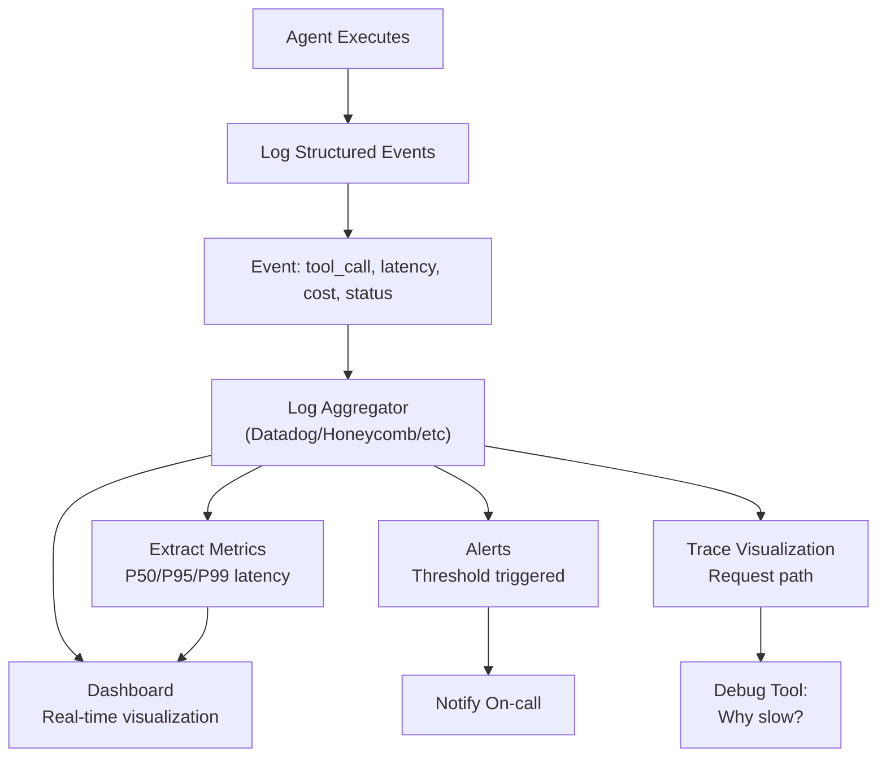
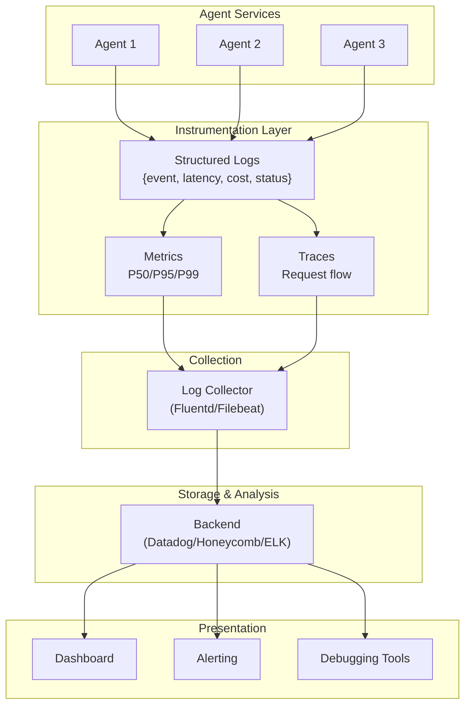

# Observability for Agents

## Detailed Explanation

Observability is the ability to understand an agent's internal state from its outputs (logs, metrics, traces). In production systems, agents are black boxes—you can't inspect them directly. Without observability, when an agent fails or behaves unexpectedly, you're blind: Did it hit a token limit? Did a tool call timeout? Did the model hallucinate? Observability for agents involves three pillars: *logs* (detailed event records), *metrics* (aggregated measurements like latency percentiles and error rates), and *traces* (request paths through the system). Structured logging captures what happened (tool called, latency 250ms, cost $0.05). Metrics aggregate these logs to show trends (P99 latency increasing, error rate at 2%). Traces visualize end-to-end request flow through multiple agents/tools. Production agents need all three: logs for debugging, metrics for monitoring, traces for understanding complex multi-step flows. A common mistake is logging text strings ("Tool X executed successfully") instead of structured data—text strings can't be queried, aggregated, or alerted on. Modern observability uses structured JSON logs with consistent schemas, enabling real-time querying and alerting.

## Core Intuition

Observability is like a car's dashboard. Logs are the black box flight recorder—detailed, everything recorded. Metrics are the dashboard dials—latency (speedometer), error rate (warning lights), costs (fuel gauge). Traces are the route map—where did the request go, which tools did it hit, why did it take 5 seconds? Pilots use all three: dashboards to notice problems, flight recorder to debug why it happened, route map to understand the path. Agents are the same.

## How It Works

Observability for agents operates across three coordinated systems:

1. **Structured Logging** — Every significant event (agent decision, tool call, error, result) is logged as JSON with consistent schema: `{"timestamp": "...", "event_type": "tool_call", "tool_name": "search", "latency_ms": 250, "cost_usd": 0.05, "status": "success"}`

2. **Metric Aggregation** — Logs are aggregated into metrics: count requests by type, calculate P50/P95/P99 latencies, sum costs, track error rates. Metrics are much smaller and queryable in real-time.

3. **Distributed Tracing** — Each request gets a unique ID that flows through all service calls. Following the trace ID shows the complete path: Agent A → Tool Call 1 (50ms) → Tool Call 2 (100ms) → Tool Call 3 (200ms) → Final Response (50ms) = 400ms total.

4. **Sampling & Filtering** — Logging everything creates too much data. Use sampling: log 100% of errors, 10% of slow requests, 1% of fast requests. Filter by agent type, environment, customer.

5. **Alerting** — Set thresholds on metrics: alert if error rate > 5%, P99 latency > 2 seconds, or cost per request > $0.50. Alerts notify on-call teams immediately.

6. **Dashboarding** — Visualize key metrics in real-time: latency trends, error rates by tool, cost breakdown by agent type, top error messages.

**Observability Flow:**


## Architecture / Trade-offs

**Three Observability Strategies:**

1. **Lightweight (No External Service)**
   - Log to stdout/files, aggregate locally
   - Cost: $0, simple
   - Trade-off: Limited query capability, can't correlate across services, requires parsing text logs
   - Use case: Development, single-service agents

2. **Managed Cloud (SaaS)**
   - Log to Datadog, Honeycomb, CloudWatch
   - Cost: $100-1000/month, powerful
   - Trade-off: Vendor lock-in, higher operational cost, external dependency
   - Use case: Production, multi-service, need real-time analysis

3. **Hybrid (Self-Hosted + Cloud)**
   - Local structured logging, stream to self-hosted ELK/Prometheus
   - Cost: $500-2000/month (infrastructure), medium operational complexity
   - Trade-off: Operational overhead, more control
   - Use case: High-scale or regulated environments needing data residency

**Architecture Diagram:**


**Key Trade-offs:**

1. **Logging Volume vs Query Cost** — Log everything (expensive, queryable) vs log sampling (cheap, potentially miss issues). Balance: log 100% errors, 10% slow, 1% fast.

2. **Real-Time vs Latency** — Real-time alerting requires immediate log processing (higher latency for agent requests). Batch processing is faster but alerts come minutes later.

3. **Centralized vs Distributed** — All logs in one place (easy to query, potential bottleneck) vs distributed (resilient, harder to correlate across services).

## Interview Q&A

**Q: How would you set up observability for a production agent handling 1000 requests/second?**
A: Start with structured logging: every tool call, error, and decision gets logged as JSON with request ID, timestamp, latency, cost, status. Use sampling: 100% of errors, 10% of slow (>1s), 1% of fast requests. Stream logs to managed service (Datadog/Honeycomb). Build dashboards for: P50/P95/P99 latency, error rate by tool, cost breakdown. Alert if error rate > 5%, P99 > 2s, or cost per request > $0.50. Set up traces: all requests flow through a trace collector so you can debug slow/erroring requests by following trace ID through the system.

**Q: You're debugging a slow request. What observability data do you need?**
A: Follow trace ID to see complete request path: which tools were called, how long each took, which one was slowest? Look at logs for that request: was there retries? Did the model regenerate many times? Check metrics: is P99 latency higher than usual, or is this an anomaly? Look at resource metrics: was the service CPU/memory saturated? If latency is spiking, it could be external (slow API) or internal (resource exhaustion). Use traces and logs together to narrow down the culprit.

**Q: Structured logging vs free-form text logs—why does structure matter?**
A: Text logs like "Tool search executed successfully" can't be queried or aggregated. You can't ask "What's the error rate of the search tool?" or "How many calls exceeded 500ms?" Structured logs like `{"event": "tool_call", "tool": "search", "latency_ms": 250, "status": "success"}` can be queried (filter by tool, group by status, calculate percentiles). Structured logging is the foundation of observability; without it, you're searching through logs manually instead of analyzing data programmatically.

**Q: How do you handle PII in logs without losing debugging capability?**
A: Never log sensitive data (API keys, user emails, passwords). For debugging-relevant data (user ID, conversation ID), decide if it's truly needed. If yes, use one of: (1) Tokenization—replace user ID with token hash, (2) Sampling—only log for specific traced requests, (3) Separate PII store—hash PII in logs, keep mapping in separate secure store. The goal is debugging capability without exposing sensitive data.

**Q: Multi-agent systems—how do you trace requests across agents?**
A: Use request ID propagation. Every request gets a unique ID (UUID). When Agent A calls Agent B, it includes this ID in the request. Agent B logs with that ID, so all events (across both agents) are tagged with the same ID. Tools like OpenTelemetry automate this. Following a trace ID shows the complete path: Client → Agent A → Tool Call 1 → Agent B → Tool Call 2 → Response. This is critical for debugging distributed systems.

**Q: How do you avoid observability becoming a bottleneck?**
A: Observability can be slow if not done right. Best practices: (1) Log asynchronously—don't block agent execution on log writes, (2) Use sampling—don't log everything, (3) Batch writes—accumulate 100 logs, send in one batch, (4) Compress—JSON can be compressed before sending, (5) Use managed services—they're optimized for this. If observability is making requests slower, you've over-instrumented. Aim for <5ms overhead per request.

**Q: What metrics are most important to track for agents?**
A: The golden signals: (1) Latency—P50/P95/P99 response time, (2) Error rate—% of requests that fail, (3) Throughput—requests/second, (4) Saturation—resource utilization (CPU/memory), (5) Cost—$ per request. These four capture the health of the system. Additionally: (1) Per-tool metrics—which tools are slowest/most error-prone?, (2) Per-agent metrics—different agents have different profiles, (3) Per-customer metrics—some customers might be pathological. Start with the golden signals, add specificity later.

## Best Practices

1. **Instrument from Day One** — Don't add observability after building the agent. Build it in: every meaningful decision point should log. It's much easier to start clean than retrofit observability.

2. **Use Structured Logging Always** — Every log entry should be JSON (or equivalent) with consistent schema. Never free-form text. Use standard field names across your system.

3. **Include Request/Trace ID in Every Log** — Every log must include request ID so you can correlate all logs from one request. Use UUID for request IDs; they're unique and distributed-friendly.

4. **Log at the Right Level** — DEBUG (verbose, development), INFO (important events), WARN (unusual but recoverable), ERROR (failures). Use appropriate levels; DEBUG is for tracing, INFO is production default.

5. **Sample Intelligently** — Always log errors and slow requests (P99), sample fast ones. A common sampling strategy: always log errors, 10% of slow (>1s latency), 1% of fast requests. Adjust based on volume.

6. **Measure the Metrics That Matter** — Track latency percentiles (P50/P95/P99), not just averages. Track error rates and which errors. Track costs and which agents/tools cost most. Dashboard these, alert on anomalies.

7. **Implement Distributed Tracing** — For multi-step agents or multi-agent systems, use tracing: unique ID per request, propagate through all calls. Tools like OpenTelemetry, Jaeger, or Honeycomb make this easy.

8. **Set Up Alerts on SLOs** — Define SLOs (Service Level Objectives): e.g., P99 latency < 2s, error rate < 5%, uptime > 99.9%. Alert when approaching or exceeding SLOs. Don't alert on every small anomaly (noisy), but do alert on clear violations.

9. **Regular Log Analysis** — Don't just collect logs; analyze them. Weekly: look at error trends, latency trends, which tools are slowest. Use this data to prioritize optimizations.

10. **Rotate and Archive** — Don't keep all logs forever (cost). Keep recent logs (hot, queryable), archive old logs (cold storage, cheap), delete very old logs. Typical: 30 days hot, 1 year archive, then delete.

## Common Pitfalls

**Pitfall 1: Logging Without Structure**
Issue: Agents log free-form text: "Tool X executed successfully, took 250ms, cost was $0.05". You can't query "show me all tool executions over 500ms" because the format varies.
Fix: Use structured JSON: `{"event": "tool_call", "tool": "X", "latency_ms": 250, "cost_usd": 0.05}`. Enforce schema consistency.

**Pitfall 2: Logging Everything, Understanding Nothing**
Issue: You log millions of events per day, but most are noise. Your dashboards are so noisy you don't notice real problems.
Fix: Be selective. Log errors always, normal operations rarely. Use sampling. Aggregate into metrics—you don't need individual log entries for every request, you need "average latency is 250ms".

**Pitfall 3: Observability Overhead Impacts Production**
Issue: Logging is synchronous and slow. Adding observability increases latency by 50%, timeouts increase, production breaks.
Fix: Async logging. Fire-and-forget: hand off log entry to a background thread, don't wait for it to be written. Batch logs (accumulate 100, send once) to amortize overhead.

**Pitfall 4: Can't Correlate Across Services**
Issue: Agent A calls Tool (external service), which calls Agent B. You can't tell why the overall request was slow because you don't have a way to correlate logs across services.
Fix: Implement distributed tracing. Every request gets UUID. Services propagate UUID in all calls. Following the UUID shows complete request path.

**Pitfall 5: Sensitive Data in Logs**
Issue: You log user conversations for debugging, but some contain PII (email, SSN, passwords). These logs are a liability.
Fix: Never log sensitive data. If debugging needs user ID, use hash or token. Tokenize before logging, not after. Train team on what's safe to log.

**Pitfall 6: Alerting on Averages Instead of Percentiles**
Issue: Average latency is 100ms, but P99 is 5 seconds. Your alerting triggers at average > 200ms. Production sees 5-second responses but no alert.
Fix: Alert on percentiles. P99 latency > 2s, error rate > 5%. Percentiles reveal the true user experience; averages hide tail behavior.

**Pitfall 7: Observability Tool Becomes Too Complex**
Issue: You set up Kubernetes monitoring, Prometheus, Grafana, custom dashboards. It's so complex that half the team doesn't know how to use it.
Fix: Start simple. Use managed service (Datadog, Honeycomb). Get key metrics dashboard first. Add complexity only when needed. Make it easy for engineers to understand.

## Code Examples

### Example 1: Structured Logging Framework

```python
import json
import logging
import time
import uuid
from datetime import datetime
from typing import Any, Dict

class StructuredLogger:
    """Log events as structured JSON for observability"""
    
    def __init__(self, name: str):
        self.logger = logging.getLogger(name)
        self.handler = logging.StreamHandler()
        self.handler.setFormatter(logging.Formatter('%(message)s'))
        self.logger.addHandler(self.handler)
        self.logger.setLevel(logging.INFO)
    
    def log_event(self, event_type: str, request_id: str, **fields) -> None:
        """Log structured event"""
        log_entry = {
            "timestamp": datetime.utcnow().isoformat(),
            "event_type": event_type,
            "request_id": request_id,
            **fields
        }
        self.logger.info(json.dumps(log_entry))
    
    def log_tool_call(self, request_id: str, tool_name: str, 
                      latency_ms: float, status: str, cost_usd: float) -> None:
        """Log tool execution"""
        self.log_event(
            "tool_call",
            request_id,
            tool_name=tool_name,
            latency_ms=round(latency_ms, 1),
            status=status,
            cost_usd=round(cost_usd, 4)
        )
    
    def log_error(self, request_id: str, error_type: str, 
                  message: str, tool_name: str = None) -> None:
        """Log error"""
        self.log_event(
            "error",
            request_id,
            error_type=error_type,
            message=message,
            tool_name=tool_name
        )

# Usage
logger = StructuredLogger("agent")
request_id = str(uuid.uuid4())

logger.log_tool_call(
    request_id=request_id,
    tool_name="web_search",
    latency_ms=250.5,
    status="success",
    cost_usd=0.05
)

logger.log_error(
    request_id=request_id,
    error_type="timeout",
    message="Tool execution exceeded 5 second timeout",
    tool_name="api_call"
)
```

### Example 2: Metrics Aggregation and Dashboard

```python
import time
from collections import defaultdict
from statistics import median, quantiles

class MetricsCollector:
    """Aggregate logs into queryable metrics"""
    
    def __init__(self):
        self.latencies = defaultdict(list)  # {tool_name: [latencies]}
        self.error_counts = defaultdict(int)  # {error_type: count}
        self.costs = defaultdict(float)  # {tool_name: total_cost}
        self.request_count = 0
    
    def record_tool_execution(self, tool_name: str, latency_ms: float, 
                               cost_usd: float, status: str) -> None:\n        """Record a tool execution\"\"\"\n        self.latencies[tool_name].append(latency_ms)\n        self.costs[tool_name] += cost_usd\n        self.request_count += 1\n        \n        if status == \"error\":\n            self.error_counts[tool_name] += 1\n    \n    def get_metrics(self) -> Dict[str, Any]:\n        \"\"\"Get aggregated metrics\"\"\"\n        metrics = {}\n        \n        # Per-tool metrics\n        for tool_name, latencies in self.latencies.items():\n            if not latencies:\n                continue\n            \n            sorted_latencies = sorted(latencies)\n            p99_idx = int(len(sorted_latencies) * 0.99)\n            \n            metrics[tool_name] = {\n                \"count\": len(latencies),\n                \"avg_latency_ms\": sum(latencies) / len(latencies),\n                \"p50_latency_ms\": median(latencies),\n                \"p99_latency_ms\": sorted_latencies[min(p99_idx, len(sorted_latencies)-1)],\n                \"total_cost_usd\": round(self.costs[tool_name], 4),\n                \"avg_cost_usd\": round(self.costs[tool_name] / len(latencies), 4),\n                \"error_count\": self.error_counts[tool_name],\n                \"error_rate\": f\"{100 * self.error_counts[tool_name] / len(latencies):.2f}%\"\n            }\n        \n        return {\n            \"total_requests\": self.request_count,\n            \"tools\": metrics\n        }\n\n# Usage\ncollector = MetricsCollector()\n\n# Simulate tool executions\nfor i in range(100):\n    latency = 250 + (i % 50) * 10  # Vary latency\n    cost = 0.05 + (i % 10) * 0.01\n    status = \"success\" if i % 20 != 0 else \"error\"\n    \n    collector.record_tool_execution(\n        tool_name=\"search\",\n        latency_ms=latency,\n        cost_usd=cost,\n        status=status\n    )\n\n# Print dashboard\nmetrics = collector.get_metrics()\nprint(\"=== Agent Metrics Dashboard ===\")\nprint(f\"Total requests: {metrics['total_requests']}\")\nprint(f\"\\nTool Performance:\")\nfor tool_name, tool_metrics in metrics[\"tools\"].items():\n    print(f\"\\n  {tool_name}:\")\n    print(f\"    Avg latency: {tool_metrics['avg_latency_ms']:.1f}ms\")\n    print(f\"    P99 latency: {tool_metrics['p99_latency_ms']:.1f}ms\")\n    print(f\"    Error rate: {tool_metrics['error_rate']}\")\n    print(f\"    Total cost: ${tool_metrics['total_cost_usd']}\")\n```

### Example 3: Distributed Tracing for Multi-Agent Systems

```python
import uuid
import json
from dataclasses import dataclass
from datetime import datetime
from typing import List, Optional

@dataclass
class Span:
    \"\"\"Single operation in a trace\"\"\"\n    trace_id: str\n    span_id: str\n    parent_span_id: Optional[str]\n    operation_name: str\n    start_time: str\n    end_time: str\n    duration_ms: float\n    status: str  # \"success\", \"error\"\n    metadata: dict\n\nclass DistributedTracer:\n    \"\"\"Track request path through multiple services\"\"\"\n    \n    def __init__(self):\n        self.traces = {}  # {trace_id: [spans]}\n    \n    def create_trace(self) -> str:\n        \"\"\"Start new trace, return trace ID\"\"\"\n        trace_id = str(uuid.uuid4())\n        self.traces[trace_id] = []\n        return trace_id\n    \n    def start_span(self, trace_id: str, operation_name: str, \n                   parent_span_id: Optional[str] = None) -> str:\n        \"\"\"Start operation, return span ID\"\"\"\n        span_id = str(uuid.uuid4())\n        self.traces[trace_id].append({\n            \"span_id\": span_id,\n            \"operation_name\": operation_name,\n            \"parent_span_id\": parent_span_id,\n            \"start_time\": datetime.utcnow().isoformat(),\n            \"end_time\": None,\n            \"duration_ms\": None,\n            \"status\": None\n        })\n        return span_id\n    \n    def end_span(self, trace_id: str, span_id: str, status: str = \"success\", \n                 duration_ms: float = 0) -> None:\n        \"\"\"End operation\"\"\"\n        for span in self.traces[trace_id]:\n            if span[\"span_id\"] == span_id:\n                span[\"end_time\"] = datetime.utcnow().isoformat()\n                span[\"duration_ms\"] = duration_ms\n                span[\"status\"] = status\n    \n    def visualize_trace(self, trace_id: str) -> str:\n        \"\"\"Show trace as tree\"\"\"\n        spans = self.traces[trace_id]\n        \n        def print_span(span_id, indent=0):\n            span = next(s for s in spans if s[\"span_id\"] == span_id)\n            indent_str = \"  \" * indent\n            return f\"{indent_str}├─ {span['operation_name']} ({span['duration_ms']:.0f}ms) [{span['status']}]\\n\" + \\\n                   \"\".join(print_span(s[\"span_id\"], indent+1) for s in spans if s[\"parent_span_id\"] == span_id)\n        \n        root_spans = [s for s in spans if s[\"parent_span_id\"] is None]\n        return \"\".join(print_span(s[\"span_id\"]) for s in root_spans)\n\n# Usage: trace multi-agent request\ntracer = DistributedTracer()\ntrace_id = tracer.create_trace()\n\n# Agent A starts\nspan_a = tracer.start_span(trace_id, \"Agent-A\")\ntime.sleep(0.05)\n\n# Agent A calls Tool 1\nspan_tool1 = tracer.start_span(trace_id, \"Tool-Search\", parent_span_id=span_a)\ntime.sleep(0.1)\ntracer.end_span(trace_id, span_tool1, \"success\", 100)\n\n# Agent A calls Agent B\nspan_b = tracer.start_span(trace_id, \"Agent-B\", parent_span_id=span_a)\ntime.sleep(0.08)\ntracer.end_span(trace_id, span_b, \"success\", 80)\n\ntracer.end_span(trace_id, span_a, \"success\", 200)\n\nprint(tracer.visualize_trace(trace_id))\n```

## Related Concepts

- **Agent Monitoring** — Continuous observation vs one-time observability
- **Latency Optimization** — Observability reveals latency bottlenecks to optimize
- **Agent Debugging** — Observability provides data for systematic debugging
- **Agent Cost Optimization** — Cost tracking is a key metric to observe
- **Error Recovery** — Observability helps detect errors that need recovery
