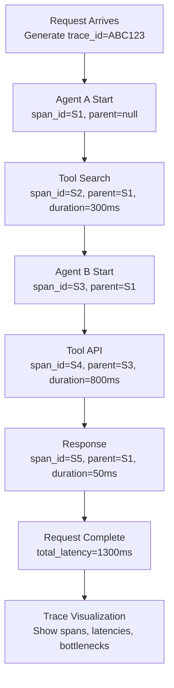
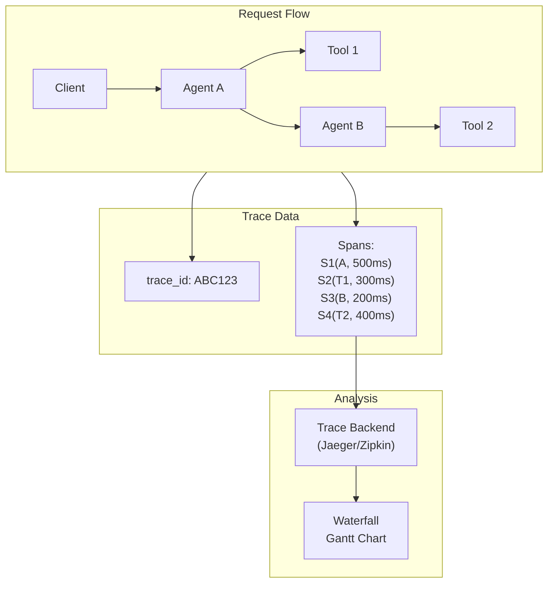

# Distributed Tracing for Agents

## Detailed Explanation

Distributed tracing tracks requests through complex multi-agent and multi-service systems. When a user request enters Agent A, which calls Agent B, which calls 3 tools in parallel, and returns—what was slow? Was it Agent B? Tool 1? Network latency? Without tracing, you're guessing. Distributed tracing assigns each request a unique trace ID that flows through all services. Every service logs events tagged with that trace ID (and nested span IDs for operations within that service). This creates a map of the entire request path with timing information. Tools like Jaeger, Zipkin, Datadog, and OpenTelemetry standardize tracing. The key insight: traces answer "where did latency come from?" while logs answer "what happened?" and metrics answer "is everything okay?" Production multi-agent systems need all three. Tracing enables root-cause analysis: a slow request's trace shows exactly which agent/tool consumed time. For agentic systems, tracing is essential because requests often involve 5-20 sequential and parallel operations; without visibility, performance optimization is impossible.

## Core Intuition

Think of shipping a package from warehouse to customer. Logs record every step: "Left warehouse at 9am, arrived at sorting facility at 11am, left facility at 2pm, delivered at 5pm." Metrics aggregate: "Average delivery 8 hours." Traces map the journey: warehouse → truck1 (2h) → facility (3h) → truck2 (2h) → customer (1h). Following the trace answers "why took 8 hours?"—you see that facility sorting was the bottleneck. For agents: traces show Agent A (50ms) → Tool Search (300ms) → Agent B (100ms) → Tool API (800ms) → Response (50ms) = 1300ms total, with API being the bottleneck.

## How It Works

Distributed tracing operates through trace ID propagation and span timing:

1. **Request Entry** — Client sends request. System generates unique trace ID (UUID). All subsequent operations tagged with this ID.

2. **Span Creation** — Each operation (agent decision, tool call, sub-agent invocation) creates a span: unique span ID, parent span ID (linking to parent operation), operation name, start/end timestamps.

3. **Context Propagation** — When Agent A calls Tool or Agent B, it includes trace ID and parent span ID in the request. Called service creates spans with the same trace ID, maintaining lineage.

4. **Timing Analysis** — After request completes, total latency = root span end time - start time. Per-operation latency = span end - start. Parallelism shows in overlapping spans (spans with same parent start/end simultaneously).

5. **Sampling** — Tracing everything creates overhead. Use sampling: 100% for errors, 10% for slow requests, 1% for fast. OpenTelemetry handles sampling automatically.

6. **Visualization** — Traces are visualized as Gantt charts or waterfall diagrams. Shows span relationships, parallelism, and bottlenecks visually.

**Tracing Flow:**


## Architecture / Trade-offs

**Tracing Strategies:**

1. **Manual Instrumentation** — Code explicitly creates spans, manages IDs. Full control, more work, error-prone.

2. **Automatic Instrumentation** — OpenTelemetry auto-instruments libraries (httpx, asyncio, database calls). Less code, some overhead.

3. **Sampling-Based** — Log traces for small % of requests. Cheap, might miss rare issues.

4. **Always-On Tracing** — Trace 100% of requests. Expensive, complete visibility.

**Trade-off Matrix:**
- **Manual + Always-On:** 100% visibility, high effort, high overhead
- **Automatic + Sampling:** 10% visibility, low effort, low overhead
- **Manual + Sampling:** 10% visibility, high effort, low overhead (bad combo)
- **Automatic + Always-On:** 100% visibility, low effort, high overhead (good for production)

**Architecture Diagram:**


## Interview Q&A

**Q: How does tracing differ from logging?**
A: Logs record individual events ("Tool search executed, latency 300ms"). Traces map request flow through multiple services. For a slow request, logs show what happened at each step; traces show which step consumed most time. Logs are reactive (what went wrong?), traces are proactive (where is latency?). Both are needed: traces identify bottleneck, logs debug why.

**Q: In a multi-agent system, how do you prevent trace ID from getting lost?**
A: Every inter-service call must include trace ID and parent span ID in headers (or request metadata). When Agent A calls Tool B, it includes them. Tool B creates spans under that trace ID, maintaining lineage. If trace ID is missing, you lose correlation. Use middleware/decorators to automate this; don't rely on manual propagation.

**Q: What's the overhead of always-on tracing?**
A: Significant. Creating spans has overhead (~1-5ms per span depending on implementation). For a request with 20 spans, that's 20-100ms overhead. If your requests are 500ms, that's 4-20% slowdown. For requests under 100ms, overhead might double latency. Use sampling for high-volume fast requests, always-on for slow/error cases. OpenTelemetry Sampling Processors let you configure this automatically.

**Q: Traces show Agent A → Tool → Agent B takes 1300ms, but Tool was only 300ms. Where did the other 1000ms go?**
A: Check the waterfall: was Tool called in parallel with something else, or sequential? If sequential (Agent A finishes, then Tool, then Agent B), the 1000ms is unaccounted for—likely Agent A or Agent B is slow. If Tool is parallel to 2 other operations, they're the bottleneck. Traces show this visually—overlapping spans are parallel, sequential spans stack up. Look for long spans (operations taking time) and sequential chains (could be parallelized).

**Q: How do you sample traces without missing rare issues?**
A: Use adaptive sampling: always log errors (100%), always log slow (>2s), sample others (1-10%). Additionally, log trace ID in error logs—when error occurs, the trace ID tells you exactly which request context caused it. You can then retrieve that trace even if it would normally be sampled out. This way, you catch both common issues (via sampling) and rare issues (via error correlation).

**Q: In OpenTelemetry, how do you create nested spans?**
A: Use context API to get current span, create child span with it as parent. Pseudocode: `with tracer.start_as_current_span("child", attributes={...}) as span:` automatically nests under parent. Exit scope, parent is restored. OpenTelemetry manages the stack; you don't manually track parent IDs.

## Best Practices

1. **Start with Request ID Propagation** — Before building full tracing, ensure every log includes request ID. This enables basic request-level debugging. Upgrade to tracing when multi-service complexity requires it.

2. **Use OpenTelemetry** — Don't build custom tracing. OpenTelemetry is open standard, works with any backend (Jaeger, Datadog, etc.), auto-instruments common libraries. Start with it.

3. **Instrument at Boundaries** — Create spans at service boundaries (incoming HTTP request, outgoing API call, agent-to-agent call). Don't create span for every internal function—too noisy. Focus on flow between services.

4. **Sample Intelligently** — 100% tracing for errors, 10% for slow requests, 1% for fast requests. Adjust based on volume and cost. Sampling Processors in OpenTelemetry automate this.

5. **Include Relevant Attributes** — Spans should include context: which agent, which tool, user ID (if available), model used, etc. Attributes enable filtering traces ("show all traces for user X").

6. **Trace Timeouts and Retries** — Mark spans that timeout or retry. This helps identify unreliable operations. "Tool Y was called 3 times due to timeouts" should be visible in the trace.

7. **Set Up Trace Alerts** — Alert on trace patterns: "P99 span latency increasing", "error rate in Tool X spiking", "span execution time exceeded SLO". This proactively surfaces issues.

8. **Export Traces Asynchronously** — Don't block request processing on trace export. Use background exporters. Sampling reduces export volume.

9. **Correlate Traces with Logs** — When a trace shows a problem, you should be able to click through to detailed logs for that span. Both systems should reference the same span ID.

10. **Regularly Review Slow Traces** — Don't just alert; actively analyze. Weekly: look at slowest traces, identify patterns. Maybe a specific agent is slow with certain inputs, or a tool is degrading.

## Common Pitfalls

**Pitfall 1: Losing Trace Context in Async Code**
Issue: Agent creates span, then uses `asyncio.create_task()`. New task doesn't have trace context, spans are unrelated.
Fix: Use context-aware async libraries. OpenTelemetry context API propagates to async tasks automatically if used correctly. Python asyncio context variables are the key.

**Pitfall 2: Tracing Everything, Performance Tanks**
Issue: You instrument every function. Requests go from 500ms to 2000ms. Too much overhead.
Fix: Instrument selectively. Only instrument service boundaries and slow operations. Use sampling for fast requests. OpenTelemetry's head-based sampling helps.

**Pitfall 3: Trace Backend Becomes Bottleneck**
Issue: You export traces immediately (synchronously) or use too many attributes. Request latency increases because trace export is slow.
Fix: Async export with batching. Export traces every 1 second or every 100 traces, whichever comes first. Sample to reduce volume.

**Pitfall 4: Trace ID Lost in Multi-Agent Calls**
Issue: Agent A calls Agent B but doesn't pass trace ID. Resulting spans are unrelated in the trace.
Fix: Middleware/decorator to automatically propagate trace ID. Use standards (W3C Trace Context headers). Don't rely on manual code.

**Pitfall 5: Can't Correlate Trace to Original Request**
Issue: You have a trace ID, but how do you find it in logs? How do you link it to the user's original request?
Fix: Standardize trace ID in all systems. Client passes X-Request-ID header, system uses it as trace ID. All logs and traces reference same ID.

**Pitfall 6: Sampling Misses Interesting Requests**
Issue: You sample 1% of fast requests, but a specific user always has slow requests. You miss all their traces.
Fix: Use tail-based sampling or adaptive sampling based on attributes. Or, keep longer retention for certain users/agents. Query traces by attributes, not just random sampling.

## Code Examples

### Example 1: Manual Tracing with Context Propagation

```python
import uuid
from datetime import datetime
from typing import Optional, Dict, Any
import json

class ManualTracer:
    """Manual distributed tracing without external library"""
    
    def __init__(self):
        self.traces = {}  # {trace_id: [spans]}
    
    def create_trace_context(self) -> Dict[str, str]:\n        \"\"\"Create trace and return context for propagation\"\"\"\n        trace_id = str(uuid.uuid4())[:8]\n        self.traces[trace_id] = []\n        return {\"trace_id\": trace_id, \"span_id\": None}\n    \n    def start_span(self, context: Dict[str, str], operation: str, \n                   service: str) -> Dict[str, str]:\n        \"\"\"Start span with parent context\"\"\"\n        trace_id = context[\"trace_id\"]\n        span_id = str(uuid.uuid4())[:8]\n        parent_span_id = context.get(\"span_id\")\n        \n        span = {\n            \"trace_id\": trace_id,\n            \"span_id\": span_id,\n            \"parent_span_id\": parent_span_id,\n            \"operation\": operation,\n            \"service\": service,\n            \"start_time\": datetime.utcnow().isoformat(),\n            \"end_time\": None,\n            \"duration_ms\": None,\n            \"attributes\": {}\n        }\n        \n        self.traces[trace_id].append(span)\n        \n        # Return new context for child operations\n        return {\"trace_id\": trace_id, \"span_id\": span_id}\n    \n    def end_span(self, context: Dict[str, str], duration_ms: float) -> None:\n        \"\"\"End current span\"\"\"\n        trace_id = context[\"trace_id\"]\n        span_id = context[\"span_id\"]\n        \n        for span in self.traces[trace_id]:\n            if span[\"span_id\"] == span_id:\n                span[\"end_time\"] = datetime.utcnow().isoformat()\n                span[\"duration_ms\"] = duration_ms\n                break\n    \n    def add_attribute(self, context: Dict[str, str], key: str, value: Any) -> None:\n        \"\"\"Add attribute to current span\"\"\"\n        trace_id = context[\"trace_id\"]\n        span_id = context[\"span_id\"]\n        \n        for span in self.traces[trace_id]:\n            if span[\"span_id\"] == span_id:\n                span[\"attributes\"][key] = value\n                break\n    \n    def export_trace(self, trace_id: str) -> str:\n        \"\"\"Export trace as JSON\"\"\"\n        return json.dumps(self.traces[trace_id], indent=2)\n\n# Usage\ntracer = ManualTracer()\n\n# Client initiates request\ncontext = tracer.create_trace_context()\nprint(f\"Trace ID: {context['trace_id']}\")\n\n# Agent A processes\nctx_a = tracer.start_span(context, \"Agent-A\", \"agent-service\")\ntracer.add_attribute(ctx_a, \"model\", \"claude-3-sonnet\")\ntime.sleep(0.05)\n\n# Agent A calls Tool\nctx_tool = tracer.start_span(ctx_a, \"Tool-Search\", \"search-service\")\ntracer.add_attribute(ctx_tool, \"query\", \"What is AI?\")\ntime.sleep(0.1)\ntracer.end_span(ctx_tool, 100)\n\ntracer.end_span(ctx_a, 150)\n\nprint(f\"\\nTrace export:\\n{tracer.export_trace(context['trace_id'])}\")\n```

### Example 2: Sampling-Based Tracing

```python\nimport random\n\nclass SamplingTracer:\n    \"\"\"Tracing with intelligent sampling\"\"\"\n    \n    def __init__(self, error_sample_rate: float = 1.0,\n                 slow_sample_rate: float = 0.1,\n                 fast_sample_rate: float = 0.01,\n                 slow_threshold_ms: float = 1000):\n        self.error_rate = error_sample_rate\n        self.slow_rate = slow_sample_rate\n        self.fast_rate = fast_sample_rate\n        self.threshold = slow_threshold_ms\n        self.traces = {}\n        self.sampled_out = 0\n    \n    def should_sample(self, is_error: bool, latency_ms: float) -> bool:\n        \"\"\"Decide whether to trace this request\"\"\"\n        if is_error:\n            return random.random() < self.error_rate  # Always sample errors\n        elif latency_ms > self.threshold:\n            return random.random() < self.slow_rate\n        else:\n            return random.random() < self.fast_rate\n    \n    def create_trace(self, is_error: bool, latency_ms: float) -> Optional[str]:\n        \"\"\"Create trace if sampled\"\"\"\n        if not self.should_sample(is_error, latency_ms):\n            self.sampled_out += 1\n            return None\n        \n        trace_id = str(uuid.uuid4())[:8]\n        self.traces[trace_id] = {\n            \"spans\": [],\n            \"latency_ms\": latency_ms,\n            \"is_error\": is_error\n        }\n        return trace_id\n    \n    def get_sampling_stats(self, total_requests: int) -> Dict[str, Any]:\n        return {\n            \"total_requests\": total_requests,\n            \"traces_sampled\": len(self.traces),\n            \"traces_sampled_out\": self.sampled_out,\n            \"sampling_rate\": f\"{100 * len(self.traces) / total_requests:.1f}%\"\n        }\n\n# Simulate requests with sampling\nsampler = SamplingTracer(slow_threshold_ms=500)\n\nfor i in range(1000):\n    if i % 50 == 0:\n        is_error = True\n        latency = 200\n    elif i % 100 == 0:\n        is_error = False\n        latency = 1500  # Slow\n    else:\n        is_error = False\n        latency = 250\n    \n    sampler.create_trace(is_error, latency)\n\nstats = sampler.get_sampling_stats(1000)\nprint(f\"Sampling results: {stats['traces_sampled']}/1000 traced\")\nprint(f\"Sampling strategy: 100% errors, 10% slow, 1% fast\")\n```

### Example 3: Trace Visualization

```python\ndef visualize_trace(spans: List[Dict]) -> str:\n    \"\"\"Create ASCII waterfall visualization of trace\"\"\"\n    if not spans:\n        return \"No spans\"\n    \n    # Find min start time\n    min_time = min(s[\"start_ms\"] for s in spans if \"start_ms\" in s)\n    \n    lines = []\n    for span in sorted(spans, key=lambda s: s.get(\"start_ms\", 0)):\n        start = span.get(\"start_ms\", 0) - min_time\n        duration = span.get(\"duration_ms\", 0)\n        indent = span.get(\"depth\", 0) * 2\n        \n        # Create bar\n        bar_start = int(start / 10)  # Scale to screen width\n        bar_width = max(1, int(duration / 10))\n        bar = \"█\" * bar_width\n        \n        line = \" \" * indent + \"|\" + \" \" * bar_start + bar + \" \" + span[\"name\"]\n        lines.append(line)\n    \n    return \"\\n\".join(lines)\n\n# Example trace visualization\nspans_example = [\n    {\"name\": \"Agent-A\", \"start_ms\": 0, \"duration_ms\": 1300, \"depth\": 0},\n    {\"name\": \"Tool-Search\", \"start_ms\": 50, \"duration_ms\": 300, \"depth\": 1},\n    {\"name\": \"Agent-B\", \"start_ms\": 360, \"duration_ms\": 200, \"depth\": 1},\n    {\"name\": \"Tool-API\", \"start_ms\": 370, \"duration_ms\": 800, \"depth\": 2},\n    {\"name\": \"Response\", \"start_ms\": 1280, \"duration_ms\": 20, \"depth\": 0},\n]\n\nprint(\"Trace Waterfall:\")\nprint(visualize_trace(spans_example))\n```

## Related Concepts

- **Observability for Agents** — Tracing is one pillar (logs, metrics, traces)
- **Latency Optimization** — Traces identify where latency hides
- **Agent Monitoring** — Traces feed into monitoring dashboards
- **Error Recovery** — Trace data helps debug error patterns
- **Multi-Agent Systems** — Tracing essential for understanding multi-agent coordination
