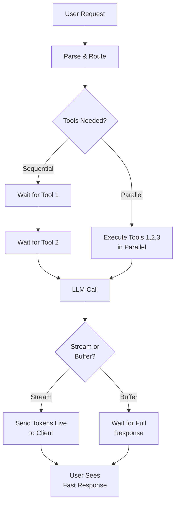

# Latency Optimization in Agents

## Detailed Explanation

Latency optimization for agents focuses on reducing end-to-end response time from user request to final output. In production AI systems, every millisecond matters—a 100ms difference in P95 latency can mean the difference between a frustrating user experience and a delightful one. Latency optimization involves identifying bottlenecks (LLM inference, tool calls, I/O operations), parallelizing independent operations, and implementing streaming responses to show progress immediately. Unlike batch processing or throughput optimization, latency work targets individual request speed. The key is measuring at scale—P50 latencies look good, but P95 and P99 reveal the true user experience. Production agents optimize across multiple dimensions: reducing model size, parallelizing tool execution, streaming token-by-token responses, connection pooling, and intelligent caching.

## Core Intuition

Think of a restaurant kitchen optimizing order fulfillment. The naive approach: take an order, prep appetizer, prep main, prep dessert, plate everything, serve (sequential). The optimized approach: take multiple orders, start prepping all three dishes in parallel for each table, stream out courses as they're ready, reuse prep work when possible. Similarly, agents can execute independent tool calls in parallel, stream responses token-by-token instead of waiting for full completion, cache intermediate results, and prefetch likely needed data before being asked.

## How It Works

Latency optimization operates across multiple layers:

1. **Measurement & Profiling** — Instrument agent code with timing information at each step (LLM call time, tool execution time, I/O wait time). Track P50, P95, P99 latencies separately; P99 often reveals timeout-prone operations.

2. **Identify Bottlenecks** — Analyze which operations consume the most time. Is it LLM inference (common), tool execution, or network I/O? Focus optimization on the biggest contributors first.

3. **Parallelize Independent Operations** — Tool calls that don't depend on each other can execute simultaneously. Instead of `result1 = tool1(); result2 = tool2()`, use `asyncio.gather(tool1(), tool2())`.

4. **Implement Streaming** — Send LLM tokens to the client immediately as they're generated, rather than waiting for full response completion. Users see progress and perceived latency decreases.

5. **Connection Pooling & Reuse** — For repeated API calls, maintain connection pools to avoid TCP handshake overhead on every request.

6. **Caching & Prefetching** — Cache LLM responses for identical inputs, prefetch likely-needed data (e.g., if tool A always precedes tool B, fetch B's data while A executes).

7. **Model Optimization** — Use smaller, faster models where possible; quantized models (int8, fp16) can be 2-3x faster than full-precision.

**Latency Flow:**


## Architecture / Trade-offs

**Latency vs Throughput:** Optimizing for latency (fast individual responses) sometimes conflicts with throughput (many simultaneous requests). A 100-token batch might be faster than 10 sequential requests, but adds latency to later batches.

**Streaming vs Accuracy:** Streaming responses immediately shows progress but prevents batch processing optimizations. Buffering allows better batch efficiency but delays first token.

**Caching vs Freshness:** Aggressive caching dramatically reduces latency but risks stale data. Trade-off depends on data volatility.

**Architecture patterns:**

```mermaid
graph TB
    subgraph Streaming["Streaming Architecture"]
        Client["Client"]
        LLM["LLM Inference"]
        Queue["Token Queue"]
        Stream["Stream to Client"]
        Client -->|Request| LLM
        LLM -->|Token| Queue
        Queue -->|Immediate| Stream
        Stream -->|Live Updates| Client
    end
    
    subgraph Parallel["Parallel Tool Execution"]
        Request["Tool Request"]
        Async["Asyncio Executor"]
        Tool1["Tool 1"]
        Tool2["Tool 2"]
        Tool3["Tool 3"]
        Results["Gather Results"]
        Request --> Async
        Async --> Tool1
        Async --> Tool2
        Async --> Tool3
        Tool1 --> Results
        Tool2 --> Results
        Tool3 --> Results
    end
    
    subgraph Caching["Caching with TTL"]
        Input["Input Hash"]
        Cache["Redis/In-Memory"]
        Hit["Cache Hit?"]
        Miss["Cache Miss"]
        LLMCall["LLM Call"]
        Input --> Hit
        Hit -->|Yes| Cache
        Hit -->|No| Miss
        Miss --> LLMCall
        LLMCall --> Cache
    end
```



**Key Trade-offs:**
1. **Parallelism vs Resource Cost** — Running 10 tool calls in parallel uses 10x resources; CPU-constrained systems may need sequential execution.
2. **First-Token Latency vs Final Latency** — Streaming optimizes perceived latency (first token fast) but total time may be similar or slightly longer.
3. **Caching Complexity vs Speed** — Distributed caching (Redis) adds operational complexity but enables sub-millisecond lookups at scale.

## Interview Q&A

**Q: How would you measure latency improvements? What metrics matter?**
A: Track three metrics: P50 (median), P95 (95th percentile), P99 (99th percentile). P50 is misleading—a system with one slow outlier can have great P50 but terrible P99. Measure end-to-end (user request → final response) and component-level (LLM inference time, tool execution time, I/O wait). Tools like Datadog or CloudWatch let you visualize distributions. For production agents, optimize P95/P99 because those determine SLAs and user frustration.

**Q: When would you parallelize tool calls vs execute sequentially?**
A: Parallelize when tools are independent (tool A result doesn't feed into tool B). If tool B needs tool A's output, you must sequence them. Watch for resource constraints—parallelizing 50 I/O-bound tool calls is fine, but parallelizing 50 GPU-intensive operations will thrash the system. For agentic systems, common pattern: parallelize initial information gathering, then sequence if synthesis is needed.

**Q: Streaming vs buffering—which should we choose?**
A: Streaming (token-by-token) is better for user-facing agents because perceived latency drops dramatically—users see "thinking" immediately. Buffering is better if you need to post-process responses (filtering, formatting) before sending. For real-time applications, always stream. For batch/async applications, buffering often allows better optimizations (batching tokens, caching opportunities).

**Q: How do you handle connection pooling in Python agents?**
A: Use libraries with built-in pooling: `httpx` with `AsyncClient` maintains connection pools automatically, `langchain` integrations use pooling under the hood. For custom integrations, use `aiohttp.ClientSession` which maintains connection pools. Set `connector=aiohttp.TCPConnector(limit=100)` to control pool size. Monitor connection exhaustion—if agents hang, you likely ran out of available connections.

**Q: What's the latency impact of model quantization (int8 vs fp16 vs fp32)?**
A: Rough estimates on modern hardware: fp32 baseline (100%), fp16 ~2-3x faster with slight accuracy loss, int8 ~4-5x faster with moderate accuracy loss. Impact varies by hardware—GPUs see bigger gains than CPUs. Always benchmark on your target hardware; theoretical speedups don't always match real-world. For latency-critical agents serving many users, quantization is usually worth the accuracy trade-off.

**Q: How would you optimize a multi-turn agent conversation that's slowing down over time?**
A: Root cause is usually growing context window—older messages accumulate, making each LLM call slower. Solutions: (1) Implement sliding window—keep only recent N messages, (2) Summarize old context into a compact form, (3) Use hierarchical memory (recent messages in fast cache, old messages compressed), (4) Implement message pruning—drop irrelevant turns. Test each on your specific task; summarization loses nuance, pruning might drop critical info.

**Q: What's a latency optimization that actually hurts production systems?**
A: Over-aggressive caching without invalidation. You cache a user's "favorite color" but the user changes it; old cached value persists for minutes. Or parallelizing expensive operations without rate limiting—10 agents each spawning 10 parallel API calls hits rate limits or crashes downstream services. The best latency optimization includes observability to verify it didn't break something else.

## Best Practices

1. **Measure Before Optimizing** — Profile real production traffic to find actual bottlenecks. Don't optimize the LLM call time if 90% of latency is database queries. Use distributed tracing (OpenTelemetry) to see component-level breakdowns.

2. **Implement P99 Monitoring** — Set up dashboards and alerts for P99 latency, not P50. P50 hides bad tail behavior. A system with P50=100ms but P99=5s will frustrate users.

3. **Stream Responses Immediately** — For any user-facing agent, implement streaming. Even if the final response takes 2 seconds, the user sees tokens appearing within 100-200ms, dramatically improving perceived experience.

4. **Parallelize I/O, Sequence Computation** — I/O-bound operations (API calls, database queries) parallelize well. Compute-bound operations (LLM inference, complex algorithms) usually can't be parallelized effectively; sequence them or use smaller models.

5. **Connection Pooling is Non-Negotiable** — Every API integration should reuse connections. A new TCP connection adds 10-50ms latency on its own; connection pooling reduces this to near-zero for subsequent requests.

6. **Cache Aggressively with Short TTLs** — Cache LLM responses for identical inputs with 5-60 minute TTLs depending on data freshness requirements. For RAG systems, cache embeddings and retrieved documents—these rarely change and take significant time.

7. **Batch Where Possible, But Not at the Cost of Latency** — Batching 10 requests together might be faster overall but delays individual requests. For latency-critical systems, prefer per-request optimization. Batching is better for throughput.

8. **Use Smaller, Faster Models by Default** — A 7B model is often 2-3x faster than 70B with acceptable accuracy. Try smaller models first; only upgrade to larger ones if accuracy suffers significantly.

9. **Implement Graceful Degradation** — If an expensive operation times out, fall back to cheaper alternatives. If tool A takes >500ms, skip it and continue with available data rather than blocking the entire response.

10. **Monitor Resource Utilization** — High latency often correlates with resource exhaustion (CPU/memory/connections). Track these metrics alongside latency; if they're high, throw resources at the problem rather than code optimization.

## Common Pitfalls

**Pitfall 1: Optimizing P50 Instead of P99**
Issue: You implement an optimization that improves median latency by 20%, but P99 barely moves. Releases it, users still complain about slowness in peak hours.
Fix: Always measure P95 and P99 explicitly. Use percentile monitoring tools. Tail latency (P99) matters more than average (P50) for user experience.

**Pitfall 2: Parallelizing Everything Without Limits**
Issue: Agent spawns 100 parallel API calls without rate limiting. Downstream service gets hammered, triggers circuit breaker, entire agent fails. Or: agent runs out of memory spawning 1000 threads.
Fix: Use semaphores (`asyncio.Semaphore(10)`) to limit concurrency. Test on realistic load. Rate limit at the source, not hoping downstream services absorb it.

**Pitfall 3: Streaming Without Backpressure**
Issue: Agent streams tokens to client as fast as they're generated. Client buffer fills up, connection drops, user gets incomplete response. Or: streaming adds latency because tokens queue up waiting for network.
Fix: Implement backpressure—when client can't consume tokens fast enough, slow down generation. Libraries like httpx handle this automatically.

**Pitfall 4: Caching Without Invalidation**
Issue: Agent caches a user's preferences. User changes settings via different interface. Old cached value persists until TTL expires. User sees stale behavior.
Fix: Always set appropriate TTLs based on data freshness requirements. Implement cache invalidation hooks—when data changes via any path, invalidate related caches. Use versioning if possible.

**Pitfall 5: Connection Pool Exhaustion**
Issue: Agent makes requests faster than connections can be returned to the pool. Subsequent requests hang waiting for available connections. P99 latency skyrockets.
Fix: Monitor connection pool utilization. Set appropriate pool sizes (typically 100-1000). Implement request timeouts so hung requests don't hold connections forever.

**Pitfall 6: Premature Model Optimization**
Issue: You quantize models to int8 or use distilled models before benchmarking. Accuracy drops 15%, users complain, you have to revert. Wasted effort.
Fix: Always benchmark on representative tasks before deploying. 5% accuracy drop might be acceptable for 3x latency improvement, but 15% is not. Measure the actual trade-off.

**Pitfall 7: Ignoring Cold Start Latency**
Issue: You optimize hot-path latency but ignore cold starts—first request after deployment or idle period takes 10x longer (container startup, model loading, etc.). Users get occasional "slow" experiences.
Fix: Implement warm-up requests after deployment. For serverless, use provisioned concurrency or keep containers warm. Measure cold-start latency separately from hot-path.

## Code Examples

### Example 1: Parallel Tool Execution with Asyncio

```python
import asyncio
import time
from anthropic import Anthropic

client = Anthropic()

# Simulate tool calls with latency
async def search_web(query: str) -> str:
    """Simulate web search (50-100ms latency)"""
    await asyncio.sleep(0.05)
    return f"Results for '{query}': Found 10,000 results..."

async def lookup_database(key: str) -> str:
    """Simulate database lookup (30-50ms latency)"""
    await asyncio.sleep(0.03)
    return f"Database record for '{key}': ID=12345, Status=Active"

async def fetch_api(endpoint: str) -> str:
    """Simulate API call (100-200ms latency)"""
    await asyncio.sleep(0.1)
    return f"API Response from '{endpoint}': [Data payload...]"

async def execute_tools_parallel(queries: dict) -> dict:
    """Execute all tools in parallel instead of sequential"""
    tasks = [
        search_web(queries.get("search", "")),
        lookup_database(queries.get("db_key", "")),
        fetch_api(queries.get("endpoint", ""))
    ]
    
    # Measure: sequential would take 50+30+100 = 180ms
    # Parallel takes max(50,30,100) = 100ms (1.8x faster)
    start = time.time()
    results = await asyncio.gather(*tasks)
    elapsed = time.time() - start
    
    return {
        "search_result": results[0],
        "db_result": results[1],
        "api_result": results[2],
        "execution_time_ms": elapsed * 1000
    }

# Example usage
async def agent_loop_with_parallel_tools():
    # Initial request
    prompt = "Find information about Python async programming"
    print(f"Agent Request: {prompt}")
    
    # Execute tools in parallel
    tool_results = await execute_tools_parallel({
        "search": "Python async programming",
        "db_key": "python_async",
        "endpoint": "/api/docs/async"
    })
    
    print(f"Tool results gathered in {tool_results['execution_time_ms']:.1f}ms")
    
    # Use results to generate response
    response = client.messages.create(
        model="claude-3-5-sonnet-20241022",
        max_tokens=500,
        messages=[{
            "role": "user",
            "content": f"{prompt}\n\nContext:\n{tool_results['search_result']}\n{tool_results['db_result']}\n{tool_results['api_result']}"
        }]
    )
    
    return response.content[0].text

# Run with: asyncio.run(agent_loop_with_parallel_tools())
```

### Example 2: Streaming Response for Perceived Latency Reduction

```python
import anthropic
import sys
from datetime import datetime

def agent_with_streaming():
    """Agent that streams responses token-by-token for better perceived latency"""
    client = anthropic.Anthropic()
    
    prompt = "Explain how to optimize latency in production AI systems in 3 key points."
    
    print(f"[{datetime.now().strftime('%H:%M:%S.%f')[:-3]}] Sending request to Claude...")
    
    # Measure first token time
    first_token_time = None
    token_count = 0
    
    with client.messages.stream(
        model="claude-3-5-sonnet-20241022",
        max_tokens=500,
        messages=[{"role": "user", "content": prompt}]
    ) as stream:
        for text in stream.text_stream:
            if first_token_time is None:
                first_token_time = datetime.now()
                elapsed = (first_token_time.timestamp() * 1000) % 100000
                print(f"[{datetime.now().strftime('%H:%M:%S.%f')[:-3]}] First token received in ~{elapsed % 10000}ms")
            
            sys.stdout.write(text)
            sys.stdout.flush()
            token_count += 1
    
    print(f"\n[{datetime.now().strftime('%H:%M:%S.%f')[:-3]}] Response complete ({token_count} tokens)")
    
    # Key insight: User sees response appearing immediately
    # vs buffering approach that waits 1-2 seconds before showing anything

# Usage: agent_with_streaming()
```

### Example 3: Response Caching with TTL for Repeated Queries

```python
import anthropic
import hashlib
import time
from datetime import datetime, timedelta
from typing import Optional

class CachingAgent:
    """Agent with response caching to optimize latency on repeated queries"""
    
    def __init__(self, cache_ttl_seconds: int = 300):
        self.client = anthropic.Anthropic()
        self.cache = {}  # In production: use Redis
        self.ttl = cache_ttl_seconds
    
    def _hash_message(self, content: str) -> str:
        """Create cache key from message content"""
        return hashlib.md5(content.encode()).hexdigest()
    
    def _is_cache_valid(self, timestamp: float) -> bool:
        """Check if cached entry hasn't expired"""
        return (time.time() - timestamp) < self.ttl
    
    def query(self, prompt: str, use_cache: bool = True) -> str:
        """Query agent with optional caching"""
        cache_key = self._hash_message(prompt)
        
        # Check cache
        if use_cache and cache_key in self.cache:
            cached_response, timestamp = self.cache[cache_key]
            if self._is_cache_valid(timestamp):
                age = time.time() - timestamp
                print(f"✓ Cache hit (age: {age:.1f}s)")
                return cached_response
            else:
                # Expired, remove
                del self.cache[cache_key]
                print(f"✗ Cache expired after {self.ttl}s")
        
        print(f"✗ Cache miss, calling Claude...")
        
        # Call API (expensive, ~1000-2000ms latency)
        start = time.time()
        response = self.client.messages.create(
            model="claude-3-5-sonnet-20241022",
            max_tokens=300,
            messages=[{"role": "user", "content": prompt}]
        )
        elapsed = time.time() - start
        
        result = response.content[0].text
        
        # Store in cache
        self.cache[cache_key] = (result, time.time())
        print(f"API call took {elapsed*1000:.0f}ms, cached for {self.ttl}s")
        
        return result

# Usage example showing latency improvement
agent = CachingAgent(cache_ttl_seconds=300)

# First call: slow (cache miss)
print("\n--- First call (cold) ---")
start = time.time()
result1 = agent.query("What is machine learning?")
elapsed1 = time.time() - start
print(f"Total latency: {elapsed1*1000:.0f}ms")

# Second identical call: fast (cache hit)
print("\n--- Second call (warm) ---")
start = time.time()
result2 = agent.query("What is machine learning?")
elapsed2 = time.time() - start
print(f"Total latency: {elapsed2*1000:.0f}ms (typically <5ms from cache)")
print(f"Speedup: {elapsed1/elapsed2:.0f}x")
```

## Related Concepts

- **Agent Memory Management** — Context window growth affects latency; optimization techniques overlap
- **Agent Monitoring** — Latency metrics are core monitoring signals
- **Error Recovery** — Timeouts and fallbacks are latency trade-offs
- **Agent Cost Optimization** — Streaming and parallelization affect both latency and cost
- **Observability for Agents** — Distributed tracing reveals latency bottlenecks
