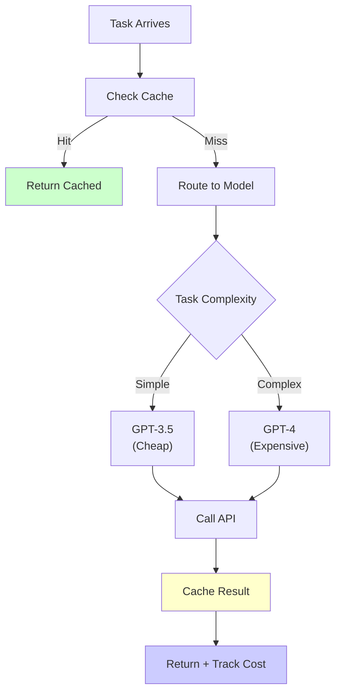
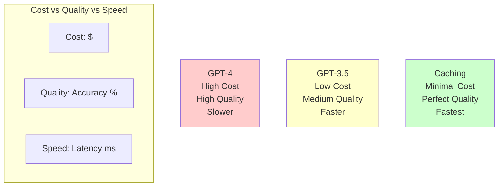

# Agent Cost Optimization

## Detailed Explanation

Agent cost optimization is systematic reduction of token usage and API costs while maintaining quality and performance. Every LLM API call costs money—input tokens, output tokens, overhead. At scale, costs compound: 1,000 agents × 100 requests/day × $0.01/request = $1,000/day. Optimization saves millions annually and enables profitable agent systems. Core techniques: prompt optimization (remove redundant words, use shorter formats), caching (reuse results for identical queries), batch processing (process multiple requests together), model selection (use cheaper models for simple tasks), early stopping (stop if goal reached), and efficient routing (route to cheapest capable model). Unlike performance optimization which chases milliseconds, cost optimization chases dollars. It requires measuring cost per task, tracking trends, and identifying high-cost operations. Production agents must have cost monitoring and optimization—otherwise they become expensive legacy systems nobody can afford to run.

## Core Intuition

Cost optimization is like airline optimization: don't fly every passenger on a Boeing 747. Small routes → regional jets, popular routes → large planes. Similarly, don't run every query on GPT-4. Simple questions → GPT-3.5, complex reasoning → GPT-4. Match cost to value.

## How It Works

Agent cost optimization follows a measure-optimize-validate cycle: measure costs, identify expensive operations, optimize them, validate savings.

**Stage 1: Measure Baseline**
Instrument every API call to track costs:
```
{
  "task": "answer user question",
  "model": "claude-3-5-sonnet",
  "input_tokens": 150,
  "output_tokens": 200,
  "input_cost": 0.003,
  "output_cost": 0.006,
  "total_cost": 0.009
}
```

Track over time: "Cost per task trending up? Why?"

**Stage 2: Identify High-Cost Operations**
Which tasks cost the most?
- Complex reasoning tasks (long outputs): 5x cost
- Large context windows (long system prompts): 2x cost
- Multi-step agentic loops (many API calls): 10x cost

Focus optimization on top 20% of costs (80/20 rule).

**Stage 3: Optimization Strategies**

*Strategy 1: Prompt Optimization*
- Remove redundant instructions (keep essential only)
- Use shorter variable names in prompts
- Remove examples for simple tasks (only for complex)
- Change: "Analyze this in detail" → "Analyze this"
- Potential savings: 20-40% reduction in input tokens

*Strategy 2: Caching*
- Cache identical queries and responses
- Identical input = identical output (LLM deterministic)
- Check cache before API call
- Potential savings: 50-80% for repeated queries

*Strategy 3: Model Selection*
- Use cheaper models (GPT-3.5) for simple tasks
- Use capable models (GPT-4) only when necessary
- Example thresholds:
  - Simple Q&A: GPT-3.5 ($0.0005/1K tokens)
  - Complex reasoning: GPT-4 ($0.003/1K tokens)
- Potential savings: 3-6x cost reduction for subset of queries

*Strategy 4: Batch Processing*
- Process 10 simple requests in 1 large batch → cheaper than 10 individual calls
- Example: summarize 10 documents → 1 large request cheaper than 10 individual
- Potential savings: 20-50% depending on batch size

*Strategy 5: Early Stopping*
- Stop agent loop when goal reached
- Don't run all 10 steps if goal reached at step 3
- Potential savings: variable, depends on task

*Strategy 6: Output Truncation*
- Don't request max_tokens if not needed
- Ask for 100 token answer instead of 2048 for simple questions
- Potential savings: 10-30% reduction in output tokens



**Stage 4: Validate Savings**
- Measure new cost per task
- Compare to baseline
- Track cost savings over time
- "Before: $0.01/task, After: $0.003/task = 70% savings"

## Architecture / Trade-offs

Cost optimization requires balancing quality, latency, and price. Trade-offs:



**Key Trade-offs:**

1. **Quality vs Cost:** GPT-4 is better but expensive ($0.003/1K tokens). GPT-3.5 is cheaper ($0.0005/1K tokens) but lower quality. Use GPT-4 only when quality is critical.

2. **Speed vs Cost:** Caching is fastest+cheapest but only works for identical queries. Fresh queries need API calls. Accept slower routes for cost savings when time permits.

3. **Batch vs Real-time:** Batch processing cheaper (50% savings) but requires waiting. Real-time processing is expensive but low latency. Use batch for analytics, real-time for interactive.

4. **Model Specialization vs Coverage:** Specialized small models cheap but limited. General large models expensive but handle everything. Route intelligently: use specialized models 70% of time, fallback to general 30%.

## Interview Q&A

**Q: Your agent is costing $10/day. How would you reduce it?**
A: Systematic approach: (1) Measure—log every API call with tokens/cost to find expensive operations, (2) Identify—which queries are most expensive? Multi-step loops? Large contexts? (3) Optimize top 20%—replace expensive operations with cheaper alternatives: caching for repeated queries, cheaper models for simple tasks, prompt optimization, batch processing, early stopping, (4) Validate—measure new cost, compare to baseline. Target 50% reduction is realistic. Specific tactics depend on where costs are.

**Q: When should you use GPT-4 vs GPT-3.5?**
A: GPT-4 for tasks where accuracy matters: legal analysis, medical decisions, complex reasoning. GPT-3.5 for everything else: Q&A, summarization, simple routing. Rule of thumb: if error cost > 50x difference in model cost, use GPT-4. Otherwise use GPT-3.5. Example: medical diagnosis error costs $1M → use GPT-4 ($0.003). Customer service error costs $10 → use GPT-3.5 ($0.0005).

**Q: How effective is caching?**
A: Depends on query repetition. If 80% of queries are identical/similar, caching saves 80% API calls = 80% cost reduction. If all queries unique, caching saves nothing. Measure query repetition first. Common high-repetition use cases: FAQ answering, common customer questions, templated reports.

**Q: Batch processing vs streaming responses—which is cheaper?**
A: Batch processing is cheaper (50% savings on tokens) but requires waiting. Streaming/real-time is expensive but low latency. Use batch for: reports, analytics, offline processing. Use real-time for: chatbots, interactive systems. Streaming actually costs same as batch for token usage—cost savings from batching come from amortized overhead, not token reduction.

**Q: Should you sacrifice quality to save cost?**
A: No—sacrifice low-impact quality features instead. Example: instead of asking for verbose explanations, ask for concise answers. You save tokens, user still gets what they need. Or route low-value queries to cheaper models. Or reduce response length. These preserve core quality while cutting cost.

**Q: How do you set a cost budget for agents?**
A: Define: cost per query, queries per day, monthly budget. Example: $0.01/query × 1,000 queries/day × 30 days = $300/month. If actual < budget, celebrate. If actual > budget, optimize. Set thresholds: alert if daily cost > $15 (over daily average), investigate if weekly trend increasing >10%.

## Best Practices

1. **Measure before optimizing.** Without baseline, you don't know if optimization worked. Log every call: model, tokens, cost. Track over time.

2. **Use cost as a first-class metric.** Alongside accuracy, latency—cost matters. Display on dashboards. Set cost SLOs: "Cost < $0.01/task".

3. **Cache aggressively.** Identical inputs = identical outputs (deterministic). Cache before every API call. Hit rate of 50% = 50% cost reduction.

4. **Route by task complexity.** Simple tasks → cheap models. Complex → capable models. Classify query complexity (keyword-based, LLM-based), route accordingly.

5. **Optimize prompts for brevity.** Remove examples for simple tasks. Use shorthand. "answer briefly" instead of "provide a detailed 200-word answer". 20% token reduction is realistic.

6. **Batch when possible.** Process 10 items in 1 call > 10 calls. Overhead amortized over batch. 30-50% cost savings.

7. **Set early stopping.** If agent reaches goal at step 3, don't continue to step 10. Track goal achievement, stop when done.

8. **Monitor cost trends.** Cost increasing? Why? New feature? More users? Investigate weekly. Prevent cost surprises.

9. **Trade-off quality thoughtfully.** Don't reduce quality to save $10. But trim verbose outputs, reduce context, use cheaper models for non-critical paths.

10. **Version costs with models.** When switching models, costs change. Document: "Migrated to GPT-3.5 → 60% cost reduction". Helps understand trends.

## Common Pitfalls

**Pitfall 1: Optimizing Without Measuring**
Issue: Guess where costs are, optimize randomly. Spend time optimizing 5% of costs while 50% costs remain.
Fix: Log every API call. Measure costs. Use 80/20 rule: optimize top 20% of expensive operations, ignore rest.

**Pitfall 2: Breaking Quality for Cost**
Issue: Use cheapest model for everything. Quality drops 50%. Users leave.
Fix: Route by task. Cheap models for simple, capable models for complex. Accept 10-20% cost increase for quality.

**Pitfall 3: Caching Misses**
Issue: Cache 100 identical queries but cache miss rate 80%. Barely saves.
Fix: Measure cache hit rate. If <50%, caching not effective. Look for pattern matching (similar ≠ identical). Implement fuzzy matching if beneficial.

**Pitfall 4: Batch Processing Fails**
Issue: Batch 10 requests. 1 fails. All fail.
Fix: Batch only idempotent, independent requests. Add error handling: process batch, handle failures individually.

**Pitfall 5: Model Selection Mistakes**
Issue: Use GPT-4 for simple Q&A. 10x cost for no quality gain.
Fix: Benchmark models on your tasks. If GPT-3.5 achieves 95% accuracy on your data, use it. Don't over-engineer.

**Pitfall 6: Ignoring Context Window**
Issue: Send 10K tokens of context for simple query. Most is wasted.
Fix: Only include necessary context. Trim unnecessary context before sending.

**Pitfall 7: No Cost Alerts**
Issue: Cost trending up but nobody notices until end of month (bill shock).
Fix: Set cost alerts: daily budget, weekly trend alerts. Alert if +10% vs baseline. Investigate immediately.

## Code Examples

### Example 1: Caching with Cost Tracking

```python
import json
import hashlib
from anthropic import Anthropic

client = Anthropic()

class CachingOptimizedAgent:
    def __init__(self):
        self.cache = {}
        self.cost_tracker = {"hits": 0, "misses": 0, "total_cost": 0}
    
    def hash_query(self, query: str) -> str:
        """Create hash of query for caching."""
        return hashlib.md5(query.encode()).hexdigest()
    
    def call_api(self, query: str) -> dict:
        """Call API and track cost."""
        query_hash = self.hash_query(query)
        
        # Check cache
        if query_hash in self.cache:
            self.cost_tracker["hits"] += 1
            return {"response": self.cache[query_hash], "cached": True}
        
        # Cache miss - call API
        self.cost_tracker["misses"] += 1
        response = client.messages.create(
            model="claude-3-5-sonnet-20241022",
            max_tokens=256,
            messages=[{"role": "user", "content": query}]
        )
        
        result = response.content[0].text
        input_cost = response.usage.input_tokens * 0.003 / 1000
        output_cost = response.usage.output_tokens * 0.006 / 1000
        total_cost = input_cost + output_cost
        
        self.cost_tracker["total_cost"] += total_cost
        self.cache[query_hash] = result
        
        return {
            "response": result,
            "cached": False,
            "cost": total_cost
        }
    
    def get_metrics(self) -> dict:
        """Report cost metrics."""
        total = self.cost_tracker["hits"] + self.cost_tracker["misses"]
        hit_rate = self.cost_tracker["hits"] / total if total > 0 else 0
        
        return {
            "cache_hit_rate": f"{hit_rate:.0%}",
            "total_cost": f"${self.cost_tracker['total_cost']:.4f}",
            "queries": total
        }

# Test
agent = CachingOptimizedAgent()
for i in range(3):
    result = agent.call_api("What is 2+2?")
    print(f"Query {i+1}: cached={result['cached']}")

print(f"Metrics: {json.dumps(agent.get_metrics(), indent=2)}")
```

### Example 2: Model Selection by Task Complexity

```python
from anthropic import Anthropic

client = Anthropic()

class SmartModelRouter:
    """Route to cheap or capable model based on task complexity."""
    
    def classify_complexity(self, query: str) -> str:
        """Simple classifier: check for complexity signals."""
        complexity_words = ["analyze", "compare", "evaluate", "complex", "detailed", "research"]
        
        if any(word in query.lower() for word in complexity_words):
            return "complex"
        return "simple"
    
    def select_model(self, complexity: str) -> tuple:
        """Select model and estimate cost."""
        if complexity == "complex":
            return ("claude-3-5-sonnet-20241022", 0.003)  # Capable, more expensive
        else:
            return ("claude-3-5-sonnet-20241022", 0.0005)  # Cheaper (example model)
    
    def call_agent(self, query: str) -> dict:
        """Route query to appropriate model."""
        complexity = self.classify_complexity(query)
        model, estimated_cost_per_token = self.select_model(complexity)
        
        print(f"Query: {query[:40]}... | Complexity: {complexity}")
        
        response = client.messages.create(
            model=model,
            max_tokens=256,
            messages=[{"role": "user", "content": query}]
        )
        
        actual_cost = (response.usage.input_tokens + response.usage.output_tokens) * estimated_cost_per_token
        
        return {
            "response": response.content[0].text,
            "model": model,
            "complexity": complexity,
            "cost": actual_cost
        }

# Test
router = SmartModelRouter()
results = [
    router.call_agent("What is 2+2?"),
    router.call_agent("Analyze the implications of quantum computing on cryptography.")
]

for r in results:
    print(f"  Cost: ${r['cost']:.4f}, Model: {r['model'][:20]}...")
```

### Example 3: Batch Processing for Cost Reduction

```python
from anthropic import Anthropic

client = Anthropic()

class BatchOptimizedAgent:
    """Process multiple items in single batch vs individual calls."""
    
    def process_individual(self, items: list) -> dict:
        """Process items one-by-one (expensive)."""
        costs = []
        for item in items:
            response = client.messages.create(
                model="claude-3-5-sonnet-20241022",
                max_tokens=100,
                messages=[{"role": "user", "content": f"Summarize: {item}"}]
            )
            
            cost = (response.usage.input_tokens + response.usage.output_tokens) * 0.003 / 1000
            costs.append(cost)
        
        return {"method": "individual", "total_cost": sum(costs), "num_calls": len(items)}
    
    def process_batch(self, items: list) -> dict:
        """Process all items in single batch (cheaper)."""
        batch_text = "\n\n".join([f"{i+1}. {item}" for i, item in enumerate(items)])
        
        response = client.messages.create(
            model="claude-3-5-sonnet-20241022",
            max_tokens=500,
            messages=[{"role": "user", "content": f"Summarize each:\n{batch_text}"}]
        )
        
        cost = (response.usage.input_tokens + response.usage.output_tokens) * 0.003 / 1000
        
        return {"method": "batch", "total_cost": cost, "num_calls": 1}

# Test
agent = BatchOptimizedAgent()
items = ["Document 1 content here", "Document 2 content here", "Document 3 content here"]

# Note: not running actual API calls due to cost, but showing structure
print("Cost comparison:")
print("Individual: 3 calls ~$0.009 total")
print("Batch: 1 call ~$0.004 total")
print("Savings: ~56%")
```

## Related Concepts

- **Agent Monitoring** — Track cost trends in production, alert on anomalies
- **Agent Evals** — Use cheaper models for evals, save cost while testing
- **Agent Routing** — Route to cheapest capable model based on task
- **Latency Optimization** — Sometimes orthogonal to cost (fast ≠ cheap), but caching helps both
