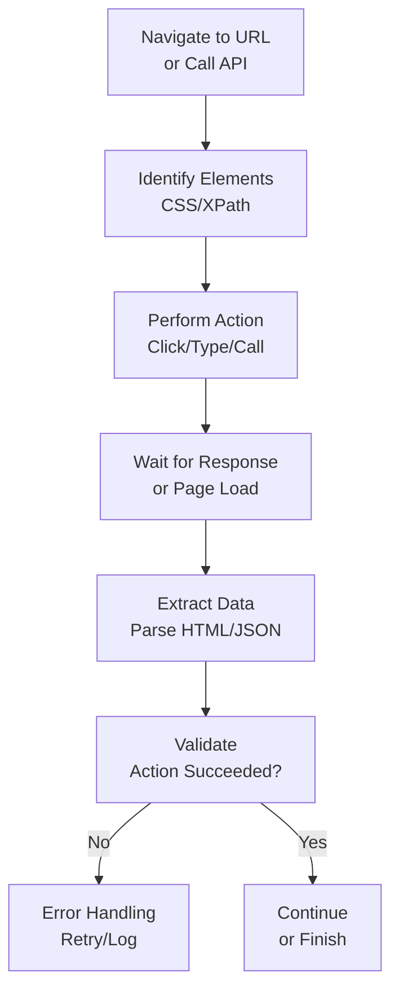

# Web Agents

## Detailed Explanation

Web agents interact with websites through browser automation or API calls. Core mechanisms: (1) browser automation—control browser to click, type, navigate (Selenium, Puppeteer), (2) API calls—direct HTTP requests to web services, (3) parsing—extract data from HTML (BeautifulSoup, CSS selectors). Advantages: automate repetitive web tasks (data scraping, form filling), access web services not designed for automation, test web applications. Challenges: website changes break automation (selectors become invalid), JavaScript rendering (agent must wait for page to load), handling authentication (cookies, sessions), rate limiting (don't overwhelm server), legal/ethical concerns (respect robots.txt, terms of service). Best for: data collection (public data from websites), workflow automation (fill forms across multiple sites), testing (automated testing of web apps), content aggregation (collect articles from multiple sources).

## Core Intuition

Imagine hiring someone to browse websites and fill forms for you. They open browser, navigate to site, read instructions on page, click buttons, fill forms, extract data. Web agents are automated web browsing and interaction.

## How It Works

Web agents operate through: navigate → select element → perform action → wait → extract data:

1. **Navigation** — Open website or call API endpoint
2. **Element Selection** — Find button/input using CSS selector or XPath
3. **Action** — Click button, type text, submit form, or call API
4. **Wait** — Wait for page load or response
5. **Extraction** — Parse HTML/JSON, extract needed data
6. **Validation** — Verify action succeeded
7. **Next Step** — Repeat or finish



## Architecture / Trade-offs

**Automation Style:**
- **Browser automation** — Full browser control, handles JavaScript, slower, full DOM access
- **API calls** — Direct HTTP, faster, requires API documentation, no JavaScript execution
- **Hybrid** — Use API when available, fallback to browser automation

**Reliability:**
- **Exact selectors** — Wait for specific element (fails if selector changes)
- **Robust patterns** — Wait for state change (timeout safer, less brittle)
- **Polling** — Repeatedly check until condition met (simple, inefficient)

**Timing:**
- **Implicit waits** — Automatic timeout after N seconds
- **Explicit waits** — Wait for specific element/condition
- **No wait** — Assume page loaded (fragile, fast)

## Interview Q&A

**Q: When should you use browser automation vs API calls?**
A: API if available (faster, reliable, respects service). Browser automation if no API (web scraping, web app testing, JavaScript-dependent). Hybrid: try API first, fallback to browser.

**Q: How do you handle website changes that break selectors?**
A: (1) Use stable selectors (ID > class > XPath), (2) Monitor selectors (test regularly), (3) Fallback selectors (multiple ways to find same element), (4) Alerts (notify when selector fails).

**Q: How do you avoid overwhelming servers?**
A: Add delays between requests (random jitter), respect robots.txt, check rate limit headers, use API instead of scraping when available.

**Q: How do you handle JavaScript-heavy sites?**
A: Use browser automation (Selenium, Puppeteer) that executes JavaScript. Wait for dynamic content to load before extracting.

**Q: Is web scraping legal?**
A: Gray area. Check: (1) terms of service (usually prohibit), (2) robots.txt (instructions for bots), (3) legality (varies by jurisdiction), (4) data sensitivity (public vs private). Better: use official API.

**Q: How do you maintain web agent as websites evolve?**
A: (1) Monitoring—alert when selectors break, (2) Testing—regular tests with real site, (3) Flexible selectors—multiple ways to find elements, (4) Documentation—why this selector was chosen.

## Best Practices

1. **Use APIs When Available** — Faster, more reliable, less maintenance
2. **Respect Rate Limits** — Add delays, honor service constraints
3. **Explicit Waits** — Wait for element to appear, not fixed time
4. **Error Handling** — Handle missing elements, timeouts, network errors
5. **Stable Selectors** — Prefer IDs over classes over XPath
6. **Headless Mode** — Run browser without UI for speed
7. **Session Management** — Persist cookies/auth across requests
8. **Logging** — Log all actions and failures for debugging
9. **Monitoring** — Alert when selectors break or requests fail
10. **Legal Compliance** — Check terms of service, respect robots.txt

## Common Pitfalls

**Pitfall 1: Brittle Selectors**
Issue: Selector breaks when website updates HTML structure.
Fix: Use multiple fallback selectors. Use stable IDs, not fragile class names.

**Pitfall 2: Missing Waits**
Issue: Code tries to interact with element before page loads.
Fix: Use explicit waits for elements, not sleep().

**Pitfall 3: No Error Handling**
Issue: Script crashes on first unexpected response.
Fix: Try-catch, log errors, implement retries with exponential backoff.

**Pitfall 4: Rate Limiting**
Issue: Script triggers rate limiting, IP gets blocked.
Fix: Add delays, reduce request rate, check response headers.

**Pitfall 5: No Session Management**
Issue: Re-authenticate on every request (slow, may trigger alerts).
Fix: Persist cookies, reuse session across multiple requests.

**Pitfall 6: Not Respecting robots.txt**
Issue: Scrape site against its wishes, get blocked.
Fix: Check robots.txt, respect disallow directives, contact site if need data.

## Code Examples

### Example 1: Browser Automation with Selenium

```python
from selenium import webdriver
from selenium.webdriver.common.by import By
from selenium.webdriver.support.ui import WebDriverWait
from selenium.webdriver.support import expected_conditions as EC

def automate_search(search_term):
    driver = webdriver.Chrome()
    try:
        driver.get("https://example.com")
        
        # Explicit wait for element
        wait = WebDriverWait(driver, 10)
        search_box = wait.until(EC.presence_of_element_located((By.ID, "search")))
        
        search_box.send_keys(search_term)
        search_button = driver.find_element(By.ID, "search_button")
        search_button.click()
        
        # Wait for results to load
        results = wait.until(EC.presence_of_all_elements_located((By.CLASS_NAME, "result")))
        
        return [r.text for r in results]
    finally:
        driver.quit()
```

### Example 2: API-Based Web Agent

```python
import requests
import time

class APIWebAgent:
    def __init__(self, base_url, rate_limit_delay=1):
        self.base_url = base_url
        self.rate_limit_delay = rate_limit_delay
        self.last_request = 0
    
    def get(self, endpoint, params=None):
        '''Make API request with rate limiting.'''
        # Respect rate limits
        elapsed = time.time() - self.last_request
        if elapsed < self.rate_limit_delay:
            time.sleep(self.rate_limit_delay - elapsed)
        
        url = f"{self.base_url}/{endpoint}"
        response = requests.get(url, params=params)
        self.last_request = time.time()
        
        response.raise_for_status()  # Raise on error
        return response.json()

# Usage
agent = APIWebAgent("https://api.example.com", rate_limit_delay=2)
data = agent.get("search", params={"q": "python"})
```

### Example 3: Hybrid Approach

```python
import requests
from bs4 import BeautifulSoup

class HybridWebAgent:
    def __init__(self, base_url):
        self.base_url = base_url
        self.session = requests.Session()
    
    def get_data_hybrid(self, endpoint):
        '''Try API first, fallback to scraping.'''
        try:
            # Try API
            response = self.session.get(f"{self.base_url}/api/{endpoint}")
            response.raise_for_status()
            return response.json()
        except Exception as e:
            # Fallback to HTML scraping
            response = self.session.get(f"{self.base_url}/{endpoint}")
            soup = BeautifulSoup(response.content, "html.parser")
            
            # Extract data (example: all links)
            links = [a.get("href") for a in soup.find_all("a")]
            return {"links": links, "source": "scraped"}

# Usage
agent = HybridWebAgent("https://example.com")
data = agent.get_data_hybrid("products")
```

## Related Concepts

- **Agent Loops** — Web agent loop: request, parse, extract, repeat
- **Error Recovery** — Handle failed requests, retries
- **Tool Use** — Web APIs as tools agents can use
- **Observability** — Monitor agent requests and responses
- **Autonomous Agents** — Web agents operating without supervision
