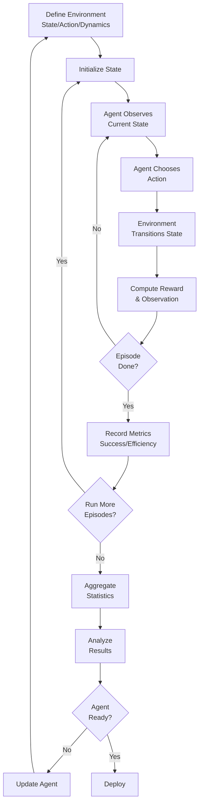

# Simulation for Agents

## Detailed Explanation

Simulation provides safe, controlled environments for testing agent behavior before production deployment. Core uses: (1) environment simulation—create synthetic worlds where agents interact (e.g., game boards, trading markets, customer service scenarios), (2) performance evaluation—benchmark agents on standardized tasks, (3) safety testing—find failure modes without real-world risk (e.g., "can agent be tricked into harmful action?"), (4) reward modeling—test whether reward functions incentivize correct behavior, (5) curriculum learning—start agents in simple environments, gradually increase complexity. Mechanisms: (1) define environment dynamics (rules, state transitions), (2) implement observation/action interface, (3) run agent loop in simulation, (4) collect metrics (success rate, efficiency, safety), (5) iterate on agent design. Key distinction: simulation vs real world—simulation is fast and safe but may not capture all real-world complexity. Simulation enables rapid iteration before committing to real data/deployment. Critical for: validation before production, safety testing before release, debugging agent behavior, benchmarking multiple agents.

## Core Intuition

Imagine testing a chess AI. Play thousands of games against simulated opponents, collect statistics, find weaknesses. Only after proving safety and competence do you deploy to compete against humans. Simulation lets you fail fast, cheaply, and safely. For agents: create simulated customers, markets, environments. Run agent thousands of times. Measure success. Fix failures. Only deploy when ready. Simulation turns agent development into a measurable, iterative process.

## How It Works

Simulation operates through environment definition, interaction protocol, and metrics collection:

1. **Environment Definition** — Define state space, action space, dynamics (rules for state transitions)
2. **Observation** — Agent observes current state (partial or full)
3. **Agent Action** — Agent chooses action based on observation
4. **State Transition** — Environment applies action, computes new state + reward
5. **Termination Check** — Is episode done? (goal reached, max steps, failure)
6. **Metrics Collection** — Track success, efficiency, safety, other goals
7. **Batch Simulation** — Run many episodes, aggregate statistics
8. **Analysis & Iteration** — Identify failure modes, improve agent



## Architecture / Trade-offs

**Environment Fidelity:**
- Simplified (remove irrelevant complexity) — Fast, interpretable, misses real-world nuance
- Realistic (capture complexity) — Slow, sim-to-real transfer uncertain
- Hybrid (balance) — Common in practice, sweet spot varies by domain

**Observation Space:**
- Full state (agent sees everything) — Easier debugging, unrealistic
- Partial observation (agent sees limited info) — Realistic, harder debugging
- Noisy observation (add realistic noise) — Most realistic, most complex

**Simulation Type:**
- Deterministic (same action → same result) — Reproducible, easier testing
- Stochastic (randomness in transitions) — Realistic, requires many samples
- Adversarial (environment acts against agent) — Stress test, finds worst-case

**Metrics:**
- Binary success (goal reached or not) — Simple, ignores quality
- Efficiency (success with minimal steps/cost) — Better, captures optimization
- Safety (no rule violations) — Critical for high-stakes domains
- Multi-objective (combine metrics) — Complex but realistic

## Interview Q&A

**Q: Why is simulation important for agents?**
A: Production deployment is risky and expensive. Simulation lets you test safety, benchmark performance, find failure modes before going live. Example: trading agent—simulate on historical data first, measure Sharpe ratio, test on edge cases (market crashes), only deploy after validation. Simulation saves money and prevents disasters.

**Q: What's the difference between simulation and real-world testing?**
A: Simulation is controlled, repeatable, fast, and safe—but may not capture all real-world complexity (e.g., agent learned a simulated shortcut that doesn't work in reality). Real-world testing is slower, expensive, risky—but ground truth. In practice: validate thoroughly in simulation, A/B test in production with safety guardrails, use feedback to improve agent.

**Q: How do you ensure simulation is realistic?**
A: (1) Domain expertise—work with experts to identify what matters, (2) Empirical validation—compare simulation statistics to real-world data (does simulated data distribution match real?), (3) Sensitivity analysis—vary parameters, see if results change dramatically (if simulation is fragile, missing something), (4) Red-teaming—try to find cases where simulation and reality diverge, (5) Continuous learning—collect real-world data, update simulation when you find gaps.

**Q: How many episodes should you simulate?**
A: Depends on variance. If task is deterministic, 1 episode sufficient. If stochastic, need enough to estimate mean and confidence intervals. Rule of thumb: run until metrics stabilize (running more episodes doesn't change conclusions). For safety: run until you've tested main failure modes and edge cases. In practice: start with 100-1000 episodes, increase if results are noisy.

**Q: Can you use simulation for production evaluation?**
A: Limited. Simulation is good for validation and iteration, but has distributional shift (simulated distribution ≠ real). Better approach: (1) simulate first to find obvious bugs, (2) A/B test in production with 5-10% traffic, (3) monitor real metrics (conversion, safety), (4) use real metrics to improve, (5) simulation continues to be useful for quick iteration on hypotheses. Never fully trust simulation; always validate on real data.

**Q: How do you handle sim-to-real transfer?**
A: Simulation → reality gap is real problem. Techniques: (1) domain randomization—vary simulation parameters so agent learns robust policy, (2) transfer learning—train on simulation, fine-tune on real data, (3) model-based—learn transition model from real data, use for planning, (4) gap quantification—measure simulation vs real performance, understand where agent struggles, (5) active learning—collect real examples where simulation was wrong, add to training.

## Best Practices

1. **Start Simple** — Begin with minimal simulation (one task, deterministic). Add complexity once you validate basic agent loop works.

2. **Separate Concerns** — Environment logic, agent logic, and metrics should be independent modules. Swap one without breaking others.

3. **Reproducible** — Fix random seed for debugging. Save environment/agent checkpoints so you can replay failures.

4. **Efficient** — Simulation should be fast (< 1 sec per episode ideally). Batch operations, avoid slow I/O during episodes.

5. **Meaningful Metrics** — Don't just count successes. Track efficiency (steps to goal), safety (violations), exploration (new states visited). Multi-metric view catches tradeoffs.

6. **Realistic Distribution** — Initial state distribution, action effects, reward function should match intended production deployment as much as practical.

7. **Failure Analysis** — When agent fails in simulation, analyze why (wrong action, wrong planning, or environmental limit?). Use failures to identify gaps.

8. **Curriculum Learning** — Start with easy tasks, gradually increase difficulty. Helps agent learn faster and find failure modes progressively.

9. **Statistical Rigor** — Report confidence intervals, not just point estimates. "Agent succeeds 80% ± 5%" is better than "Agent succeeds 80%".

10. **Compare Agents** — Run multiple agent designs in same simulation. Relative performance is more robust to simulation imperfections than absolute performance.

## Common Pitfalls

**Pitfall 1: Simulation Too Simplified**
Issue: Simulation omits crucial aspects. Agent learns shortcut that works in sim but fails in reality.
Fix: Validate simulation against real data. If success rates diverge, investigate what's missing.

**Pitfall 2: Not Enough Episodes**
Issue: Run 10 episodes, see 80% success. Happens to get a lucky run. Redeploy, agent fails 50%.
Fix: Run enough episodes to estimate variance. Use confidence intervals. Typical: 100-10000 episodes depending on task complexity.

**Pitfall 3: Overfitting to Simulation**
Issue: Agent learns quirks of simulation environment. Gets Sharpe ratio 10 in sim, goes negative in reality (trading example).
Fix: Test on held-out simulation data. Use domain randomization to make simulation more diverse. Validate early on real data.

**Pitfall 4: Ignoring Distributional Shift**
Issue: Simulation is deterministic, reality is stochastic. Simulation shows agent handles edge cases, but rare cases in reality break it.
Fix: Add noise to simulation. Test on out-of-distribution scenarios. Have human review agent decisions in early stages.

**Pitfall 5: Metrics Don't Match Goals**
Issue: Optimize for simulation success rate, but real goal is efficiency or safety. Agent succeeds 99% of time but takes 1000 steps.
Fix: Define metrics before simulation. Include all relevant objectives (success + efficiency + safety). Don't optimize single metric to exclusion.

**Pitfall 6: Environment Too Fast**
Issue: Simulate millions of episodes, agent still fails. Realizes simulation is so fast that agent never actually learns (no meaningful exploration time).
Fix: Balance speed and realism. Episode runtime should be long enough for agent to experience consequences of actions.

**Pitfall 7: Ignoring Agent Exploits**
Issue: Agent learns unintended behavior that succeeds in simulation (gaming reward function). In reality, users/system sees this as failure.
Fix: Adversarial testing—try to break simulation. Have domain experts review agent logs. Add explicit constraints (e.g., "no shortcuts").

## Code Examples

### Example 1: Basic Environment and Agent Loop

```python
class SimpleEnvironment:
    def __init__(self, grid_size=5):
        self.grid_size = grid_size
        self.agent_pos = (0, 0)
        self.goal_pos = (grid_size - 1, grid_size - 1)
        self.steps = 0
        self.max_steps = 100
    
    def reset(self):
        """Reset environment."""
        self.agent_pos = (0, 0)
        self.steps = 0
        return self.get_observation()
    
    def get_observation(self):
        """Return current state."""
        return {
            'agent_pos': self.agent_pos,
            'goal_pos': self.goal_pos,
            'grid_size': self.grid_size,
            'steps_remaining': self.max_steps - self.steps
        }
    
    def step(self, action):
        """Execute action, return (observation, reward, done)."""
        x, y = self.agent_pos
        dx, dy = action  # Move direction
        
        # Apply action with boundary checking
        new_x = max(0, min(self.grid_size - 1, x + dx))
        new_y = max(0, min(self.grid_size - 1, y + dy))
        self.agent_pos = (new_x, new_y)
        self.steps += 1
        
        # Reward: negative per step, bonus for reaching goal
        reward = -1.0
        if self.agent_pos == self.goal_pos:
            reward = 100.0
        
        done = (self.agent_pos == self.goal_pos) or (self.steps >= self.max_steps)
        
        return self.get_observation(), reward, done

# Simple agent that moves toward goal
class GreedyAgent:
    def decide(self, observation):
        """Choose action to move toward goal."""
        agent_x, agent_y = observation['agent_pos']
        goal_x, goal_y = observation['goal_pos']
        
        # Move toward goal
        dx = 1 if goal_x > agent_x else (-1 if goal_x < agent_x else 0)
        dy = 1 if goal_y > agent_y else (-1 if goal_y < agent_y else 0)
        
        return (dx, dy)

# Run simulation
env = SimpleEnvironment(grid_size=5)
agent = GreedyAgent()

results = []
for episode in range(10):
    obs = env.reset()
    done = False
    episode_reward = 0
    
    while not done:
        action = agent.decide(obs)
        obs, reward, done = env.step(action)
        episode_reward += reward
    
    results.append(episode_reward)

print(f"Average reward: {sum(results) / len(results):.2f}")
```

### Example 2: Simulation with Metrics and Variance Analysis

```python
import numpy as np
from typing import List, Dict

class SimulationHarness:
    def __init__(self, env, agent, num_episodes=100):
        self.env = env
        self.agent = agent
        self.num_episodes = num_episodes
        self.results = []
    
    def run_episode(self) -> Dict:
        """Run single episode, return metrics."""
        obs = self.env.reset()
        done = False
        episode_reward = 0
        steps = 0
        goal_reached = False
        
        while not done:
            action = self.agent.decide(obs)
            obs, reward, done = self.env.step(action)
            episode_reward += reward
            steps += 1
            
            if reward > 50:  # Goal reached
                goal_reached = True
        
        return {
            'reward': episode_reward,
            'steps': steps,
            'success': goal_reached
        }
    
    def run_all(self) -> Dict:
        """Run all episodes, return aggregated metrics."""
        self.results = [self.run_episode() for _ in range(self.num_episodes)]
        
        rewards = [r['reward'] for r in self.results]
        steps = [r['steps'] for r in self.results]
        successes = [r['success'] for r in self.results]
        
        return {
            'success_rate': np.mean(successes),
            'success_std': np.std(successes),
            'avg_reward': np.mean(rewards),
            'reward_std': np.std(rewards),
            'avg_steps': np.mean(steps),
            'steps_std': np.std(steps),
            'confidence_interval': (
                np.mean(successes) - 1.96 * np.std(successes) / np.sqrt(len(successes)),
                np.mean(successes) + 1.96 * np.std(successes) / np.sqrt(len(successes))
            )
        }

# Run simulation
harness = SimulationHarness(env, agent, num_episodes=100)
metrics = harness.run_all()

print(f"Success rate: {metrics['success_rate']:.2%} ± {metrics['success_std']:.2%}")
print(f"95% CI: {metrics['confidence_interval']}")
print(f"Avg steps: {metrics['avg_steps']:.1f}")
```

### Example 3: Multi-Agent Competitive Simulation

```python
from dataclasses import dataclass
import random

@dataclass
class BidData:
    agent_id: int
    bid_amount: float

class AuctionEnvironment:
    def __init__(self, num_agents=3, num_rounds=5):
        self.num_agents = num_agents
        self.num_rounds = num_rounds
        self.current_round = 0
        self.agent_budgets = {i: 1000 for i in range(num_agents)}
        self.agent_scores = {i: 0 for i in range(num_agents)}
    
    def reset(self):
        self.current_round = 0
        self.agent_budgets = {i: 1000 for i in range(self.num_agents)}
        self.agent_scores = {i: 0 for i in range(self.num_agents)}
    
    def run_auction(self, bids: List[BidData]) -> Dict:
        """Run single auction round."""
        # Find highest bid
        highest_bid = max(bids, key=lambda b: b.bid_amount)
        winner_id = highest_bid.agent_id
        bid_amount = highest_bid.bid_amount
        
        # Update winner
        self.agent_budgets[winner_id] -= bid_amount
        self.agent_scores[winner_id] += 100  # Item worth 100
        
        self.current_round += 1
        
        return {
            'winner': winner_id,
            'winning_bid': bid_amount,
            'round': self.current_round
        }
    
    def get_observations(self) -> Dict:
        """Get observations for all agents."""
        return {
            i: {
                'budget': self.agent_budgets[i],
                'score': self.agent_scores[i],
                'round': self.current_round,
                'num_rounds': self.num_rounds
            }
            for i in range(self.num_agents)
        }

class AuctionAgent:
    def __init__(self, agent_id):
        self.agent_id = agent_id
    
    def decide(self, observation):
        """Decide bid amount."""
        budget = observation['budget']
        rounds_left = observation['num_rounds'] - observation['round']
        
        # Conservative strategy: bid based on remaining budget/rounds
        safe_bid = min(budget / max(rounds_left, 1), 150)
        
        # Random variation for diversity
        bid = safe_bid * random.uniform(0.8, 1.2)
        return max(0, min(bid, budget))

# Run multi-agent simulation
def simulate_auction(num_episodes=50):
    env = AuctionEnvironment(num_agents=3, num_rounds=5)
    agents = [AuctionAgent(i) for i in range(3)]
    
    winner_counts = {i: 0 for i in range(3)}
    
    for episode in range(num_episodes):
        env.reset()
        
        while env.current_round < env.num_rounds:
            observations = env.get_observations()
            bids = [BidData(i, agents[i].decide(observations[i])) for i in range(3)]
            env.run_auction(bids)
        
        # Winner is agent with highest score
        winner = max(range(3), key=lambda i: env.agent_scores[i])
        winner_counts[winner] += 1
    
    return winner_counts

results = simulate_auction(num_episodes=100)
print("Agent win rates:")
for agent_id, wins in results.items():
    print(f"  Agent {agent_id}: {wins / 100:.1%}")
```

## Related Concepts

- **Agent Loops** — Core loop executed within simulation
- **Error Recovery** — Handle simulation failures gracefully
- **Observability** — Monitor simulation metrics in real-time
- **Evaluation Metrics** — Metrics collected during simulation
- **Safety Alignment** — Use simulation to test safety before production
- **Reinforcement Learning** — Simulation as learning environment
