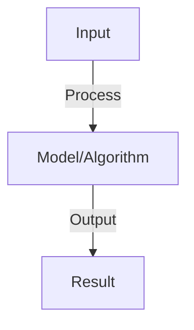

# LangChain Framework

## Detailed Explanation

Build complex language model applications using chains, agents, memory, and tool integrations

## Core Intuition

Build complex language model applications using chains, agents, memory, and tool integrations Core idea: understand the fundamental principle and how it applies.

## How It Works

1. LLMs (language models): wrappers for OpenAI, HuggingFace, etc.
2. Chains: sequence of calls to LLMs and other tools
   - LLMChain: template → format input → LLM → parse output
   - SequentialChain: run chains in sequence, pass outputs
3. Agents: LLM decides which tools to use iteratively
   - Think: LLM decides next action
   - Act: execute tool
   - Observe: see result
   - Repeat
4. Memory: store conversation history, retrieved context
5. Tools: calculators, search, databases, APIs

## Architecture / Trade-offs

### LangChain Framework Architecture

| Component | Role | Trade-off |
|-----------|------|-----------|
| **Core** | Primary functionality | Complexity vs effectiveness |
| **Support** | Auxiliary systems | Overhead vs robustness |

### Design Considerations

- **Scalability:** System scales with data and model size
- **Efficiency:** Computational and memory trade-offs
- **Flexibility:** Adaptability to different tasks
- **Robustness:** Handling edge cases and failures

### Implementation Strategy

- **Baseline:** Start with simple approach
- **Iterate:** Measure and optimize bottlenecks
- **Validate:** Test on representative data

## Interview Q&A

**Q: What's the difference between chains and agents?**
A: Chains: predetermined sequence of steps. Agents: LLM decides steps dynamically. Chains are deterministic, agents flexible. Use chains for fixed workflows, agents for reasoning-based decisions.

**Q: How does LangChain memory work?**
A: Stores messages (user, assistant) in conversation. Types: ConversationBufferMemory (all), ConversationSummaryMemory (summarize old), ConversationKGMemory (knowledge graph). Tradeoff: length vs richness.

**Q: What are prompts and prompt templates in LangChain?**
A: Templates: reusable prompt structures with variables. Example: 'Analyze {text} for {sentiment}'. At runtime, variables are filled. Enables prompt reuse, versioning, testing.

**Q: How do you handle errors in chains?**
A: Try-catch in code, but also: ValidationError for bad format, LLMException for API fails. Add fallbacks: if tool fails, try alternative. Retry with backoff for transient errors.

**Q: What is output parsing and why is it needed?**
A: LLMs output free text; need to extract structured data. Parsers: JSON (force format), PydanticOutputParser (validate schema), CommaSeparatedListOutputParser. Critical for using outputs downstream.

## Best Practices

- Research and implement best practices as you learn the concept
- Consider production implications and scalability
- Test on realistic data and benchmarks
- Monitor performance and iterate

## Common Pitfalls

- Oversimplifying the problem — understand nuances
- Ignoring computational costs and practicality
- Not validating assumptions with real data
- Premature optimization without profiling

## Code Examples

See concept implementation and real-world examples in the associated notebook.

## Related Concepts

- Review foundational concepts first
- Understand prerequisites before advanced topics
- Connect concepts to build integrated knowledge
