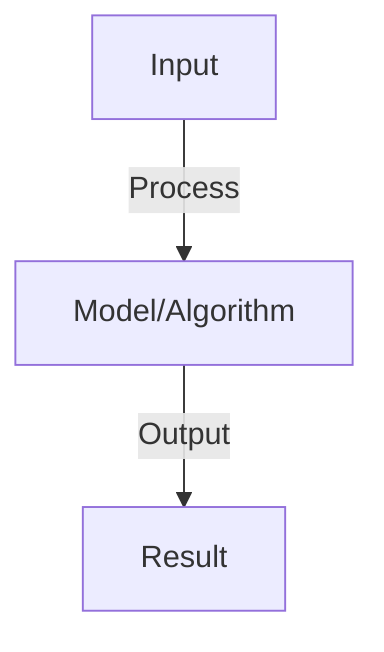

# AutoGen Multi-Agent Orchestration

## Detailed Explanation

Coordinate multiple agents with different roles and capabilities to solve complex tasks through conversation

## Core Intuition

Coordinate multiple agents with different roles and capabilities to solve complex tasks through conversation Core idea: understand the fundamental principle and how it applies.

## How It Works

1. Define agents with specific roles (researcher, critic, executor)
2. Assign capabilities: tool access, knowledge base, reasoning
3. Agent interaction: send messages back-and-forth
   - Agent A → Agent B: question or result
   - Agent B → Agent A: response or next action
4. Termination: conversation ends when task solved or max rounds reached
5. Nested agents: agent calls another agent as a tool
6. Example: user → researcher (gathers info) → critic (evaluates) → executor (takes action)

## Architecture / Trade-offs

Trade-off 1 vs trade-off 2 — consider context and requirements.

## Interview Q&A

**Q: How do you define agent roles in AutoGen?**
A: System message defines role: 'You are a researcher. Your job is to...'. Role shapes how agent interprets requests and what tools it has. Clear roles reduce hallucination and wasted steps.

**Q: What's better: one smart agent or many specialized agents?**
A: Many agents: better division of labor, easier to debug (separate concerns), can verify work. One agent: simpler, fewer tokens (fewer messages), faster. Use many for complex tasks, one for simple.

**Q: How do you handle agent disagreement?**
A: Add a moderator agent that arbitrates. Or voting: each agent proposes solution, majority wins. Or escalation: complex cases go to human. Context matters: some tasks need consensus, others don't.

**Q: What is the cost of multi-agent systems vs single agent?**
A: Multi-agent: more API calls (message overhead), more tokens total. Single agent: fewer calls but may fail on complex tasks. Measure: token count × cost/token + latency tradeoff. Multi-agent often cheaper for complex tasks.

**Q: How do you prevent infinite loops in agent conversations?**
A: Set max_rounds (e.g., 20 turns max). Monitor: if same question repeated, stop. Termination condition: check if task complete (heuristic). Human-in-loop: user can stop anytime.

## Best Practices

- Research and implement best practices as you learn the concept
- Consider production implications and scalability
- Test on realistic data and benchmarks
- Monitor performance and iterate

## Common Pitfalls

- Oversimplifying the problem — understand nuances
- Ignoring computational costs and practicality
- Not validating assumptions with real data
- Premature optimization without profiling

## Code Examples

See concept implementation and real-world examples in the associated notebook.

## Related Concepts

- Review foundational concepts first
- Understand prerequisites before advanced topics
- Connect concepts to build integrated knowledge
