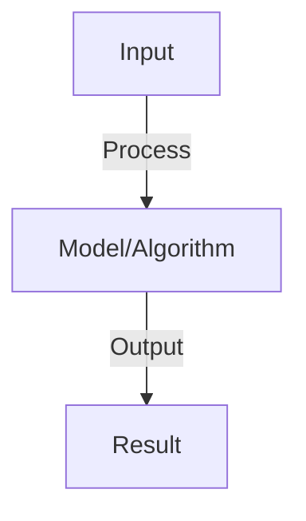

# OpenAI Assistants API

## Detailed Explanation

Build stateful agents using OpenAI's managed assistant infrastructure with thread management and file handling

## Core Intuition

Build stateful agents using OpenAI's managed assistant infrastructure with thread management and file handling Understanding this concept enables better system design and problem-solving.

## How It Works

1. Assistant: define agent with instructions, model, tools, files
2. Thread: conversation session, persists messages and history
3. Run: execute assistant on thread, returns step-by-step execution
4. Messages: user and assistant messages in thread
5. Tools: code_interpreter (execute Python), retrieval (search uploaded files), function_call
6. File handling: upload documents, assistant can retrieve and analyze
7. Process: create assistant → create thread → add message → run → handle tool calls → check status

## Architecture / Trade-offs

Key trade-offs and design considerations for this concept.

## Interview Q&A

**Q: What's the advantage of Assistants API vs raw LLM calls?**
A: Thread management: built-in conversation history (don't need to manage manually). Tool use: automatic handling of function calls. File handling: can work with documents without embedding. Simplification: less code, less error handling needed.

**Q: How do you handle function calls in Assistants?**
A: Define functions in assistant config (name, description, parameters). When model calls function, run gets 'requires_action' status. You execute function, submit result back to thread. Assistant continues from there. Automatic retry/recovery.

**Q: Can you upload files for the assistant to analyze?**
A: Yes: upload to Files API, pass file_ids to assistant. Assistant can use code_interpreter to analyze (CSV, images, text, code). Can also use retrieval tool for semantic search over documents. File size limits apply (max 20MB per file).

**Q: How do you implement stateful conversations?**
A: Threads persist: each thread has unique ID. Messages stay in thread automatically. No need to pass full conversation history each time. Add user message → run → assistant responds. Thread handles state transparently.

**Q: What are limitations of Assistants API?**
A: Cost: more expensive than raw API (overhead of managed service). Latency: slightly higher. Control: less fine-grained (less customization than building from scratch). Best for: prototypes, simple agents, teams wanting managed service.

## Best Practices

- Apply best practices specific to this concept
- Consider edge cases and failure modes
- Test on representative data
- Evaluate comprehensively

## Common Pitfalls

- Avoid over-simplification
- Watch for incorrect assumptions
- Test edge cases thoroughly
- Monitor for degradation

## Code Examples

See the associated notebook for implementation and real-world examples.

## Related Concepts

- Understand prerequisites first
- Connect related topics
- Build integrated knowledge
