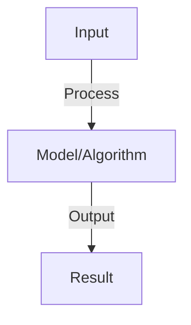
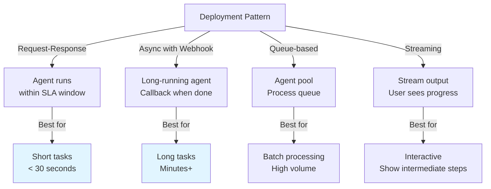

# Agent Deployment Patterns

## Detailed Explanation

Agent deployment patterns address the challenges of running multi-step, tool-using AI systems in production where traditional deployment patterns don't directly apply. Agents are different from standard models: they make decisions about whether to use tools, how to interpret tool results, and when to stop—creating non-deterministic behavior, variable latency, and potential failure modes. Production deployment requires patterns for: error handling (what if a tool call fails?), state management (tracking agent progress), cost control (preventing expensive infinite loops), and observability (understanding why the agent made decisions).

Deployment patterns include: (1) Request-response with timeout (agent runs for fixed time), (2) Streaming output (showing agent steps as they happen), (3) Asynchronous with webhooks (long-running agents), (4) Agent pools (load balancing across multiple agent instances), (5) Staged rollout (deploying to a fraction of traffic first). Key decisions include where to run agents (cloud API, on-premise for latency), how to handle failures (retry with different tools? escalate to human?), and how to monitor behavior (are agents reliably achieving goals?).

Understanding agent deployment patterns is crucial as agent-based systems move from research to production. It requires systems thinking about infrastructure, reliability, and observability—recognizing that agents differ fundamentally from stateless model inference.

## Core Intuition

Deploying a model is like deploying a calculator: stateless, deterministic, fast. Deploying an agent is like deploying an employee who needs to think, make decisions, and use various tools. That's harder: you need to manage their work progress, handle when tools fail, ensure they don't get stuck, and understand their decision-making process.

## How It Works

1. Containerization: Docker image with agent code, dependencies, config
2. Orchestration: Kubernetes for scaling, health checks, updates
3. API gateway: expose agent as REST/gRPC endpoint
4. Load balancing: distribute traffic across agent replicas
5. State management: persistent storage for conversation history, context
6. Monitoring: logs, metrics, error tracking
7. Graceful shutdown: finish in-flight requests before stopping
8. Versioning: deploy new agent versions without downtime (blue-green, canary)

## Architecture / Trade-offs

### Deployment Pattern Options

### Failure Handling Strategies

| Strategy | Coverage | Complexity | Cost |
|----------|----------|-----------|------|
| **Retry with backoff** | Transient failures | Low | Low |
| **Fallback agent** | Degraded mode | Medium | Medium |
| **Human escalation** | Critical cases | Medium | High |
| **Circuit breaker** | Cascade prevention | Low | Low |
| **Timeout limits** | Runaway agents | Low | Low |
## Interview Q&A

**Q: How do you handle agent state in distributed deployments?**
A: Challenge: agent state (conversation history) needs to persist. Solutions: (1) centralized database (Redis, Postgres), (2) sticky sessions (route user to same agent), (3) stateless design (pass state in messages). Database more reliable for high-availability.

**Q: What are blue-green deployments for agents?**
A: Blue (current): agent version A handling all traffic. Green (new): agent version B deployed but idle. Switch: route traffic from blue to green. Rollback: easy (switch back to blue). Zero downtime, quick rollback if issues.

**Q: How do you monitor agent health in production?**
A: Metrics: response latency, error rate, token usage, cost. Logs: requests, responses, errors. Alerts: latency spike, error rate >1%, cost anomaly. Distributed tracing: track request flow through components. Real-time dashboard for on-call team.

**Q: What is graceful shutdown and why does it matter?**
A: Graceful: agent stops accepting new requests, finishes in-flight requests, then shuts down. Matters: avoids losing mid-computation work, maintains user experience. Timeout: if request takes >30s, force shutdown (prevent hanging forever).

**Q: How do you scale agents horizontally?**
A: Replicas: run multiple agent instances behind load balancer. Autoscaling: increase replicas when CPU/latency high, decrease when low. Challenges: maintain state consistency, manage shared resources (databases, APIs). Stateless agents easier to scale.

## Best Practices

- Apply best practices specific to this concept
- Consider edge cases and failure modes
- Test on representative data
- Evaluate comprehensively

## Common Pitfalls

- Avoid over-simplification
- Watch for incorrect assumptions
- Test edge cases thoroughly
- Monitor for degradation

## Code Examples

See the associated notebook for implementation and real-world examples.

## Related Concepts

- Understand prerequisites first
- Connect related topics
- Build integrated knowledge
