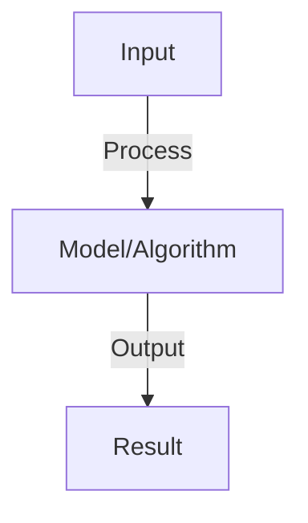

# Agent Deployment Patterns

## Detailed Explanation

Deploy agents to production with containerization, scaling, monitoring, and reliability

## Core Intuition

Deploy agents to production with containerization, scaling, monitoring, and reliability Understanding this concept enables better system design and problem-solving.

## How It Works

1. Containerization: Docker image with agent code, dependencies, config
2. Orchestration: Kubernetes for scaling, health checks, updates
3. API gateway: expose agent as REST/gRPC endpoint
4. Load balancing: distribute traffic across agent replicas
5. State management: persistent storage for conversation history, context
6. Monitoring: logs, metrics, error tracking
7. Graceful shutdown: finish in-flight requests before stopping
8. Versioning: deploy new agent versions without downtime (blue-green, canary)

## Architecture / Trade-offs

Key trade-offs and design considerations for this concept.

## Interview Q&A

**Q: How do you handle agent state in distributed deployments?**
A: Challenge: agent state (conversation history) needs to persist. Solutions: (1) centralized database (Redis, Postgres), (2) sticky sessions (route user to same agent), (3) stateless design (pass state in messages). Database more reliable for high-availability.

**Q: What are blue-green deployments for agents?**
A: Blue (current): agent version A handling all traffic. Green (new): agent version B deployed but idle. Switch: route traffic from blue to green. Rollback: easy (switch back to blue). Zero downtime, quick rollback if issues.

**Q: How do you monitor agent health in production?**
A: Metrics: response latency, error rate, token usage, cost. Logs: requests, responses, errors. Alerts: latency spike, error rate >1%, cost anomaly. Distributed tracing: track request flow through components. Real-time dashboard for on-call team.

**Q: What is graceful shutdown and why does it matter?**
A: Graceful: agent stops accepting new requests, finishes in-flight requests, then shuts down. Matters: avoids losing mid-computation work, maintains user experience. Timeout: if request takes >30s, force shutdown (prevent hanging forever).

**Q: How do you scale agents horizontally?**
A: Replicas: run multiple agent instances behind load balancer. Autoscaling: increase replicas when CPU/latency high, decrease when low. Challenges: maintain state consistency, manage shared resources (databases, APIs). Stateless agents easier to scale.

## Best Practices

- Apply best practices specific to this concept
- Consider edge cases and failure modes
- Test on representative data
- Evaluate comprehensively

## Common Pitfalls

- Avoid over-simplification
- Watch for incorrect assumptions
- Test edge cases thoroughly
- Monitor for degradation

## Code Examples

See the associated notebook for implementation and real-world examples.

## Related Concepts

- Understand prerequisites first
- Connect related topics
- Build integrated knowledge
