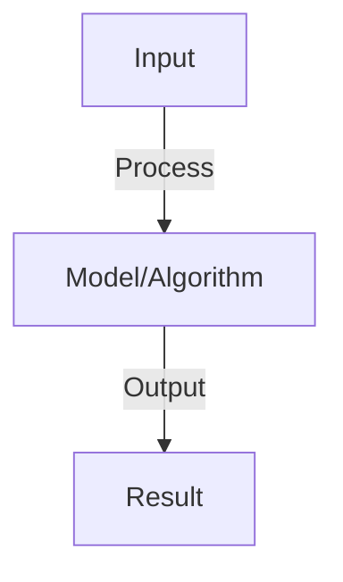
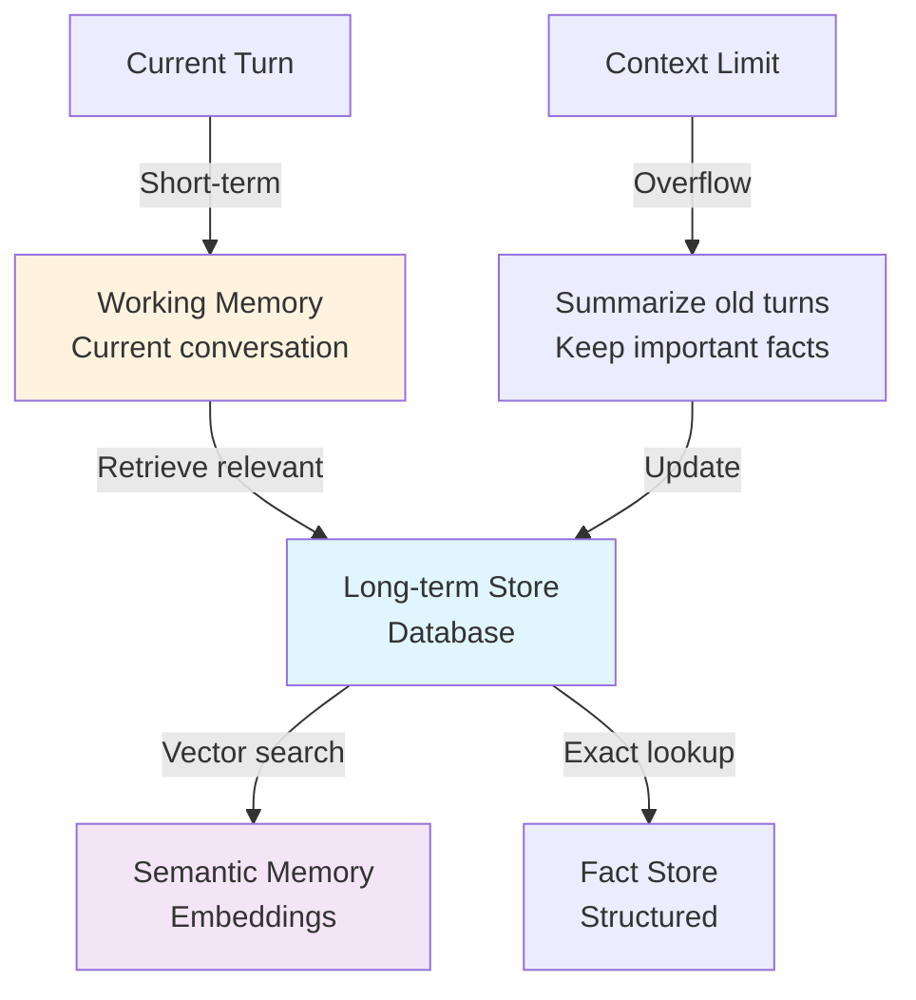

# Agent State Management

## Detailed Explanation

Agent state management handles the complexity that agents are stateful systems: they maintain conversation history, memory of past decisions, intermediate results, and tool outputs across multiple turns. Unlike stateless model inference (input → output), agents maintain context that influences future decisions. This creates challenges: what state should persist? How long? How much does state grow? When should state be purged? How do you recover from failures mid-execution?

State components include: (1) Conversation history (what was discussed), (2) Memory (facts the agent has learned or been told), (3) Intermediate results (outputs from tool calls), (4) Execution context (current task, progress). Design decisions include: persistent storage (database) vs. ephemeral (in-memory), what to remember long-term (core facts) vs. short-term (latest turn), and how to bound memory size. Some systems implement vector memory (embedding-based semantic search for relevant facts) while others use explicit memory slots ('what is the user's name?'). The key is balancing available context (more state helps reasoning) against retrieval cost and potential confusion (irrelevant old context might distract).

Understanding agent state management requires systems thinking about persistence, memory bounds, and the interaction between short-term working memory and long-term knowledge. It's crucial for building agents that learn from experience and improve over time.

## Core Intuition

Humans maintain memory: we remember facts about people, lessons learned, facts discussed. Conversations rely on this memory—you don't re-explain your job to friends repeatedly. Agents need similar memory: remembering what happened, what worked, facts about the user. State management is how agents maintain and use this memory effectively without getting confused by too much old information.

## How It Works

1. State types: conversation history, agent knowledge, task progress, user preferences
2. Storage: in-memory (fast, lost on restart), database (persistent, slower)
3. Context window: load relevant state into prompt for each interaction
4. State pruning: remove old/irrelevant state to stay under context limits
5. Consistency: ensure state consistent across distributed replicas
6. Recovery: reload state from database on restart, resume tasks
7. Lifecycle: state created → updated → archived (keep old for audit) → deleted (cleanup)

## Architecture / Trade-offs

### State Storage Architecture

### Memory Type Trade-offs

| Type | Capacity | Speed | Query | Retention |
|------|----------|-------|-------|-----------|
| **Working memory** | Small (context) | Very fast | Direct index | Current turn |
| **Semantic memory** | Large | Medium | Vector search | Long-term |
| **Episodic memory** | Large | Slow | Sequential search | Full history |
| **Fact store** | Medium | Fast | Exact match | Verified facts |
| **Summary** | Small | Very fast | Direct | Key points |
## Interview Q&A

**Q: How do you choose between in-memory and database storage?**
A: In-memory: fast (microseconds), lost on crash, limited to single machine. Database: slower (milliseconds), persistent, survives crashes. Hybrid: in-memory cache + database for durability. For agents: database essential (conversation continuity matters).

**Q: How do you handle state explosion in long-running agents?**
A: Problem: state grows unbounded (conversation history gets huge). Solutions: (1) summarization (compress old messages), (2) chunking (split into separate documents), (3) TTL (delete old state after N days), (4) relevance filtering (keep only relevant). Choose based on task.

**Q: What is state consistency in distributed agents?**
A: Problem: multiple agent replicas, each with own state copy. Updates to one replica don't reflect in others (stale data). Solution: centralized database (single source of truth), agents read/write there. Trade-off: slightly higher latency for consistency.

**Q: How do you recover agent state after a failure?**
A: Persistence: save state to database periodically (or after each interaction). On restart: load last saved state. Resume: continue from last saved step. Edge case: partial writes (state saved but request failed). Handle: idempotent operations (safe to retry).

**Q: What is versioning for agent state?**
A: Store snapshots of state over time. Enable: rollback (revert to previous state if needed), audit trail (trace what changed), branching (fork state for experimentation). Trade-off: storage cost (store multiple versions). Essential for critical agents.

## Best Practices

- Apply best practices specific to this concept
- Consider edge cases and failure modes
- Test on representative data
- Evaluate comprehensively

## Common Pitfalls

- Avoid over-simplification
- Watch for incorrect assumptions
- Test edge cases thoroughly
- Monitor for degradation

## Code Examples

See the associated notebook for implementation and real-world examples.

## Related Concepts

- Understand prerequisites first
- Connect related topics
- Build integrated knowledge
