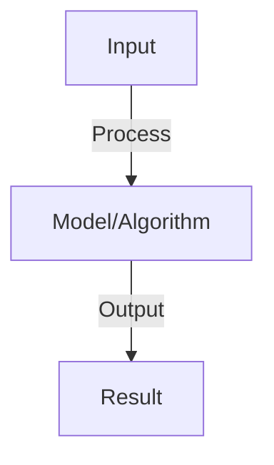

# Agent State Management

## Detailed Explanation

Maintain persistent state across agent interactions including memory, context, and execution history

## Core Intuition

Maintain persistent state across agent interactions including memory, context, and execution history Understanding this concept enables better system design and problem-solving.

## How It Works

1. State types: conversation history, agent knowledge, task progress, user preferences
2. Storage: in-memory (fast, lost on restart), database (persistent, slower)
3. Context window: load relevant state into prompt for each interaction
4. State pruning: remove old/irrelevant state to stay under context limits
5. Consistency: ensure state consistent across distributed replicas
6. Recovery: reload state from database on restart, resume tasks
7. Lifecycle: state created → updated → archived (keep old for audit) → deleted (cleanup)

## Architecture / Trade-offs

Key trade-offs and design considerations for this concept.

## Interview Q&A

**Q: How do you choose between in-memory and database storage?**
A: In-memory: fast (microseconds), lost on crash, limited to single machine. Database: slower (milliseconds), persistent, survives crashes. Hybrid: in-memory cache + database for durability. For agents: database essential (conversation continuity matters).

**Q: How do you handle state explosion in long-running agents?**
A: Problem: state grows unbounded (conversation history gets huge). Solutions: (1) summarization (compress old messages), (2) chunking (split into separate documents), (3) TTL (delete old state after N days), (4) relevance filtering (keep only relevant). Choose based on task.

**Q: What is state consistency in distributed agents?**
A: Problem: multiple agent replicas, each with own state copy. Updates to one replica don't reflect in others (stale data). Solution: centralized database (single source of truth), agents read/write there. Trade-off: slightly higher latency for consistency.

**Q: How do you recover agent state after a failure?**
A: Persistence: save state to database periodically (or after each interaction). On restart: load last saved state. Resume: continue from last saved step. Edge case: partial writes (state saved but request failed). Handle: idempotent operations (safe to retry).

**Q: What is versioning for agent state?**
A: Store snapshots of state over time. Enable: rollback (revert to previous state if needed), audit trail (trace what changed), branching (fork state for experimentation). Trade-off: storage cost (store multiple versions). Essential for critical agents.

## Best Practices

- Apply best practices specific to this concept
- Consider edge cases and failure modes
- Test on representative data
- Evaluate comprehensively

## Common Pitfalls

- Avoid over-simplification
- Watch for incorrect assumptions
- Test edge cases thoroughly
- Monitor for degradation

## Code Examples

See the associated notebook for implementation and real-world examples.

## Related Concepts

- Understand prerequisites first
- Connect related topics
- Build integrated knowledge
