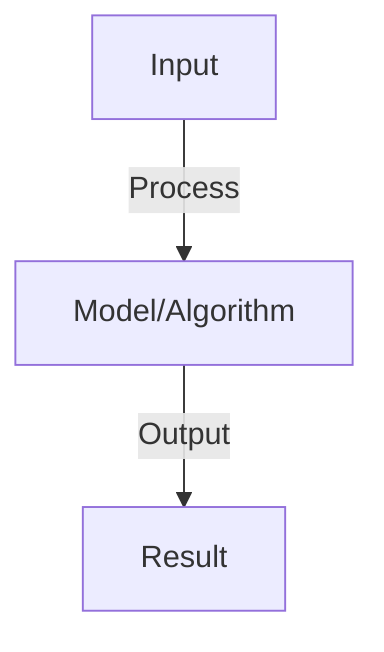

# Advanced Reasoning Variants

## Detailed Explanation

Advanced reasoning variants extend basic agent frameworks with enhanced decision-making capabilities: Chain-of-Thought (showing reasoning steps), Tree-of-Thought (exploring multiple reasoning paths), Self-Critique (agent reviews and improves its own output), Metacognition (agent thinking about its own thinking), and Debate (multiple agents arguing to reach better conclusions). These variants address the fact that the initial agent output is often suboptimal—iteration and alternative perspectives improve results.

Each variant trades computation for quality: Chain-of-Thought requires longer outputs but improves reasoning clarity. Tree-of-Thought explores multiple paths (expensive) but finds better solutions. Self-Critique adds a review pass. Debate uses multiple agents (N× computation). The key insight is that just like humans solve complex problems by thinking out loud, trying multiple approaches, and reconsidering, AI agents benefit from similar reflection. However, these variants multiply inference cost, creating a trade-off between solution quality and computational expense.

Advanced reasoning variants are becoming standard in complex agent applications because they demonstrably improve outcomes. Understanding them requires appreciating that single-pass inference often produces suboptimal results, and that cost of thinking is worth paying for important decisions.

## Core Intuition

A math student solving a hard problem doesn't just write the first answer—they work through multiple approaches, check their work, reconsider. Advanced reasoning variants let agents work similarly: try multiple solutions, think through their reasoning, critique and improve. This costs more time/compute but gives better answers.

## How It Works

1. Chain-of-thought: step-by-step reasoning improves accuracy
2. Tree-of-thought: generate multiple reasoning paths, evaluate each, select best
3. Self-consistency: sample multiple reasoning chains, take majority answer
4. Program synthesis: generate code, execute to verify correctness
5. Ensemble: combine multiple agent instances or reasoning strategies
6. Iterative refinement: generate answer → check → refine → repeat
7. Backtracking: if path fails, try alternative reasoning path

## Architecture / Trade-offs

Key trade-offs and design considerations for this concept.

## Interview Q&A

**Q: How does tree-of-thought improve on standard chain-of-thought?**
A: CoT: single path (might get stuck). ToT: generate multiple paths (3-5), evaluate each, select best. Enables backtracking (if path fails, try other). Slower (need multiple inference passes) but more reliable for hard problems.

**Q: What is self-consistency and when is it useful?**
A: Self-consistency: sample same prompt multiple times (different random seeds), get multiple answers. Vote (majority wins). Improves accuracy especially for reasoning tasks (math, logic). Cost: N×inference cost for sampling N times. Worth it for critical decisions.

**Q: How do you evaluate reasoning quality in agents?**
A: Metrics: (1) final answer correctness, (2) reasoning quality (check steps are logical), (3) confidence (agent's self-assessment), (4) efficiency (how many steps to reach answer). Trace reasoning: log each step for debugging and auditing.

**Q: What is program synthesis and why is it better than natural language reasoning?**
A: Program synthesis: generate executable code instead of text. Benefits: deterministic (no ambiguity), verifiable (run and check), composable (combine programs). Challenge: requires coding capability, works best for specific problem classes.

**Q: How do you handle multiple agents reasoning differently?**
A: Ensemble: run multiple agents with different prompts/models. Aggregate: vote, weighted average, or consensus. Diversity: different agents should use different approaches (some systematic, some intuitive). Better performance than single agent, especially for complex problems.

## Best Practices

- Apply best practices specific to this concept
- Consider edge cases and failure modes
- Test on representative data
- Evaluate comprehensively

## Common Pitfalls

- Avoid over-simplification
- Watch for incorrect assumptions
- Test edge cases thoroughly
- Monitor for degradation

## Code Examples

See the associated notebook for implementation and real-world examples.

## Related Concepts

- Understand prerequisites first
- Connect related topics
- Build integrated knowledge
