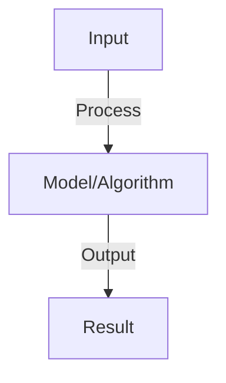

# Agent Evaluation Metrics

## Detailed Explanation

Measure agent performance comprehensively including success rate, cost, latency, and quality

## Core Intuition

Measure agent performance comprehensively including success rate, cost, latency, and quality Understanding this concept enables better system design and problem-solving.

## How It Works

1. Task success: did agent complete task correctly? Binary or continuous score
2. Cost: token usage × cost-per-token, total expense per task
3. Latency: wall-clock time to complete task, end-to-end latency
4. Quality: subjective evaluation (human raters), automated metrics
5. Efficiency: task success / (cost × latency), score per resource
6. Reliability: success rate, failure modes, error distribution
7. User satisfaction: NPS, task satisfaction, willingness to use again
8. Benchmarks: standard datasets, compare across agents and versions

## Architecture / Trade-offs

Key trade-offs and design considerations for this concept.

## Interview Q&A

**Q: How do you measure success for open-ended tasks?**
A: Binary success: did agent achieve goal? Limited (doesn't measure partial progress). Continuous: score 0-1 based on closeness to goal. Rubric: define criteria (clarity, accuracy, completeness) and score on each. Human evaluation most reliable but expensive.

**Q: What metrics matter most for production agents?**
A: Prioritize: (1) success rate (core metric), (2) cost (budget constraint), (3) latency (user patience), (4) error rate (reliability). In that order: fast failure is costly, slow success is annoying, errors are worst. Monitor all four.

**Q: How do you compare agents fairly?**
A: Same benchmark: test on identical tasks. Controlled conditions: same model, same prompts, same data. Multiple seeds: run each agent 5-10 times, report mean ± std. Report all metrics (not cherry-picked). Significance testing (statistical).

**Q: What is Pareto frontier for agents?**
A: Trade-off between metrics (accuracy vs cost, accuracy vs speed). Pareto frontier: set of non-dominated solutions (can't improve one without worsening another). Plot accuracy vs cost for all agents, frontier shows Pareto-optimal agents.

**Q: How do you handle metrics for multi-turn interactions?**
A: Per-turn: success per interaction. Cumulative: did agent eventually succeed? Task-centric: did agent achieve high-level goal (may take many turns)? Choose based on use case. For chat: success = user satisfied after conversation.

## Best Practices

- Apply best practices specific to this concept
- Consider edge cases and failure modes
- Test on representative data
- Evaluate comprehensively

## Common Pitfalls

- Avoid over-simplification
- Watch for incorrect assumptions
- Test edge cases thoroughly
- Monitor for degradation

## Code Examples

See the associated notebook for implementation and real-world examples.

## Related Concepts

- Understand prerequisites first
- Connect related topics
- Build integrated knowledge
