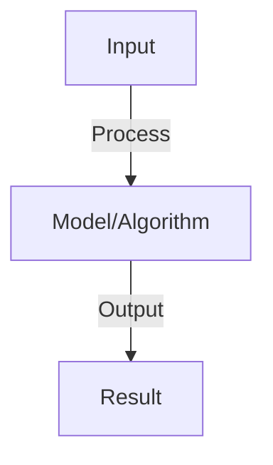

# Agent Security and Sandboxing

## Detailed Explanation

Agent security sandboxing constrains the actions agents can take, preventing them from accessing sensitive data, making dangerous API calls, or performing unauthorized operations. Unlike model-only systems where the model's output is reviewed before taking action, agents autonomously call tools, creating security risks if not carefully controlled. Sandboxing creates isolation: agents operate in constrained environments where their tool access is limited to safe operations.

Sandboxing approaches include: (1) Capability restrictions (agents can only access specific APIs), (2) Resource limits (rate limiting, timeouts, cost caps), (3) Input/output filtering (scrubbing sensitive data from agent inputs/outputs), (4) Approval workflows (requiring human approval for certain actions), (5) Execution containers (running agent code in isolated VMs), (6) Monitoring (detecting suspicious patterns). The key tension is between safety (more restrictions) and usefulness (more capabilities). A heavily sandboxed agent is safe but limited; an unrestricted agent is useful but dangerous.

Agent security sandboxing is crucial as agents gain more capabilities and operate in higher-stakes domains. Understanding it requires security thinking and appreciation for threat models—what could go wrong if agents misbehave, and what controls prevent those failures.

## Core Intuition

Giving someone access to your bank account is risky. A security sandbox is like giving them access to a limited, monitored account: they can perform safe operations, but can't drain all funds or access sensitive information. Each agent should work in such a 'sandbox' appropriate to their trustworthiness and the risks they could cause.

## How It Works

1. Sandboxing: isolated execution environment, limits resource access
2. Containerization: Docker containers with resource limits (CPU, memory, disk)
3. Code execution: execute agent-generated code in sandbox, not main process
4. Timeouts: kill execution if exceeds time limit (prevent infinite loops)
5. Permissions: restrict file system access, network access, capability access
6. Monitoring: log all system calls, detect malicious behavior
7. Auditing: track what code executed, who triggered it, what resources used

## Architecture / Trade-offs

Key trade-offs and design considerations for this concept.

## Interview Q&A

**Q: Why is sandboxing necessary for agents?**
A: Risk: agent-generated code might have bugs (infinite loop, crash), or be malicious (steal credentials, delete files). Sandbox isolates: bug doesn't crash main system, malicious code has limited damage. Essential for untrusted agent code.

**Q: What are levels of sandboxing?**
A: Process isolation: separate OS process (some isolation). Container: Docker with resource limits (good isolation). VM: full virtual machine (complete isolation, expensive). Choose based on risk (untrusted code → VM, trusted code → process).

**Q: How do you handle code that needs external resources?**
A: Restricted APIs: agent calls whitelisted functions (not arbitrary code). Examples: read_file('/data/...') allowed, read_file('/etc/passwd') blocked. Requires careful API design to be both safe and useful.

**Q: What is the difference between code execution and code generation?**
A: Generation: agent writes code, human reviews, human executes (safe). Execution: agent writes and runs code (risky but faster). For agents: auto-execute only whitelisted operations (math, data processing), require approval for external operations.

**Q: How do you prevent agents from accessing credentials?**
A: Secrets management: don't pass credentials in prompts. Use secret vault (AWS Secrets Manager, HashiCorp Vault). Agent calls API with permission token (not full credentials). Audit: log which secrets accessed by whom. Rotate regularly.

## Best Practices

- Apply best practices specific to this concept
- Consider edge cases and failure modes
- Test on representative data
- Evaluate comprehensively

## Common Pitfalls

- Avoid over-simplification
- Watch for incorrect assumptions
- Test edge cases thoroughly
- Monitor for degradation

## Code Examples

See the associated notebook for implementation and real-world examples.

## Related Concepts

- Understand prerequisites first
- Connect related topics
- Build integrated knowledge
