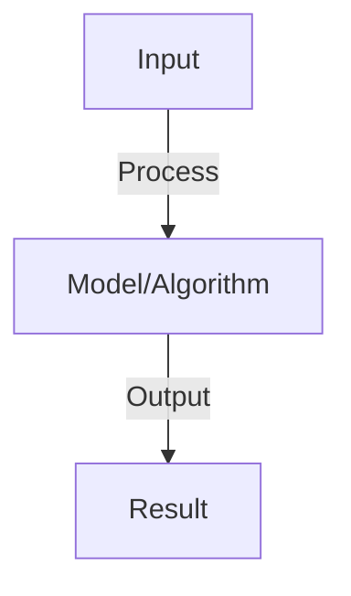

# Multi-Turn Conversation Management

## Detailed Explanation

Multi-turn conversations involve back-and-forth exchanges where context from previous turns influences interpretation of current turns. This is natural for humans but challenging for AI systems: maintaining conversation coherence, tracking what's been established, handling contradictions, and managing growing context. Multi-turn interactions reveal weaknesses invisible in single-turn systems: inconsistency (contradicting earlier statements), context loss (forgetting discussed facts), and repetition (answering the same question multiple times).

Challenges include: (1) Context window limitations (can't keep entire conversation history as it grows), (2) Context relevance (not all previous turns matter equally), (3) Inconsistency (model might give conflicting responses in different turns), (4) User expectations (users expect agents to remember everything discussed). Solutions involve: context summarization (condensing older turns), selective retrieval (finding relevant past turns), coherence monitoring (detecting inconsistencies), and explicit state tracking (maintaining facts established during conversation).

Multi-turn conversation is central to practical agent applications—almost no real interaction is single-turn. Understanding it requires recognizing that conversation is collaborative meaning-making, not isolated exchanges. It's harder than single-turn because context compounds the complexity.

## Core Intuition

A phone customer support representative in their first call can look up everything. But a customer service agent working with a returning customer must remember they discussed this issue last week, their account details, their preferences. Multi-turn conversation is managing this growing, interconnected context.

## How It Works

1. Turns: user input → agent response → user input → ...
2. Context: keep relevant history (last N turns, summarized context)
3. State: track conversation state (topic, subtasks, context)
4. Coherence: ensure responses consistent with context and previous statements
5. Turn-taking: manage who speaks (user or agent, avoid deadlock)
6. Interruption: handle user interruptions, task switching
7. Cleanup: end conversation gracefully, summarize outcome

## Architecture / Trade-offs

Key trade-offs and design considerations for this concept.

## Interview Q&A

**Q: How much conversation history should you keep?**
A: Full history: accurate but uses tokens. Last N turns: balance accuracy and efficiency. Summarization: compress old turns to facts. Hybrid: keep last 5 full turns, summarize older context. Adjust based on context window size and task complexity.

**Q: How do you handle context window overflows?**
A: Overflow: conversation exceeds model's context window. Solutions: (1) drop oldest messages, (2) summarize old context, (3) retrieval (fetch relevant messages from history). Try summarization first (preserve info), then drop if needed.

**Q: What is conversation state and how do you track it?**
A: State: current topic, subtasks completed, user intent, decisions made. Track: explicitly (state variable) or implicitly (inferred from messages). Use explicit for critical applications (fewer errors). Update: after each agent response.

**Q: How do you prevent agents from contradicting themselves?**
A: Check: before responding, review past statements. Verify: ensure new statement consistent with context. Fallback: if inconsistency detected, acknowledge and clarify. Log: track contradictions for debugging.

**Q: How do you handle topic switching in conversation?**
A: Detect: user changes topic (detect intent shift). Handle: (1) acknowledge old topic, (2) switch context, (3) reset sub-state if needed. Challenge: intent detection not always clear (genuine switch vs. tangent).

## Best Practices

- Apply best practices specific to this concept
- Consider edge cases and failure modes
- Test on representative data
- Evaluate comprehensively

## Common Pitfalls

- Avoid over-simplification
- Watch for incorrect assumptions
- Test edge cases thoroughly
- Monitor for degradation

## Code Examples

See the associated notebook for implementation and real-world examples.

## Related Concepts

- Understand prerequisites first
- Connect related topics
- Build integrated knowledge
