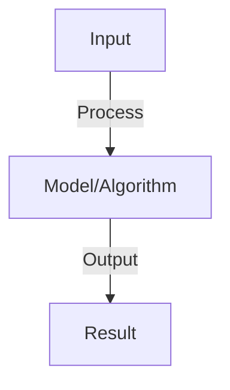

# Multi-Turn Conversation Management

## Detailed Explanation

Manage long-running conversations with coherent context, turn-taking, and state tracking

## Core Intuition

Manage long-running conversations with coherent context, turn-taking, and state tracking Understanding this concept enables better system design and problem-solving.

## How It Works

1. Turns: user input → agent response → user input → ...
2. Context: keep relevant history (last N turns, summarized context)
3. State: track conversation state (topic, subtasks, context)
4. Coherence: ensure responses consistent with context and previous statements
5. Turn-taking: manage who speaks (user or agent, avoid deadlock)
6. Interruption: handle user interruptions, task switching
7. Cleanup: end conversation gracefully, summarize outcome

## Architecture / Trade-offs

Key trade-offs and design considerations for this concept.

## Interview Q&A

**Q: How much conversation history should you keep?**
A: Full history: accurate but uses tokens. Last N turns: balance accuracy and efficiency. Summarization: compress old turns to facts. Hybrid: keep last 5 full turns, summarize older context. Adjust based on context window size and task complexity.

**Q: How do you handle context window overflows?**
A: Overflow: conversation exceeds model's context window. Solutions: (1) drop oldest messages, (2) summarize old context, (3) retrieval (fetch relevant messages from history). Try summarization first (preserve info), then drop if needed.

**Q: What is conversation state and how do you track it?**
A: State: current topic, subtasks completed, user intent, decisions made. Track: explicitly (state variable) or implicitly (inferred from messages). Use explicit for critical applications (fewer errors). Update: after each agent response.

**Q: How do you prevent agents from contradicting themselves?**
A: Check: before responding, review past statements. Verify: ensure new statement consistent with context. Fallback: if inconsistency detected, acknowledge and clarify. Log: track contradictions for debugging.

**Q: How do you handle topic switching in conversation?**
A: Detect: user changes topic (detect intent shift). Handle: (1) acknowledge old topic, (2) switch context, (3) reset sub-state if needed. Challenge: intent detection not always clear (genuine switch vs. tangent).

## Best Practices

- Apply best practices specific to this concept
- Consider edge cases and failure modes
- Test on representative data
- Evaluate comprehensively

## Common Pitfalls

- Avoid over-simplification
- Watch for incorrect assumptions
- Test edge cases thoroughly
- Monitor for degradation

## Code Examples

See the associated notebook for implementation and real-world examples.

## Related Concepts

- Understand prerequisites first
- Connect related topics
- Build integrated knowledge
