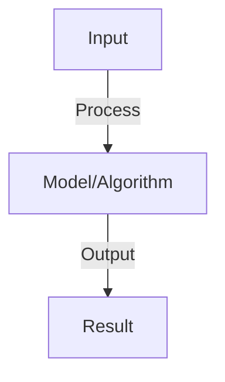
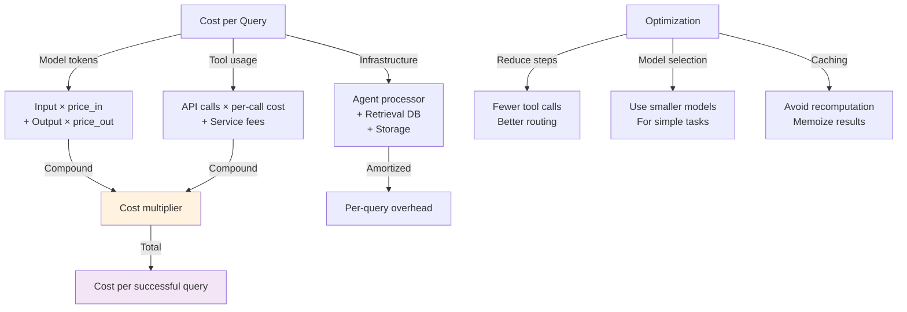

# Agent Cost Analysis

## Detailed Explanation

Agent cost analysis quantifies the expenses of running agent-based systems, which differs from standard inference costs because agents perform variable amounts of computation depending on task complexity. A simple task might complete in one step (minimal cost), while complex tasks might involve multiple tool calls, retries, and long context windows (expensive). Understanding and controlling costs is crucial for viability: an agent system that works perfectly but costs $10 per query isn't commercially viable.

Cost components include: (1) LLM API calls (primary cost, varies by model size and tokens), (2) Tool usage (external APIs, data retrieval), (3) Retrieval operations (searching knowledge bases), (4) Token overhead (prompt structure, examples), (5) Failures requiring retry (wasted computation). Cost optimization strategies include: model selection (use smaller models when sufficient), step reduction (design agents to take fewer steps), tool efficiency (fast tools are cheaper), and caching (avoid redundant computations). Some systems use tiered approaches: cheap fast agents for simple queries, expensive capable agents only for complex queries.

Understanding agent cost analysis requires systems thinking about the economics of AI systems. Many novel agents are technically impressive but economically unviable. Cost considerations should drive architecture decisions, not be an afterthought.

## Core Intuition

Imagine an employee who must make a decision: they can choose to spend 5 minutes thinking and decide, or spend 2 hours researching and decide better. Agents have similar choices: fast but potentially wrong (cheap), or slow and careful (expensive). Cost analysis is choosing the right level of effort for each decision.

## How It Works

1. Token counting: input tokens + output tokens per interaction
2. Pricing: cost-per-1K-tokens varies by model (GPT-4: $0.03, GPT-3.5: $0.002)
3. API calls: each tool call, retrieval, external service adds cost
4. Cost per task: sum of all tokens and API calls for one task
5. Aggregation: multiply by frequency to get daily/monthly/yearly cost
6. Optimization: reduce tokens (shorter prompts), use cheaper models (GPT-3.5 vs GPT-4)
7. Monitoring: track cost in real-time, alert on anomalies

## Architecture / Trade-offs

### Cost Calculation Framework

### Cost Optimization Hierarchy

| Level | Cost Reduction | Effort | Impact |
|-------|----------------|--------|--------|
| **Caching** | 50%+ | Low | High |
| **Model selection** | 30-70% | Low | High |
| **Step reduction** | 20-50% | Medium | High |
| **Batching** | 10-30% | Medium | Medium |
| **Rate limiting** | 0% | Low | Prevents overages |
| **Monitoring** | 0% | Low | Alerts on issues |
## Interview Q&A

**Q: How do you reduce agent token usage?**
A: Prompt optimization: remove verbose instructions, use examples efficiently. Model selection: GPT-3.5 cheaper than GPT-4 (trade accuracy for cost). Caching: reuse computations (store embeddings, cache prompts). Summarization: compress context. Typical reduction: 30-50% with optimization.

**Q: What's the cost difference between models?**
A: GPT-4: $0.03/1K input, $0.06/1K output tokens. GPT-3.5: $0.002/1K input, $0.004/1K output. Claude: similar to GPT-4. Trade-off: GPT-4 better quality but expensive. Use GPT-3.5 for high-volume low-stakes, GPT-4 for critical tasks.

**Q: How do you handle cost anomalies?**
A: Monitor: track per-user, per-task costs. Alert: if exceeds threshold (e.g., >$1 per task). Investigate: is it legitimate (complex task) or bug (infinite loop, hallucination)? Limits: set per-user caps to prevent runaway spending.

**Q: Should you optimize for cost or quality?**
A: Context: cost-quality trade-off. High-volume: optimize cost (use GPT-3.5, short context). Mission-critical: optimize quality (use GPT-4, long context). Most: balance (use hybrid, optimize both). Measure: cost per unit quality achieved.

**Q: How do you forecast agent costs?**
A: Estimate: average tokens per task × tasks per day × days per month × price-per-token. Sensitivity: how do costs scale with usage, model, context? Budget: plan for growth (2-3x). Monitor: track actual vs. forecast, adjust as needed.

## Best Practices

- Apply best practices specific to this concept
- Consider edge cases and failure modes
- Test on representative data
- Evaluate comprehensively

## Common Pitfalls

- Avoid over-simplification
- Watch for incorrect assumptions
- Test edge cases thoroughly
- Monitor for degradation

## Code Examples

See the associated notebook for implementation and real-world examples.

## Related Concepts

- Understand prerequisites first
- Connect related topics
- Build integrated knowledge
