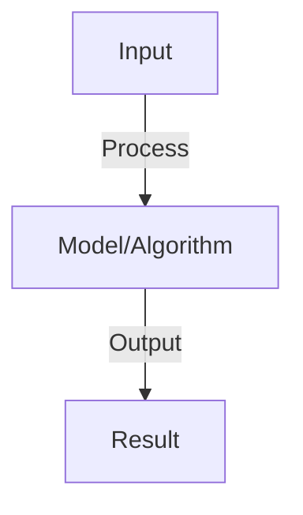

# Agent Cost Analysis

## Detailed Explanation

Analyze and optimize the financial cost of running agents including token usage and API calls

## Core Intuition

Analyze and optimize the financial cost of running agents including token usage and API calls Understanding this concept enables better system design and problem-solving.

## How It Works

1. Token counting: input tokens + output tokens per interaction
2. Pricing: cost-per-1K-tokens varies by model (GPT-4: $0.03, GPT-3.5: $0.002)
3. API calls: each tool call, retrieval, external service adds cost
4. Cost per task: sum of all tokens and API calls for one task
5. Aggregation: multiply by frequency to get daily/monthly/yearly cost
6. Optimization: reduce tokens (shorter prompts), use cheaper models (GPT-3.5 vs GPT-4)
7. Monitoring: track cost in real-time, alert on anomalies

## Architecture / Trade-offs

Key trade-offs and design considerations for this concept.

## Interview Q&A

**Q: How do you reduce agent token usage?**
A: Prompt optimization: remove verbose instructions, use examples efficiently. Model selection: GPT-3.5 cheaper than GPT-4 (trade accuracy for cost). Caching: reuse computations (store embeddings, cache prompts). Summarization: compress context. Typical reduction: 30-50% with optimization.

**Q: What's the cost difference between models?**
A: GPT-4: $0.03/1K input, $0.06/1K output tokens. GPT-3.5: $0.002/1K input, $0.004/1K output. Claude: similar to GPT-4. Trade-off: GPT-4 better quality but expensive. Use GPT-3.5 for high-volume low-stakes, GPT-4 for critical tasks.

**Q: How do you handle cost anomalies?**
A: Monitor: track per-user, per-task costs. Alert: if exceeds threshold (e.g., >$1 per task). Investigate: is it legitimate (complex task) or bug (infinite loop, hallucination)? Limits: set per-user caps to prevent runaway spending.

**Q: Should you optimize for cost or quality?**
A: Context: cost-quality trade-off. High-volume: optimize cost (use GPT-3.5, short context). Mission-critical: optimize quality (use GPT-4, long context). Most: balance (use hybrid, optimize both). Measure: cost per unit quality achieved.

**Q: How do you forecast agent costs?**
A: Estimate: average tokens per task × tasks per day × days per month × price-per-token. Sensitivity: how do costs scale with usage, model, context? Budget: plan for growth (2-3x). Monitor: track actual vs. forecast, adjust as needed.

## Best Practices

- Apply best practices specific to this concept
- Consider edge cases and failure modes
- Test on representative data
- Evaluate comprehensively

## Common Pitfalls

- Avoid over-simplification
- Watch for incorrect assumptions
- Test edge cases thoroughly
- Monitor for degradation

## Code Examples

See the associated notebook for implementation and real-world examples.

## Related Concepts

- Understand prerequisites first
- Connect related topics
- Build integrated knowledge
