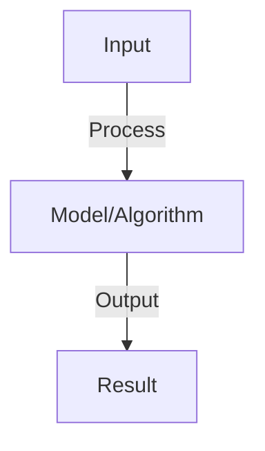

# Agent Frameworks Comparison

## Detailed Explanation

Multiple agent frameworks exist with different philosophies, capabilities, and trade-offs: LangChain (flexible, composable), AutoGen (multi-agent orchestration), OpenAI Assistants API (managed infrastructure), Anthropic Claude API (direct model access), and domain-specific frameworks (AgentGPT, Taskweaver). Each represents different points in the spectrum: flexibility (control everything yourself) vs. abstraction (platform handles complexity).

Key comparison dimensions: (1) Level of abstraction (does platform handle agent loop or do you?), (2) Multi-agent capabilities (can agents coordinate?), (3) Integration breadth (what tools/APIs supported?), (4) Cost structure (per-API-call or managed service?), (5) Flexibility (can you customize reasoning?), (6) Learning curve (easy to start or requires system design understanding?). No framework is universally best—selection depends on use case: building a simple chatbot (Assistants API), complex multi-step systems (LangChain), multi-agent coordination (AutoGen), research/prototyping (direct API access).

Understanding framework trade-offs is crucial because choosing wrong creates unnecessary complexity (over-engineered simple systems) or insufficient capability (frameworks too limited for your needs). Evaluating frameworks requires clarity about your requirements: Do you need multi-agent coordination? How much customization? What integrations matter?

## Core Intuition

Frameworks are like restaurants: some offer full service (staff handles everything, you just order), some are buffet (you pick what you want from available options), some are ingredient suppliers (you cook yourself). Different situations call for different approaches—not about good or bad restaurants.

## How It Works

1. LangChain: chains (templates), agents (tool use), memory, integrations
2. AutoGen: multi-agent conversations, automatic role assignment, flexible interactions
3. ReAct: reasoning + acting loop, simple structure, clear reasoning trace
4. Comparison: ease of use, flexibility, production readiness, community
5. LangChain: most popular, best integrations, middle learning curve
6. AutoGen: best for multi-agent, experimental, fewer integrations
7. ReAct: simplest, good for learning, limited extensibility

## Architecture / Trade-offs

Key trade-offs and design considerations for this concept.

## Interview Q&A

**Q: Which framework should you choose for a new project?**
A: Start with LangChain: most mature, best docs, most integrations. Use AutoGen: if multi-agent is core (AutoGen excels here). Use ReAct: if learning or prototyping (simple, clear). In production: depends on team expertise and requirements.

**Q: How do frameworks differ in handling state?**
A: LangChain: explicit memory management (you control state). AutoGen: implicit (framework manages conversation). ReAct: minimal state (just reasoning trace). Tradeoff: control vs convenience. ReAct simplest, LangChain most flexible.

**Q: What's the learning curve for each framework?**
A: ReAct: lowest (simple loop, 1-2 hours to understand). LangChain: medium (many concepts, 1-2 days to productive). AutoGen: medium (new paradigm, 1-2 days to productive). All have good docs/tutorials.

**Q: Can you mix frameworks (e.g., LangChain agent with AutoGen?)**
A: Possible but rare: different abstractions, not designed to interop. Better: choose one and stick with it. If need features from both: evaluate if really needed, or wait for frameworks to converge.

**Q: Which framework is best for production?**
A: LangChain: if you want full control and maturity. AutoGen: if you want multi-agent as core. ReAct: not designed for production (too simple). For production: add monitoring, error handling, deployment logic on top of any framework.

## Best Practices

- Apply best practices specific to this concept
- Consider edge cases and failure modes
- Test on representative data
- Evaluate comprehensively

## Common Pitfalls

- Avoid over-simplification
- Watch for incorrect assumptions
- Test edge cases thoroughly
- Monitor for degradation

## Code Examples

See the associated notebook for implementation and real-world examples.

## Related Concepts

- Understand prerequisites first
- Connect related topics
- Build integrated knowledge
