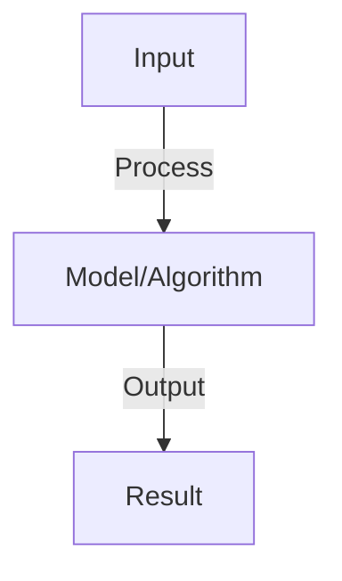

# Real-Time Agent Systems

## Detailed Explanation

Real-time agent systems must respond to continuous streams of data and make decisions within strict latency constraints—think autonomous vehicles deciding how to respond to traffic, trading bots reacting to market movements, or live customer support systems. Real-time creates constraints that fundamentally change system design: computation must be fast (milliseconds or milliseconds), decisions must be robust despite incomplete information (can't wait for perfect data), and failures must be recoverable (no ability to pause and debug).

Key challenges: (1) Latency budgets (every millisecond matters, cutting model inference in half cuts agent latency in half), (2) Streaming reasoning (decisions made with incomplete information, updated as new data arrives), (3) State consistency (ensuring distributed components stay coordinated), (4) Failure recovery (graceful degradation, fallback strategies), (5) Monitoring (understanding system behavior in production). Design choices include: edge deployment (running agent logic locally for latency), batching decisions (grouping updates to reduce overhead), approximate reasoning (fast decisions over perfect decisions), and hierarchical response (immediate reaction + longer-term optimization).

Real-time agent systems represent the frontier of agent applications—autonomous systems that must perform in the real world, not just offline. Understanding them requires systems and operations thinking, and appreciation that 'real-time' isn't about AI capability but about infrastructure and system design.

## Core Intuition

A chess player thinking deeply can beat a fast player. But a chess player in a lightning round (seconds per move) must think fast rather than deeply. Real-time agent systems are like lightning chess: decisions must happen immediately even if imperfect. Infrastructure and algorithm efficiency matter more than raw capability.

## How It Works

1. Streaming: return response tokens as they're generated (don't wait for full response)
2. Concurrency: handle multiple requests simultaneously (not sequential)
3. Latency: first-token latency (how fast first token appears) and total latency
4. Buffering: buffer tokens to avoid excessive I/O, stream in chunks
5. Inference optimization: quantization, caching, batching to reduce latency
6. Infrastructure: use GPU, high-bandwidth connections, optimized serving (vLLM)
7. Monitoring: track latency distribution, percentiles (p50, p99)

## Architecture / Trade-offs

Key trade-offs and design considerations for this concept.

## Interview Q&A

**Q: How do you stream responses from agents?**
A: Use streaming API: GPT-4 streaming, LLaMA server with streaming. Get tokens one at a time, send to user as they arrive. UX: user sees incremental response (feels responsive). Implementation: WebSocket or Server-Sent Events (SSE).

**Q: What causes agent latency and how do you reduce it?**
A: Sources: model inference (biggest), tokenization, tool calls, API latency. Reduce: (1) faster models (7B vs 70B), (2) quantization (4-bit vs 16-bit), (3) batching (process multiple requests together), (4) caching (reuse computations).

**Q: How do you handle concurrent agent requests?**
A: Load balancing: distribute to multiple replicas. Queue: if more requests than capacity, queue and process in order. Async: use async/await, don't block on slow requests. Graceful degradation: prioritize critical requests, drop non-critical if overwhelmed.

**Q: What is first-token latency and why does it matter?**
A: First-token: how fast user sees first response token. Matters: affects perceived responsiveness. Optimize: reduce prompt processing, use smaller models, cache embeddings. Typical: 100-500ms first-token (good), >1s (feels slow).

**Q: How do you optimize for different latency SLAs?**
A: Compute SLA: p50 latency (median), p99 (99th percentile). Different tiers: standard (p50<1s), fast (p50<100ms), urgent (p50<10ms). Cost increases: faster tier = more resources. Choose based on use case.

## Best Practices

- Apply best practices specific to this concept
- Consider edge cases and failure modes
- Test on representative data
- Evaluate comprehensively

## Common Pitfalls

- Avoid over-simplification
- Watch for incorrect assumptions
- Test edge cases thoroughly
- Monitor for degradation

## Code Examples

See the associated notebook for implementation and real-world examples.

## Related Concepts

- Understand prerequisites first
- Connect related topics
- Build integrated knowledge
